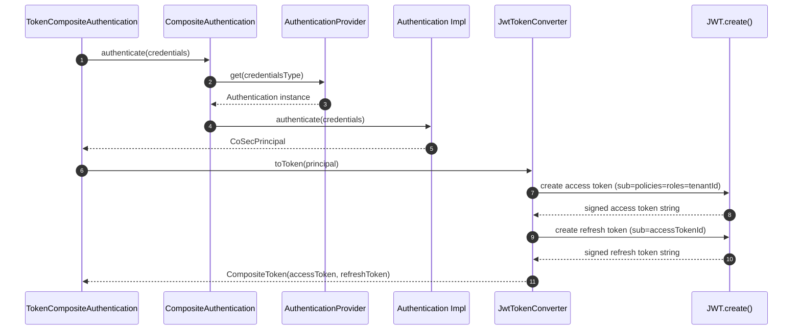
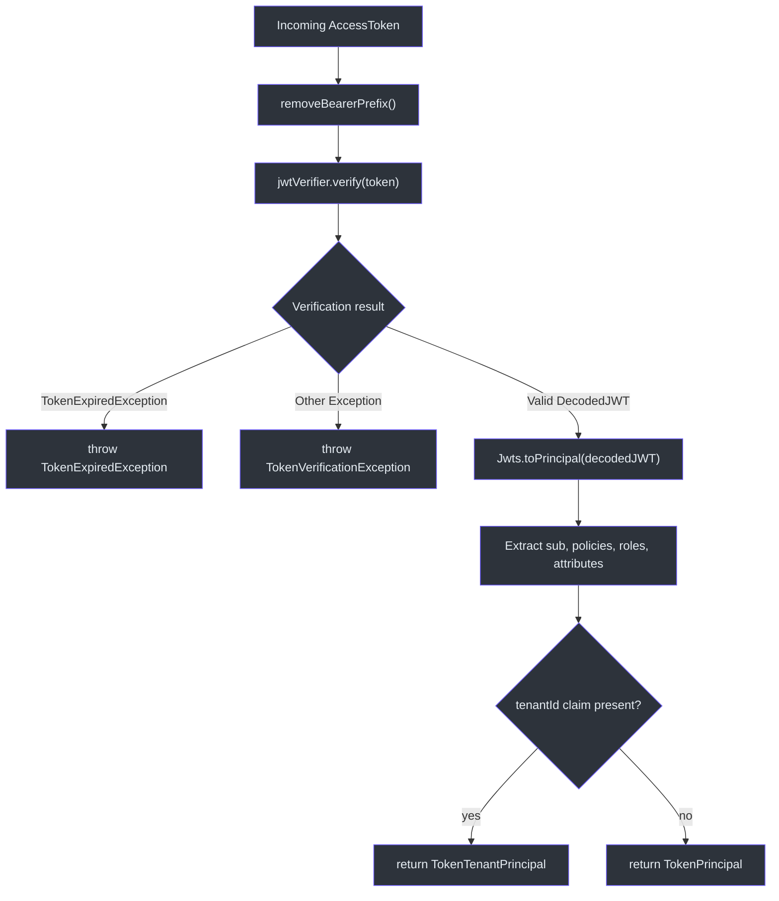
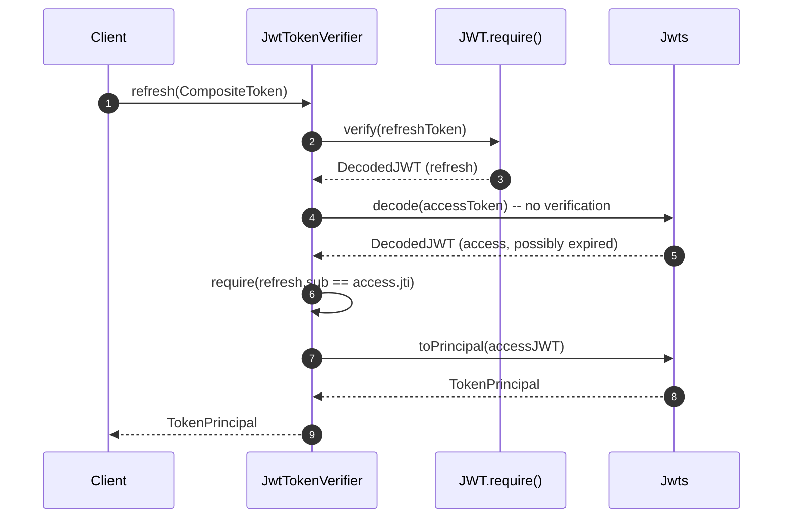

# JWT 集成

CoSec 使用 [Auth0 java-jwt](https://github.com/auth0/java-jwt) 库来创建和验证 JSON Web Token。该集成封装在 `cosec-jwt` 模块中，提供 `JwtTokenConverter`（签发令牌）和 `JwtTokenVerifier`（验证并提取主体）。Spring Boot 自动配置将所有组件组装在一起。

## 令牌生命周期

### 令牌有效期默认值

| 令牌类型 | 默认有效期 | 可通过以下方式配置 |
|----------|-----------|-------------------|
| 访问令牌 | 10 分钟 | `cosec.jwt.token-validity.access` |
| 刷新令牌 | 7 天 | `cosec.jwt.token-validity.refresh` |

这些默认值定义在 [JwtProperties](../../../../cosec-spring-boot-starter/src/main/kotlin/me/ahoo/cosec/spring/boot/starter/jwt/JwtProperties.kt) 中：

```kotlin
data class TokenValidity(
    var access: Duration = Duration.ofMinutes(10),
    var refresh: Duration = Duration.ofDays(7)
)
```

### 支持的算法

自动配置支持三种 HMAC 算法，通过 `cosec.jwt.algorithm` 选择：

| 值 | 算法 | Javadoc |
|----|------|---------|
| `HMAC256`（默认） | HS256 | `Algorithm.HMAC256(secret)` |
| `HMAC384` | HS384 | `Algorithm.HMAC384(secret)` |
| `HMAC512` | HS512 | `Algorithm.HMAC512(secret)` |

## JWT 声明结构

[JwtTokenConverter](../../../../cosec-jwt/src/main/kotlin/me/ahoo/cosec/jwt/JwtTokenConverter.kt) 构建具有以下声明结构的 JWT 访问令牌：

```json
{
  "jti": "<generated-unique-id>",
  "sub": "<principal.id>",
  "iat": 1684000000000,
  "exp": 1684000600000,
  "policies": ["policy-id-1", "policy-id-2"],
  "roles": ["admin", "user"],
  "attributes": {"key": "value"},
  "tenantId": "tenant-123"
}
```

关键映射：

- **`sub`**（主题）：设置为 `principal.id` -- 唯一用户标识符
- **`jti`**（JWT ID）：由 `IdGenerator` 生成（默认：UUID）。用于令牌撤销和刷新令牌绑定
- **`policies`**: `PolicyCapable.POLICY_KEY` 声明 -- 分配给主体的策略 ID 列表
- **`roles`**: `RoleCapable.ROLE_KEY` 声明 -- 角色 ID 列表
- **`attributes`**: `CoSecPrincipal::attributes.name` 声明 -- 任意键值元数据
- **`tenantId`**: `Tenant.TENANT_ID_KEY` 声明 -- 仅当主体实现了 `TenantCapable` 时存在

刷新令牌的结构更简单：

```json
{
  "jti": "<refresh-token-id>",
  "sub": "<access-token-id>",
  "iat": 1684000000000,
  "exp": 1685209600000
}
```

刷新令牌的 `sub` 声明被设置为**访问令牌的 `jti`**，在两个令牌之间建立绑定关系。

## 关键类

### JwtTokenConverter

[JwtTokenConverter](../../../../cosec-jwt/src/main/kotlin/me/ahoo/cosec/jwt/JwtTokenConverter.kt) 实现了 `TokenConverter`，将 `CoSecPrincipal` 转换为 `CompositeToken`：

```kotlin
class JwtTokenConverter(
    private val idGenerator: IdGenerator,
    private val algorithm: Algorithm,
    private val accessTokenValidity: Duration = Duration.ofMinutes(10),
    private val refreshTokenValidity: Duration = Duration.ofDays(7)
) : TokenConverter
```

### JwtTokenVerifier

[JwtTokenVerifier](../../../../cosec-jwt/src/main/kotlin/me/ahoo/cosec/jwt/JwtTokenVerifier.kt) 实现了 `TokenVerifier`，提供：

- **`verify(AccessToken)`**：验证签名，检查过期时间，提取 `TokenPrincipal`
- **`refresh(CompositeToken)`**：验证刷新令牌，确保其 `sub` 与访问令牌的 `jti` 匹配，然后从（可能已过期的）访问令牌中提取主体

### Jwts 工具类

[Jwts](../../../../cosec-jwt/src/main/kotlin/me/ahoo/cosec/jwt/Jwts.kt) 提供辅助函数：

- **`decode(token)`**：去除 `Bearer ` 前缀并解码 JWT（不验证）
- **`toPrincipal(decodedJWT)`**：提取所有声明并构造 `TokenPrincipal`（当存在 `tenantId` 时构造 `TokenTenantPrincipal`）
- **`removeBearerPrefix()`**：去除 `"Bearer "` 前缀的字符串扩展函数（如果存在）

## 架构图

### 令牌创建流程



### 令牌验证流程



### 刷新令牌流程



## Spring Boot 自动配置

[CoSecJwtAutoConfiguration](../../../../cosec-spring-boot-starter/src/main/kotlin/me/ahoo/cosec/spring/boot/starter/jwt/CoSecJwtAutoConfiguration.kt) 在以下条件满足时激活：

1. `cosec.enabled=true`（默认）
2. `cosec.jwt.enabled=true`（默认）
3. `JwtTokenConverter` 在类路径上

它注册三个 Bean：

| Bean | 类型 | 用途 |
|------|------|------|
| `cosecTokenAlgorithm` | `Algorithm` | 来自配置的 HMAC 算法 |
| `cosecTokenConverter` | `TokenConverter` | 创建 JWT 令牌 |
| `cosecJwtTokenVerifier` | `TokenVerifier` | 验证 JWT 令牌 |

当认证也被启用时，它还会注册 `TokenCompositeAuthentication`，将基于凭据的认证与令牌签发链接在一起。

## 配置示例

```yaml
cosec:
  jwt:
    enabled: true
    algorithm: HMAC256
    secret: your-secret-key-must-be-long-enough
    token-validity:
      access: 10m
      refresh: 7d
```

## 参考文献

- [JwtTokenConverter.kt:42](https://github.com/Ahoo-Wang/CoSec/blob/main/cosec-jwt/src/main/kotlin/me/ahoo/cosec/jwt/JwtTokenConverter.kt#L42) - 包含声明的 JWT 令牌创建
- [JwtTokenVerifier.kt:37](https://github.com/Ahoo-Wang/CoSec/blob/main/cosec-jwt/src/main/kotlin/me/ahoo/cosec/jwt/JwtTokenVerifier.kt#L37) - JWT 验证和主体提取
- [Jwts.kt:41](https://github.com/Ahoo-Wang/CoSec/blob/main/cosec-jwt/src/main/kotlin/me/ahoo/cosec/jwt/Jwts.kt#L41) - JWT 工具函数（decode、toPrincipal、removeBearerPrefix）
- [CoSecJwtAutoConfiguration.kt:47](https://github.com/Ahoo-Wang/CoSec/blob/main/cosec-spring-boot-starter/src/main/kotlin/me/ahoo/cosec/spring/boot/starter/jwt/CoSecJwtAutoConfiguration.kt#L47) - Spring Boot 自动配置
- [JwtProperties.kt:28](https://github.com/Ahoo-Wang/CoSec/blob/main/cosec-spring-boot-starter/src/main/kotlin/me/ahoo/cosec/spring/boot/starter/jwt/JwtProperties.kt#L28) - 配置属性

## 相关页面

- [认证系统](./authentication-system.md) - JWT 如何接入提供者注册表
- [令牌管理](./token-management.md) - 令牌层次结构和主体类型
- [社交认证](./social-authentication.md) - 基于 OAuth 的认证替代方案
- [授权流程](../authorization/authorization-flow.md) - 令牌声明如何驱动授权决策
