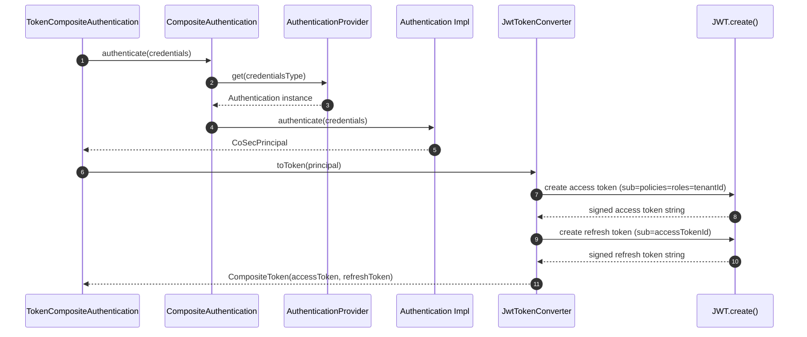
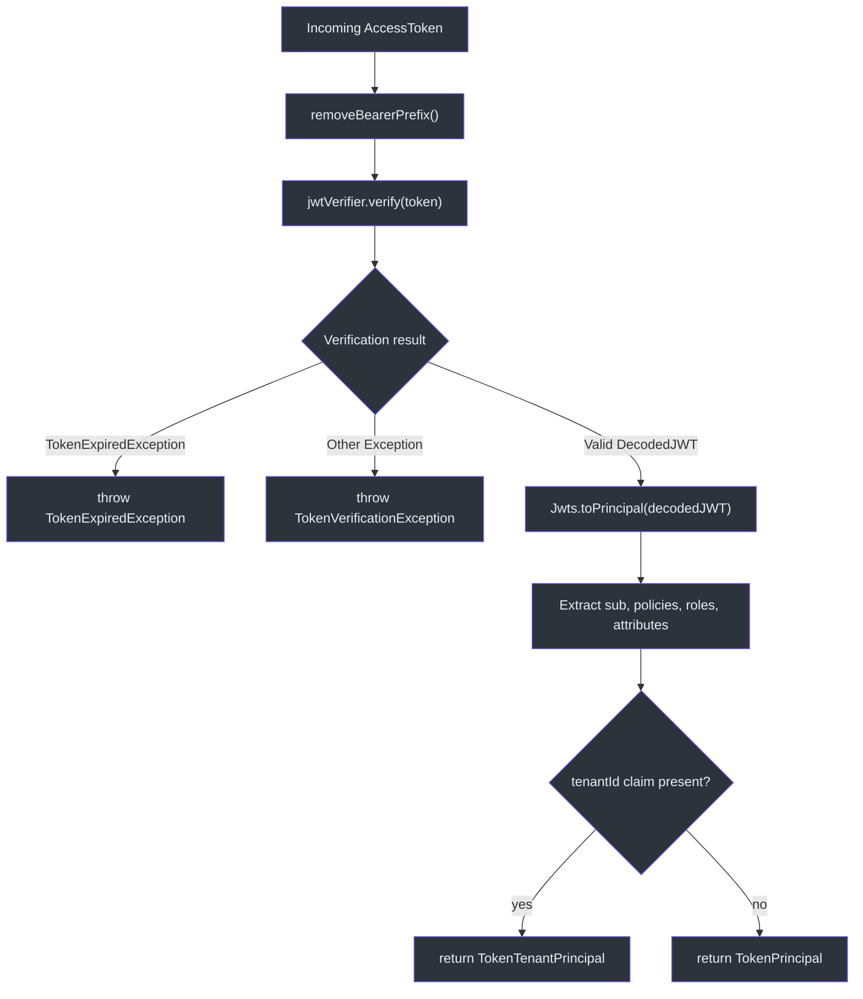
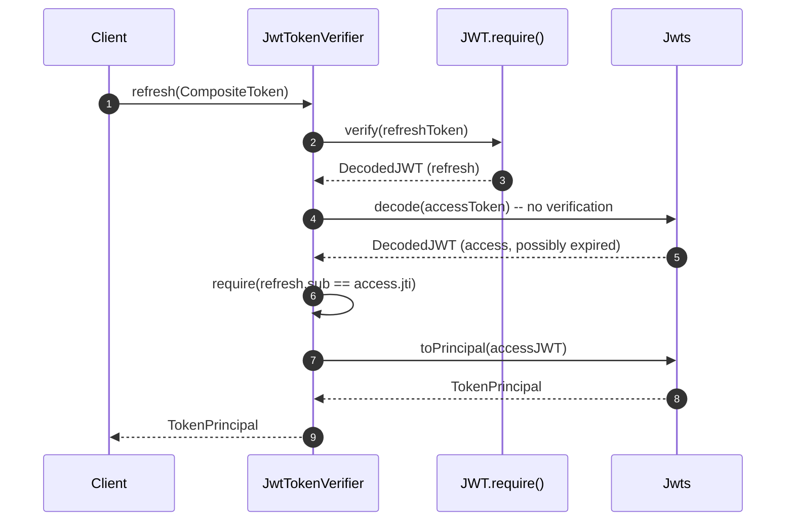

# JWT 集成

CoSec 使用 [Auth0 java-jwt](https://github.com/auth0/java-jwt) 库来创建和验证 JSON Web Token。该集成封装在 `cosec-jwt` 模块中，提供 `JwtTokenConverter`（签发令牌）和 `JwtTokenVerifier`（验证并提取主体）。Spring Boot 自动配置将所有组件组装在一起。

## 令牌生命周期

### 令牌有效期默认值

| 令牌类型 | 默认有效期 | 可通过以下方式配置 |
|----------|-----------|-------------------|
| 访问令牌 | 10 分钟 | `cosec.jwt.token-validity.access` |
| 刷新令牌 | 7 天 | `cosec.jwt.token-validity.refresh` |

这些默认值定义在 [JwtProperties](../../../../cosec-spring-boot-starter/src/main/kotlin/me/ahoo/cosec/spring/boot/starter/jwt/JwtProperties.kt) 中：

```kotlin
data class TokenValidity(
    var access: Duration = Duration.ofMinutes(10),
    var refresh: Duration = Duration.ofDays(7)
)
```

### 支持的算法

自动配置支持三种 HMAC 算法，通过 `cosec.jwt.algorithm` 选择：

| 值 | 算法 | Javadoc |
|----|------|---------|
| `HMAC256`（默认） | HS256 | `Algorithm.HMAC256(secret)` |
| `HMAC384` | HS384 | `Algorithm.HMAC384(secret)` |
| `HMAC512` | HS512 | `Algorithm.HMAC512(secret)` |

## JWT 声明结构

[JwtTokenConverter](../../../../cosec-jwt/src/main/kotlin/me/ahoo/cosec/jwt/JwtTokenConverter.kt) 构建具有以下声明结构的 JWT 访问令牌：

```json
{
  "jti": "<generated-unique-id>",
  "sub": "<principal.id>",
  "iat": 1684000000000,
  "exp": 1684000600000,
  "policies": ["policy-id-1", "policy-id-2"],
  "roles": ["admin", "user"],
  "attributes": {"key": "value"},
  "tenantId": "tenant-123"
}
```

关键映射：

- **`sub`**（主题）：设置为 `principal.id` -- 唯一用户标识符
- **`jti`**（JWT ID）：由 `IdGenerator` 生成（默认：UUID）。用于令牌吊销（见下文《注销登录（Token 吊销）》小节）和刷新令牌绑定
- **`policies`**: `PolicyCapable.POLICY_KEY` 声明 -- 分配给主体的策略 ID 列表
- **`roles`**: `RoleCapable.ROLE_KEY` 声明 -- 角色 ID 列表
- **`attributes`**: `CoSecPrincipal::attributes.name` 声明 -- 任意键值元数据
- **`tenantId`**: `Tenant.TENANT_ID_KEY` 声明 -- 仅当主体实现了 `TenantCapable` 时存在

刷新令牌的结构更简单：

```json
{
  "jti": "<refresh-token-id>",
  "sub": "<access-token-id>",
  "iat": 1684000000000,
  "exp": 1685209600000
}
```

刷新令牌的 `sub` 声明被设置为**访问令牌的 `jti`**，在两个令牌之间建立绑定关系。

## 关键类

### JwtTokenConverter

[JwtTokenConverter](../../../../cosec-jwt/src/main/kotlin/me/ahoo/cosec/jwt/JwtTokenConverter.kt) 实现了 `TokenConverter`，将 `CoSecPrincipal` 转换为 `CompositeToken`：

```kotlin
class JwtTokenConverter(
    private val idGenerator: IdGenerator,
    private val algorithm: Algorithm,
    private val accessTokenValidity: Duration = Duration.ofMinutes(10),
    private val refreshTokenValidity: Duration = Duration.ofDays(7)
) : TokenConverter
```

### JwtTokenVerifier

[JwtTokenVerifier](../../../../cosec-jwt/src/main/kotlin/me/ahoo/cosec/jwt/JwtTokenVerifier.kt) 实现了 `TokenVerifier`，提供：

- **`verify(AccessToken)`**：验证签名，检查过期时间，提取 `TokenPrincipal`
- **`refresh(CompositeToken)`**：验证刷新令牌，确保其 `sub` 与访问令牌的 `jti` 匹配，然后从（可能已过期的）访问令牌中提取主体

### Jwts 工具类

[Jwts](../../../../cosec-jwt/src/main/kotlin/me/ahoo/cosec/jwt/Jwts.kt) 提供辅助函数：

- **`decode(token)`**：去除 `Bearer ` 前缀并解码 JWT（不验证）
- **`toPrincipal(decodedJWT)`**：提取所有声明并构造 `TokenPrincipal`（当存在 `tenantId` 时构造 `TokenTenantPrincipal`）
- **`removeBearerPrefix()`**：去除 `"Bearer "` 前缀的字符串扩展函数（如果存在）

## 架构图

### 令牌创建流程


```mermaid
sequenceDiagram
    autonumber
    participant Auth as TokenCompositeAuthentication
    participant CA as CompositeAuthentication
    participant AP as AuthenticationProvider
    participant Impl as Authentication Impl
    participant Conv as JwtTokenConverter
    participant JWT as JWT.create()

    Auth->>CA: authenticate(credentials)
    CA->>AP: get(credentialsType)
    AP-->>CA: Authentication instance
    CA->>Impl: authenticate(credentials)
    Impl-->>Auth: CoSecPrincipal
    Auth->>Conv: toToken(principal)
    Conv->>JWT: create access token (sub=policies=roles=tenantId)
    JWT-->>Conv: signed access token string
    Conv->>JWT: create refresh token (sub=accessTokenId)
    JWT-->>Conv: signed refresh token string
    Conv-->>Auth: CompositeToken(accessToken, refreshToken)

```

### 令牌验证流程


```mermaid
flowchart TD
    A["Incoming AccessToken"] --> B["removeBearerPrefix()"]
    B --> C["jwtVerifier.verify(token)"]
    C --> D{"Verification result"}
    D -->|"TokenExpiredException"| E["throw TokenExpiredException"]
    D -->|"Other Exception"| F["throw TokenVerificationException"]
    D -->|"Valid DecodedJWT"| G["Jwts.toPrincipal(decodedJWT)"]
    G --> H["Extract sub, policies, roles, attributes"]
    H --> I{"tenantId claim present?"}
    I -->|"yes"| J["return TokenTenantPrincipal"]
    I -->|"no"| K["return TokenPrincipal"]

    style A fill:#2d333b,stroke:#6d5dfc,color:#e6edf3
    style B fill:#2d333b,stroke:#6d5dfc,color:#e6edf3
    style C fill:#2d333b,stroke:#6d5dfc,color:#e6edf3
    style D fill:#2d333b,stroke:#6d5dfc,color:#e6edf3
    style E fill:#2d333b,stroke:#6d5dfc,color:#e6edf3
    style F fill:#2d333b,stroke:#6d5dfc,color:#e6edf3
    style G fill:#2d333b,stroke:#6d5dfc,color:#e6edf3
    style H fill:#2d333b,stroke:#6d5dfc,color:#e6edf3
    style I fill:#2d333b,stroke:#6d5dfc,color:#e6edf3
    style J fill:#2d333b,stroke:#6d5dfc,color:#e6edf3
    style K fill:#2d333b,stroke:#6d5dfc,color:#e6edf3

```

### 刷新令牌流程


```mermaid
sequenceDiagram
    autonumber
    participant Client
    participant Verifier as JwtTokenVerifier
    participant JWT as JWT.require()
    participant Jwts as Jwts

    Client->>Verifier: refresh(CompositeToken)
    Verifier->>JWT: verify(refreshToken)
    JWT-->>Verifier: DecodedJWT (refresh)
    Verifier->>Jwts: decode(accessToken) -- no verification
    Jwts-->>Verifier: DecodedJWT (access, possibly expired)
    Verifier->>Verifier: require(refresh.sub == access.jti)
    Verifier->>Jwts: toPrincipal(accessJWT)
    Jwts-->>Verifier: TokenPrincipal
    Verifier-->>Client: TokenPrincipal

```

## 注销登录（Token 吊销）

JWT 默认是无状态的——仅在客户端删除令牌并不会让服务端令牌失效。CoSec 通过以令牌的 `jti` 声明为键的可选吊销机制弥补了这一缺口。

### 功能说明

- `TokenRevoker.revoke(accessToken)` 验证令牌并将其 `jti` 记录到吊销存储中。请在自定义的登出端点中调用它。
- 被吊销的访问令牌会立即失效并返回 `401`——每次验证都会经过 `RevocableTokenVerifier`，它在接受令牌前会先检查吊销存储。
- 刷新令牌绑定到访问令牌的 `jti`（即其 `sub` 声明），因此被吊销令牌的刷新请求同样会被拒绝。
- 吊销条目的存活时间为刷新令牌的有效期（`cosec.jwt.token-validity.refresh`），因此它绝不会早于所绑定的刷新令牌过期。

令牌已失效时登出保持幂等——捕获并忽略验证失败即可：

```kotlin
@PostMapping("/logout")
fun logout(@RequestHeader(HttpHeaders.AUTHORIZATION) authorization: String): ResponseEntity<Void> {
    try {
        tokenRevoker.revoke(SimpleAccessToken(authorization)) // Bearer 前缀由验证器内部剥离
    } catch (ignored: TokenVerificationException) {
        // 令牌已无效或已过期——已无可吊销
    }
    return ResponseEntity.noContent().build()
}
```

注意：请在访问令牌过期前执行注销。已过期的访问令牌会验证失败，此时其仍有效的绑定刷新令牌将无法再通过 `TokenRevoker` 吊销。

### 如何启用

```yaml
cosec:
  jwt:
    token-revocation:
      enabled: true
```

这将接入基于 Redis 的 `CoCacheTokenStore`，它需要 `cosec-cocache` 依赖（启动器的 `cacheSupport` Gradle 特性）以及 Redis 连接：

```kotlin
dependencies {
    implementation("me.ahoo.cosec:cosec-spring-boot-starter") {
        capabilities {
            requireCapability("me.ahoo.cosec:cosec-spring-boot-starter-cache-support")
        }
    }
}
```

### TokenStore SPI

吊销存储通过 `TokenStore` SPI 实现可插拔：

- **默认 `NoOp`** —— 无状态空实现。升级 CoSec 后行为零变化，保持无状态默认行为。
- **`CoCacheTokenStore`** —— 开箱即用的 Redis 实现（CoCache 两级缓存：本地 + Redis），在启用该属性且类路径上存在 cosec-cocache 时自动装配。
- **自定义** —— 提供自己的 `TokenStore` Bean，可将吊销信息存储到其他任何地方。

### 运维注意事项

- **注入模式**：通过网关请求头注入安全上下文的下游服务不验证 JWT 签名，因此它们自身无法检查吊销状态。吊销的执行发生在验证边缘（网关）。
- **传播**：CoCache 通过 Redis pub/sub 驱逐本地条目，因此在集群健康时吊销几乎实时地在所有实例上生效。最坏情况下，传播时间受本地缓存 TTL 限制（默认 30 秒，可通过 `cosec.authorization.cache.token.*` 配置）。
- **Redis 故障时失效（fail-open）**：在 CoCache 默认的 `strictFailure=false` 下，Redis 不可达会使 `isRevoked` 回退为 `false`（被吊销的令牌可能重新通过认证），吊销写入也会被丢弃。偏好 fail-closed 行为的部署可以设置 `cocache.redis.strict-failure=true`。

## Spring Boot 自动配置

[CoSecJwtAutoConfiguration](../../../../cosec-spring-boot-starter/src/main/kotlin/me/ahoo/cosec/spring/boot/starter/jwt/CoSecJwtAutoConfiguration.kt) 在以下条件满足时激活：

1. `cosec.enabled=true`（默认）
2. `cosec.jwt.enabled=true`（默认）
3. `JwtTokenConverter` 在类路径上

它注册五个 Bean：

| Bean | 类型 | 用途 |
|------|------|------|
| `cosecTokenAlgorithm` | `Algorithm` | 来自配置的 HMAC 算法 |
| `cosecTokenConverter` | `TokenConverter` | 创建 JWT 令牌 |
| `cosecTokenStore` | `TokenStore` | 吊销存储（默认 `NoOp`，除非接入缓存实现，见《注销登录（Token 吊销）》小节） |
| `cosecJwtTokenVerifier` | `TokenVerifier` | 验证 JWT 令牌并拒绝已吊销的令牌 |
| `cosecTokenRevoker` | `TokenRevoker` | 注销时吊销令牌 |

当认证也被启用时，它还会注册 `TokenCompositeAuthentication`，将基于凭据的认证与令牌签发链接在一起。

## 配置示例

```yaml
cosec:
  jwt:
    enabled: true
    algorithm: HMAC256
    secret: your-secret-key-must-be-long-enough
    token-validity:
      access: 10m
      refresh: 7d
    token-revocation:
      enabled: false # 可选启用注销；设为 true 时接入基于 Redis 的 CoCacheTokenStore
```

吊销的本地缓存通过 `cosec.authorization.cache.token.*` 调优（默认：写入后 30 秒过期、10 万条目——这也是跨实例登出生效的最坏传播窗口）。

## 参考文献

- [JwtTokenConverter.kt:42](https://github.com/Ahoo-Wang/CoSec/blob/main/cosec-jwt/src/main/kotlin/me/ahoo/cosec/jwt/JwtTokenConverter.kt#L42) - 包含声明的 JWT 令牌创建
- [JwtTokenVerifier.kt:37](https://github.com/Ahoo-Wang/CoSec/blob/main/cosec-jwt/src/main/kotlin/me/ahoo/cosec/jwt/JwtTokenVerifier.kt#L37) - JWT 验证和主体提取
- [Jwts.kt:41](https://github.com/Ahoo-Wang/CoSec/blob/main/cosec-jwt/src/main/kotlin/me/ahoo/cosec/jwt/Jwts.kt#L41) - JWT 工具函数（decode、toPrincipal、removeBearerPrefix）
- [CoSecJwtAutoConfiguration.kt:47](https://github.com/Ahoo-Wang/CoSec/blob/main/cosec-spring-boot-starter/src/main/kotlin/me/ahoo/cosec/spring/boot/starter/jwt/CoSecJwtAutoConfiguration.kt#L47) - Spring Boot 自动配置
- [JwtProperties.kt:28](https://github.com/Ahoo-Wang/CoSec/blob/main/cosec-spring-boot-starter/src/main/kotlin/me/ahoo/cosec/spring/boot/starter/jwt/JwtProperties.kt#L28) - 配置属性
- [TokenStore.kt:28](https://github.com/Ahoo-Wang/CoSec/blob/main/cosec-core/src/main/kotlin/me/ahoo/cosec/token/TokenStore.kt#L28) - 令牌吊销存储 SPI
- [CoCacheTokenStore.kt:25](https://github.com/Ahoo-Wang/CoSec/blob/main/cosec-cocache/src/main/kotlin/me/ahoo/cosec/cache/CoCacheTokenStore.kt#L25) - 基于 Redis 的吊销存储

## 相关页面

- [认证系统](./authentication-system.md) - JWT 如何接入提供者注册表
- [令牌管理](./token-management.md) - 令牌层次结构和主体类型
- [社交认证](./social-authentication.md) - 基于 OAuth 的认证替代方案
- [授权流程](../authorization/authorization-flow.md) - 令牌声明如何驱动授权决策
