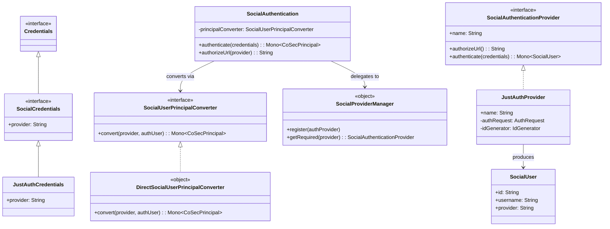
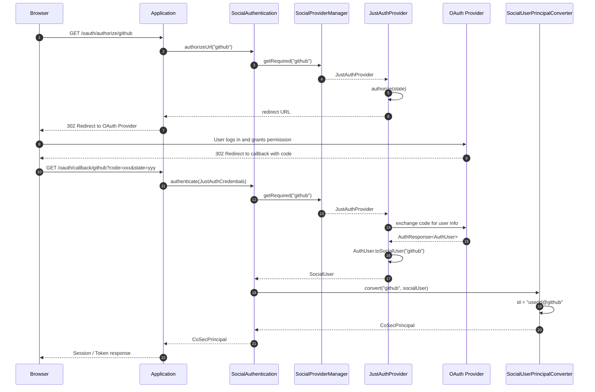
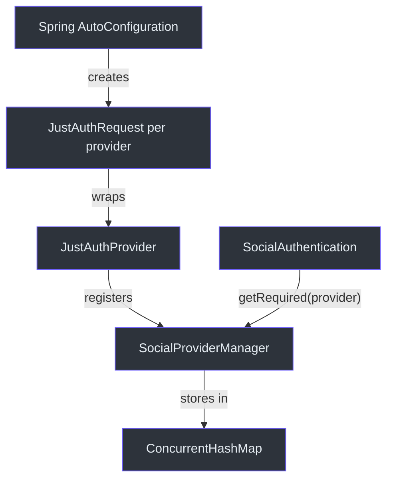

# 社交认证

CoSec 通过 `cosec-social` 模块提供基于 OAuth 的社交登录。它使用 [JustAuth](https://github.com/justauth/JustAuth) 库，在统一的认证接口背后支持数十种 OAuth 提供者（GitHub、Google、微信、钉钉等）。

## 架构概述

社交认证遵循标准的 CoSec `Authentication<C, P>` 模式，但针对 OAuth 流程进行了专门化。关键抽象包括：

- **`SocialCredentials`** -- 携带 OAuth 回调数据和一个 `provider` 标识符
- **`SocialAuthenticationProvider`** -- 每个提供者生成授权 URL 和用授权码交换用户数据的逻辑
- **`SocialAuthentication`** -- 顶层 `Authentication` 实现，路由到正确的提供者
- **`SocialUserPrincipalConverter`** -- 将提供者的用户资料转换为 `CoSecPrincipal`

## 关键接口

### SocialCredentials

[SocialCredentials](../../../../cosec-social/src/main/kotlin/me/ahoo/cosec/social/SocialCredentials.kt) 扩展了 `Credentials`，增加了 `provider` 字段：

```kotlin
interface SocialCredentials : Credentials {
    val provider: String
}
```

具体实现是 [JustAuthCredentials](../../../../cosec-social/src/main/kotlin/me/ahoo/cosec/social/justauth/JustAuthCredentials.kt)，它同时扩展了 JustAuth 的 `AuthCallback`，携带 OAuth 授权码和状态。

### SocialAuthenticationProvider

[SocialAuthenticationProvider](../../../../cosec-social/src/main/kotlin/me/ahoo/cosec/social/SocialAuthenticationProvider.kt) 定义了每个提供者的行为：

```kotlin
interface SocialAuthenticationProvider : Named {
    fun authorizeUrl(): String
    fun authenticate(credentials: SocialCredentials): Mono<SocialUser>
}
```

- `authorizeUrl()` 生成 OAuth 授权重定向 URL
- `authenticate()` 将授权码交换为 `SocialUser`

### SocialProviderManager

[SocialProviderManager](../../../../cosec-social/src/main/kotlin/me/ahoo/cosec/social/SocialProviderManager.kt) 是一个单例注册表，将提供者名称（如 "github"、"google"）映射到 `SocialAuthenticationProvider` 实例：

```kotlin
object SocialProviderManager {
    fun register(authProvider: SocialAuthenticationProvider)
    fun getRequired(provider: String): SocialAuthenticationProvider
}
```

### SocialUser

[SocialUser](../../../../cosec-social/src/main/kotlin/me/ahoo/cosec/social/SocialUser.kt) 是一个数据类，持有提供者的用户资料：

```kotlin
data class SocialUser(
    val id: String,
    val username: String,
    val nickname: String? = null,
    val avatar: String? = null,
    val email: String? = null,
    val location: String? = null,
    val gender: Gender = Gender.UNKNOWN,
    val rawInfo: MutableMap<String, Any> = mutableMapOf(),
    val provider: String
)
```

### SocialUserPrincipalConverter

[SocialUserPrincipalConverter](../../../../cosec-social/src/main/kotlin/me/ahoo/cosec/social/SocialUserPrincipalConverter.kt) 将 `SocialUser` 转换为 `CoSecPrincipal`：

```kotlin
fun interface SocialUserPrincipalConverter {
    fun convert(provider: String, authUser: SocialUser): Mono<CoSecPrincipal>
}
```

### DirectSocialUserPrincipalConverter

[DirectSocialUserPrincipalConverter](../../../../cosec-social/src/main/kotlin/me/ahoo/cosec/social/DirectSocialUserPrincipalConverter.kt) 是默认实现。它使用复合 ID 格式创建 `SimplePrincipal`：

```kotlin
// ID 格式："userId@provider"（例如 "12345@github"）
private fun asProviderUserId(provider: String, authUser: SocialUser): String {
    return authUser.id + "@" + provider
}
```

主体初始时具有空的策略和角色 -- 这些必须在账户创建/关联后单独分配。

## JustAuth 集成

### JustAuthProvider

[JustAuthProvider](../../../../cosec-social/src/main/kotlin/me/ahoo/cosec/social/justauth/JustAuthProvider.kt) 包装了 JustAuth 的 `AuthRequest` 来实现 `SocialAuthenticationProvider`：

```kotlin
class JustAuthProvider(
    override val name: String,
    private val authRequest: AuthRequest,
    private val idGenerator: IdGenerator
) : SocialAuthenticationProvider
```

- `authorizeUrl()` 使用生成的状态令牌调用 `authRequest.authorize(state)`
- `authenticate()` 调用 `authRequest.login(credentials)` 并将 `AuthUser` 响应转换为 `SocialUser`

### RedisAuthStateCache

[RedisAuthStateCache](../../../../cosec-social/src/main/kotlin/me/ahoo/cosec/social/justauth/RedisAuthStateCache.kt) 使用 Redis 实现了 JustAuth 的 `AuthStateCache` 接口，在分布式实例间存储 OAuth 状态令牌。状态在 3 分钟后过期。键的前缀为 `cosec:oauth:state:`。

## 架构图

### 社交认证类图



### 社交 OAuth 流程序列图



### 提供者注册流程



## 设计决策

1. **可插拔的提供者**: `SocialAuthenticationProvider` 抽象允许将 JustAuth 替换为另一个 OAuth 库，而无需更改应用代码。
2. **复合用户 ID**: `userId@provider` 格式确保跨所有 OAuth 提供者的全局唯一主体 ID。
3. **分布式状态**: `RedisAuthStateCache` 确保 OAuth 状态令牌在多个应用实例间正常工作。
4. **可定制的转换**: `SocialUserPrincipalConverter` 接口允许应用实现自定义逻辑来创建主体（例如，关联到现有账户、分配默认角色）。

## 参考文献

- [SocialAuthentication.kt:24](https://github.com/Ahoo-Wang/CoSec/blob/main/cosec-social/src/main/kotlin/me/ahoo/cosec/social/SocialAuthentication.kt#L24) - 顶层社交认证
- [SocialAuthenticationProvider.kt:23](https://github.com/Ahoo-Wang/CoSec/blob/main/cosec-social/src/main/kotlin/me/ahoo/cosec/social/SocialAuthenticationProvider.kt#L23) - 每个提供者的接口
- [SocialProviderManager.kt:22](https://github.com/Ahoo-Wang/CoSec/blob/main/cosec-social/src/main/kotlin/me/ahoo/cosec/social/SocialProviderManager.kt#L22) - 提供者注册表单例
- [JustAuthProvider.kt:33](https://github.com/Ahoo-Wang/CoSec/blob/main/cosec-social/src/main/kotlin/me/ahoo/cosec/social/justauth/JustAuthProvider.kt#L33) - JustAuth 包装器实现
- [DirectSocialUserPrincipalConverter.kt:25](https://github.com/Ahoo-Wang/CoSec/blob/main/cosec-social/src/main/kotlin/me/ahoo/cosec/social/DirectSocialUserPrincipalConverter.kt#L25) - 使用 "userId@provider" 格式的默认主体转换器

## 相关页面

- [认证系统](./authentication-system.md) - 社交认证如何接入提供者注册表
- [令牌管理](./token-management.md) - 将社交认证主体转换为令牌
- [JWT 集成](./jwt-integration.md) - 社交登录后的 JWT 令牌创建
- [授权流程](../authorization/authorization-flow.md) - 社交主体如何被授权
