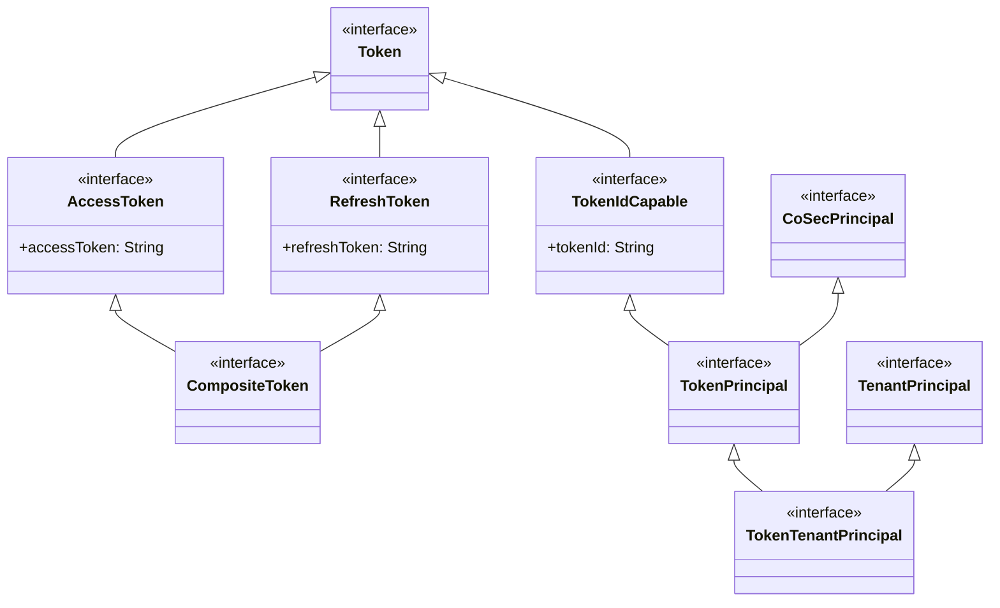
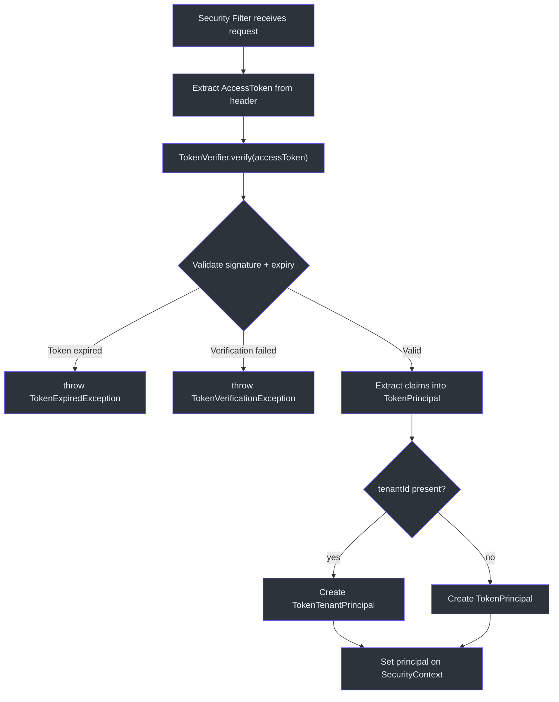
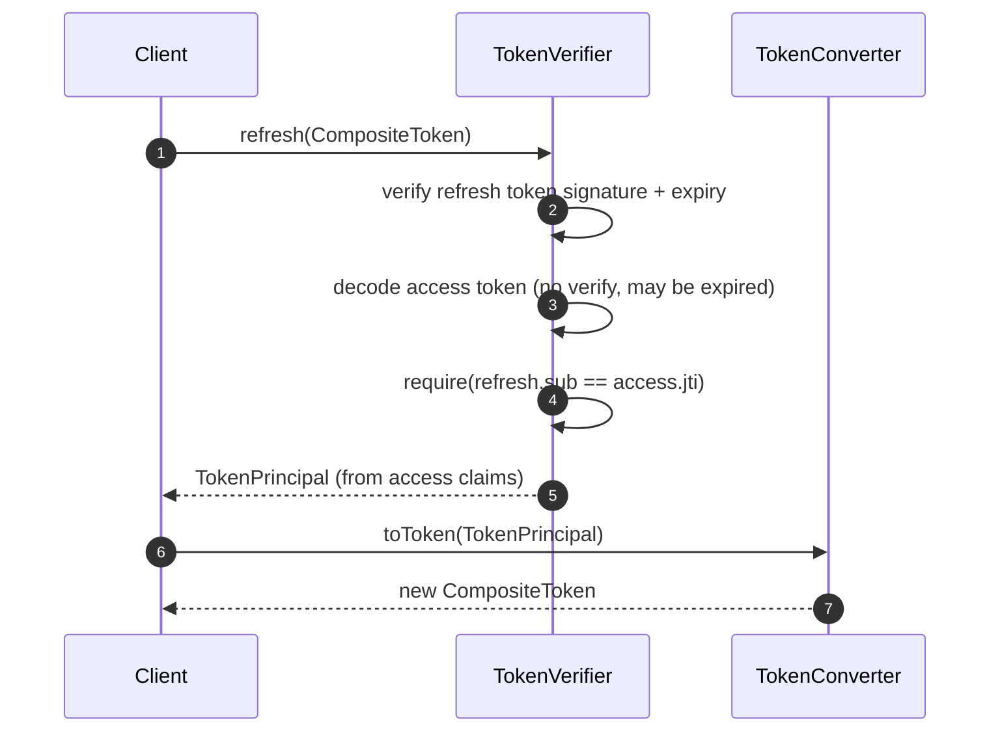

# 令牌管理

CoSec 的令牌管理层提供了清晰的类型层次结构，用于表示和操作认证令牌。设计将抽象令牌模型（在 `cosec-api` 中）与具体实现（在 `cosec-core` 和 `cosec-jwt` 中）分离，遵循项目 API-实现分离的惯例。

## 令牌类型层次结构

令牌类型层次结构位于 `cosec-api` 模块中，构成一个组合格：

### Token（基础）

[Token](../../../../cosec-api/src/main/kotlin/me/ahoo/cosec/api/token/Token.kt) 是根标记接口：

```kotlin
interface Token
```

### AccessToken

[AccessToken](../../../../cosec-api/src/main/kotlin/me/ahoo/cosec/api/token/AccessToken.kt) 扩展了 `Token`，增加了访问令牌字符串：

```kotlin
interface AccessToken : Token {
    val accessToken: String
}
```

### RefreshToken

[RefreshToken](../../../../cosec-api/src/main/kotlin/me/ahoo/cosec/api/token/RefreshToken.kt) 扩展了 `Token`，增加了刷新令牌字符串：

```kotlin
interface RefreshToken : Token {
    val refreshToken: String
}
```

### CompositeToken

[CompositeToken](../../../../cosec-api/src/main/kotlin/me/ahoo/cosec/api/token/CompositeToken.kt) 组合了两个接口：

```kotlin
interface CompositeToken : AccessToken, RefreshToken
```

这允许单个对象同时携带两种令牌，同时保持类型安全 -- 接受 `AccessToken` 的方法可以接收 `CompositeToken`。

## 主体类型

### TokenIdCapable

[TokenIdCapable](../../../../cosec-api/src/main/kotlin/me/ahoo/cosec/api/token/TokenIdCapable.kt) 将令牌标识混入任何类型：

```kotlin
interface TokenIdCapable : Token {
    val tokenId: String
}
```

### TokenPrincipal

[TokenPrincipal](../../../../cosec-api/src/main/kotlin/me/ahoo/cosec/api/token/TokenPrincipal.kt) 扩展了 `CoSecPrincipal`，增加了令牌感知：

```kotlin
interface TokenPrincipal : TokenIdCapable, CoSecPrincipal
```

`TokenPrincipal` 代表一个已认证的用户以及用于认证的令牌 ID。这使得下游代码可以引用特定令牌（例如，用于审计日志或令牌撤销）。

### TokenTenantPrincipal

[TokenTenantPrincipal](../../../../cosec-api/src/main/kotlin/me/ahoo/cosec/api/token/TokenTenantPrincipal.kt) 增加了租户上下文：

```kotlin
interface TokenTenantPrincipal : TenantPrincipal, TokenPrincipal
```

这将三个维度 -- 身份、令牌和租户 -- 组合到单一主体类型中，用于多租户令牌认证应用。

## 转换器和验证器接口

### PrincipalConverter

[PrincipalConverter](../../../../cosec-core/src/main/kotlin/me/ahoo/cosec/token/PrincipalConverter.kt) 是一个 `fun interface`，将 `AccessToken` 转换为 `CoSecPrincipal`：

```kotlin
fun interface PrincipalConverter {
    fun toPrincipal(accessToken: AccessToken): CoSecPrincipal
}
```

### TokenConverter

[TokenConverter](../../../../cosec-core/src/main/kotlin/me/ahoo/cosec/token/TokenConverter.kt) 将 `CoSecPrincipal` 转换为 `CompositeToken`：

```kotlin
interface TokenConverter {
    fun toToken(principal: CoSecPrincipal): CompositeToken
    fun toToken(
        principal: CoSecPrincipal,
        accessTokenValidity: Duration,
        refreshTokenValidity: Duration
    ): CompositeToken
}
```

带有自定义持续时间的重载支持按请求控制令牌有效期（例如，敏感操作使用更短的令牌）。

### TokenVerifier

[TokenVerifier](../../../../cosec-core/src/main/kotlin/me/ahoo/cosec/token/TokenVerifier.kt) 扩展了 `PrincipalConverter`，增加了验证和刷新功能：

```kotlin
interface TokenVerifier : PrincipalConverter {
    fun <T : TokenPrincipal> verify(accessToken: AccessToken): T
    override fun toPrincipal(accessToken: AccessToken): CoSecPrincipal = verify(accessToken)
    fun <T : TokenPrincipal> refresh(token: CompositeToken): T
}
```

默认的 `toPrincipal` 实现委托给 `verify`，因此任何 `TokenVerifier` 自动就是一个 `PrincipalConverter`。

## 架构图

### 令牌类型层次结构



### 令牌验证流程



### 令牌刷新序列



## 具体实现（cosec-core）

| 类 | 实现 | 描述 |
|----|------|------|
| `SimpleCompositeToken` | `CompositeToken` | 持有两个字符串的数据类 |
| `SimpleAccessToken` | `AccessToken` | 单一访问令牌包装器 |
| `SimpleTokenPrincipal` | `TokenPrincipal` | 用令牌 ID 包装 `CoSecPrincipal` |
| `SimpleTokenTenantPrincipal` | `TokenTenantPrincipal` | 用 `Tenant` 上下文包装 `TokenPrincipal` |
| `TokenCompositeAuthentication` | `Authentication` | 将 `CompositeAuthentication` 与 `TokenConverter` 链接，用于 `authenticateAsToken()` |

## TokenCompositeAuthentication

[TokenCompositeAuthentication](../../../../cosec-core/src/main/kotlin/me/ahoo/cosec/token/TokenCompositeAuthentication.kt) 桥接认证和令牌签发：

```kotlin
class TokenCompositeAuthentication(
    private val compositeAuthentication: CompositeAuthentication,
    private val tokenConverter: TokenConverter
) : Authentication<Credentials, CoSecPrincipal>
```

它提供了一个额外的 `authenticateAsToken()` 方法，认证凭据并立即将结果主体转换为 `CompositeToken`：

```kotlin
fun authenticateAsToken(credentials: Credentials): Mono<out CompositeToken>
```

这是需要直接返回令牌的登录端点的主要入口。

## 参考文献

- [Token.kt:25](https://github.com/Ahoo-Wang/CoSec/blob/main/cosec-api/src/main/kotlin/me/ahoo/cosec/api/token/Token.kt#L25) - 基础令牌接口
- [AccessToken.kt:25](https://github.com/Ahoo-Wang/CoSec/blob/main/cosec-api/src/main/kotlin/me/ahoo/cosec/api/token/AccessToken.kt#L25) - 访问令牌接口
- [RefreshToken.kt:25](https://github.com/Ahoo-Wang/CoSec/blob/main/cosec-api/src/main/kotlin/me/ahoo/cosec/api/token/RefreshToken.kt#L25) - 刷新令牌接口
- [CompositeToken.kt:24](https://github.com/Ahoo-Wang/CoSec/blob/main/cosec-api/src/main/kotlin/me/ahoo/cosec/api/token/CompositeToken.kt#L24) - 组合访问 + 刷新令牌
- [TokenPrincipal.kt:27](https://github.com/Ahoo-Wang/CoSec/blob/main/cosec-api/src/main/kotlin/me/ahoo/cosec/api/token/TokenPrincipal.kt#L27) - 令牌感知主体
- [TokenConverter.kt:27](https://github.com/Ahoo-Wang/CoSec/blob/main/cosec-core/src/main/kotlin/me/ahoo/cosec/token/TokenConverter.kt#L27) - 主体到令牌的转换器

## 相关页面

- [JWT 集成](./jwt-integration.md) - JWT 特定的令牌实现
- [认证系统](./authentication-system.md) - 令牌在认证过程中如何产生
- [社交认证](./social-authentication.md) - 社交登录产生携带令牌的主体
- [授权流程](../authorization/authorization-flow.md) - 令牌声明如何在授权中使用
