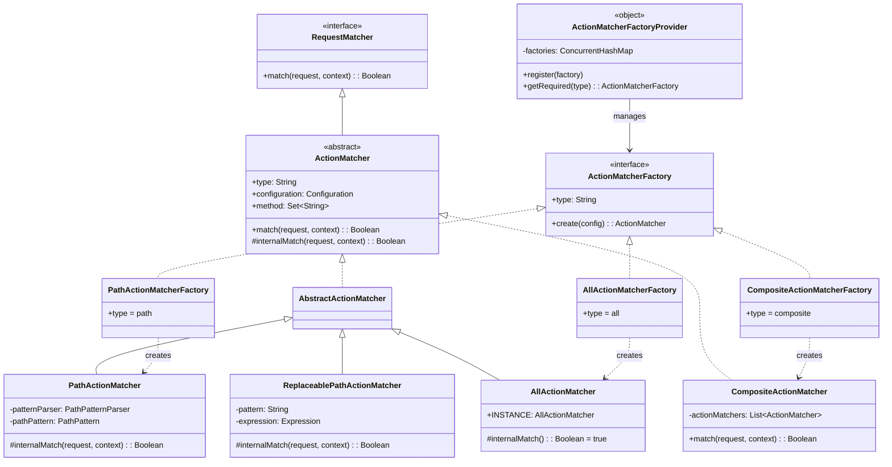
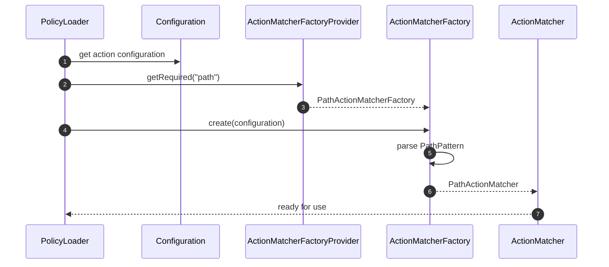
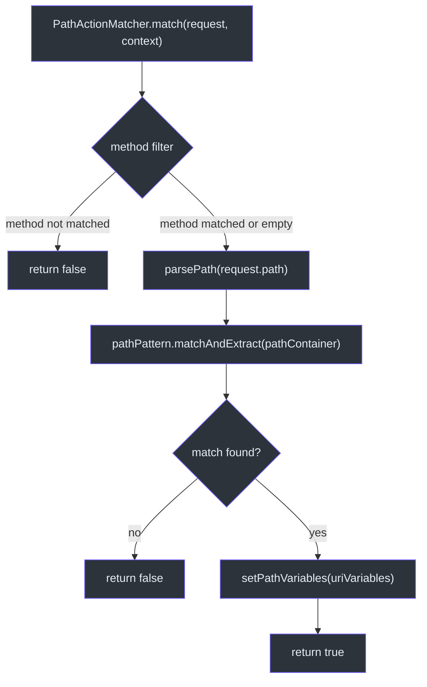

# 动作匹配器

动作匹配器决定传入请求是否匹配策略声明中定义的动作模式。CoSec 提供三种内置匹配器类型和一个 SPI（服务提供者接口）用于自定义实现。所有动作匹配器在策略加载时通过 `ActionMatcherFactory` SPI 解析。

## ActionMatcher 接口

[ActionMatcher](../../../../cosec-api/src/main/kotlin/me/ahoo/cosec/api/policy/ActionMatcher.kt) 扩展了 `RequestMatcher`：

```kotlin
interface ActionMatcher : RequestMatcher
```

`RequestMatcher` 接口定义了：

```kotlin
fun match(request: Request, securityContext: SecurityContext): Boolean
```

## 内置动作匹配器

### PathActionMatcher

[PathActionMatcher](../../../../cosec-core/src/main/kotlin/me/ahoo/cosec/policy/action/PathActionMatcher.kt) 使用 Spring 的 `PathPattern` 进行 URL 模式匹配，并支持路径变量提取：

```kotlin
class PathActionMatcher(
    private val patternParser: PathPatternParser,
    private val pathPattern: PathPattern,
    configuration: Configuration
) : AbstractActionMatcher(PathActionMatcherFactory.TYPE, configuration)
```

当匹配成功时，提取的路径变量会自动存储在 `SecurityContext` 中：

```kotlin
val pathMatchInfo = pathPattern.matchAndExtract(pathContainer) ?: return false
securityContext.setPathVariables(pathMatchInfo.uriVariables)
```

这使得路径变量可以通过 `request.path.var.xxx` 部分提取器被条件匹配器访问。

#### AbstractActionMatcher

[AbstractActionMatcher](../../../../cosec-core/src/main/kotlin/me/ahoo/cosec/policy/action/AbstractActionMatcher.kt) 添加了 HTTP 方法过滤：

```kotlin
abstract class AbstractActionMatcher(
    override val type: String,
    final override val configuration: Configuration
) : ActionMatcher {
    val method: Set<String> = configuration.asMethod()
    override fun match(request, securityContext): Boolean {
        if (method.isNotEmpty() && !method.contains(request.method.uppercase())) return false
        return internalMatch(request, securityContext)
    }
}
```

`method` 配置键接受单个方法（`"GET"`）或列表（`["GET", "POST"]`）。

### AllActionMatcher

[AllActionMatcher](../../../../cosec-core/src/main/kotlin/me/ahoo/cosec/policy/action/AllActionMatcher.kt) 匹配所有请求：

```kotlin
override fun internalMatch(request: Request, securityContext: SecurityContext): Boolean = true
```

由通配符 `"*"` 模式触发。

### CompositeActionMatcher

[CompositeActionMatcher](../../../../cosec-core/src/main/kotlin/me/ahoo/cosec/policy/action/CompositeActionMatcher.kt) 使用 OR 逻辑组合多个匹配器：

```kotlin
override fun match(request: Request, securityContext: SecurityContext): Boolean =
    actionMatchers.any { it.match(request, securityContext) }
```

当策略动作定义了多个路径模式时会自动创建。

### ReplaceablePathActionMatcher

[ReplaceablePathActionMatcher](../../../../cosec-core/src/main/kotlin/me/ahoo/cosec/policy/action/PathActionMatcher.kt) 支持路径模式中的 SpEL 模板表达式：

```kotlin
class ReplaceablePathActionMatcher(
    private val patternParser: PathPatternParser,
    private val pattern: String,
    configuration: Configuration
) : AbstractActionMatcher(PathActionMatcherFactory.TYPE, configuration)
```

当模式包含 SpEL 模板（例如 `"#{context.principal.attributes.customPath}"`）时，模式在运行时从安全上下文中解析，实现按用户或租户的动态路径模式。

## SPI：ActionMatcherFactory

[ActionMatcherFactory](../../../../cosec-core/src/main/kotlin/me/ahoo/cosec/policy/action/ActionMatcherFactory.kt) 是创建匹配器的 SPI 接口：

```kotlin
interface ActionMatcherFactory {
    val type: String
    fun create(configuration: Configuration): ActionMatcher
}
```

### ActionMatcherFactoryProvider

[ActionMatcherFactoryProvider](../../../../cosec-core/src/main/kotlin/me/ahoo/cosec/policy/action/ActionMatcherFactoryProvider.kt) 通过 Java SPI（`ServiceLoader`）发现工厂：

```kotlin
object ActionMatcherFactoryProvider {
    init {
        ServiceLoader.load(ActionMatcherFactory::class.java)
            .forEach { register(it) }
    }
}
```

内置工厂注册在 `META-INF/services/me.ahoo.cosec.policy.action.ActionMatcherFactory` 中：

| 工厂 | 类型 | 匹配器 |
|------|------|--------|
| `PathActionMatcherFactory` | `"path"` | URL 模式匹配 |
| `AllActionMatcherFactory` | `"all"` | 通配符匹配 |
| `CompositeActionMatcherFactory` | `"composite"` | OR 组合 |

### 注册自定义匹配器

1. 实现 `ActionMatcherFactory`，使用唯一的 `type` 字符串
2. 创建文件 `META-INF/services/me.ahoo.cosec.policy.action.ActionMatcherFactory`
3. 添加工厂的完全限定类名

## 架构图

### 动作匹配器类层次结构



### 工厂 SPI 解析序列图



### 带变量提取的路径匹配



## 策略 JSON 示例

### 单路径模式

```json
{
  "action": {
    "path": {
      "pattern": "/api/users/**",
      "method": ["GET", "POST"]
    }
  }
}
```

### 多路径模式（CompositeActionMatcher）

```json
{
  "action": {
    "path": {
      "pattern": ["/api/users/**", "/api/admin/**"]
    }
  }
}
```

### 通配符（AllActionMatcher）

```json
{
  "action": "*"
}
```

## 参考文献

- [PathActionMatcher.kt:42](https://github.com/Ahoo-Wang/CoSec/blob/main/cosec-core/src/main/kotlin/me/ahoo/cosec/policy/action/PathActionMatcher.kt#L42) - 带变量提取的基于路径的动作匹配
- [AllActionMatcher.kt:30](https://github.com/Ahoo-Wang/CoSec/blob/main/cosec-core/src/main/kotlin/me/ahoo/cosec/policy/action/AllActionMatcher.kt#L30) - 通配符匹配器
- [CompositeActionMatcher.kt:32](https://github.com/Ahoo-Wang/CoSec/blob/main/cosec-core/src/main/kotlin/me/ahoo/cosec/policy/action/CompositeActionMatcher.kt#L32) - OR 组合匹配器
- [ActionMatcherFactory.kt:30](https://github.com/Ahoo-Wang/CoSec/blob/main/cosec-core/src/main/kotlin/me/ahoo/cosec/policy/action/ActionMatcherFactory.kt#L30) - 工厂 SPI 接口
- [ActionMatcherFactoryProvider.kt:20](https://github.com/Ahoo-Wang/CoSec/blob/main/cosec-core/src/main/kotlin/me/ahoo/cosec/policy/action/ActionMatcherFactoryProvider.kt#L20) - 使用 ServiceLoader 的 SPI 提供者

## 相关页面

- [策略评估](./policy-evaluation.md) - 动作匹配器如何用于声明验证
- [条件匹配器](./condition-matchers.md) - 动作匹配后的条件评估
- [授权流程](./authorization-flow.md) - 完整的授权管道
- [权限与角色](./permissions-roles.md) - 权限级动作匹配
