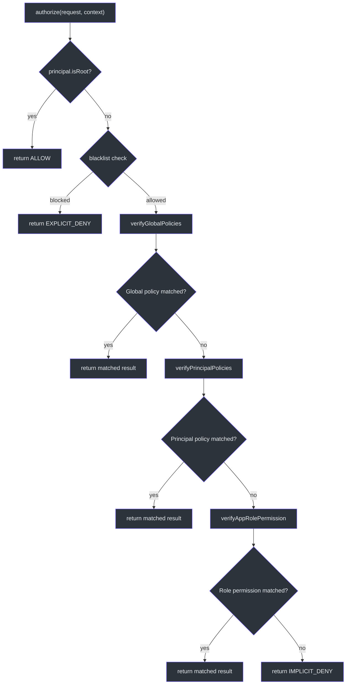
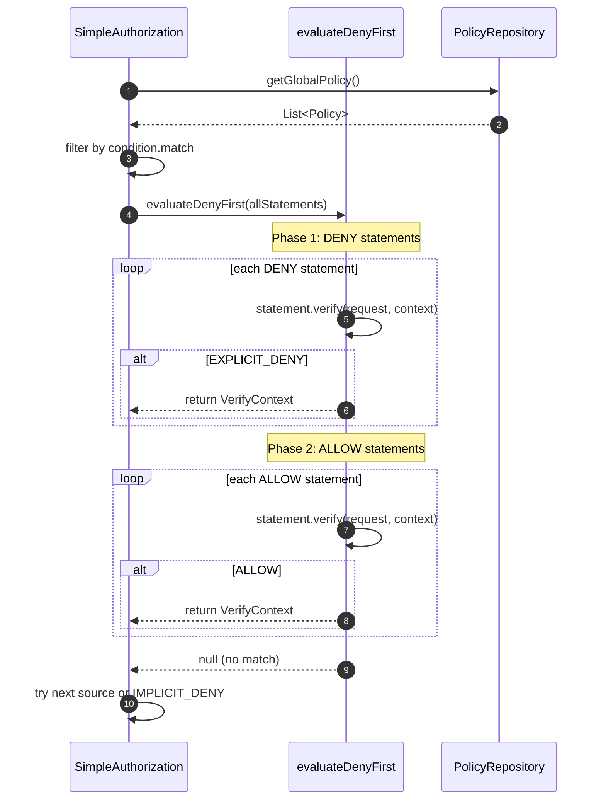
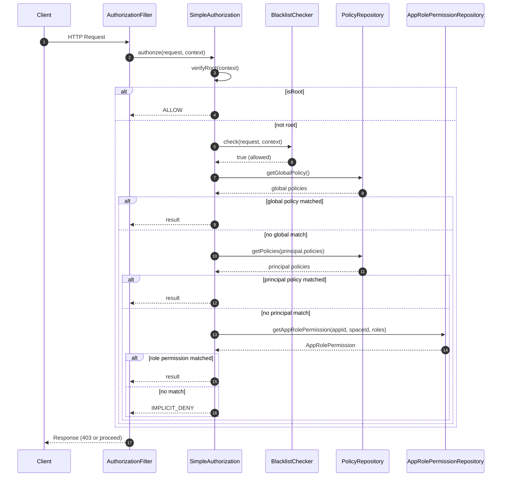

# 授权流程

CoSec 的授权由 [SimpleAuthorization](../../../../cosec-core/src/main/kotlin/me/ahoo/cosec/authorization/SimpleAuthorization.kt) 实现，遵循受 AWS IAM 启发的**拒绝优先**评估策略。管道按定义的优先级顺序检查多个授权源，返回第一个决定性结果或回退到隐式拒绝。

## 授权算法

完整的授权算法按以下步骤进行：

### 步骤 1：根用户检查

如果主体的 `isRoot == true`，授权立即返回 `ALLOW`。根用户绕过所有策略和权限检查。

### 步骤 2：黑名单检查

[BlacklistChecker](../../../../cosec-core/src/main/kotlin/me/ahoo/cosec/blacklist/BlacklistChecker.kt) 检查请求是否被阻止（例如，通过 IP 或用户 ID）。如果被阻止，立即返回 `EXPLICIT_DENY`。默认的 `NoOp` 实现始终允许。

### 步骤 3：全局策略

全局策略（类型 `GLOBAL`）从 `PolicyRepository` 获取。这些策略适用于所有应用和所有主体。策略使用拒绝优先策略进行评估。

### 步骤 4：主体特定策略

明确分配给主体的策略（通过 `principal.policies`）接下来进行评估。这些策略允许单个用户携带自定义策略授权。

### 步骤 5：基于角色的应用权限

使用主体的角色评估应用特定权限。`AppRolePermissionRepository` 获取请求的 `appId` 和 `spaceId` 的角色-权限映射。

### 步骤 6：隐式拒绝

如果没有策略或权限匹配，结果是 `IMPLICIT_DENY` -- 未匹配请求的默认行为。

## 拒绝优先评估

`evaluateDenyFirst` 算法是 CoSec 授权逻辑的核心：

```kotlin
private inline fun <T> evaluateDenyFirst(
    items: Sequence<T>,
    crossinline effectExtractor: (T) -> Effect,
    crossinline verifyItem: (T) -> VerifyResult,
    crossinline onMatch: (T, VerifyResult) -> VerifyContext
): VerifyContext? {
    // Phase 1: Check ALL DENY statements first
    items.filter { effectExtractor(it) == Effect.DENY }.forEach { item ->
        val result = verifyItem(item)
        if (result == VerifyResult.EXPLICIT_DENY) {
            return onMatch(item, result)
        }
    }
    // Phase 2: Then check ALLOW statements
    items.filter { effectExtractor(it) == Effect.ALLOW }.forEach { item ->
        val result = verifyItem(item)
        if (result == VerifyResult.ALLOW) {
            return onMatch(item, result)
        }
    }
    return null
}
```

这确保了**显式拒绝始终优先于允许**，与 AWS IAM 评估模型一致。

## AuthorizeResult 类型

[AuthorizeResult](../../../../cosec-api/src/main/kotlin/me/ahoo/cosec/api/authorization/AuthorizeResult.kt) 定义了可能的结果：

| 结果 | `authorized` | 描述 |
|------|-------------|------|
| `ALLOW` | `true` | 请求被允许 |
| `EXPLICIT_DENY` | `false` | 被显式拒绝声明或黑名单阻止 |
| `IMPLICIT_DENY` | `false` | 没有匹配的策略 -- 默认拒绝 |
| `TOKEN_EXPIRED` | `false` | JWT 令牌已过期 |
| `TOO_MANY_REQUESTS` | `false` | 超出速率限制 |

## VerifyContext

当策略或权限匹配时，[VerifyContext](../../../../cosec-core/src/main/kotlin/me/ahoo/cosec/authorization/PolicyVerifyContext.kt) 被存储在 `SecurityContext` 属性中。这提供了审计信息：

- **`PolicyVerifyContext`**：哪个策略、声明索引和声明匹配了
- **`RoleVerifyContext`**：哪个角色和权限匹配了

## 架构图

### 授权管道流程图



### 拒绝优先评估序列图



### 完整授权请求序列图



## 响应式链

授权管道使用 Reactor 的 `switchIfEmpty` 来链接授权源：

```kotlin
verifyGlobalPolicies(request, context)
    .switchIfEmpty { verifyPrincipalPolicies(request, context) }
    .switchIfEmpty { verifyAppRolePermission(request, context) }
    .map { context.setVerifyContext(it); it.result.toAuthorizeResult() }
    .switchIfEmpty { AuthorizeResult.IMPLICIT_DENY.toMono() }
```

每个源在未找到匹配时返回 `Mono.empty()`，使链继续到下一个源。这保持了整个流程的非阻塞特性。

## 参考文献

- [SimpleAuthorization.kt:48](https://github.com/Ahoo-Wang/CoSec/blob/main/cosec-core/src/main/kotlin/me/ahoo/cosec/authorization/SimpleAuthorization.kt#L48) - 完整授权实现
- [Authorization.kt:35](https://github.com/Ahoo-Wang/CoSec/blob/main/cosec-api/src/main/kotlin/me/ahoo/cosec/api/authorization/Authorization.kt#L35) - 授权接口
- [AuthorizeResult.kt:25](https://github.com/Ahoo-Wang/CoSec/blob/main/cosec-api/src/main/kotlin/me/ahoo/cosec/api/authorization/AuthorizeResult.kt#L25) - 结果类型（ALLOW、EXPLICIT_DENY、IMPLICIT_DENY）
- [BlacklistChecker.kt:29](https://github.com/Ahoo-Wang/CoSec/blob/main/cosec-core/src/main/kotlin/me/ahoo/cosec/blacklist/BlacklistChecker.kt#L29) - 黑名单检查接口
- [PolicyVerifyContext.kt:31](https://github.com/Ahoo-Wang/CoSec/blob/main/cosec-core/src/main/kotlin/me/ahoo/cosec/authorization/PolicyVerifyContext.kt#L31) - 验证上下文类型

## 相关页面

- [策略评估](./policy-evaluation.md) - 单个策略和声明如何被验证
- [动作匹配器](./action-matchers.md) - 请求动作如何被匹配
- [条件匹配器](./condition-matchers.md) - 请求条件如何被评估
- [权限与角色](./permissions-roles.md) - 基于角色的权限评估
