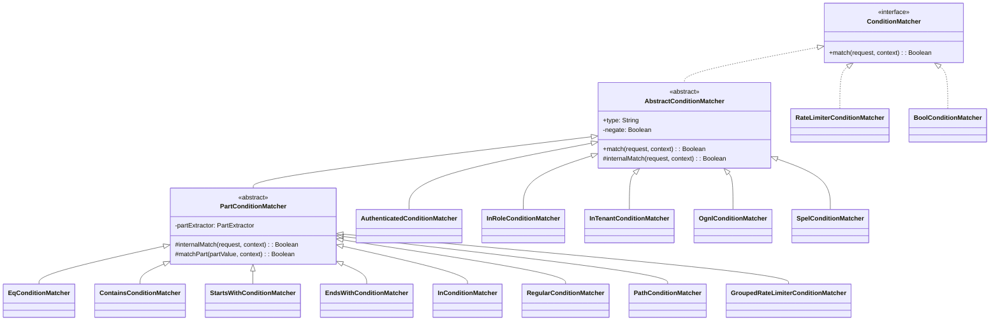
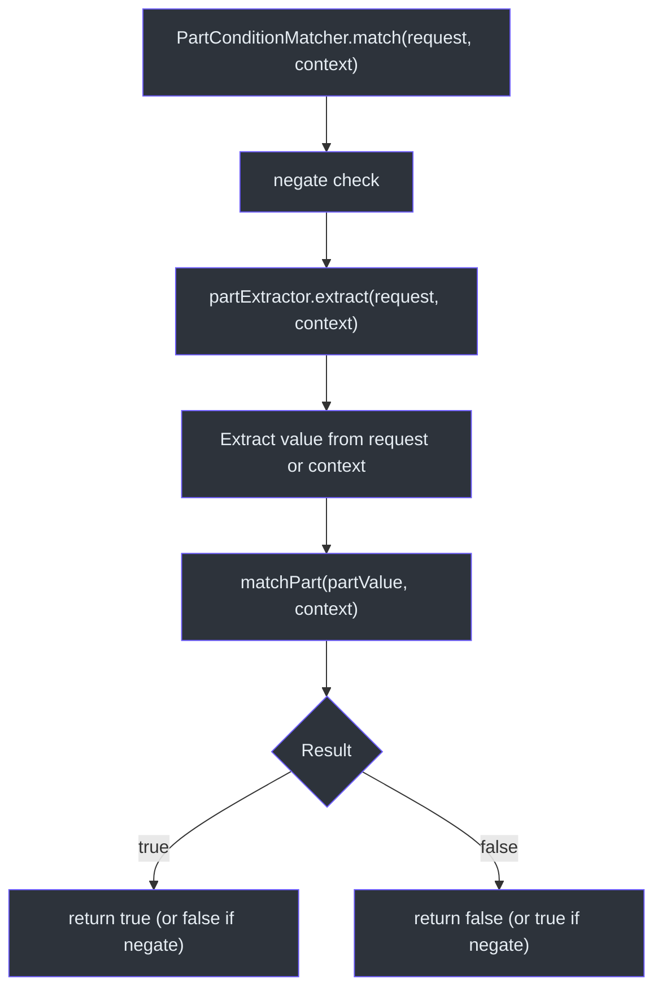
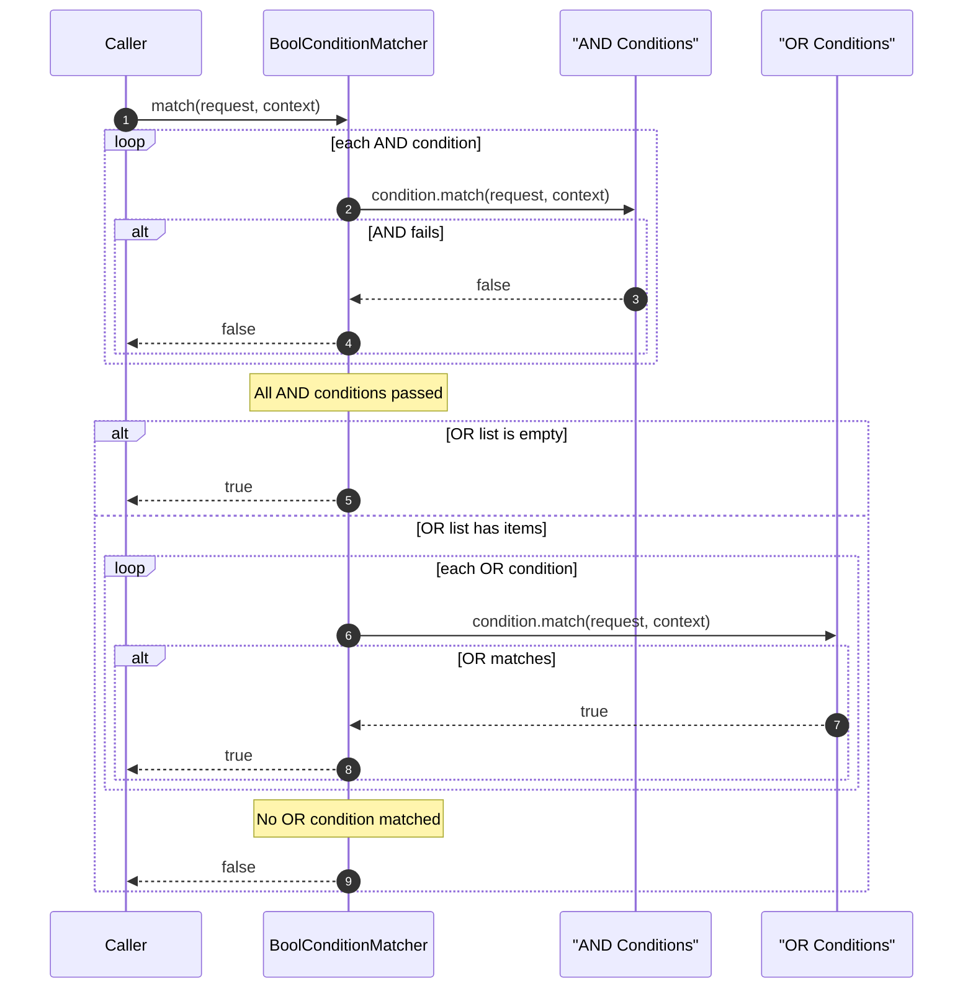

# 条件匹配器

条件匹配器为策略和声明评估添加了细粒度控制。动作匹配器决定*什么*请求被发出，而条件匹配器决定规则*何时*应基于请求属性、安全上下文、速率限制或自定义表达式来应用。

## ConditionMatcher 接口

[ConditionMatcher](../../../../cosec-api/src/main/kotlin/me/ahoo/cosec/api/policy/ConditionMatcher.kt) 扩展了 `RequestMatcher`：

```kotlin
interface ConditionMatcher : RequestMatcher
```

## AbstractConditionMatcher

[AbstractConditionMatcher](../../../../cosec-core/src/main/kotlin/me/ahoo/cosec/policy/condition/AbstractConditionMatcher.kt) 提供了 `negate` 选项和模板方法模式：

```kotlin
abstract class AbstractConditionMatcher(
    final override val type: String,
    final override val configuration: Configuration
) : ConditionMatcher {
    private val negate: Boolean = configuration.get("negate")?.asBoolean() ?: false

    override fun match(request, securityContext): Boolean {
        val match = internalMatch(request, securityContext)
        return if (negate) !match else match
    }
}
```

任何条件都可以通过在配置中设置 `"negate": true` 来取反。

## PartExtractor 框架

许多条件匹配器共享一个通用模式：从请求或安全上下文中提取值，然后进行比较。[PartExtractor](../../../../cosec-core/src/main/kotlin/me/ahoo/cosec/policy/condition/part/PartExtractor.kt) 框架将此形式化：

```kotlin
fun interface PartExtractor {
    fun extract(request: Request, securityContext: SecurityContext): String
}
```

### 部分标识符

`DefaultPartExtractor` 支持以下部分标识符：

**请求部分**（前缀 `request.`）：

| 部分 | 描述 |
|------|------|
| `request.path` | 请求 URL 路径 |
| `request.method` | HTTP 方法 |
| `request.appId` | 应用 ID |
| `request.spaceId` | 空间 ID |
| `request.deviceId` | 设备 ID |
| `request.remoteIp` | 客户端 IP 地址 |
| `request.origin` | Origin 头 URI |
| `request.origin.host` | Origin 主机 |
| `request.referer` | Referer 头 URI |
| `request.referer.host` | Referer 主机 |
| `request.header.{key}` | 请求头值 |
| `request.attributes.{key}` | 请求属性 |
| `request.path.var.{key}` | 路径变量（由 PathActionMatcher 设置） |

**安全上下文部分**（前缀 `context.`）：

| 部分 | 描述 |
|------|------|
| `context.tenantId` | 当前租户 ID |
| `context.principal.id` | 主体用户 ID |
| `context.principal.attributes.{key}` | 主体属性值 |

## 条件匹配器类型

### 基于路径的匹配器

所有基于路径的匹配器都扩展了 [PartConditionMatcher](../../../../cosec-core/src/main/kotlin/me/ahoo/cosec/policy/condition/part/PartConditionMatcher.kt)，操作提取的字符串值：

| 匹配器 | 类型键 | 描述 |
|--------|--------|------|
| [EqConditionMatcher](../../../../cosec-core/src/main/kotlin/me/ahoo/cosec/policy/condition/part/EqConditionMatcher.kt) | `eq` | 相等检查（支持模板表达式和 `ignoreCase`） |
| [ContainsConditionMatcher](../../../../cosec-core/src/main/kotlin/me/ahoo/cosec/policy/condition/part/ContainsConditionMatcher.kt) | `contains` | 子字符串包含检查 |
| [StartsWithConditionMatcher](../../../../cosec-core/src/main/kotlin/me/ahoo/cosec/policy/condition/part/StartsWithConditionMatcher.kt) | `startsWith` | 前缀检查 |
| [EndsWithConditionMatcher](../../../../cosec-core/src/main/kotlin/me/ahoo/cosec/policy/condition/part/EndsWithConditionMatcher.kt) | `endsWith` | 后缀检查 |
| [InConditionMatcher](../../../../cosec-core/src/main/kotlin/me/ahoo/cosec/policy/condition/part/InConditionMatcher.kt) | `in` | 集合成员检查 |
| [RegularConditionMatcher](../../../../cosec-core/src/main/kotlin/me/ahoo/cosec/policy/condition/part/RegularConditionMatcher.kt) | `regular` | 正则表达式匹配 |
| [PathConditionMatcher](../../../../cosec-core/src/main/kotlin/me/ahoo/cosec/policy/condition/part/PathConditionMatcher.kt) | `path` | Spring PathPattern 匹配 |

### 基于上下文的匹配器

这些匹配器直接检查安全上下文：

| 匹配器 | 类型键 | 描述 |
|--------|--------|------|
| [AuthenticatedConditionMatcher](../../../../cosec-core/src/main/kotlin/me/ahoo/cosec/policy/condition/context/AuthenticatedConditionMatcher.kt) | `authenticated` | 检查 `securityContext.principal.authenticated` |
| [InRoleConditionMatcher](../../../../cosec-core/src/main/kotlin/me/ahoo/cosec/policy/condition/context/InRoleConditionMatcher.kt) | `inRole` | 检查主体是否具有特定角色 |
| [InTenantConditionMatcher](../../../../cosec-core/src/main/kotlin/me/ahoo/cosec/policy/condition/context/InTenantConditionMatcher.kt) | `inTenant` | 检查租户类型（DEFAULT、USER、PLATFORM） |

### 速率限制器

| 匹配器 | 类型键 | 描述 |
|--------|--------|------|
| [RateLimiterConditionMatcher](../../../../cosec-core/src/main/kotlin/me/ahoo/cosec/policy/condition/limiter/RateLimiterConditionMatcher.kt) | `rateLimiter` | 使用 Guava `RateLimiter` 的全局速率限制 |
| [GroupedRateLimiterConditionMatcher](../../../../cosec-core/src/main/kotlin/me/ahoo/cosec/policy/condition/limiter/GroupedRateLimiterConditionMatcher.kt) | `groupedRateLimiter` | 按组的速率限制（例如，按用户、按 IP） |

`RateLimiterConditionMatcher` 创建一个跨所有请求共享的单个速率限制器。`GroupedRateLimiterConditionMatcher` 创建一个按提取的部分值为键的 `LoadingCache` 速率限制器，访问后自动过期。

当超出速率限制时，会抛出 `TooManyRequestsException`，授权层会捕获并将其转换为 `AuthorizeResult.TOO_MANY_REQUESTS`。

### 基于表达式的匹配器

| 匹配器 | 类型键 | 描述 |
|--------|--------|------|
| [OgnlConditionMatcher](../../../../cosec-core/src/main/kotlin/me/ahoo/cosec/policy/condition/OgnlConditionMatcher.kt) | `ognl` | OGNL 表达式评估 |
| [SpelConditionMatcher](../../../../cosec-core/src/main/kotlin/me/ahoo/cosec/policy/condition/SpelConditionMatcher.kt) | `spel` | Spring 表达式语言评估 |

两者都在其表达式根中提供对 `request` 和 `context` 对象的访问，支持任意复杂的条件。

### 布尔组合器

[BoolConditionMatcher](../../../../cosec-core/src/main/kotlin/me/ahoo/cosec/policy/condition/BoolConditionMatcher.kt) 使用 AND/OR 逻辑组合多个条件：

```kotlin
class BoolConditionMatcher(configuration: Configuration) {
    val and: List<ConditionMatcher>
    val or: List<ConditionMatcher>
}
```

- **AND**：`and` 列表中的所有条件都必须匹配。如果任何一个失败，结果为 false。
- **OR**：`or` 列表中至少一个条件必须匹配。如果都不匹配，结果为 false。
- 当只有 `and`（没有 `or`）时，所有 AND 条件通过后返回 true。

## SPI：ConditionMatcherFactory

[ConditionMatcherFactory](../../../../cosec-core/src/main/kotlin/me/ahoo/cosec/policy/condition/ConditionMatcherFactory.kt) 是 SPI 接口：

```kotlin
interface ConditionMatcherFactory {
    val type: String
    fun create(configuration: Configuration): ConditionMatcher
}
```

自定义条件匹配器通过 `META-INF/services/me.ahoo.cosec.policy.condition.ConditionMatcherFactory` 注册。

## 架构图

### 条件匹配器类层次结构



### 基于部分的条件评估流程



### 布尔组合器评估



## 策略 JSON 示例

### 基于路径的条件

```json
{
  "condition": {
    "eq": {
      "part": "request.path",
      "value": "/api/admin"
    }
  }
}
```

### 速率限制器（按用户）

```json
{
  "condition": {
    "groupedRateLimiter": {
      "part": "context.principal.id",
      "permitsPerSecond": 10.0,
      "expireAfterAccessSecond": 60
    }
  }
}
```

### 布尔组合

```json
{
  "condition": {
    "bool": {
      "and": [
        { "authenticated": {} },
        { "inRole": { "value": "admin" } }
      ],
      "or": [
        { "eq": { "part": "request.method", "value": "GET" } },
        { "startsWith": { "part": "request.path", "value": "/api/public" } }
      ]
    }
  }
}
```

## 参考文献

- [ConditionMatcherFactory.kt:30](https://github.com/Ahoo-Wang/CoSec/blob/main/cosec-core/src/main/kotlin/me/ahoo/cosec/policy/condition/ConditionMatcherFactory.kt#L30) - 工厂 SPI 接口
- [PartExtractor.kt:22](https://github.com/Ahoo-Wang/CoSec/blob/main/cosec-core/src/main/kotlin/me/ahoo/cosec/policy/condition/part/PartExtractor.kt#L22) - 部分提取框架
- [PartConditionMatcher.kt:21](https://github.com/Ahoo-Wang/CoSec/blob/main/cosec-core/src/main/kotlin/me/ahoo/cosec/policy/condition/part/PartConditionMatcher.kt#L21) - 抽象基于部分的匹配器
- [BoolConditionMatcher.kt:35](https://github.com/Ahoo-Wang/CoSec/blob/main/cosec-core/src/main/kotlin/me/ahoo/cosec/policy/condition/BoolConditionMatcher.kt#L35) - AND/OR 组合器
- [AbstractConditionMatcher.kt:23](https://github.com/Ahoo-Wang/CoSec/blob/main/cosec-core/src/main/kotlin/me/ahoo/cosec/policy/condition/AbstractConditionMatcher.kt#L23) - 带取反支持的基类

## 相关页面

- [动作匹配器](./action-matchers.md) - 声明中的动作模式匹配
- [策略评估](./policy-evaluation.md) - 条件如何控制策略验证
- [授权流程](./authorization-flow.md) - 完整的授权管道
- [权限与角色](./permissions-roles.md) - 基于角色的权限条件
