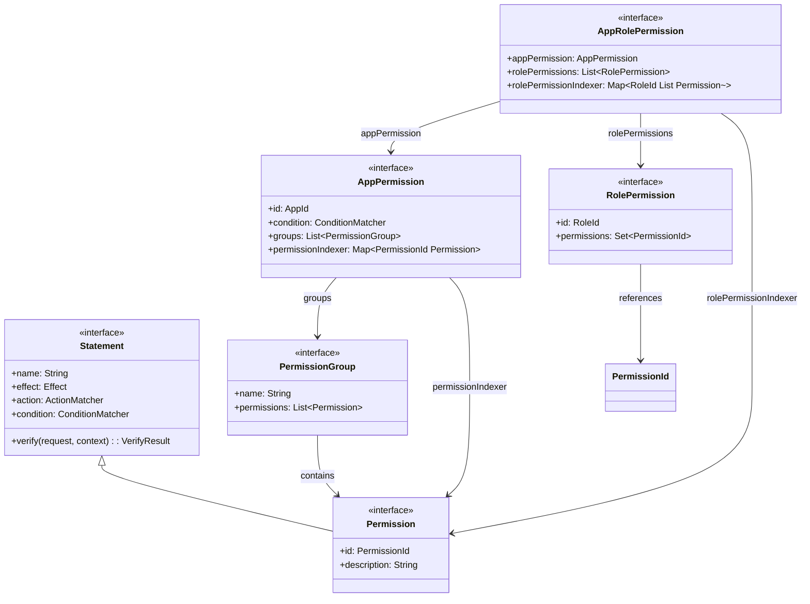
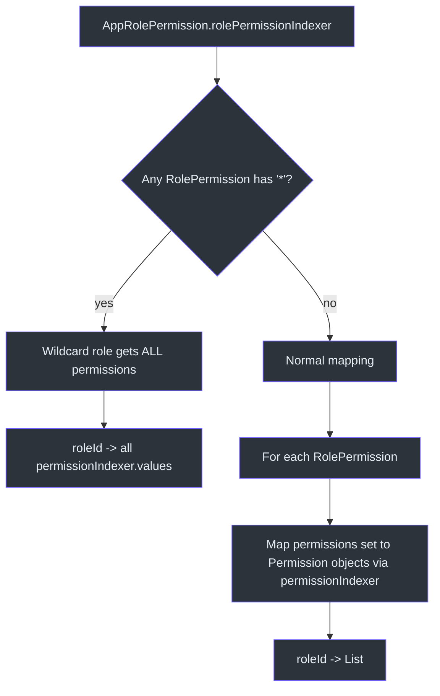
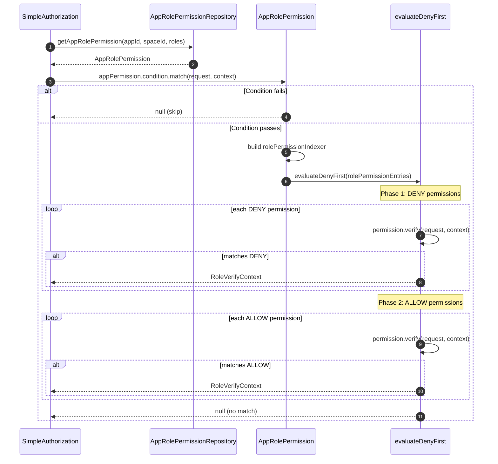

# 权限与角色

CoSec 通过分层权限模型实现基于角色的访问控制（RBAC）。权限是应用范围的，组织成组并分配给角色。`AppRolePermission` 接口通过将角色映射到应用内的允许操作来整合一切。

## 权限模型

### Permission

[Permission](../../../../cosec-api/src/main/kotlin/me/ahoo/cosec/api/permission/Permission.kt) 扩展了 `Statement`，增加了标识和描述：

```kotlin
interface Permission : Statement {
    val id: PermissionId       // 格式："appId.group.permission"
    val description: String
}
```

因为 `Permission` 扩展了 `Statement`，每个权限携带自己的 `effect`（ALLOW/DENY）、`action` 匹配器和 `condition` 匹配器。这意味着单个权限可以使用自己的条件来针对特定 API 端点。

### PermissionGroup

权限通过 `PermissionGroup` 组织成组（例如 "read"、"write"、"admin"），`PermissionGroup` 持有一个 `Permission` 实例列表。

### AppPermission

[AppPermission](../../../../cosec-api/src/main/kotlin/me/ahoo/cosec/api/permission/AppPermission.kt) 代表单个应用的完整权限集：

```kotlin
interface AppPermission {
    val id: AppId                              // 应用标识符
    val condition: ConditionMatcher            // 应用级条件门控
    val groups: List<PermissionGroup>          // 分组的权限
    val permissionIndexer: Map<PermissionId, Permission>  // 计算的索引
}
```

`permissionIndexer` 是一个计算属性，将所有组展平为一个以权限 ID 为键的单一映射，支持 O(1) 查找。

## 基于角色的权限

### RolePermission

[RolePermission](../../../../cosec-api/src/main/kotlin/me/ahoo/cosec/api/permission/RolePermission.kt) 将角色映射到一组权限 ID：

```kotlin
interface RolePermission {
    val id: RoleId                // 角色标识符
    val permissions: Set<PermissionId>  // 分配的权限 ID
}
```

### AppRolePermission

[AppRolePermission](../../../../cosec-api/src/main/kotlin/me/ahoo/cosec/api/permission/AppRolePermission.kt) 将 `AppPermission` 与角色分配组合在一起：

```kotlin
interface AppRolePermission {
    val appPermission: AppPermission
    val rolePermissions: List<RolePermission>
    val rolePermissionIndexer: Map<RoleId, List<Permission>>
}
```

`rolePermissionIndexer` 执行角色与权限之间的连接：

```kotlin
val rolePermissionIndexer: Map<RoleId, List<Permission>>
    get() {
        // Check for wildcard first
        rolePermissions.forEach {
            if (it.permissions.contains(ALL_PERMISSION_ID)) {
                return mapOf(it.id to appPermission.permissionIndexer.values.toList())
            }
        }
        // Normal mapping
        return rolePermissions.associate {
            it.id to it.permissions.mapNotNull { permId ->
                appPermission.permissionIndexer[permId]
            }
        }
    }
```

### 通配符权限

常量 `ALL_PERMISSION_ID = "*"` 授予角色应用中的**所有权限**。当任何 `RolePermission` 的权限集中包含 `"*"` 时，该角色的索引条目包含 `AppPermission` 中的每一个权限。

## 授权中的基于角色评估

在授权期间（参见[授权流程](./authorization-flow.md)），`SimpleAuthorization.verifyAppRolePermission`：

1. 检查 `appRolePermission.appPermission.condition.match(request, context)` -- 应用级门控
2. 将所有角色-权限条目展平为序列
3. 应用拒绝优先算法评估权限

每个角色映射到其已解析的 `Permission` 对象集，这些对象本身就是带有自己动作和条件匹配器的 `Statement` 实例。

## 加载时验证

### DefaultAppPermissionEvaluator

[DefaultAppPermissionEvaluator](../../../../cosec-core/src/main/kotlin/me/ahoo/cosec/permission/DefaultAppPermissionEvaluator.kt) 在加载时验证 `AppPermission`：

```kotlin
object DefaultAppPermissionEvaluator : AppPermissionEvaluator {
    override fun evaluate(appPermission: AppPermission) {
        val evaluateRequest = EvaluateRequest()
        val mockContext = SimpleSecurityContext(SimpleTenantPrincipal.ANONYMOUS)
        // Validate app-level condition
        safeEvaluate { appPermission.condition.match(evaluateRequest, mockContext) }
        // Validate each permission
        appPermission.permissionIndexer.values.forEach { permission ->
            safeEvaluate { permission.condition.match(evaluateRequest, mockContext) }
            safeEvaluate { permission.action.match(evaluateRequest, mockContext) }
            safeEvaluate { permission.verify(evaluateRequest, mockContext) }
        }
    }
}
```

这与策略的 `DefaultPolicyEvaluator` 模式一致，在部署时捕获配置错误。

## 架构图

### 权限模型类图



### 角色-权限索引



### 基于角色的授权序列图



## 权限 ID 约定

权限 ID 遵循格式 `appId.group.permission`：

| 示例 | 描述 |
|------|------|
| `order.read` | 读取订单 |
| `order.write` | 创建/更新订单 |
| `admin.users.delete` | 删除管理员应用中的用户 |
| `*` | 通配符 - 所有权限 |

这种命名约定支持层次化组织和可读的审计日志。

## 参考文献

- [Permission.kt:33](https://github.com/Ahoo-Wang/CoSec/blob/main/cosec-api/src/main/kotlin/me/ahoo/cosec/api/permission/Permission.kt#L33) - 扩展 Statement 的权限接口
- [AppPermission.kt:19](https://github.com/Ahoo-Wang/CoSec/blob/main/cosec-api/src/main/kotlin/me/ahoo/cosec/api/permission/AppPermission.kt#L19) - 应用级权限容器
- [RolePermission.kt:28](https://github.com/Ahoo-Wang/CoSec/blob/main/cosec-api/src/main/kotlin/me/ahoo/cosec/api/permission/RolePermission.kt#L28) - 角色到权限的映射
- [AppRolePermission.kt:16](https://github.com/Ahoo-Wang/CoSec/blob/main/cosec-api/src/main/kotlin/me/ahoo/cosec/api/permission/AppRolePermission.kt#L16) - 组合应用 + 角色权限及索引
- [DefaultAppPermissionEvaluator.kt:23](https://github.com/Ahoo-Wang/CoSec/blob/main/cosec-core/src/main/kotlin/me/ahoo/cosec/permission/DefaultAppPermissionEvaluator.kt#L23) - 加载时验证

## 相关页面

- [授权流程](./authorization-flow.md) - 基于角色的权限如何融入授权管道
- [策略评估](./policy-evaluation.md) - 策略级评估（与权限评估并行）
- [动作匹配器](./action-matchers.md) - 权限中使用的动作模式
- [条件匹配器](./condition-matchers.md) - 权限中使用的条件
