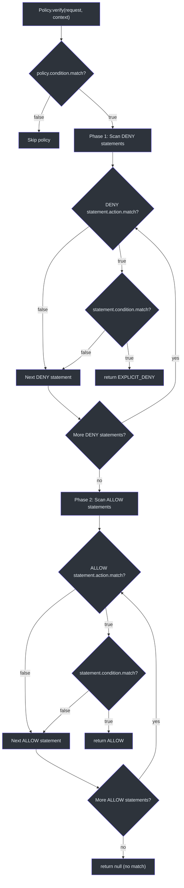
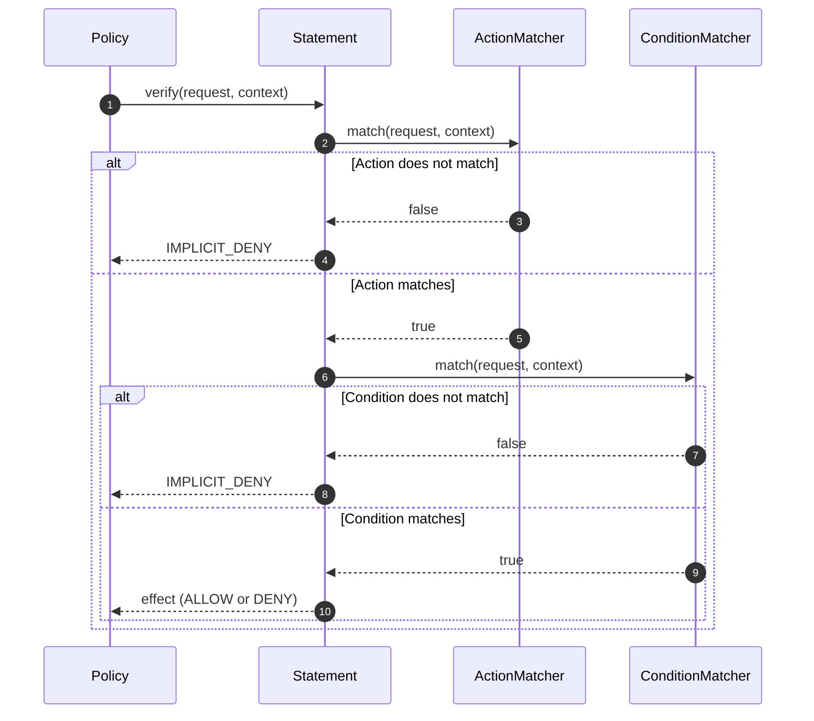
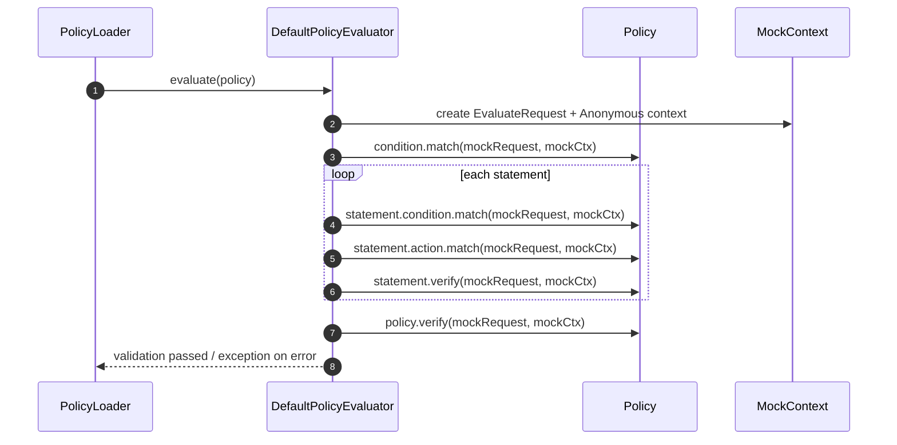

# 策略评估

策略是 CoSec 中定义授权规则的核心抽象。一个策略包含一组声明，每个声明有一个动作匹配器和可选条件。评估遵循严格的顺序：首先检查条件，然后对所有匹配的声明执行拒绝优先评估。

## 策略结构

### PolicyData

[PolicyData](../../../../cosec-core/src/main/kotlin/me/ahoo/cosec/policy/PolicyData.kt) 是 `Policy` 接口的具体实现：

```kotlin
class PolicyData(
    override val id: String,
    override val category: String,
    override val name: String,
    override val description: String,
    override val type: PolicyType,       // GLOBAL or APP
    override val tenantId: String,
    override val condition: ConditionMatcher = AllConditionMatcher.INSTANCE,
    override val statements: List<Statement> = listOf()
) : Policy
```

关键属性：

- **`id`**：唯一策略标识符
- **`type`**：`GLOBAL`（适用于所有应用）或 `APP`（应用范围）
- **`tenantId`**：租户范围 -- 策略是租户范围的
- **`condition`**：在评估任何声明之前必须匹配的顶层条件
- **`statements`**：有序的权限规则列表

### StatementData

[StatementData](../../../../cosec-core/src/main/kotlin/me/ahoo/cosec/policy/StatementData.kt) 代表单个规则：

```kotlin
data class StatementData(
    override val name: String = "",
    override val effect: Effect = Effect.ALLOW,
    override val action: ActionMatcher,
    override val condition: ConditionMatcher = AllConditionMatcher.INSTANCE
) : Statement
```

- **`effect`**：`ALLOW` 或 `DENY` -- 确定该声明匹配时的结果
- **`action`**：匹配请求（例如，路径模式）。参见[动作匹配器](./action-matchers.md)
- **`condition`**：必须满足的附加条件。默认为 `AllConditionMatcher`（始终匹配）

## 策略验证算法

### 策略级验证

当策略针对请求进行评估时，过程遵循以下顺序：

1. **策略条件检查**：`policy.condition.match(request, securityContext)` -- 如果为 false，整个策略被跳过
2. **拒绝优先声明扫描**：首先检查所有 `DENY` 声明；如果有任何一个匹配，结果为 `EXPLICIT_DENY`
3. **允许声明扫描**：接下来检查 `ALLOW` 声明；如果有任何一个匹配，结果为 `ALLOW`
4. **无匹配**：返回 `null`（传递到下一个授权源）

### 声明级验证

每个声明通过两个步骤验证：

1. **动作匹配**：`statement.action.match(request, securityContext)` -- 请求是否匹配动作模式？
2. **条件匹配**：`statement.condition.match(request, securityContext)` -- 附加条件是否满足？

两者都必须返回 true 才能使声明匹配。

## 加载时验证

### DefaultPolicyEvaluator

[DefaultPolicyEvaluator](../../../../cosec-core/src/main/kotlin/me/ahoo/cosec/policy/DefaultPolicyEvaluator.kt) 使用模拟请求和上下文在加载时验证策略：

```kotlin
object DefaultPolicyEvaluator : PolicyEvaluator {
    override fun evaluate(policy: Policy) {
        val evaluateRequest = EvaluateRequest()
        val mockContext = SimpleSecurityContext(SimpleTenantPrincipal.ANONYMOUS)
        // Verify policy condition
        safeEvaluate { policy.condition.match(evaluateRequest, mockContext) }
        // Verify each statement
        policy.statements.forEach { statement ->
            safeEvaluate { statement.condition.match(evaluateRequest, mockContext) }
            statement.action.match(evaluateRequest, mockContext)
            safeEvaluate { statement.verify(evaluateRequest, mockContext) }
        }
        // Verify full policy
        safeEvaluate { policy.verify(evaluateRequest, mockContext) }
    }
}
```

`safeEvaluate` 包装器捕获 `TooManyRequestsException`（来自速率限制器条件）并继续执行，因为速率限制无法使用模拟数据进行有意义的评估。

### EvaluateRequest

[EvaluateRequest](../../../../cosec-core/src/main/kotlin/me/ahoo/cosec/policy/DefaultPolicyEvaluator.kt) 为验证提供了合理的默认值：

```kotlin
data class EvaluateRequest(
    override val path: String = "/policies/test",
    override val method: String = "POST",
    override val remoteIp: String = "127.0.0.1",
    override val origin: URI = URI.create("http://mockOrigin"),
    override val referer: URI = URI.create("http://mockReferer"),
) : Request
```

## 架构图

### 策略验证流程



### 声明验证序列图



### 加载时验证序列图



## PolicyVerifyContext

当授权期间策略或声明匹配时，[PolicyVerifyContext](../../../../cosec-core/src/main/kotlin/me/ahoo/cosec/authorization/PolicyVerifyContext.kt) 被创建并附加到 `SecurityContext`：

```kotlin
data class PolicyVerifyContext(
    val policy: Policy,
    val statementIndex: Int,
    val statement: Statement,
    override val result: VerifyResult
) : VerifyContext
```

这使得下游代码（审计日志、调试、OpenTelemetry 追踪）能够准确了解哪个策略和声明产生了授权决策。

## 性能：基于序列的评估

`evaluateDenyFirst` 函数操作 Kotlin `Sequence<T>` 而非 `List<T>`。这意味着：

- 声明过滤和迭代是**惰性的** -- 仅在需要时评估
- 如果 DENY 声明提前匹配，剩余声明永远不会被评估
- 内存开销最小，因为不创建中间集合

## 参考文献

- [DefaultPolicyEvaluator.kt:25](https://github.com/Ahoo-Wang/CoSec/blob/main/cosec-core/src/main/kotlin/me/ahoo/cosec/policy/DefaultPolicyEvaluator.kt#L25) - 加载时策略验证
- [PolicyVerifyContext.kt:60](https://github.com/Ahoo-Wang/CoSec/blob/main/cosec-core/src/main/kotlin/me/ahoo/cosec/authorization/PolicyVerifyContext.kt#L60) - 验证上下文数据类
- [PolicyData.kt:35](https://github.com/Ahoo-Wang/CoSec/blob/main/cosec-core/src/main/kotlin/me/ahoo/cosec/policy/PolicyData.kt#L35) - 策略数据实现
- [StatementData.kt:31](https://github.com/Ahoo-Wang/CoSec/blob/main/cosec-core/src/main/kotlin/me/ahoo/cosec/policy/StatementData.kt#L31) - 声明数据实现
- [SimpleAuthorization.kt:86](https://github.com/Ahoo-Wang/CoSec/blob/main/cosec-core/src/main/kotlin/me/ahoo/cosec/authorization/SimpleAuthorization.kt#L86) - 授权中的策略验证

## 相关页面

- [授权流程](./authorization-flow.md) - 使用策略的完整授权管道
- [动作匹配器](./action-matchers.md) - 动作模式如何被匹配
- [条件匹配器](./condition-matchers.md) - 条件如何被评估
- [权限与角色](./permissions-roles.md) - 基于角色的权限结构
