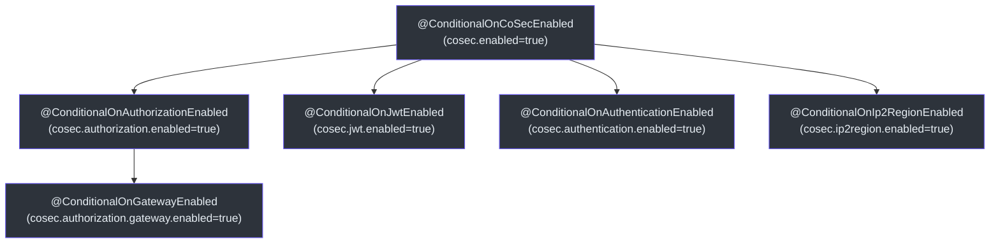
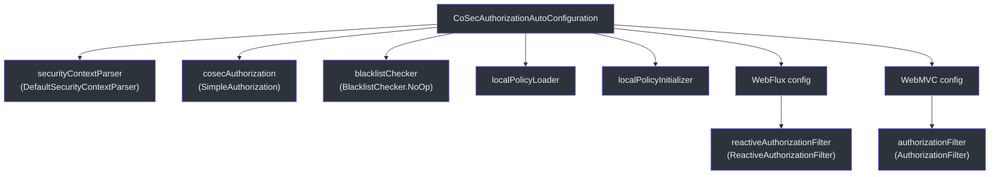
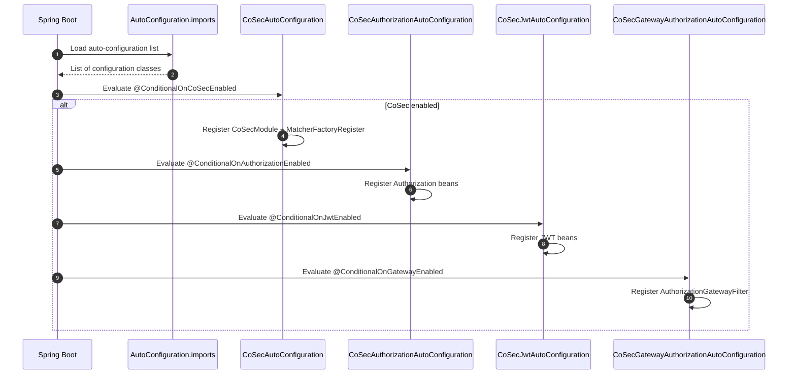

# 自动配置

CoSec 使用 Spring Boot 的自动配置机制，根据类路径存在和属性配置自动装配所有安全组件。这使得应用程序只需添加依赖并进行少量配置即可集成 CoSec。

## 配置层次结构

```mermaid
graph TD
    A["CoSecAutoConfiguration<br>(root)"] --> B["CoSecAuthorizationAutoConfiguration"]
    A --> C["CoSecJwtAutoConfiguration"]
    A --> D["CoSecGatewayAuthorizationAutoConfiguration"]
    A --> E["CoSecPolicyCacheAutoConfiguration"]
    A --> F["Ip2RegionAutoConfiguration"]
    A --> G["CoSecSocialAutoConfiguration"]
    A --> H["CoSecOpenTelemetryAutoConfiguration"]
    B --> I["WebFlux (ReactiveAuthorizationFilter)"]
    B --> J["WebMVC (AuthorizationFilter)"]
    B --> K["InjectSecurityContext"]
    C --> L["JwtTokenConverter"]
    C --> M["JwtTokenVerifier"]
    C --> N["TokenCompositeAuthentication"]
    D --> O["AuthorizationGatewayFilter"]

    style A fill:#2d333b,stroke:#6d5dfc,color:#e6edf3
    style B fill:#2d333b,stroke:#6d5dfc,color:#e6edf3
    style C fill:#2d333b,stroke:#6d5dfc,color:#e6edf3
    style D fill:#2d333b,stroke:#6d5dfc,color:#e6edf3
    style E fill:#2d333b,stroke:#6d5dfc,color:#e6edf3
    style F fill:#2d333b,stroke:#6d5dfc,color:#e6edf3
    style G fill:#2d333b,stroke:#6d5dfc,color:#e6edf3
    style H fill:#2d333b,stroke:#6d5dfc,color:#e6edf3
    style I fill:#2d333b,stroke:#6d5dfc,color:#e6edf3
    style J fill:#2d333b,stroke:#6d5dfc,color:#e6edf3
    style K fill:#2d333b,stroke:#6d5dfc,color:#e6edf3
    style L fill:#2d333b,stroke:#6d5dfc,color:#e6edf3
    style M fill:#2d333b,stroke:#6d5dfc,color:#e6edf3
    style N fill:#2d333b,stroke:#6d5dfc,color:#e6edf3
    style O fill:#2d333b,stroke:#6d5dfc,color:#e6edf3

```



## CoSecAutoConfiguration

根自动配置类。它在 `JacksonAutoConfiguration` 之前运行，以确保 CoSec JSON 模块尽早注册。

```kotlin
@ConditionalOnCoSecEnabled
@AutoConfiguration(before = [JacksonAutoConfiguration::class])
@EnableConfigurationProperties(CoSecProperties::class)
class CoSecAutoConfiguration {
    @Bean
    fun coSecModule(): CoSecModule = CoSecModule()

    @Bean
    fun matcherFactoryRegister(
        applicationContext: ApplicationContext
    ): MatcherFactoryRegister = MatcherFactoryRegister(applicationContext)
}
```

注册两个 Bean：
1. **`CoSecModule`** -- 用于序列化 CoSec 类型（策略、语句、匹配器）的 Jackson 模块。
2. **`MatcherFactoryRegister`** -- Spring `SmartLifecycle`，从应用上下文中注册所有 `ActionMatcherFactory` 和 `ConditionMatcherFactory` Bean。

## 条件注解

CoSec 定义了一系列条件注解，用于控制哪些自动配置类被激活：



所有注解都基于 Spring 的 `@ConditionalOnProperty` 构建。根注解 `@ConditionalOnCoSecEnabled` 使用 `matchIfMissing = true`，因此 CoSec 默认启用。

| 注解 | 属性 | 默认值 |
|------|------|--------|
| `@ConditionalOnCoSecEnabled` | `cosec.enabled` | `true` |
| `@ConditionalOnAuthorizationEnabled` | `cosec.authorization.enabled` | `true` |
| `@ConditionalOnJwtEnabled` | `cosec.jwt.enabled` | `true` |
| `@ConditionalOnAuthenticationEnabled` | `cosec.authentication.enabled` | `true` |
| `@ConditionalOnIp2RegionEnabled` | `cosec.ip2region.enabled` | `true` |
| `@ConditionalOnGatewayEnabled` | `cosec.authorization.gateway.enabled` | `true` |

## CoSecAuthorizationAutoConfiguration

装配核心授权组件：



嵌套的 `WebFlux` 和 `WebMVC` 配置根据类路径存在情况有条件地激活：
- **WebFlux**：当 `ReactiveAuthorizationFilter` 在类路径上且 Spring Cloud Gateway 不在时激活。
- **WebMVC**：当 `AuthorizationFilter` 在类路径上时激活。
- **Gateway**：由单独的 `CoSecGatewayAuthorizationAutoConfiguration` 处理，通过 `@ConditionalOnMissingClass` 优先于普通 WebFlux 过滤器。

## CoSecJwtAutoConfiguration

配置 JWT 令牌处理：

- **算法**：通过 `JwtProperties` 支持 `HMAC256`、`HMAC384`、`HMAC512`。
- **TokenConverter**：创建具有可配置有效期的 JWT 访问令牌和刷新令牌。
- **TokenVerifier**：验证 JWT 签名。
- **TokenCompositeAuthentication**：在认证启用时，用令牌生成包装 `CompositeAuthentication`。

## CoSecProperties

根配置属性：

```yaml
cosec:
  enabled: true          # 所有 CoSec 功能的主开关
  # 子属性遵循相同模式：
  # cosec.authorization.enabled
  # cosec.jwt.enabled
  # cosec.authentication.enabled
  # cosec.ip2region.enabled
```

## Spring 自动配置注册

CoSec 使用 Spring Boot 的 `META-INF/spring/org.springframework.boot.autoconfigure.AutoConfiguration.imports` 文件注册所有自动配置类。这是 `spring.factories` 的现代替代方案。



## 参考资料

- [cosec-spring-boot-starter/src/main/kotlin/.../CoSecAutoConfiguration.kt:37](https://github.com/Ahoo-Wang/CoSec/blob/main/cosec-spring-boot-starter/src/main/kotlin/me/ahoo/cosec/spring/boot/starter/CoSecAutoConfiguration.kt#L37) -- 根自动配置
- [cosec-spring-boot-starter/src/main/kotlin/.../CoSecProperties.kt:30](https://github.com/Ahoo-Wang/CoSec/blob/main/cosec-spring-boot-starter/src/main/kotlin/me/ahoo/cosec/spring/boot/starter/CoSecProperties.kt#L30) -- 配置属性
- [cosec-spring-boot-starter/src/main/kotlin/.../ConditionalOnCoSecEnabled.kt:23](https://github.com/Ahoo-Wang/CoSec/blob/main/cosec-spring-boot-starter/src/main/kotlin/me/ahoo/cosec/spring/boot/starter/ConditionalOnCoSecEnabled.kt#L23) -- 条件注解
- [cosec-spring-boot-starter/src/main/kotlin/.../CoSecAuthorizationAutoConfiguration.kt:48](https://github.com/Ahoo-Wang/CoSec/blob/main/cosec-spring-boot-starter/src/main/kotlin/me/ahoo/cosec/spring/boot/starter/authorization/CoSecAuthorizationAutoConfiguration.kt#L48) -- 授权自动配置
- [cosec-spring-boot-starter/src/main/kotlin/.../CoSecJwtAutoConfiguration.kt:47](https://github.com/Ahoo-Wang/CoSec/blob/main/cosec-spring-boot-starter/src/main/kotlin/me/ahoo/cosec/spring/boot/starter/jwt/CoSecJwtAutoConfiguration.kt#L47) -- JWT 自动配置

## 相关页面

- [自定义匹配器](./custom-matchers.md)
- [Spring WebFlux 集成](../integrations/spring-webflux.md)
- [Spring Cloud Gateway 集成](../integrations/spring-cloud-gateway.md)
- [部署](../operations/deployment.md)
