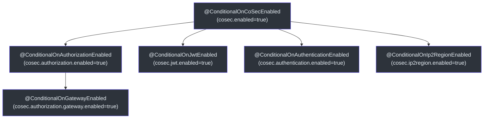
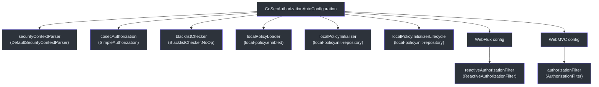
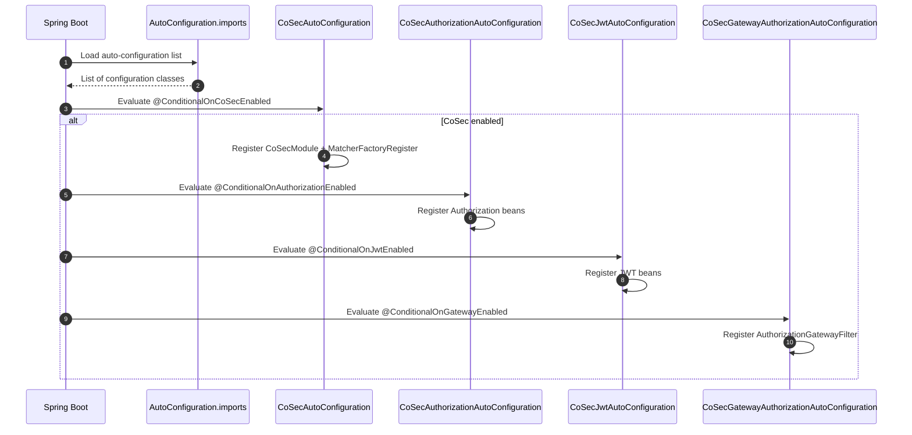

# 自动配置

CoSec 使用 Spring Boot 的自动配置机制，根据类路径存在和属性配置自动装配所有安全组件。这使得应用程序只需添加依赖并进行少量配置即可集成 CoSec。

## 自动配置概览

全部 19 个 CoSec 自动配置类都作为**独立的扁平条目**注册在 `META-INF/spring/org.springframework.boot.autoconfigure.AutoConfiguration.imports` 中 -- 它们之间没有父/子层次结构。将它们联系在一起的是共享的 `@ConditionalOnCoSecEnabled` 门控（`cosec.enabled`，默认为 `true`）；若干类在此之上叠加了额外的条件（例如 `CoSecAuthorizationAutoConfiguration` 还要求 `@ConditionalOnAuthorizationEnabled`，`CoSecGatewayAuthorizationAutoConfiguration` 额外要求 `@ConditionalOnGatewayEnabled` 和 `@ConditionalOnClass(AuthorizationGatewayFilter::class)`）。唯一的例外是 `CoSecEndpointAutoConfiguration`，它仅由类路径存在性激活。


```mermaid
graph TD
    G["@ConditionalOnCoSecEnabled<br>(cosec.enabled=true)"]
    G --> A["CoSecAutoConfiguration"]
    G --> B["CoSecAuthenticationAutoConfiguration"]
    G --> C["CoSecSocialAuthenticationAutoConfiguration"]
    G --> D["CoSecPolicyCacheAutoConfiguration"]
    G --> E["CoSecPermissionCacheAutoConfiguration"]
    G --> F["CoSecRequestParserAutoConfiguration"]
    G --> H["CoSecAuthorizationAutoConfiguration"]
    G --> I["CoSecGatewayAuthorizationAutoConfiguration"]
    G --> J["InjectSecurityContextAutoConfiguration"]
    G --> K["CoSecTokenRevocationCacheAutoConfiguration"]
    G --> L["CoSecJwtAutoConfiguration"]
    G --> M["CoSecOpenTelemetryAutoConfiguration"]
    G --> N["Ip2RegionAutoConfiguration"]
    G --> O["CoSecOpenAPIAutoConfiguration"]
    G --> Q["CoSecRedisRateLimiterAutoConfiguration"]
    G --> R["CoSecKafkaAuditAutoConfiguration"]
    G --> S["CoSecAuditAutoConfiguration"]
    G --> T["CoSecAuditFallbackAutoConfiguration"]
    P["CoSecEndpointAutoConfiguration<br>(classpath-only gate)"]

    style G fill:#2d333b,stroke:#6d5dfc,color:#e6edf3
    style A fill:#2d333b,stroke:#6d5dfc,color:#e6edf3
    style B fill:#2d333b,stroke:#6d5dfc,color:#e6edf3
    style C fill:#2d333b,stroke:#6d5dfc,color:#e6edf3
    style D fill:#2d333b,stroke:#6d5dfc,color:#e6edf3
    style E fill:#2d333b,stroke:#6d5dfc,color:#e6edf3
    style F fill:#2d333b,stroke:#6d5dfc,color:#e6edf3
    style H fill:#2d333b,stroke:#6d5dfc,color:#e6edf3
    style I fill:#2d333b,stroke:#6d5dfc,color:#e6edf3
    style J fill:#2d333b,stroke:#6d5dfc,color:#e6edf3
    style K fill:#2d333b,stroke:#6d5dfc,color:#e6edf3
    style L fill:#2d333b,stroke:#6d5dfc,color:#e6edf3
    style M fill:#2d333b,stroke:#6d5dfc,color:#e6edf3
    style N fill:#2d333b,stroke:#6d5dfc,color:#e6edf3
    style O fill:#2d333b,stroke:#6d5dfc,color:#e6edf3
    style Q fill:#2d333b,stroke:#6d5dfc,color:#e6edf3
    style R fill:#2d333b,stroke:#6d5dfc,color:#e6edf3
    style S fill:#2d333b,stroke:#6d5dfc,color:#e6edf3
    style T fill:#2d333b,stroke:#6d5dfc,color:#e6edf3
    style P fill:#2d333b,stroke:#6d5dfc,color:#e6edf3

```

## CoSecAutoConfiguration

根自动配置类。它在 `JacksonAutoConfiguration` 之前运行，以确保 CoSec JSON 模块尽早注册。

```kotlin
@ConditionalOnCoSecEnabled
@AutoConfiguration(before = [JacksonAutoConfiguration::class])
@EnableConfigurationProperties(CoSecProperties::class)
class CoSecAutoConfiguration {
    @Bean
    @ConditionalOnMissingBean
    fun coSecModule(): CoSecModule = CoSecModule()

    @Bean
    fun matcherFactoryRegister(
        applicationContext: ApplicationContext
    ): MatcherFactoryRegister = MatcherFactoryRegister(applicationContext)
}
```

注册两个 Bean（当应用定义了自己的 `CoSecModule` 时，`coSecModule` Bean 会通过 `@ConditionalOnMissingBean` 退避）：
1. **`CoSecModule`** -- 用于序列化 CoSec 类型（策略、语句、匹配器）的 Jackson 模块。
2. **`MatcherFactoryRegister`** -- Spring `SmartLifecycle`，从应用上下文中注册所有 `ActionMatcherFactory` 和 `ConditionMatcherFactory` Bean。

## 条件注解

CoSec 定义了一系列条件注解，用于控制哪些自动配置类被激活：


```mermaid
graph TD
    A["@ConditionalOnCoSecEnabled<br>(cosec.enabled=true)"] --> B["@ConditionalOnAuthorizationEnabled<br>(cosec.authorization.enabled=true)"]
    A --> C["@ConditionalOnJwtEnabled<br>(cosec.jwt.enabled=true)"]
    A --> D["@ConditionalOnAuthenticationEnabled<br>(cosec.authentication.enabled=true)"]
    A --> E["@ConditionalOnIp2RegionEnabled<br>(cosec.ip2region.enabled=true)"]
    B --> F["@ConditionalOnGatewayEnabled<br>(cosec.authorization.gateway.enabled=true)"]

    style A fill:#2d333b,stroke:#6d5dfc,color:#e6edf3
    style B fill:#2d333b,stroke:#6d5dfc,color:#e6edf3
    style C fill:#2d333b,stroke:#6d5dfc,color:#e6edf3
    style D fill:#2d333b,stroke:#6d5dfc,color:#e6edf3
    style E fill:#2d333b,stroke:#6d5dfc,color:#e6edf3
    style F fill:#2d333b,stroke:#6d5dfc,color:#e6edf3

```

所有注解都基于 Spring 的 `@ConditionalOnProperty` 构建。根注解 `@ConditionalOnCoSecEnabled` 使用 `matchIfMissing = true`，因此 CoSec 默认启用。

| 注解 | 属性 | 默认值 |
|------|------|--------|
| `@ConditionalOnCoSecEnabled` | `cosec.enabled` | `true` |
| `@ConditionalOnAuthorizationEnabled` | `cosec.authorization.enabled` | `true` |
| `@ConditionalOnJwtEnabled` | `cosec.jwt.enabled` | `true` |
| `@ConditionalOnAuthenticationEnabled` | `cosec.authentication.enabled` | `true` |
| `@ConditionalOnIp2RegionEnabled` | `cosec.ip2region.enabled` | `true` |
| `@ConditionalOnGatewayEnabled` | `cosec.authorization.gateway.enabled` | `true` |

## CoSecAuthorizationAutoConfiguration

装配核心授权组件：


```mermaid
graph TD
    A["CoSecAuthorizationAutoConfiguration"] --> B["securityContextParser<br>(DefaultSecurityContextParser)"]
    A --> C["cosecAuthorization<br>(SimpleAuthorization)"]
    A --> D["blacklistChecker<br>(BlacklistChecker.NoOp)"]
    A --> E["localPolicyLoader<br>(local-policy.enabled)"]
    A --> F["localPolicyInitializer<br>(local-policy.init-repository)"]
    A --> K["localPolicyInitializerLifecycle<br>(local-policy.init-repository)"]
    A --> G["WebFlux config"]
    A --> H["WebMVC config"]
    G --> I["reactiveAuthorizationFilter<br>(ReactiveAuthorizationFilter)"]
    H --> J["authorizationFilter<br>(AuthorizationFilter)"]

    style A fill:#2d333b,stroke:#6d5dfc,color:#e6edf3
    style B fill:#2d333b,stroke:#6d5dfc,color:#e6edf3
    style C fill:#2d333b,stroke:#6d5dfc,color:#e6edf3
    style D fill:#2d333b,stroke:#6d5dfc,color:#e6edf3
    style E fill:#2d333b,stroke:#6d5dfc,color:#e6edf3
    style F fill:#2d333b,stroke:#6d5dfc,color:#e6edf3
    style K fill:#2d333b,stroke:#6d5dfc,color:#e6edf3
    style G fill:#2d333b,stroke:#6d5dfc,color:#e6edf3
    style H fill:#2d333b,stroke:#6d5dfc,color:#e6edf3
    style I fill:#2d333b,stroke:#6d5dfc,color:#e6edf3
    style J fill:#2d333b,stroke:#6d5dfc,color:#e6edf3

```

嵌套的 `WebFlux` 和 `WebMVC` 配置根据类路径存在情况有条件地激活：
- **WebFlux**：当 `ReactiveAuthorizationFilter` 在类路径上且 Spring Cloud Gateway 不在时激活。
- **WebMVC**：当 `AuthorizationFilter` 在类路径上时激活。
- **Gateway**：由单独的 `CoSecGatewayAuthorizationAutoConfiguration` 处理，通过 `@ConditionalOnClass(AuthorizationGatewayFilter::class)` 激活；普通 WebFlux 的 `reactiveAuthorizationFilter` Bean 自身带有 `@ConditionalOnMissingClass("org.springframework.cloud.gateway.filter.GlobalFilter")`，因此当 Spring Cloud Gateway 在类路径上时它会自动退避。

`localPolicyLoader` 和 `localPolicyInitializer` Bean **默认关闭**：两者分别由 `@ConditionalOnProperty`（`cosec.authorization.local-policy.enabled` 和 `cosec.authorization.local-policy.init-repository`）守卫，且 `matchIfMissing = false`，因此只有在显式启用时才会创建这两个 Bean。`localPolicyInitializerLifecycle` Bean 由相同的 `init-repository` 属性守卫；它是一个 `SmartLifecycle`，其 phase 紧随 `MatcherFactoryRegister` 之后执行，因此本地策略只会在所有 SPI 匹配器工厂注册完成之后初始化一次。

## CoSecJwtAutoConfiguration

配置 JWT 令牌处理：

- **算法**：通过 `JwtProperties` 支持 `HMAC256`、`HMAC384`、`HMAC512`。
- **TokenConverter**：创建具有可配置有效期的 JWT 访问令牌和刷新令牌。
- **TokenVerifier**：验证 JWT 签名。
- **TokenCompositeAuthentication**：在认证启用时，用令牌生成包装 `CompositeAuthentication`。

## CoSecProperties

根配置属性：

```yaml
cosec:
  enabled: true          # 所有 CoSec 功能的主开关
  # 子属性遵循相同模式：
  # cosec.authorization.enabled
  # cosec.jwt.enabled
  # cosec.authentication.enabled
  # cosec.ip2region.enabled
```

## Spring 自动配置注册

CoSec 使用 Spring Boot 的 `META-INF/spring/org.springframework.boot.autoconfigure.AutoConfiguration.imports` 文件注册所有自动配置类。这是 `spring.factories` 的现代替代方案。starter 将全部 19 个自动配置类注册为扁平的独立条目：

```
me.ahoo.cosec.spring.boot.starter.CoSecAutoConfiguration
me.ahoo.cosec.spring.boot.starter.authentication.CoSecAuthenticationAutoConfiguration
me.ahoo.cosec.spring.boot.starter.authentication.social.CoSecSocialAuthenticationAutoConfiguration
me.ahoo.cosec.spring.boot.starter.authorization.cache.CoSecPolicyCacheAutoConfiguration
me.ahoo.cosec.spring.boot.starter.authorization.cache.CoSecPermissionCacheAutoConfiguration
me.ahoo.cosec.spring.boot.starter.authorization.CoSecRequestParserAutoConfiguration
me.ahoo.cosec.spring.boot.starter.authorization.CoSecAuthorizationAutoConfiguration
me.ahoo.cosec.spring.boot.starter.authorization.gateway.CoSecGatewayAuthorizationAutoConfiguration
me.ahoo.cosec.spring.boot.starter.inject.InjectSecurityContextAutoConfiguration
me.ahoo.cosec.spring.boot.starter.jwt.CoSecTokenRevocationCacheAutoConfiguration
me.ahoo.cosec.spring.boot.starter.jwt.CoSecJwtAutoConfiguration
me.ahoo.cosec.spring.boot.starter.opentelemetry.CoSecOpenTelemetryAutoConfiguration
me.ahoo.cosec.spring.boot.starter.ip2region.Ip2RegionAutoConfiguration
me.ahoo.cosec.spring.boot.starter.actuate.CoSecEndpointAutoConfiguration
me.ahoo.cosec.spring.boot.starter.openapi.CoSecOpenAPIAutoConfiguration
me.ahoo.cosec.spring.boot.starter.authorization.limiter.CoSecRedisRateLimiterAutoConfiguration
me.ahoo.cosec.spring.boot.starter.audit.kafka.CoSecKafkaAuditAutoConfiguration
me.ahoo.cosec.spring.boot.starter.audit.CoSecAuditAutoConfiguration
me.ahoo.cosec.spring.boot.starter.audit.CoSecAuditFallbackAutoConfiguration
```

audit 相关条目额外受 `@ConditionalOnAuditEnabled` 守卫（[CoSecAuditAutoConfiguration.kt:39](https://github.com/Ahoo-Wang/CoSec/blob/main/cosec-spring-boot-starter/src/main/kotlin/me/ahoo/cosec/spring/boot/starter/audit/CoSecAuditAutoConfiguration.kt#L39)）。


```mermaid
sequenceDiagram
    autonumber
    participant Boot as Spring Boot
    participant Meta as AutoConfiguration.imports
    participant Root as CoSecAutoConfiguration
    participant Auth as CoSecAuthorizationAutoConfiguration
    participant Jwt as CoSecJwtAutoConfiguration
    participant GW as CoSecGatewayAuthorizationAutoConfiguration

    Boot->>Meta: Load auto-configuration list
    Meta-->>Boot: List of configuration classes
    Boot->>Root: Evaluate @ConditionalOnCoSecEnabled
    alt CoSec enabled
        Root->>Root: Register CoSecModule + MatcherFactoryRegister
        Boot->>Auth: Evaluate @ConditionalOnAuthorizationEnabled
        Auth->>Auth: Register Authorization beans
        Boot->>Jwt: Evaluate @ConditionalOnJwtEnabled
        Jwt->>Jwt: Register JWT beans
        Boot->>GW: Evaluate @ConditionalOnGatewayEnabled
        GW->>GW: Register AuthorizationGatewayFilter
    end


```

## 参考资料

- [cosec-spring-boot-starter/src/main/kotlin/.../CoSecAutoConfiguration.kt:37](https://github.com/Ahoo-Wang/CoSec/blob/main/cosec-spring-boot-starter/src/main/kotlin/me/ahoo/cosec/spring/boot/starter/CoSecAutoConfiguration.kt#L37) -- 根自动配置
- [cosec-spring-boot-starter/src/main/kotlin/.../CoSecProperties.kt:30](https://github.com/Ahoo-Wang/CoSec/blob/main/cosec-spring-boot-starter/src/main/kotlin/me/ahoo/cosec/spring/boot/starter/CoSecProperties.kt#L30) -- 配置属性
- [cosec-spring-boot-starter/src/main/kotlin/.../ConditionalOnCoSecEnabled.kt:23](https://github.com/Ahoo-Wang/CoSec/blob/main/cosec-spring-boot-starter/src/main/kotlin/me/ahoo/cosec/spring/boot/starter/ConditionalOnCoSecEnabled.kt#L23) -- 条件注解
- [cosec-spring-boot-starter/src/main/kotlin/.../CoSecAuthorizationAutoConfiguration.kt:48](https://github.com/Ahoo-Wang/CoSec/blob/main/cosec-spring-boot-starter/src/main/kotlin/me/ahoo/cosec/spring/boot/starter/authorization/CoSecAuthorizationAutoConfiguration.kt#L48) -- 授权自动配置
- [cosec-spring-boot-starter/src/main/kotlin/.../CoSecJwtAutoConfiguration.kt:47](https://github.com/Ahoo-Wang/CoSec/blob/main/cosec-spring-boot-starter/src/main/kotlin/me/ahoo/cosec/spring/boot/starter/jwt/CoSecJwtAutoConfiguration.kt#L47) -- JWT 自动配置

## 相关页面

- [自定义匹配器](./custom-matchers.md)
- [Spring WebFlux 集成](../integrations/spring-webflux.md)
- [Spring Cloud Gateway 集成](../integrations/spring-cloud-gateway.md)
- [部署](../operations/deployment.md)
