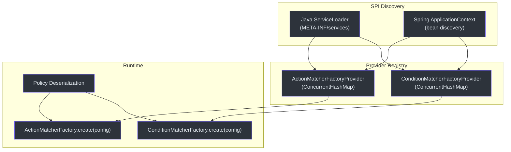
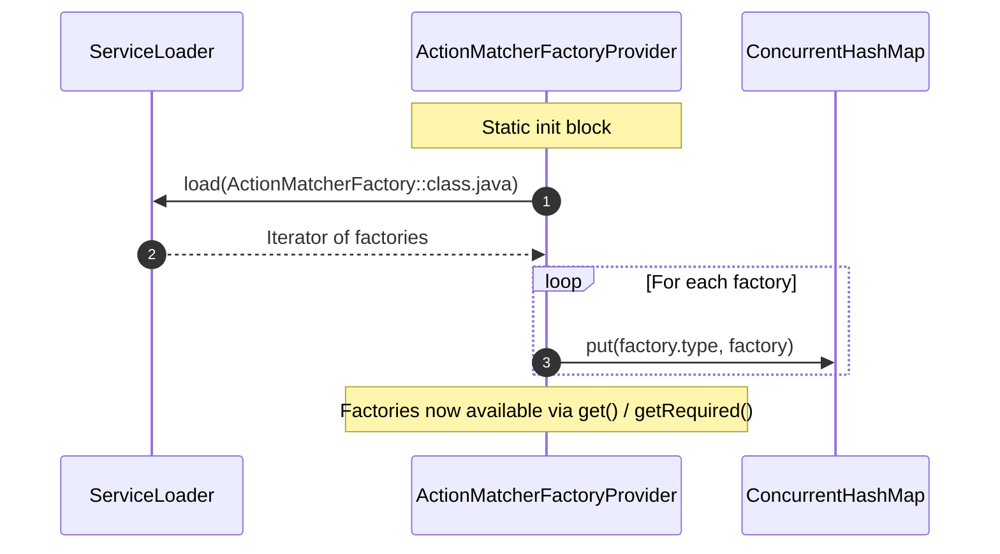
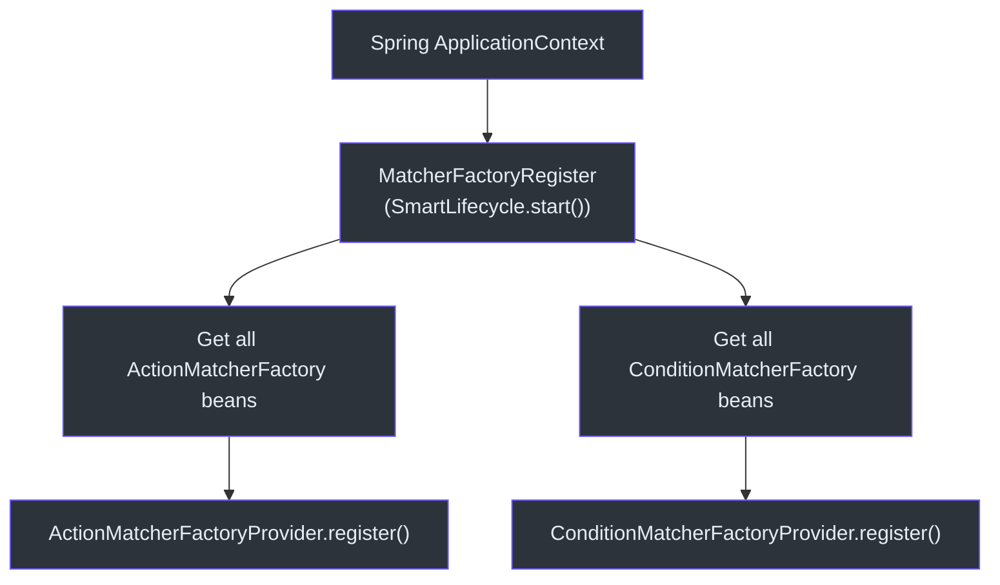

# 自定义匹配器 (SPI)

CoSec 的策略系统通过两个 SPI（服务提供者接口）扩展点实现完全可扩展：`ActionMatcherFactory` 用于定义请求如何匹配操作，`ConditionMatcherFactory` 用于定义策略语句的附加条件。自定义匹配器通过 Java 的 `ServiceLoader` 和 Spring 的 `ApplicationContext` 自动发现。

## 扩展架构



## ActionMatcherFactory

用于创建 `ActionMatcher` 实例的工厂接口。每个工厂通过唯一的 `type` 字符串标识，该字符串在策略 JSON 中用于引用匹配器。

```kotlin
interface ActionMatcherFactory {
    val type: String
    fun create(configuration: Configuration): ActionMatcher
}
```

### 内置操作匹配器

| 工厂类 | 类型 | 描述 |
|--------|------|------|
| `AllActionMatcherFactory` | `all` | 无条件匹配所有操作 |
| `PathActionMatcherFactory` | `path` | 按 URL 路径模式和 HTTP 方法匹配 |
| `CompositeActionMatcherFactory` | `composite` | 使用 AND/OR 逻辑组合多个匹配器 |

## ConditionMatcherFactory

用于创建 `ConditionMatcher` 实例的工厂接口。条件匹配器在操作匹配之外添加额外的约束条件。

```kotlin
interface ConditionMatcherFactory {
    val type: String
    fun create(configuration: Configuration): ConditionMatcher
}
```

### 内置条件匹配器

| 类别 | 匹配器 | 描述 |
|------|--------|------|
| 基于路径 | `Eq`、`Contains`、`StartsWith`、`EndsWith`、`In`、`Regular` | 将请求属性与值进行匹配 |
| 基于上下文 | `Authenticated`、`InRole`、`InTenant` | 匹配安全上下文属性 |
| 速率限制 | 速率限制匹配器 | 强制执行请求速率限制 |
| 表达式 | `OGNL`、`SpEL` | 计算自定义表达式 |

## 注册流程

### 步骤 1：Java ServiceLoader (META-INF/services)

对于非 Spring 上下文，工厂在类加载时通过 `ServiceLoader` 发现。

**文件**：`META-INF/services/me.ahoo.cosec.policy.action.ActionMatcherFactory`

```
me.ahoo.cosec.policy.action.AllActionMatcherFactory
me.ahoo.cosec.policy.action.PathActionMatcherFactory
me.ahoo.cosec.policy.action.CompositeActionMatcherFactory
```

**文件**：`META-INF/services/me.ahoo.cosec.policy.condition.ConditionMatcherFactory`

```
me.ahoo.cosec.policy.condition.AllConditionMatcherFactory
me.ahoo.cosec.policy.condition.authenticated.AuthenticatedConditionMatcherFactory
me.ahoo.cosec.policy.condition.eq.EqConditionMatcherFactory
...
```

### 步骤 2：提供者注册表

`ActionMatcherFactoryProvider` 和 `ConditionMatcherFactoryProvider` 单例维护一个包含所有已注册工厂的 `ConcurrentHashMap`。



### 步骤 3：Spring SmartLifecycle (MatcherFactoryRegister)

在 Spring 上下文中运行时，`MatcherFactoryRegister` 实现 `SmartLifecycle`，将所有 Spring 管理的工厂 Bean 注册到提供者单例。此操作在启动时运行，确保定义为 `@Bean` 的自定义工厂可用于策略评估。

```kotlin
class MatcherFactoryRegister(
    private val applicationContext: ApplicationContext
) : SmartLifecycle {
    override fun start() {
        applicationContext.getBeansOfType<ConditionMatcherFactory>().values.forEach {
            ConditionMatcherFactoryProvider.register(it)
        }
        applicationContext.getBeansOfType<ActionMatcherFactory>().values.forEach {
            ActionMatcherFactoryProvider.register(it)
        }
    }
}
```



## 创建自定义操作匹配器

### 步骤 1：实现匹配器

```kotlin
class HttpMethodActionMatcher(private val method: String) : ActionMatcher {
    override fun match(request: Request): Boolean {
        return request.method.equals(method, ignoreCase = true)
    }
}
```

### 步骤 2：实现工厂

```kotlin
class HttpMethodActionMatcherFactory : ActionMatcherFactory {
    override val type = "httpMethod"
    override fun create(configuration: Configuration): ActionMatcher {
        val method = configuration.getConfigValue("method", String::class.java)
        return HttpMethodActionMatcher(method)
    }
}
```

### 步骤 3：通过 META-INF/services 注册

**文件**：`META-INF/services/me.ahoo.cosec.policy.action.ActionMatcherFactory`

```
com.example.HttpMethodActionMatcherFactory
```

### 步骤 4：在策略 JSON 中使用

```json
{
  "effect": "ALLOW",
  "action": {
    "type": "httpMethod",
    "method": "GET"
  }
}
```

## 创建自定义条件匹配器

相同的模式适用于 `ConditionMatcherFactory`。实现 `ConditionMatcher` 接口，创建工厂，然后注册即可。

## 参考资料

- [cosec-core/src/main/kotlin/me/ahoo/cosec/policy/action/ActionMatcherFactory.kt:30](https://github.com/Ahoo-Wang/CoSec/blob/main/cosec-core/src/main/kotlin/me/ahoo/cosec/policy/action/ActionMatcherFactory.kt#L30) -- ActionMatcherFactory 接口
- [cosec-core/src/main/kotlin/me/ahoo/cosec/policy/condition/ConditionMatcherFactory.kt:30](https://github.com/Ahoo-Wang/CoSec/blob/main/cosec-core/src/main/kotlin/me/ahoo/cosec/policy/condition/ConditionMatcherFactory.kt#L30) -- ConditionMatcherFactory 接口
- [cosec-spring-boot-starter/src/main/kotlin/.../MatcherFactoryRegister.kt:24](https://github.com/Ahoo-Wang/CoSec/blob/main/cosec-spring-boot-starter/src/main/kotlin/me/ahoo/cosec/spring/boot/starter/policy/MatcherFactoryRegister.kt#L24) -- Spring SmartLifecycle 注册
- [cosec-core/src/main/kotlin/me/ahoo/cosec/policy/action/ActionMatcherFactoryProvider.kt:20](https://github.com/Ahoo-Wang/CoSec/blob/main/cosec-core/src/main/kotlin/me/ahoo/cosec/policy/action/ActionMatcherFactoryProvider.kt#L20) -- 提供者单例
- [cosec-core/src/main/kotlin/me/ahoo/cosec/policy/condition/ConditionMatcherFactoryProvider.kt:20](https://github.com/Ahoo-Wang/CoSec/blob/main/cosec-core/src/main/kotlin/me/ahoo/cosec/policy/condition/ConditionMatcherFactoryProvider.kt#L20) -- 提供者单例
- [cosec-core/src/main/resources/META-INF/services/me.ahoo.cosec.policy.action.ActionMatcherFactory](https://github.com/Ahoo-Wang/CoSec/blob/main/cosec-core/src/main/resources/META-INF/services/me.ahoo.cosec.policy.action.ActionMatcherFactory) -- 内置服务注册

## 相关页面

- [自动配置](./auto-configuration.md)
- [OpenAPI 集成](../integrations/openapi.md)
- [IP 地理定位](../integrations/ip-geolocation.md)
- [测试](../operations/testing.md)
