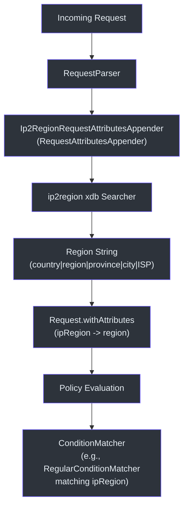
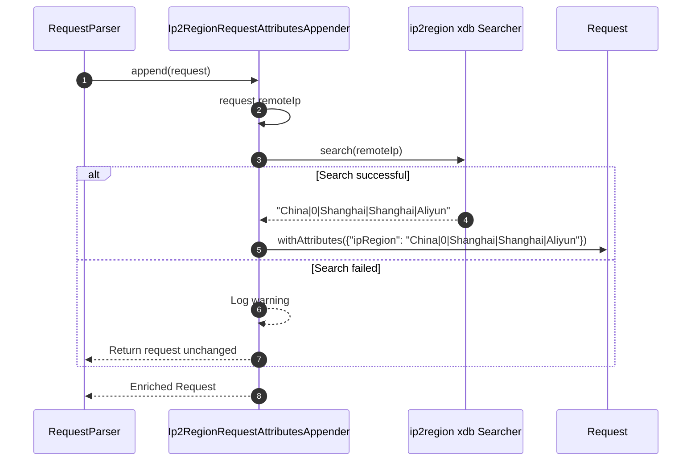
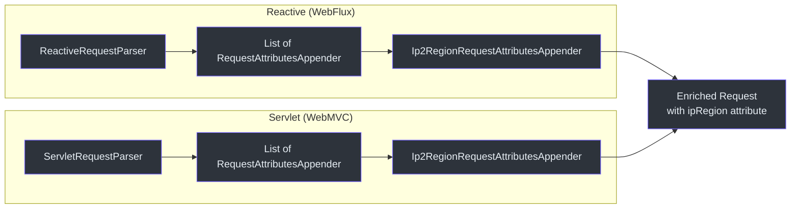

# IP 地理定位

CoSec 集成了 ip2region 库，将客户端 IP 地址解析为地理区域数据。此信息作为请求属性（`ipRegion`）附加，可在策略条件匹配器中用于创建基于地理位置的访问规则。

## 架构概览



## 核心组件

### Ip2RegionRequestAttributesAppender

实现 `RequestAttributesAppender`，使用 ip2region 的 `xdb` 格式数据库将 IP 地址解析为区域字符串。

```kotlin
class Ip2RegionRequestAttributesAppender(
    ip2regionFile: File = LOCAL_IP2REGION_FILE,
    version: Version = Version.IPv4
) : RequestAttributesAppender
```

关键特性：

- **数据库**: 默认从 classpath 加载 `ip2region.xdb` 文件。xdb 格式提供内存映射查询，无需外部依赖。
- **惰性初始化**: `Searcher` 在首次使用时惰性创建。
- **属性键**: `ipRegion` -- 对应常量 `REQUEST_ATTRIBUTES_IP_REGION_KEY`。
- **错误处理**: 如果搜索失败（例如在 IPv4 模式下搜索 IPv6 地址），请求将在不添加 `ipRegion` 属性的情况下原样返回。



### IP 数据如何到达请求

`Ip2RegionRequestAttributesAppender` 作为 `RequestAttributesAppender` Bean 注册。`ReactiveRequestParser`（WebFlux）和 `ServletRequestParser`（WebMVC）在请求解析期间遍历所有已注册的 appender：



### 在策略条件中使用 ipRegion

`ipRegion` 属性可与 CoSec 内置的 `RegularConditionMatcher`（基于正则表达式）配合使用，创建基于地理位置的访问规则。例如，条件匹配器可以验证 IP 区域是否匹配特定模式。

## 自动配置

### Ip2RegionAutoConfiguration

将 `Ip2RegionRequestAttributesAppender` 注册为 Spring Bean。在以下条件满足时激活：

- `@ConditionalOnCoSecEnabled` -- `cosec.enabled=true`（默认值）
- `@ConditionalOnIp2RegionEnabled` -- `cosec.ip2region.enabled=true`
- `@ConditionalOnClass(Ip2RegionRequestAttributesAppender::class)` -- ip2region 模块在 classpath 中

### 配置属性

```yaml
cosec:
  ip2region:
    enabled: true   # 启用/禁用（默认：模块存在时启用）
```

当设置 `cosec.ip2region.enabled=false` 时（如网关部署中），`Ip2RegionRequestAttributesAppender` Bean 不会被创建，也不会执行 IP 查询。

## 参考资料

- [cosec-ip2region/src/main/kotlin/me/ahoo/cosec/ip2region/Ip2RegionRequestAttributesAppender.kt:25](https://github.com/Ahoo-Wang/CoSec/blob/main/cosec-ip2region/src/main/kotlin/me/ahoo/cosec/ip2region/Ip2RegionRequestAttributesAppender.kt#L25) -- 核心 IP 解析逻辑
- [cosec-spring-boot-starter/src/main/kotlin/.../Ip2RegionAutoConfiguration.kt:33](https://github.com/Ahoo-Wang/CoSec/blob/main/cosec-spring-boot-starter/src/main/kotlin/me/ahoo/cosec/spring/boot/starter/ip2region/Ip2RegionAutoConfiguration.kt#L33) -- 自动配置
- [cosec-webflux/src/main/kotlin/me/ahoo/cosec/webflux/ReactiveRequestParser.kt:27](https://github.com/Ahoo-Wang/CoSec/blob/main/cosec-webflux/src/main/kotlin/me/ahoo/cosec/webflux/ReactiveRequestParser.kt#L27) -- WebFlux 请求解析器（使用 appender）
- [cosec-webmvc/src/main/kotlin/me/ahoo/cosec/servlet/ServletRequestParser.kt:31](https://github.com/Ahoo-Wang/CoSec/blob/main/cosec-webmvc/src/main/kotlin/me/ahoo/cosec/servlet/ServletRequestParser.kt#L31) -- Servlet 请求解析器（使用 appender）
- [k8s/cosec-gateway-config.yaml](https://github.com/Ahoo-Wang/CoSec/blob/main/k8s/cosec-gateway-config.yaml) -- 禁用 ip2region 的示例配置

## 相关页面

- [自定义匹配器](../extending/custom-matchers.md)
- [自动配置](../extending/auto-configuration.md)
- [Spring WebFlux 集成](./spring-webflux.md)
- [Spring WebMVC 集成](./spring-webmvc.md)
