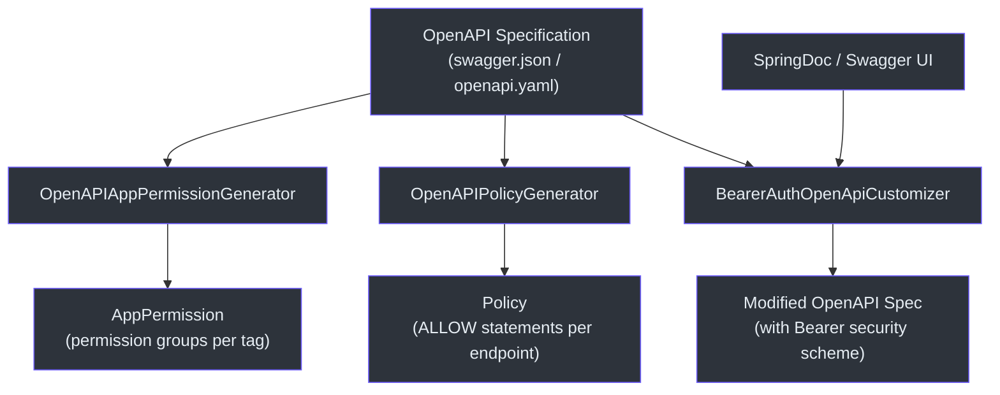
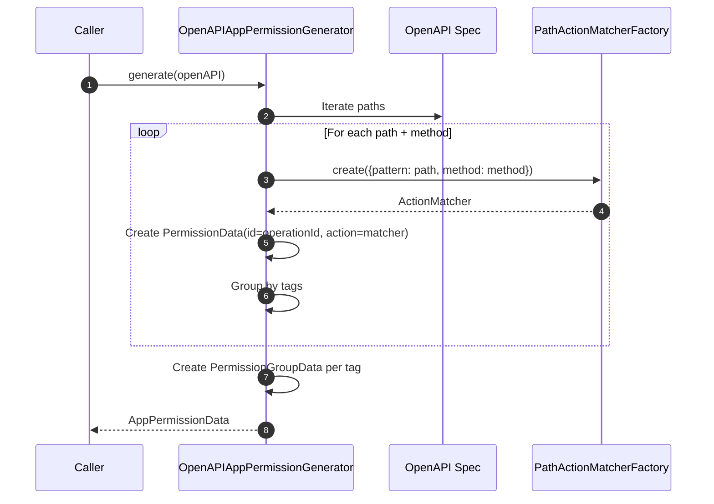
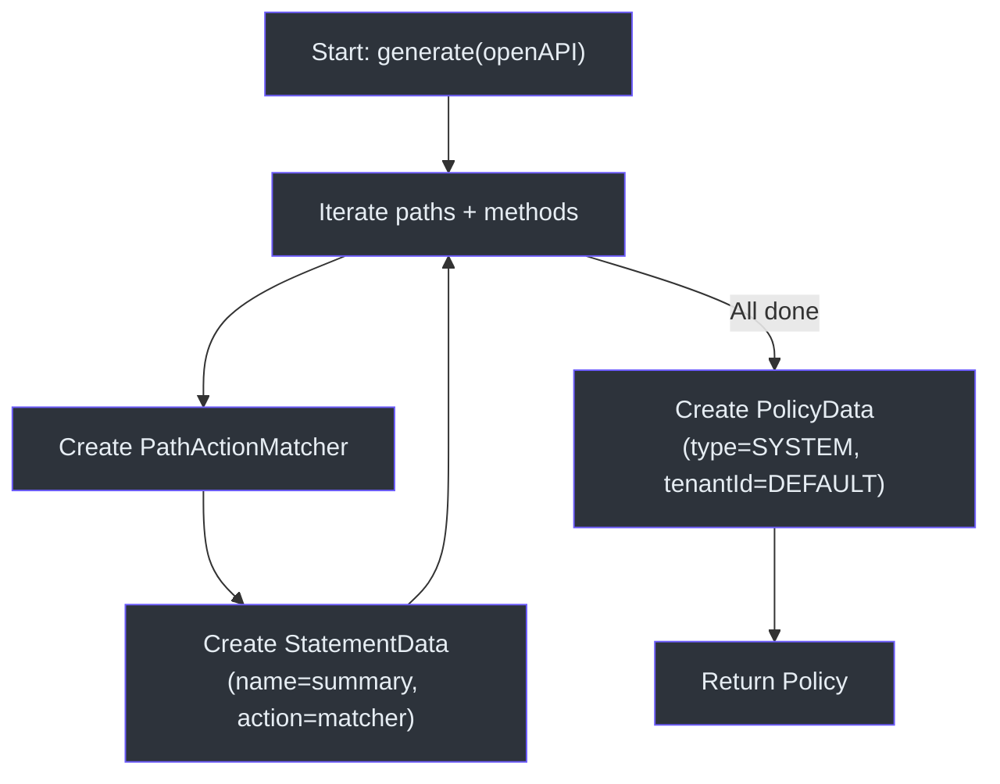
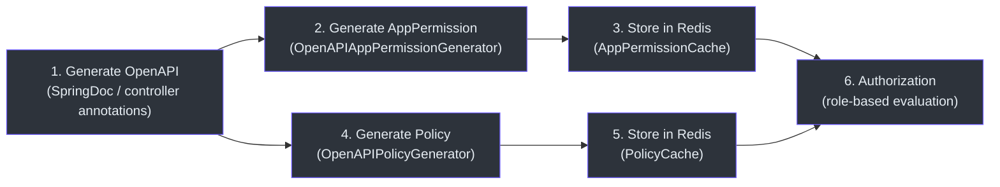

# OpenAPI 集成

CoSec 提供 OpenAPI 集成，可自动从 OpenAPI 3.0 规范生成应用权限和安全策略。这消除了手动保持权限定义与 API 文档同步的工作。

## 架构概览



## 核心组件

### OpenAPIAppPermissionGenerator

从 OpenAPI 规范生成 `AppPermission`。它遍历所有路径和操作，为每个操作创建 `Permission` 对象，然后按 OpenAPI 标签进行分组。



每个生成的权限具有：
- **ID**: OpenAPI 规范中的 `operationId`
- **Name**: 操作的 `summary`
- **Description**: 操作的 `description`
- **Action**: 使用端点路径和 HTTP 方法配置的 `PathActionMatcher`

操作使用 OpenAPI `tags` 字段分组为 `PermissionGroupData` 对象。这意味着 Swagger UI 标签名称成为权限组名称。

### OpenAPIPolicyGenerator

从 OpenAPI 规范生成 `Policy`。与权限生成器不同，它生成一个扁平的 `Statement` 对象列表，每个端点一个，全部使用 `Effect.ALLOW`。



生成的策略具有以下默认值：
- **策略 ID**: `"PolicyId"`（可自定义）
- **策略类型**: `PolicyType.SYSTEM`
- **租户 ID**: `Tenant.DEFAULT_TENANT_ID`
- **效果**: 所有声明默认为 `ALLOW`

### BearerAuthOpenApiCustomizer

一个 `Consumer<OpenAPI>`，向 OpenAPI 规范添加全局 Bearer 认证安全方案。这使 Swagger UI 显示带有 Bearer 令牌输入的"Authorize"按钮。

```kotlin
object BearerAuthOpenApiCustomizer : Consumer<OpenAPI> {
    override fun accept(openAPI: OpenAPI) {
        openAPI.addSecurityItem(SecurityRequirement().addList(BEARER_AUTH_NAME))
        openAPI.components.addSecuritySchemes(
            BEARER_AUTH_NAME,
            SecurityScheme()
                .type(SecurityScheme.Type.HTTP)
                .scheme("bearer")
        )
    }
}
```

安全方案名称为 `cosec.BearerAuth`，使用 `cosec.` 前缀以避免与规范中的其他安全方案冲突。

## 工作流程：从 OpenAPI 到权限



## 参考资料

- [cosec-openapi/src/main/kotlin/me/ahoo/cosec/openapi/generator/OpenAPIAppPermissionGenerator.kt:27](https://github.com/Ahoo-Wang/CoSec/blob/main/cosec-openapi/src/main/kotlin/me/ahoo/cosec/openapi/generator/OpenAPIAppPermissionGenerator.kt#L27) -- 权限生成器
- [cosec-openapi/src/main/kotlin/me/ahoo/cosec/openapi/generator/OpenAPIPolicyGenerator.kt:28](https://github.com/Ahoo-Wang/CoSec/blob/main/cosec-openapi/src/main/kotlin/me/ahoo/cosec/openapi/generator/OpenAPIPolicyGenerator.kt#L28) -- 策略生成器
- [cosec-openapi/src/main/kotlin/me/ahoo/cosec/openapi/security/BearerAuthOpenApiCustomizer.kt:23](https://github.com/Ahoo-Wang/CoSec/blob/main/cosec-openapi/src/main/kotlin/me/ahoo/cosec/openapi/security/BearerAuthOpenApiCustomizer.kt#L23) -- Bearer 认证自定义器
- [cosec-cocache/src/main/kotlin/me/ahoo/cosec/cache/AppPermissionCache.kt:20](https://github.com/Ahoo-Wang/CoSec/blob/main/cosec-cocache/src/main/kotlin/me/ahoo/cosec/cache/AppPermissionCache.kt#L20) -- 应用权限缓存
- [cosec-core/src/main/kotlin/me/ahoo/cosec/policy/action/PathActionMatcherFactory.kt](https://github.com/Ahoo-Wang/CoSec/blob/main/cosec-core/src/main/kotlin/me/ahoo/cosec/policy/action/PathActionMatcherFactory.kt) -- 路径动作匹配器工厂

## 相关页面

- [Redis 缓存](./redis-caching.md)
- [自定义匹配器](../extending/custom-matchers.md)
- [自动配置](../extending/auto-configuration.md)
