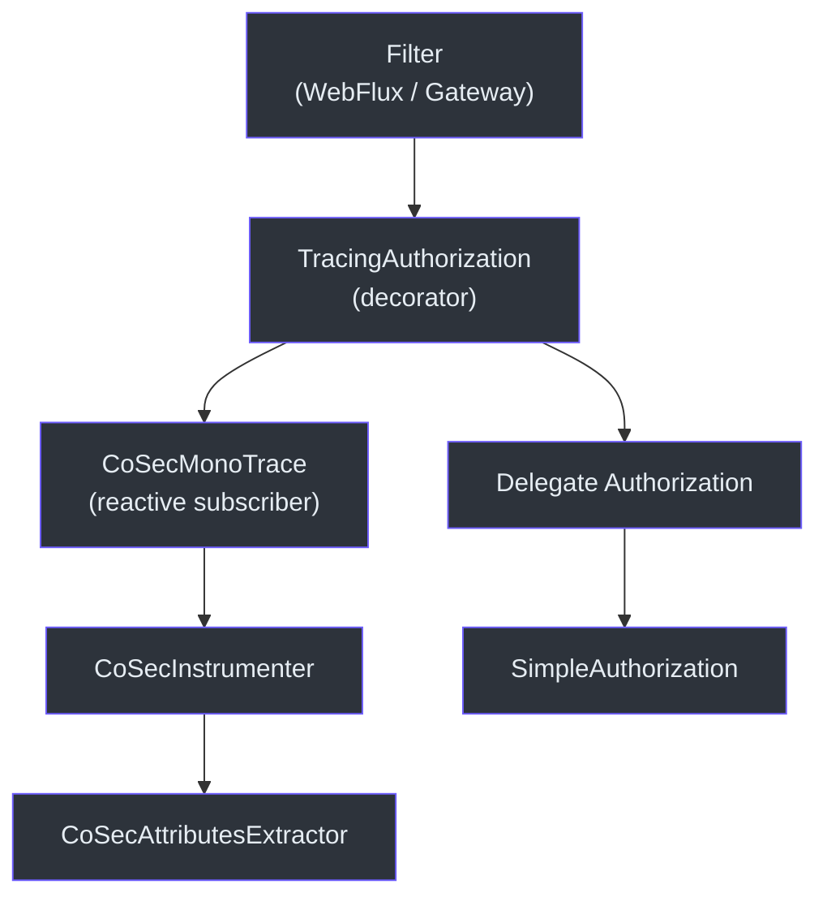
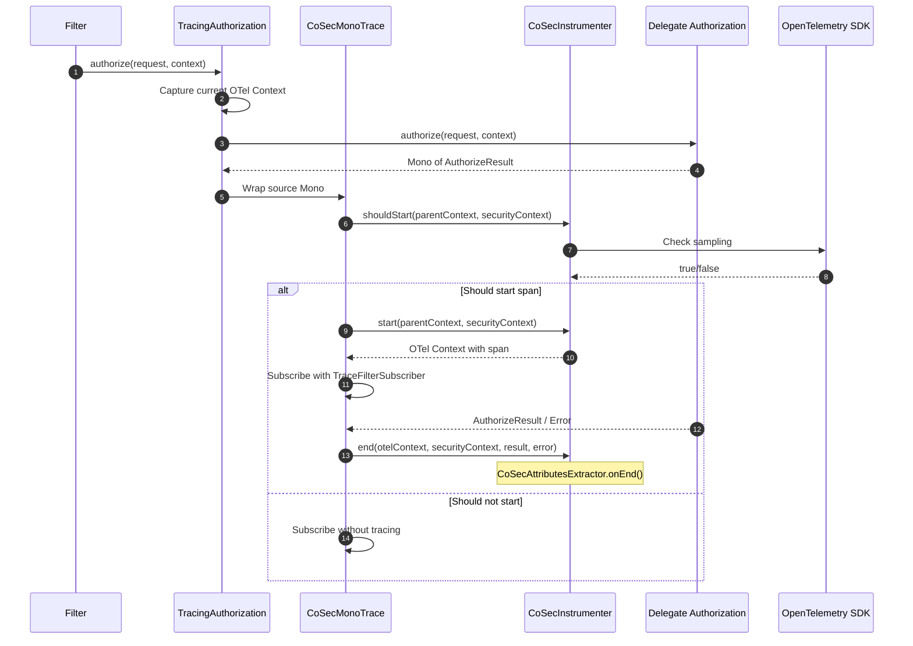
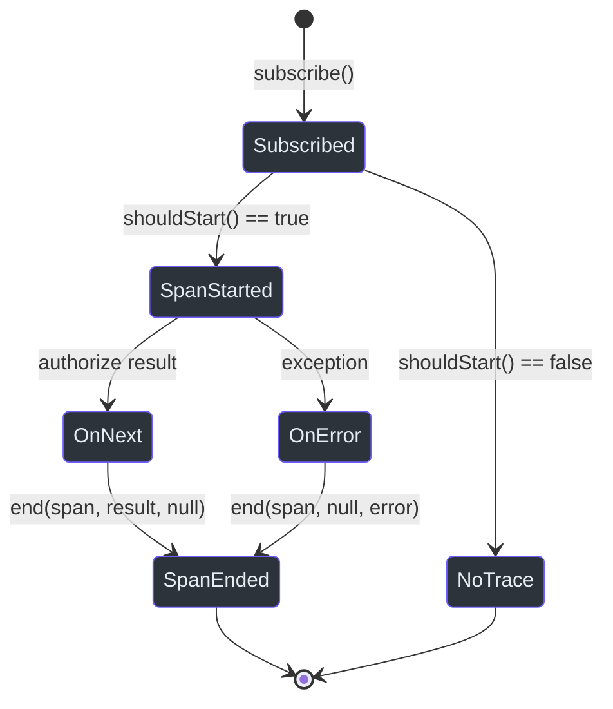

# OpenTelemetry 集成

CoSec 通过装饰器模式提供深度 OpenTelemetry 集成，使用追踪插桩包装 `Authorization` 接口。每个授权决策都会产生一个 span，其中包含捕获主体、策略、声明和结果的丰富属性。

## 架构概览



## 核心组件

### TracingAuthorization

一个装饰器，使用 OpenTelemetry 追踪包装任意 `Authorization` 实现。它同时实现了 `Authorization` 和 `Delegated<Authorization>`。

```kotlin
class TracingAuthorization(override val delegate: Authorization) :
    Authorization,
    Delegated<Authorization>
```

当调用 `authorize()` 时，它会：

1. 捕获当前 OpenTelemetry `Context`。
2. 创建一个 `CoSecMonoTrace` 来包装被委托方的 `Mono<AuthorizeResult>`。
3. 追踪订阅者管理 span 的生命周期（开始、结束、错误）。

### CoSecInstrumenter

核心插桩配置。它使用以下配置创建 OpenTelemetry `Instrumenter`：

- **插桩名称**: `me.ahoo.cosec`
- **Span 名称**: 始终为 `cosec.authorize`（通过 `CoSecSpanNameExtractor`）
- **属性提取器**: `CoSecAttributesExtractor`
- **版本**: 从包的实现版本中读取



### CoSecAttributesExtractor

从安全上下文和授权结果中提取详细属性。属性在 `onEnd()` 中（授权决策完成后）填充，捕获完整的决策上下文。

#### Span 属性

| 属性键 | 类型 | 来源 | 描述 |
|--------------|------|--------|-------------|
| `user.id` | string | `principal.id` | 已认证用户 ID |
| `user.roles` | string array | `principal.roles` | 用户分配的角色 |
| `cosec.tenant_id` | string | `securityContext.tenant.tenantId` | 当前租户 |
| `cosec.space_id` | string | `request.spaceId` | 当前空间 |
| `cosec.app_id` | string | `request.appId` | 目标应用 ID |
| `device.id` | string | `request.deviceId` | 请求设备 ID |
| `cosec.request_id` | string | `request.requestId` | 关联请求 ID |
| `cosec.policy` | string array | `principal.policies` | 主体的策略 ID |
| `cosec.authorize.policy.id` | string | `PolicyVerifyContext` | 匹配的策略 ID |
| `cosec.authorize.statement.index` | long | `PolicyVerifyContext` | 匹配的声明索引 |
| `cosec.authorize.statement.name` | string | `PolicyVerifyContext` | 匹配的声明名称 |
| `cosec.authorize.role.id` | string | `RoleVerifyContext` | 匹配的角色 ID |
| `cosec.authorize.permission.id` | string | `RoleVerifyContext` | 匹配的权限 ID |
| `cosec.authorize.result` | string | `VerifyContext.result` | ALLOW / EXPLICIT_DENY / IMPLICIT_DENY |

### CoSecMonoTrace 和 TraceFilterSubscriber

这些类通过包装 `Mono<AuthorizeResult>` 实现响应式追踪契约：

- `CoSecMonoTrace` 扩展了 `Mono<AuthorizeResult>`，在订阅时处理 span 创建。
- `TraceFilterSubscriber` 扩展了 `CoreSubscriber<AuthorizeResult>`，在 `onComplete()` 或 `onError()` 时结束 span。



## 在 Jaeger / Grafana 中使用

Span 名称 `cosec.authorize` 可用于在可观测性后端中过滤追踪。`cosec.authorize.result` 属性可快速查找被拒绝的请求，而 `cosec.authorize.policy.id` 和 `cosec.authorize.statement.name` 可精确指出触发决策的策略规则。

## 参考资料

- [cosec-opentelemetry/src/main/kotlin/me/ahoo/cosec/opentelemetry/TracingAuthorization.kt:24](https://github.com/Ahoo-Wang/CoSec/blob/main/cosec-opentelemetry/src/main/kotlin/me/ahoo/cosec/opentelemetry/TracingAuthorization.kt#L24) -- 包装 Authorization 的装饰器
- [cosec-opentelemetry/src/main/kotlin/me/ahoo/cosec/opentelemetry/CoSecInstrumenter.kt:36](https://github.com/Ahoo-Wang/CoSec/blob/main/cosec-opentelemetry/src/main/kotlin/me/ahoo/cosec/opentelemetry/CoSecInstrumenter.kt#L36) -- Instrumenter 和属性提取器
- [cosec-opentelemetry/src/main/kotlin/me/ahoo/cosec/opentelemetry/AuthorizationMono.kt:23](https://github.com/Ahoo-Wang/CoSec/blob/main/cosec-opentelemetry/src/main/kotlin/me/ahoo/cosec/opentelemetry/AuthorizationMono.kt#L23) -- 响应式追踪订阅者
- [cosec-core/src/main/kotlin/me/ahoo/cosec/authorization/SimpleAuthorization.kt:48](https://github.com/Ahoo-Wang/CoSec/blob/main/cosec-core/src/main/kotlin/me/ahoo/cosec/authorization/SimpleAuthorization.kt#L48) -- 被委托的授权实现
- [cosec-spring-boot-starter/src/main/kotlin/.../CoSecAutoConfiguration.kt:37](https://github.com/Ahoo-Wang/CoSec/blob/main/cosec-spring-boot-starter/src/main/kotlin/me/ahoo/cosec/spring/boot/starter/CoSecAutoConfiguration.kt#L37) -- 自动配置

## 相关页面

- [Spring Cloud Gateway 集成](./spring-cloud-gateway.md)
- [Redis 缓存](./redis-caching.md)
- [性能](../operations/performance.md)
- [部署](../operations/deployment.md)
