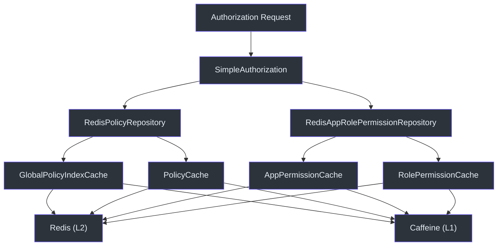
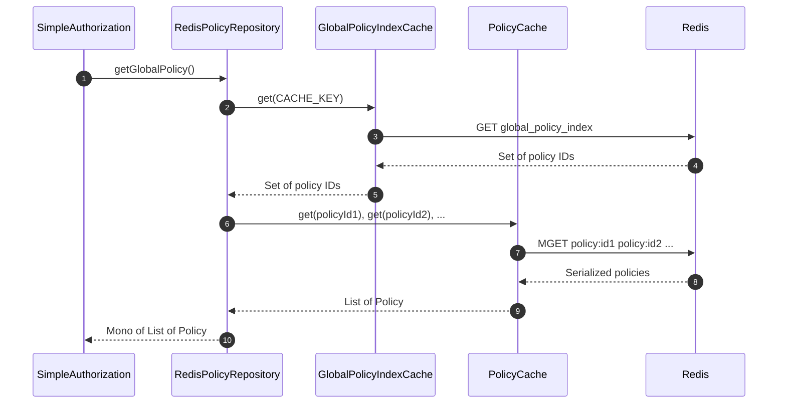
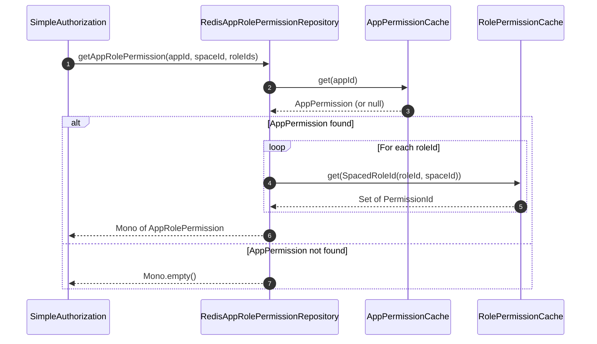
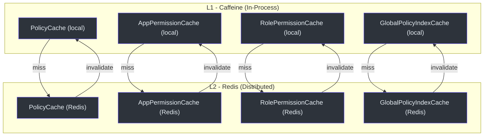

# 使用 CoCache 的 Redis 缓存

CoSec 利用 CoCache 为策略和角色权限提供两级分布式缓存层（本地 Caffeine + Redis）。这确保了快速的授权决策，同时在多个网关实例间保持一致性。

## 架构概览



## 核心组件

### RedisPolicyRepository

基于 Redis 缓存实现 `PolicyRepository`。提供三种操作：

1. **`getGlobalPolicy()`** -- 通过从 `GlobalPolicyIndexCache` 获取全局策略索引，然后从 `PolicyCache` 批量获取每个策略，来检索所有全局策略。
2. **`getPolicies(policyIds)`** -- 从 `PolicyCache` 根据 ID 获取特定策略。
3. **`setPolicy(policy)`** -- 将策略存储到 `PolicyCache`。如果策略类型为 `PolicyType.GLOBAL`，还会将策略 ID 添加到 `GlobalPolicyIndexCache`。



当调用 `setPolicy()` 时，策略首先通过 `DefaultPolicyEvaluator.evaluate(policy)` 进行验证以确保格式正确，然后再进行缓存。如果策略是全局策略，全局索引会原子性地更新。

### RedisAppRolePermissionRepository

通过组合两个缓存的数据实现 `AppRolePermissionRepository`：

1. **`AppPermissionCache`** -- 将 `AppId` 映射到 `AppPermission`（应用的权限定义）。
2. **`RolePermissionCache`** -- 将 `SpacedRoleId` 映射到 `Set<PermissionId>`（每个角色在空间内被授予的权限）。



### 缓存接口

所有缓存接口都扩展了 CoCache 的 `Cache<K, V>` 接口，提供统一的 L1（Caffeine）和 L2（Redis）缓存 API：

| 缓存接口 | 键类型 | 值类型 | 用途 |
|----------------|----------|------------|---------|
| `PolicyCache` | `String`（策略 ID） | `Policy` | 单个策略文档 |
| `GlobalPolicyIndexCache` | `String`（固定键） | `Set<String>`（策略 ID） | 所有全局策略 ID 的索引 |
| `AppPermissionCache` | `AppId` | `AppPermission` | 应用权限定义 |
| `RolePermissionCache` | `SpacedRoleId` | `Set<PermissionId>` | 角色到权限的映射 |

### GlobalPolicyIndexKeyConverter

一个 CoCache `KeyConverter`，将所有缓存键映射到单一固定键。这确保 `GlobalPolicyIndexCache` 始终读写同一个 Redis 键，维护单一的全局索引条目。

## 缓存配置

网关的 `application.yaml` 配置缓存最大容量：

```yaml
cosec:
  authorization:
    cache:
      policy:
        maximum-size: 100000
      role:
        maximum-size: 100000
```

## 缓存层次结构



## 参考资料

- [cosec-cocache/src/main/kotlin/me/ahoo/cosec/cache/RedisPolicyRepository.kt:26](https://github.com/Ahoo-Wang/CoSec/blob/main/cosec-cocache/src/main/kotlin/me/ahoo/cosec/cache/RedisPolicyRepository.kt#L26) -- 策略仓库
- [cosec-cocache/src/main/kotlin/me/ahoo/cosec/cache/RedisAppRolePermissionRepository.kt:27](https://github.com/Ahoo-Wang/CoSec/blob/main/cosec-cocache/src/main/kotlin/me/ahoo/cosec/cache/RedisAppRolePermissionRepository.kt#L27) -- 角色权限仓库
- [cosec-cocache/src/main/kotlin/me/ahoo/cosec/cache/PolicyCache.kt:23](https://github.com/Ahoo-Wang/CoSec/blob/main/cosec-cocache/src/main/kotlin/me/ahoo/cosec/cache/PolicyCache.kt#L23) -- 策略缓存接口
- [cosec-cocache/src/main/kotlin/me/ahoo/cosec/cache/AppPermissionCache.kt:20](https://github.com/Ahoo-Wang/CoSec/blob/main/cosec-cocache/src/main/kotlin/me/ahoo/cosec/cache/AppPermissionCache.kt#L20) -- 应用权限缓存接口
- [cosec-cocache/src/main/kotlin/me/ahoo/cosec/cache/GlobalPolicyIndexCache.kt:22](https://github.com/Ahoo-Wang/CoSec/blob/main/cosec-cocache/src/main/kotlin/me/ahoo/cosec/cache/GlobalPolicyIndexCache.kt#L22) -- 全局策略索引缓存
- [cosec-cocache/src/main/kotlin/me/ahoo/cosec/cache/GlobalPolicyIndexKeyConverter.kt:18](https://github.com/Ahoo-Wang/CoSec/blob/main/cosec-cocache/src/main/kotlin/me/ahoo/cosec/cache/GlobalPolicyIndexKeyConverter.kt#L18) -- 键转换器

## 相关页面

- [Spring Cloud Gateway 集成](./spring-cloud-gateway.md)
- [OpenTelemetry 集成](./opentelemetry.md)
- [性能](../operations/performance.md)
- [部署](../operations/deployment.md)
