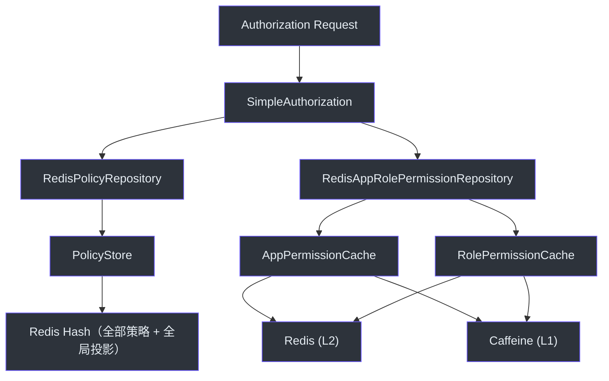
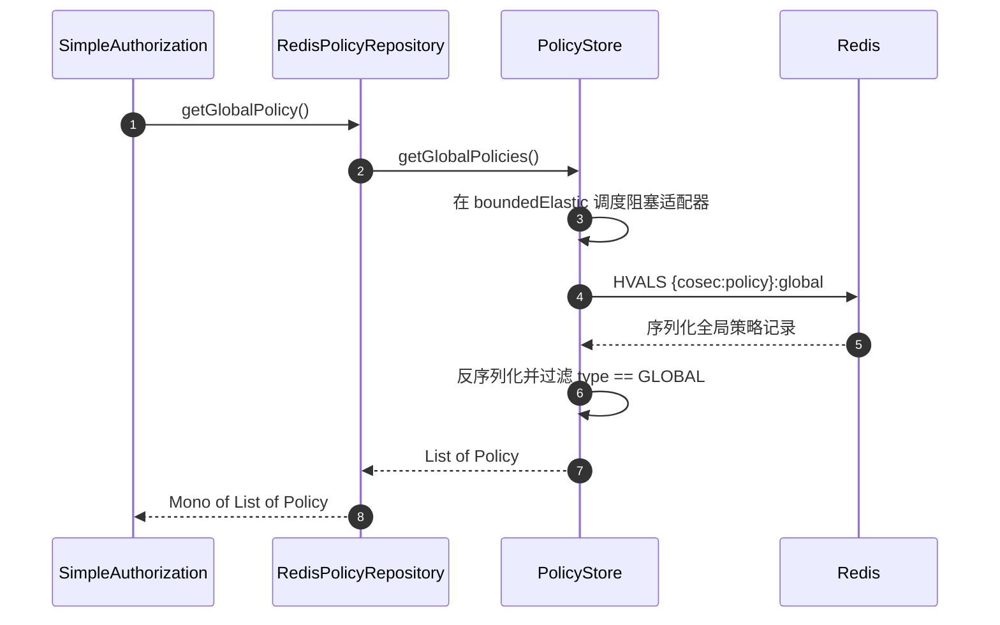
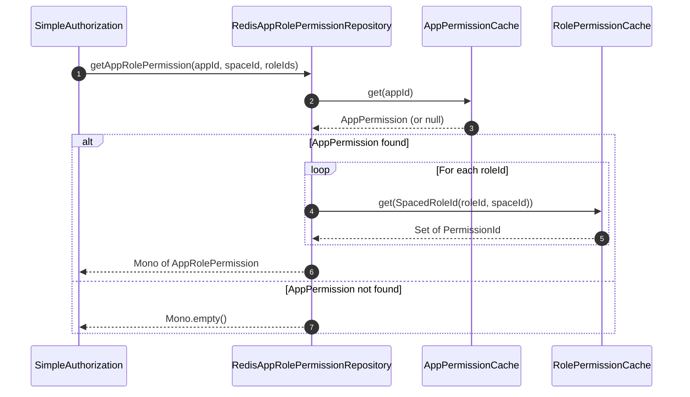
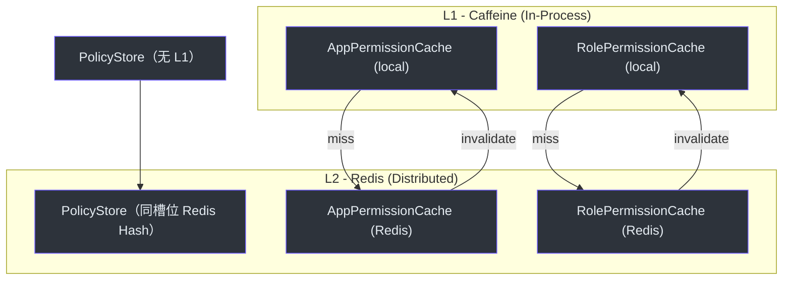

# Redis 策略存储与 CoCache

CoSec 使用两个同槽位 Redis Hash 支撑响应式 `PolicyStore`：一个保存全部策略的权威 Hash，一个保存完整文档的全局策略投影。Lua 脚本原子更新二者，因此从 `GLOBAL` 切换到其他类型时不会暴露陈旧全局策略。角色权限继续使用 CoCache 的两级缓存（本地 Caffeine + Redis）。阻塞式 Redis 操作会延迟到 Reactor bounded-elastic 调度器执行。

## 架构概览


```mermaid
graph TD
    A["Authorization Request"] --> B["SimpleAuthorization"]
    B --> C["RedisPolicyRepository"]
    B --> D["RedisAppRolePermissionRepository"]
    C --> E["PolicyStore"]
    D --> G["AppPermissionCache"]
    D --> H["RolePermissionCache"]
    E --> K["Redis Hash（全部策略 + 全局投影）"]
    I["Redis (L2)"]
    J["Caffeine (L1)"]
    G --> I
    H --> I
    G --> J
    H --> J

    style A fill:#2d333b,stroke:#6d5dfc,color:#e6edf3
    style B fill:#2d333b,stroke:#6d5dfc,color:#e6edf3
    style C fill:#2d333b,stroke:#6d5dfc,color:#e6edf3
    style D fill:#2d333b,stroke:#6d5dfc,color:#e6edf3
    style E fill:#2d333b,stroke:#6d5dfc,color:#e6edf3
    style G fill:#2d333b,stroke:#6d5dfc,color:#e6edf3
    style H fill:#2d333b,stroke:#6d5dfc,color:#e6edf3
    style I fill:#2d333b,stroke:#6d5dfc,color:#e6edf3
    style J fill:#2d333b,stroke:#6d5dfc,color:#e6edf3
    style K fill:#2d333b,stroke:#6d5dfc,color:#e6edf3

```

## 核心组件

### RedisPolicyRepository

基于 Redis 缓存实现 `PolicyRepository`。提供三种操作：

1. **`getGlobalPolicy()`** -- 委托给响应式 `PolicyStore`，只读取全局投影，并按文档当前的 `PolicyType.GLOBAL` 值防御性过滤。
2. **`getPolicies(policyIds)`** -- 批量读取指定的 Hash field。
3. **`setPolicy(policy)`** -- 校验策略，并原子更新权威 field 与全局投影。


```mermaid
sequenceDiagram
    autonumber
    participant Auth as SimpleAuthorization
    participant Repo as RedisPolicyRepository
    participant Store as PolicyStore
    participant Redis

    Auth->>Repo: getGlobalPolicy()
    Repo->>Store: getGlobalPolicies()
    Store->>Store: 在 boundedElastic 调度阻塞适配器
    Store->>Redis: HVALS {cosec:policy}:global
    Redis-->>Store: 序列化全局策略记录
    Store->>Store: 反序列化并过滤 type == GLOBAL
    Store-->>Repo: List of Policy
    Repo-->>Auth: Mono of List of Policy


```

每个策略 ID 在权威 Hash 中对应一个 field。Lua 脚本在一次 Redis 操作内写入该 field，并在全局投影中写入或删除同一完整文档。两个 key 使用相同 Redis Cluster hash tag，因此无需可续租 lease 或过期锁持有者即可获得单一线性化点。全局读取复杂度是 O(G)，G 为全局策略数量，不再扫描全部策略。`RedisPolicyStore` 同时暴露既有同步 `PolicyCache` 门面，并在旧写入方全部停止后按需迁移旧记录。

### RedisAppRolePermissionRepository

通过组合两个缓存的数据实现 `AppRolePermissionRepository`：

1. **`AppPermissionCache`** -- 将 `AppId` 映射到 `AppPermission`（应用的权限定义）。
2. **`RolePermissionCache`** -- 将 `SpacedRoleId` 映射到 `Set<PermissionId>`（每个角色在空间内被授予的权限）。


```mermaid
sequenceDiagram
    autonumber
    participant Auth as SimpleAuthorization
    participant Repo as RedisAppRolePermissionRepository
    participant AppCache as AppPermissionCache
    participant RoleCache as RolePermissionCache

    Auth->>Repo: getAppRolePermission(appId, spaceId, roleIds)
    Repo->>AppCache: get(appId)
    AppCache-->>Repo: AppPermission (or null)
    alt AppPermission found
        loop For each roleId
            Repo->>RoleCache: get(SpacedRoleId(roleId, spaceId))
            RoleCache-->>Repo: Set of PermissionId
        end
        Repo-->>Auth: Mono of AppRolePermission
    else AppPermission not found
        Repo-->>Auth: Mono.empty()
    end


```

### 缓存接口

缓存接口继续保留既有 `Cache<K, V>` API。策略访问直接由 Redis Hash 支撑；权限缓存继续使用 CoCache L1 与 L2：

| 缓存接口 | 键类型 | 值类型 | 用途 |
|----------------|----------|------------|---------|
| `PolicyCache` | `String`（策略 ID） | `Policy` | `PolicyStore` 记录的兼容门面 |
| `AppPermissionCache` | `AppId` | `AppPermission` | 应用权限定义 |
| `RolePermissionCache` | `SpacedRoleId` | `Set<PermissionId>` | 角色到权限的映射 |

### PolicyStore

`PolicyStore` 是 `cosec-api` 中的响应式公开端口。默认适配器使用 `{<key-prefix>:policy}:store` 保存全部策略，使用 `{<key-prefix>:policy}:global` 保存全局投影。自定义适配器必须原子发布策略文档及其全局可见性，并且不得在订阅方的 event-loop 线程执行阻塞 I/O。

该迁移是维护窗口切换，不支持新旧版本滚动混部。旧策略记录没有可用于安全排序新旧写入的 revision。部署前必须停止全部旧写入方；随后新适配器会排空旧全局索引，并按需导入旧文档，且不会覆盖新权威记录。发生新写入后若需回滚，必须先导出或迁移新 Hash 数据；仅重启旧节点会丢失这些写入。

## 缓存配置

网关的 `application.yaml` 配置缓存最大容量：

```yaml
cosec:
  authorization:
    cache:
      role:
        maximum-size: 100000
```

## 缓存层次结构


```mermaid
graph TD
    subgraph "L1 - Caffeine (In-Process)"
        B["AppPermissionCache (local)"]
        C["RolePermissionCache (local)"]
    end
    subgraph "L2 - Redis (Distributed)"
        E["PolicyStore（同槽位 Redis Hash）"]
        F["AppPermissionCache (Redis)"]
        G["RolePermissionCache (Redis)"]
    end
    D["PolicyStore（无 L1）"] --> E
    B -->|miss| F
    C -->|miss| G
    F -->|invalidate| B
    G -->|invalidate| C

    style B fill:#2d333b,stroke:#6d5dfc,color:#e6edf3
    style C fill:#2d333b,stroke:#6d5dfc,color:#e6edf3
    style D fill:#2d333b,stroke:#6d5dfc,color:#e6edf3
    style E fill:#2d333b,stroke:#6d5dfc,color:#e6edf3
    style F fill:#2d333b,stroke:#6d5dfc,color:#e6edf3
    style G fill:#2d333b,stroke:#6d5dfc,color:#e6edf3

```

## 参考资料

- [cosec-cocache/src/main/kotlin/me/ahoo/cosec/cache/RedisPolicyRepository.kt:26](https://github.com/Ahoo-Wang/CoSec/blob/main/cosec-cocache/src/main/kotlin/me/ahoo/cosec/cache/RedisPolicyRepository.kt#L26) -- 策略仓库
- [cosec-cocache/src/main/kotlin/me/ahoo/cosec/cache/RedisAppRolePermissionRepository.kt:27](https://github.com/Ahoo-Wang/CoSec/blob/main/cosec-cocache/src/main/kotlin/me/ahoo/cosec/cache/RedisAppRolePermissionRepository.kt#L27) -- 角色权限仓库
- [cosec-cocache/src/main/kotlin/me/ahoo/cosec/cache/PolicyCache.kt:23](https://github.com/Ahoo-Wang/CoSec/blob/main/cosec-cocache/src/main/kotlin/me/ahoo/cosec/cache/PolicyCache.kt#L23) -- 策略缓存接口
- [cosec-cocache/src/main/kotlin/me/ahoo/cosec/cache/AppPermissionCache.kt:20](https://github.com/Ahoo-Wang/CoSec/blob/main/cosec-cocache/src/main/kotlin/me/ahoo/cosec/cache/AppPermissionCache.kt#L20) -- 应用权限缓存接口
- [cosec-api/src/main/kotlin/me/ahoo/cosec/api/policy/PolicyStore.kt:23](https://github.com/Ahoo-Wang/CoSec/blob/main/cosec-api/src/main/kotlin/me/ahoo/cosec/api/policy/PolicyStore.kt#L23) -- 响应式策略存储端口
- [cosec-spring-boot-starter/src/main/kotlin/me/ahoo/cosec/spring/boot/starter/authorization/cache/RedisPolicyStore.kt:29](https://github.com/Ahoo-Wang/CoSec/blob/main/cosec-spring-boot-starter/src/main/kotlin/me/ahoo/cosec/spring/boot/starter/authorization/cache/RedisPolicyStore.kt#L29) -- 原子 Redis Hash 适配器

## 相关页面

- [Spring Cloud Gateway 集成](./spring-cloud-gateway.md)
- [OpenTelemetry 集成](./opentelemetry.md)
- [性能](../operations/performance.md)
- [部署](../operations/deployment.md)
