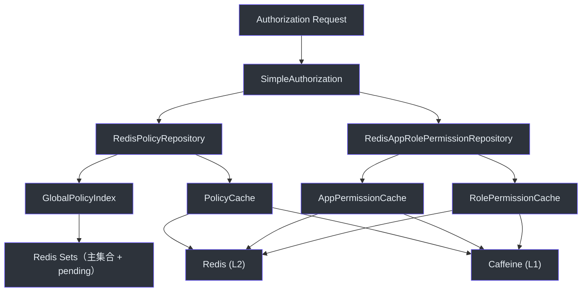
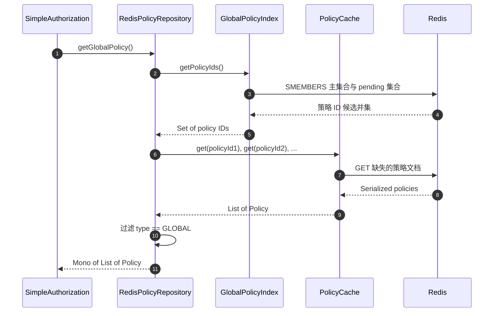
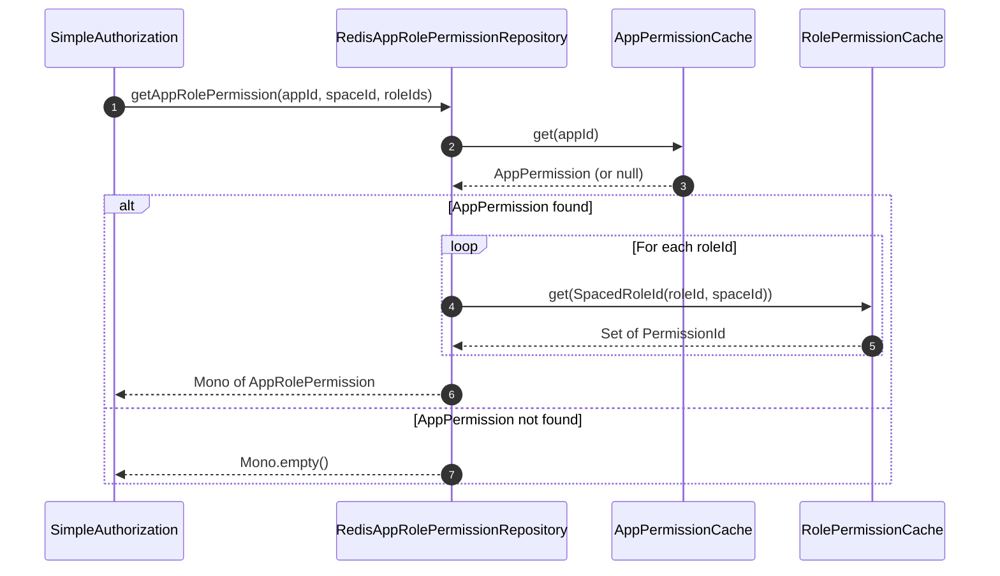
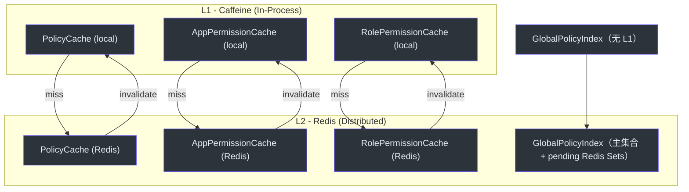

# 使用 CoCache 的 Redis 缓存

CoSec 使用 CoCache 的两级缓存（本地 Caffeine + Redis）保存策略文档和角色权限。全局策略索引刻意独立：`GlobalPolicyIndex` 直接读写两个 Redis Set，避免任何进程从 L1 成员快照返回陈旧数据。主集合保存已确认的索引归属，pending 集合在写入所有权不确定时保留 fail-safe 候选。

## 架构概览


```mermaid
graph TD
    A["Authorization Request"] --> B["SimpleAuthorization"]
    B --> C["RedisPolicyRepository"]
    B --> D["RedisAppRolePermissionRepository"]
    C --> E["GlobalPolicyIndex"]
    C --> F["PolicyCache"]
    D --> G["AppPermissionCache"]
    D --> H["RolePermissionCache"]
    E --> K["Redis Sets（主集合 + pending）"]
    I["Redis (L2)"]
    J["Caffeine (L1)"]
    F --> I
    G --> I
    H --> I
    F --> J
    G --> J
    H --> J

    style A fill:#2d333b,stroke:#6d5dfc,color:#e6edf3
    style B fill:#2d333b,stroke:#6d5dfc,color:#e6edf3
    style C fill:#2d333b,stroke:#6d5dfc,color:#e6edf3
    style D fill:#2d333b,stroke:#6d5dfc,color:#e6edf3
    style E fill:#2d333b,stroke:#6d5dfc,color:#e6edf3
    style F fill:#2d333b,stroke:#6d5dfc,color:#e6edf3
    style G fill:#2d333b,stroke:#6d5dfc,color:#e6edf3
    style H fill:#2d333b,stroke:#6d5dfc,color:#e6edf3
    style I fill:#2d333b,stroke:#6d5dfc,color:#e6edf3
    style J fill:#2d333b,stroke:#6d5dfc,color:#e6edf3
    style K fill:#2d333b,stroke:#6d5dfc,color:#e6edf3

```

## 核心组件

### RedisPolicyRepository

基于 Redis 缓存实现 `PolicyRepository`。提供三种操作：

1. **`getGlobalPolicy()`** -- 从 `GlobalPolicyIndex` 读取 ID，再从 `PolicyCache` 获取文档，并过滤当前类型不是 `PolicyType.GLOBAL` 的文档。
2. **`getPolicies(policyIds)`** -- 从 `PolicyCache` 根据 ID 获取特定策略。
3. **`setPolicy(policy)`** -- 校验策略，然后把幂等的缓存覆盖写交给 `GlobalPolicyIndex.update()`，按策略 ID 串行协调文档与索引归属。


```mermaid
sequenceDiagram
    autonumber
    participant Auth as SimpleAuthorization
    participant Repo as RedisPolicyRepository
    participant Index as GlobalPolicyIndex
    participant PolicyCache as PolicyCache
    participant Redis

    Auth->>Repo: getGlobalPolicy()
    Repo->>Index: getPolicyIds()
    Index->>Redis: SMEMBERS 主集合与 pending 集合
    Redis-->>Index: 策略 ID 候选并集
    Index-->>Repo: Set of policy IDs
    Repo->>PolicyCache: get(policyId1), get(policyId2), ...
    PolicyCache->>Redis: GET 缺失的策略文档
    Redis-->>PolicyCache: Serialized policies
    PolicyCache-->>Repo: List of Policy
    Repo->>Repo: 过滤 type == GLOBAL
    Repo-->>Auth: Mono of List of Policy


```

`GlobalPolicyIndex.update()` 获取按策略 ID 隔离、可续租的 Redis 锁。GLOBAL 更新先把 ID 写入 pending 集合，再对主集合执行 `SADD`，然后覆盖策略；非 GLOBAL 更新先覆盖策略再执行 `SREM`。只有确认锁所有权后才删除 pending 标记。锁所有权确认返回 false 或发生异常时，会重放幂等覆盖写。所有尝试都无法确认时，适配器保留 pending 候选、对主集合执行 fail-safe `SADD`，并返回显式错误。`getPolicyIds()` 返回两个集合的并集；这可能产生会被读取端策略类型过滤的冗余候选，但不会静默漏掉 GLOBAL 策略。

### RedisAppRolePermissionRepository

通过组合两个缓存的数据实现 `AppRolePermissionRepository`：

1. **`AppPermissionCache`** -- 将 `AppId` 映射到 `AppPermission`（应用的权限定义）。
2. **`RolePermissionCache`** -- 将 `SpacedRoleId` 映射到 `Set<PermissionId>`（每个角色在空间内被授予的权限）。


```mermaid
sequenceDiagram
    autonumber
    participant Auth as SimpleAuthorization
    participant Repo as RedisAppRolePermissionRepository
    participant AppCache as AppPermissionCache
    participant RoleCache as RolePermissionCache

    Auth->>Repo: getAppRolePermission(appId, spaceId, roleIds)
    Repo->>AppCache: get(appId)
    AppCache-->>Repo: AppPermission (or null)
    alt AppPermission found
        loop For each roleId
            Repo->>RoleCache: get(SpacedRoleId(roleId, spaceId))
            RoleCache-->>Repo: Set of PermissionId
        end
        Repo-->>Auth: Mono of AppRolePermission
    else AppPermission not found
        Repo-->>Auth: Mono.empty()
    end


```

### 缓存接口

文档缓存接口扩展 CoCache 的 `Cache<K, V>`，提供统一的 L1（Caffeine）和 L2（Redis）缓存 API：

| 缓存接口 | 键类型 | 值类型 | 用途 |
|----------------|----------|------------|---------|
| `PolicyCache` | `String`（策略 ID） | `Policy` | 单个策略文档 |
| `AppPermissionCache` | `AppId` | `AppPermission` | 应用权限定义 |
| `RolePermissionCache` | `SpacedRoleId` | `Set<PermissionId>` | 角色到权限的映射 |

### GlobalPolicyIndex

`GlobalPolicyIndex` 是 `cosec-api` 中的公开端口，不属于 CoCache 缓存。Redis 适配器针对主键 `cosec.authorization.cache.key-prefix + ":global:policy"` 及额外追加 `":pending"` 的 pending 键执行 `SMEMBERS`、`SADD` 和 `SREM`。自定义适配器必须完整实现 fail-safe `update` 契约；回调可能被重放，因此必须保持幂等。

## 缓存配置

网关的 `application.yaml` 配置缓存最大容量：

```yaml
cosec:
  authorization:
    cache:
      policy:
        maximum-size: 100000
      role:
        maximum-size: 100000
```

## 缓存层次结构


```mermaid
graph TD
    subgraph "L1 - Caffeine (In-Process)"
        A["PolicyCache (local)"]
        B["AppPermissionCache (local)"]
        C["RolePermissionCache (local)"]
    end
    subgraph "L2 - Redis (Distributed)"
        E["PolicyCache (Redis)"]
        F["AppPermissionCache (Redis)"]
        G["RolePermissionCache (Redis)"]
        H["GlobalPolicyIndex（主集合 + pending Redis Sets）"]
    end
    D["GlobalPolicyIndex（无 L1）"] --> H
    A -->|miss| E
    B -->|miss| F
    C -->|miss| G
    E -->|invalidate| A
    F -->|invalidate| B
    G -->|invalidate| C

    style A fill:#2d333b,stroke:#6d5dfc,color:#e6edf3
    style B fill:#2d333b,stroke:#6d5dfc,color:#e6edf3
    style C fill:#2d333b,stroke:#6d5dfc,color:#e6edf3
    style D fill:#2d333b,stroke:#6d5dfc,color:#e6edf3
    style E fill:#2d333b,stroke:#6d5dfc,color:#e6edf3
    style F fill:#2d333b,stroke:#6d5dfc,color:#e6edf3
    style G fill:#2d333b,stroke:#6d5dfc,color:#e6edf3
    style H fill:#2d333b,stroke:#6d5dfc,color:#e6edf3

```

## 参考资料

- [cosec-cocache/src/main/kotlin/me/ahoo/cosec/cache/RedisPolicyRepository.kt:26](https://github.com/Ahoo-Wang/CoSec/blob/main/cosec-cocache/src/main/kotlin/me/ahoo/cosec/cache/RedisPolicyRepository.kt#L26) -- 策略仓库
- [cosec-cocache/src/main/kotlin/me/ahoo/cosec/cache/RedisAppRolePermissionRepository.kt:27](https://github.com/Ahoo-Wang/CoSec/blob/main/cosec-cocache/src/main/kotlin/me/ahoo/cosec/cache/RedisAppRolePermissionRepository.kt#L27) -- 角色权限仓库
- [cosec-cocache/src/main/kotlin/me/ahoo/cosec/cache/PolicyCache.kt:23](https://github.com/Ahoo-Wang/CoSec/blob/main/cosec-cocache/src/main/kotlin/me/ahoo/cosec/cache/PolicyCache.kt#L23) -- 策略缓存接口
- [cosec-cocache/src/main/kotlin/me/ahoo/cosec/cache/AppPermissionCache.kt:20](https://github.com/Ahoo-Wang/CoSec/blob/main/cosec-cocache/src/main/kotlin/me/ahoo/cosec/cache/AppPermissionCache.kt#L20) -- 应用权限缓存接口
- [cosec-api/src/main/kotlin/me/ahoo/cosec/api/policy/GlobalPolicyIndex.kt](https://github.com/Ahoo-Wang/CoSec/blob/main/cosec-api/src/main/kotlin/me/ahoo/cosec/api/policy/GlobalPolicyIndex.kt) -- fail-safe 索引端口
- [cosec-spring-boot-starter/src/main/kotlin/me/ahoo/cosec/spring/boot/starter/authorization/cache/RedisGlobalPolicyIndex.kt](https://github.com/Ahoo-Wang/CoSec/blob/main/cosec-spring-boot-starter/src/main/kotlin/me/ahoo/cosec/spring/boot/starter/authorization/cache/RedisGlobalPolicyIndex.kt) -- Redis 适配器

## 相关页面

- [Spring Cloud Gateway 集成](./spring-cloud-gateway.md)
- [OpenTelemetry 集成](./opentelemetry.md)
- [性能](../operations/performance.md)
- [部署](../operations/deployment.md)
