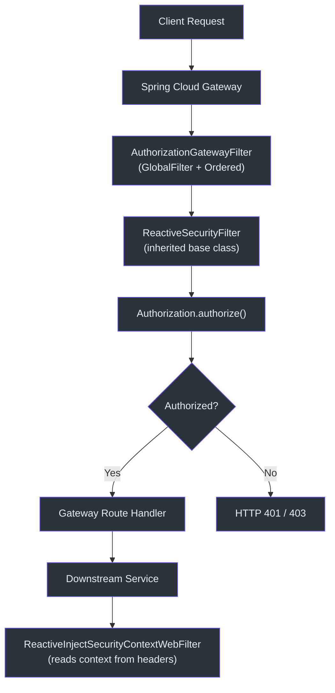
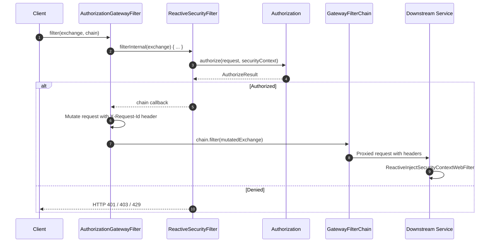
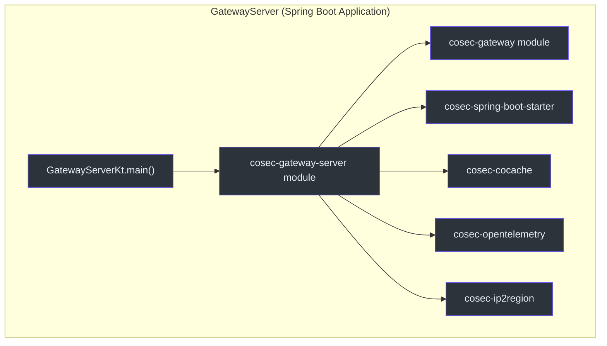
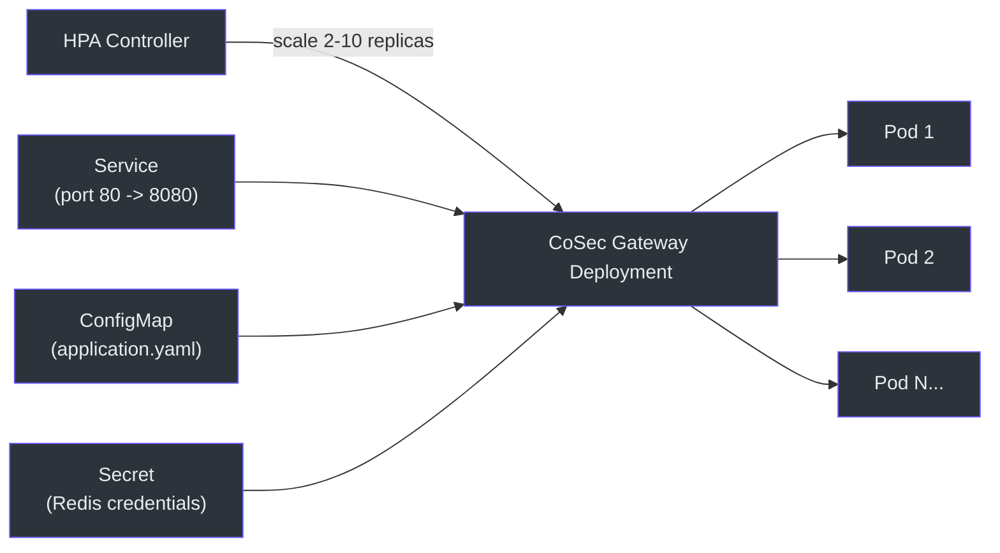

# Spring Cloud Gateway 集成

CoSec 通过 `GlobalFilter` 实现在 API 网关层的集中式授权。每个通过网关的请求在路由到下游服务之前都会经过授权检查，下游服务则使用仅注入的过滤器来获取安全上下文。

## 架构概览



## 核心组件

### AuthorizationGatewayFilter

在网关中执行授权的核心过滤器。它实现了 `GlobalFilter` 和 `Ordered`，并扩展了 `ReactiveSecurityFilter`。

```kotlin
class AuthorizationGatewayFilter(
    securityContextParser: SecurityContextParser,
    requestParser: RequestParser<ServerWebExchange>,
    authorization: Authorization
) : GlobalFilter, Ordered,
    ReactiveSecurityFilter(securityContextParser, requestParser, authorization)
```

关键特性：

- **过滤器排序**: `Ordered.HIGHEST_PRECEDENCE + 10` -- 在网关过滤器链中非常靠前运行，确保在路由特定过滤器之前完成授权检查。
- **请求 ID 传播**: 授权成功后，修改 exchange 添加 `X-Request-Id` 头，以便下游服务关联请求。
- 继承了 `ReactiveSecurityFilter.filterInternal()` 的所有授权逻辑。



### CoSecGatewayAuthorizationAutoConfiguration

将 `AuthorizationGatewayFilter` 注册为 Spring Bean 的自动配置。在以下条件满足时激活：

- `@ConditionalOnCoSecEnabled` -- `cosec.enabled=true`（默认值）
- `@ConditionalOnAuthorizationEnabled` -- `cosec.authorization.enabled=true`
- `@ConditionalOnGatewayEnabled` -- `cosec.authorization.gateway.enabled=true`
- `@ConditionalOnClass(AuthorizationGatewayFilter::class)` -- 网关模块在 classpath 中

### GatewayServer

独立网关应用的入口点。它是一个标准的 `@SpringBootApplication`，引入了所有 CoSec 模块。



## Kubernetes 部署

网关作为容器化应用部署在 Kubernetes 上，配置了健康探针、资源限制和水平 Pod 自动扩缩。

### 网关配置（ConfigMap）

`application.yaml` ConfigMap 配置路由、CORS 和 CoSec 特定设置：

```yaml
cosec:
  authentication:
    enabled: false
  jwt:
    algorithm: hmac256
    secret: FyN0Igd80Gas8stTavArGKOYnS9uLWGA_
  ip2region:
    enabled: false
  authorization:
    local-policy:
      enabled: true
      init-repository: true
    cache:
      policy:
        maximum-size: 100000
      role:
        maximum-size: 100000
```

### 健康探针

部署使用三级探针：

| 探针类型 | 端点 | 用途 |
|------------|----------|---------|
| `startupProbe` | `/actuator/health` | 确认应用已启动 |
| `readinessProbe` | `/actuator/health/readiness` | 准备好接收流量 |
| `livenessProbe` | `/actuator/health/liveness` | 应用仍在运行 |

### 水平 Pod 自动扩缩

HPA 基于 CPU 利用率在 2 到 10 个副本之间扩缩。



## 参考资料

- [cosec-gateway/src/main/kotlin/me/ahoo/cosec/gateway/AuthorizationGatewayFilter.kt:31](https://github.com/Ahoo-Wang/CoSec/blob/main/cosec-gateway/src/main/kotlin/me/ahoo/cosec/gateway/AuthorizationGatewayFilter.kt#L31) -- 网关过滤器实现
- [cosec-spring-boot-starter/src/main/kotlin/.../CoSecGatewayAuthorizationAutoConfiguration.kt:43](https://github.com/Ahoo-Wang/CoSec/blob/main/cosec-spring-boot-starter/src/main/kotlin/me/ahoo/cosec/spring/boot/starter/authorization/gateway/CoSecGatewayAuthorizationAutoConfiguration.kt#L43) -- 自动配置
- [cosec-gateway-server/src/main/kotlin/.../GatewayServer.kt:24](https://github.com/Ahoo-Wang/CoSec/blob/main/cosec-gateway-server/src/main/kotlin/me/ahoo/cosec/gateway/server/GatewayServer.kt#L24) -- 应用入口
- [k8s/cosec-gateway-deployment.yml](https://github.com/Ahoo-Wang/CoSec/blob/main/k8s/cosec-gateway-deployment.yml) -- Kubernetes 部署
- [k8s/cosec-gateway-config.yaml](https://github.com/Ahoo-Wang/CoSec/blob/main/k8s/cosec-gateway-config.yaml) -- 网关配置

## 相关页面

- [Spring WebFlux 集成](./spring-webflux.md)
- [Redis 缓存](./redis-caching.md)
- [OpenTelemetry 集成](./opentelemetry.md)
- [部署](../operations/deployment.md)
