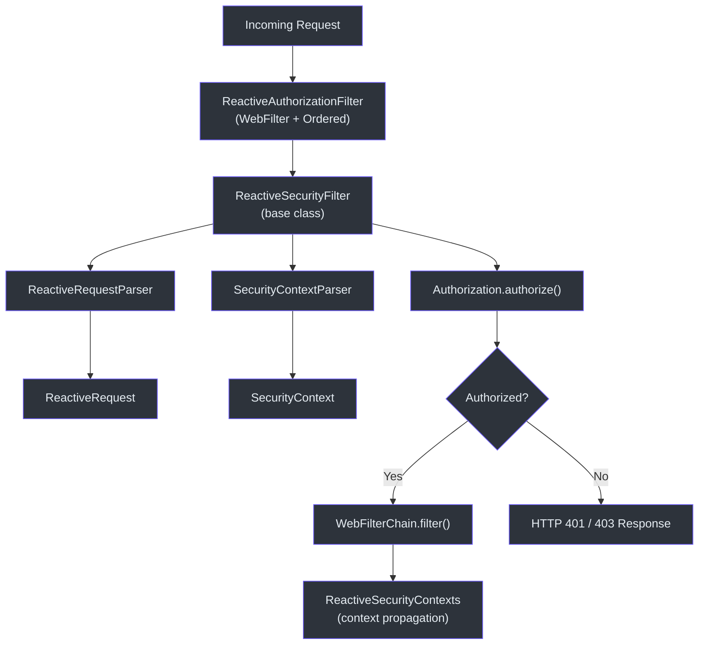
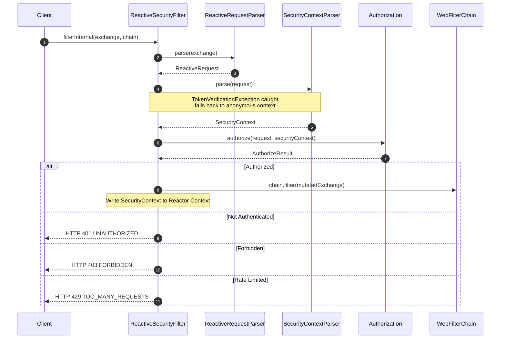
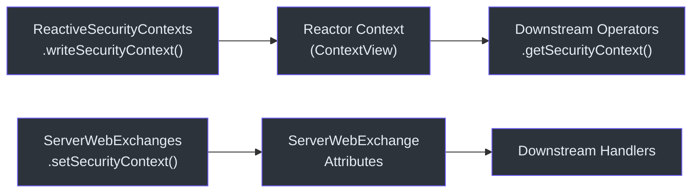
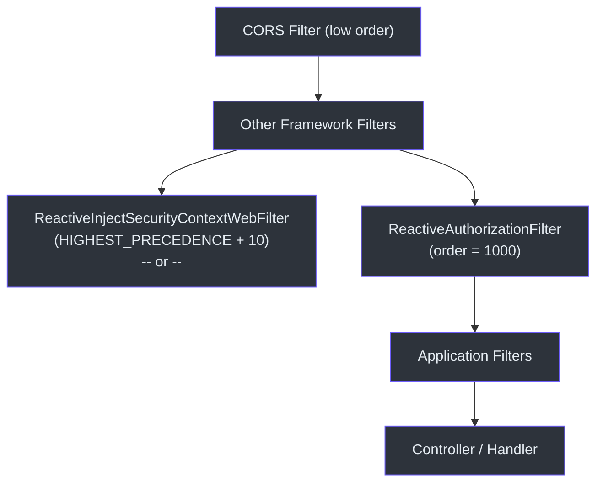

# Spring WebFlux 集成

CoSec 通过基于 Project Reactor 构建的过滤器和上下文传播工具集，为 Spring WebFlux 提供一流的响应式集成。每个请求都经过非阻塞的授权管线，端到端地保持响应式契约。

## 架构概览



## 核心组件

### ReactiveAuthorizationFilter

WebFlux 安全的入口点。它同时实现了 `WebFilter` 和 `Ordered`，排序值为 `1000`，位于框架过滤器（CORS 等）之后、大多数应用逻辑之前。

```kotlin
class ReactiveAuthorizationFilter(
    securityContextParser: SecurityContextParser,
    requestParser: RequestParser<ServerWebExchange>,
    authorization: Authorization
) : ReactiveSecurityFilter(securityContextParser, requestParser, authorization),
    WebFilter,
    Ordered
```

- **排序值**: `REACTIVE_AUTHORIZATION_FILTER_ORDER = 1000` -- 在 CORS 和其他基础设施过滤器之后运行。
- 将实际工作委托给 [ReactiveSecurityFilter.filterInternal](#reactivesecurityfilter)。
- 成功后，调用 `chain.filter(exchange)` 使下游处理器接收到已设置主体信息的增强 exchange。

### ReactiveSecurityFilter

包含所有授权逻辑的共享基类。Spring Cloud Gateway 集成也扩展了此类。



`filterInternal` 方法处理以下内容：

1. **请求解析** -- 将 `ServerWebExchange` 转换为 CoSec `Request`。
2. **令牌验证** -- 捕获 `TokenVerificationException` 并回退到匿名的 `SimpleSecurityContext`。
3. **授权决策** -- 调用 `Authorization.authorize()` 并将结果映射为 HTTP 状态码。
4. **错误处理** -- 将 `TooManyRequestsException` 映射为 429，将意外错误映射为 500。

### ReactiveRequestParser

将 `ServerWebExchange` 转换为 `ReactiveRequest`，提取路径、方法、远程 IP、来源、引用页和请求 ID。同时应用所有已注册的 `RequestAttributesAppender` 实例（如 IP 地理定位）。

### ReactiveRequest

一个不可变的数据类，包装了 `ServerWebExchange` 并实现了 CoSec 的 `Request` 接口。它提供了对底层 exchange 中 headers、查询参数和 cookies 的惰性访问。

### ReactiveSecurityContexts

用于通过 Reactor 的 `Context` 传播 `SecurityContext` 的工具对象：



并行使用两个传播通道：

| 通道 | 机制 | 使用场景 |
|---------|-----------|----------|
| Reactor `Context` | `contextWrite { it.setSecurityContext(ctx) }` | 同一响应式链中的响应式操作符 |
| `ServerWebExchange` 属性 | `exchange.setSecurityContext(ctx)` | 在下游处理器中直接访问 |

### ReactiveInjectSecurityContextWebFilter

专为 API 网关背后的下游服务设计。它不执行授权，而是从请求头中注入安全上下文（由上游网关设置），无需令牌验证。这避免了微服务间调用中重复的 JWT 验证。

## 过滤器链顺序



根据服务是前端服务还是下游微服务，在 `ReactiveAuthorizationFilter` 和 `ReactiveInjectSecurityContextWebFilter` 之间进行选择。

## 参考资料

- [cosec-webflux/src/main/kotlin/me/ahoo/cosec/webflux/ReactiveAuthorizationFilter.kt:36](https://github.com/Ahoo-Wang/CoSec/blob/main/cosec-webflux/src/main/kotlin/me/ahoo/cosec/webflux/ReactiveAuthorizationFilter.kt#L36) -- 过滤器入口
- [cosec-webflux/src/main/kotlin/me/ahoo/cosec/webflux/ReactiveSecurityFilter.kt:57](https://github.com/Ahoo-Wang/CoSec/blob/main/cosec-webflux/src/main/kotlin/me/ahoo/cosec/webflux/ReactiveSecurityFilter.kt#L57) -- 包含 `filterInternal` 的基类
- [cosec-webflux/src/main/kotlin/me/ahoo/cosec/webflux/ReactiveRequestParser.kt:27](https://github.com/Ahoo-Wang/CoSec/blob/main/cosec-webflux/src/main/kotlin/me/ahoo/cosec/webflux/ReactiveRequestParser.kt#L27) -- 请求解析
- [cosec-webflux/src/main/kotlin/me/ahoo/cosec/webflux/ReactiveRequest.kt:22](https://github.com/Ahoo-Wang/CoSec/blob/main/cosec-webflux/src/main/kotlin/me/ahoo/cosec/webflux/ReactiveRequest.kt#L22) -- 请求数据类
- [cosec-webflux/src/main/kotlin/me/ahoo/cosec/webflux/ReactiveSecurityContexts.kt:21](https://github.com/Ahoo-Wang/CoSec/blob/main/cosec-webflux/src/main/kotlin/me/ahoo/cosec/webflux/ReactiveSecurityContexts.kt#L21) -- 上下文传播

## 相关页面

- [Spring WebMVC 集成](./spring-webmvc.md)
- [Spring Cloud Gateway 集成](./spring-cloud-gateway.md)
- [自动配置](../extending/auto-configuration.md)
- [测试](../operations/testing.md)
