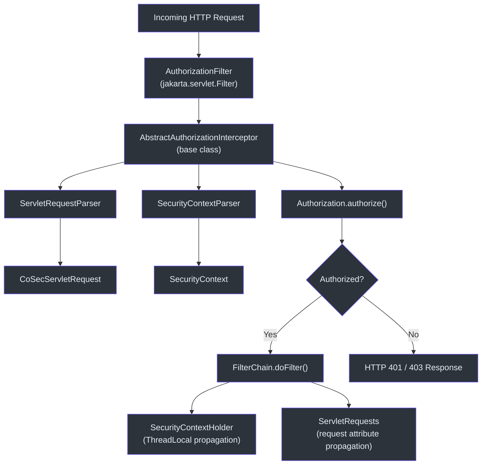
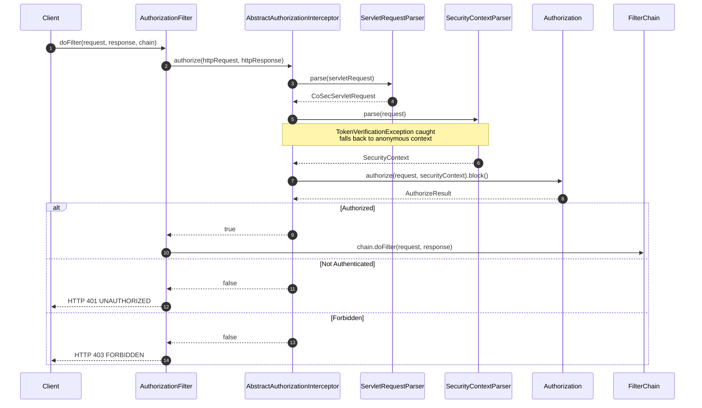
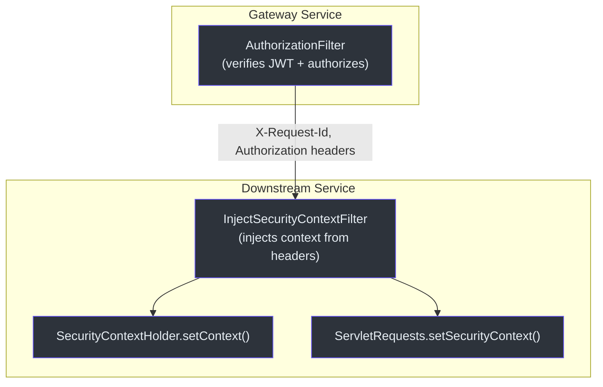

# Spring WebMVC 集成

CoSec 通过 `jakarta.servlet.Filter` 实现为传统 Spring MVC 应用提供基于 Servlet 的集成路径。Servlet 集成与响应式 WebFlux 集成类似，但使用线程本地上下文传播代替 Reactor Context。

## 架构概览

## 核心组件

### AuthorizationFilter

Servlet 过滤器入口点。它实现了 `jakarta.servlet.Filter` 并扩展了 `AbstractAuthorizationInterceptor`，对每个传入请求执行授权检查。

`AuthorizationFilter.doFilter` 的关键行为：

1. **委托**给 `AbstractAuthorizationInterceptor.authorize()`。
2. **捕获** `TooManyRequestsException` 并返回 HTTP 429。
3. **捕获**意外异常，记录错误日志并返回 HTTP 500。
4. 授权成功后，调用 `chain.doFilter(request, response)`。

### AbstractAuthorizationInterceptor

包含授权算法的基类。它与 `ReactiveSecurityFilter` 中的逻辑保持一致 -- 此处的任何更改都应同步到响应式对应类中。

`authorize()` 方法：

1. 通过 `ServletRequestParser` 将 Servlet 请求解析为 CoSec `Request`。
2. 通过 `SecurityContextParser` 解析 `SecurityContext`，捕获 `TokenVerificationException`。
3. 将上下文存储到 `SecurityContextHolder`（线程本地）和请求属性中。
4. 设置 `X-Request-Id` 响应头。
5. 调用 `authorization.authorize()` 并阻塞等待结果（`.block()`）。
6. 如果被拒绝返回 `false`，如果被允许返回 `true`。

### ServletRequestParser

将 `jakarta.servlet.http.HttpServletRequest` 转换为 `CoSecServletRequest`，提取路径（通过 `servletPath`）、方法、远程 IP、来源、引用页和请求 ID。同时应用已注册的 `RequestAttributesAppender` 实例。

### CoSecServletRequest

包装 `HttpServletRequest` 的不可变数据类。实现了 CoSec 的 `Request` 接口和 `Delegated<HttpServletRequest>`，提供对底层 Servlet 请求中 headers、查询参数和 cookies 的访问。

### InjectSecurityContextFilter

`ReactiveInjectSecurityContextWebFilter` 的 Servlet 对应版本。专为已执行授权的 API 网关背后的下游服务设计。它使用 `SecurityContextParser.ensureParse()` 从请求头中提取安全上下文，无需令牌验证。

### SecurityContextHolder

当前安全上下文的线程本地持有者。使用 `InheritableThreadLocal` 使子线程继承父线程的上下文。提供静态方法 `setContext()`、`context`、`requiredContext` 和 `remove()`。

## 上下文传播

与使用 Reactor `Context` 的响应式集成不同，Servlet 集成使用两个并行通道：

| 通道 | 机制 | 作用域 |
|---------|-----------|-------|
| `SecurityContextHolder` | `InheritableThreadLocal` | 当前线程和子线程 |
| `HttpServletRequest` 属性 | `request.setAttribute()` | 当前请求生命周期 |

两者都在 `AbstractAuthorizationInterceptor.authorize()` 中设置，因此下游代码可以通过任一机制访问安全上下文。

## 参考资料

- [cosec-webmvc/src/main/kotlin/me/ahoo/cosec/servlet/AuthorizationFilter.kt:42](https://github.com/Ahoo-Wang/CoSec/blob/main/cosec-webmvc/src/main/kotlin/me/ahoo/cosec/servlet/AuthorizationFilter.kt#L42) -- Servlet 过滤器入口
- [cosec-webmvc/src/main/kotlin/me/ahoo/cosec/servlet/AbstractAuthorizationInterceptor.kt:51](https://github.com/Ahoo-Wang/CoSec/blob/main/cosec-webmvc/src/main/kotlin/me/ahoo/cosec/servlet/AbstractAuthorizationInterceptor.kt#L51) -- 包含授权逻辑的基类拦截器
- [cosec-webmvc/src/main/kotlin/me/ahoo/cosec/servlet/ServletRequestParser.kt:31](https://github.com/Ahoo-Wang/CoSec/blob/main/cosec-webmvc/src/main/kotlin/me/ahoo/cosec/servlet/ServletRequestParser.kt#L31) -- 请求解析
- [cosec-webmvc/src/main/kotlin/me/ahoo/cosec/servlet/CoSecServletRequest.kt:22](https://github.com/Ahoo-Wang/CoSec/blob/main/cosec-webmvc/src/main/kotlin/me/ahoo/cosec/servlet/CoSecServletRequest.kt#L22) -- 请求数据类
- [cosec-webmvc/src/main/kotlin/me/ahoo/cosec/servlet/InjectSecurityContextFilter.kt:40](https://github.com/Ahoo-Wang/CoSec/blob/main/cosec-webmvc/src/main/kotlin/me/ahoo/cosec/servlet/InjectSecurityContextFilter.kt#L40) -- 下游上下文注入
- [cosec-core/src/main/kotlin/me/ahoo/cosec/context/SecurityContextHolder.kt:26](https://github.com/Ahoo-Wang/CoSec/blob/main/cosec-core/src/main/kotlin/me/ahoo/cosec/context/SecurityContextHolder.kt#L26) -- 线程本地上下文持有者

## 相关页面

- [Spring WebFlux 集成](./spring-webflux.md)
- [Spring Cloud Gateway 集成](./spring-cloud-gateway.md)
- [自动配置](../extending/auto-configuration.md)
- [测试](../operations/testing.md)
