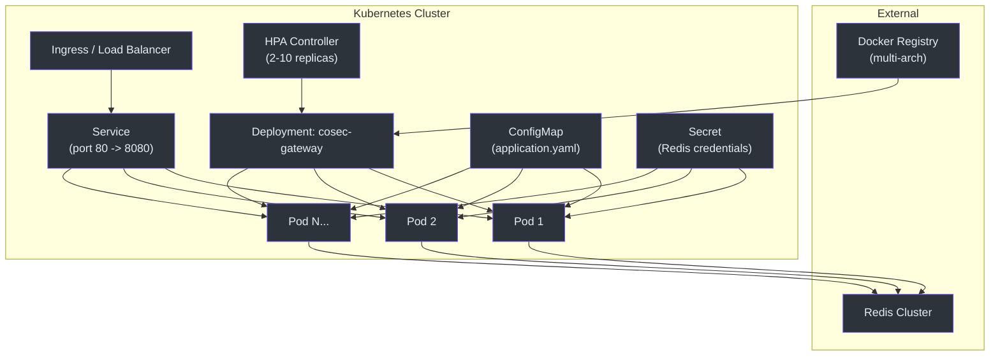
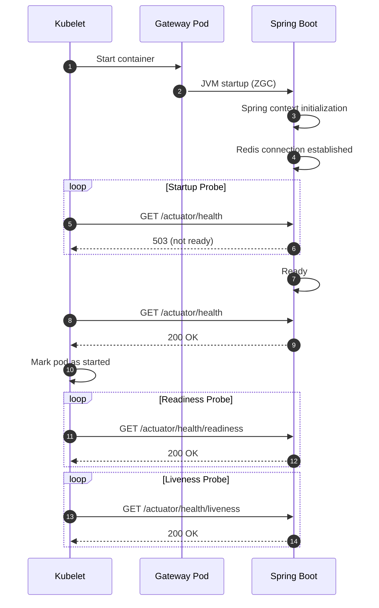
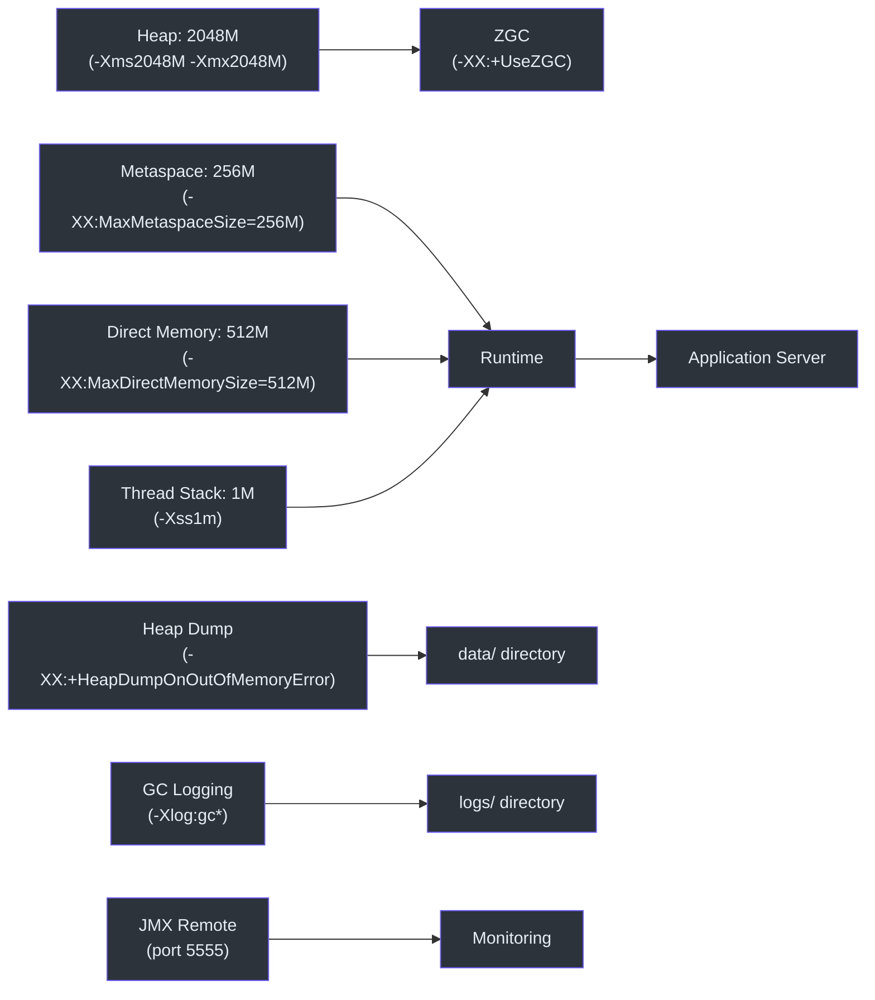
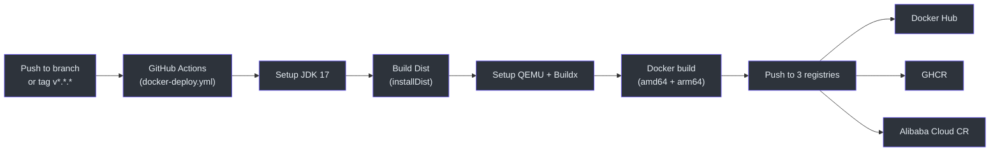

# 部署

CoSec Gateway 作为容器化的 Spring Boot 应用部署在 Kubernetes 上。部署包括多架构 Docker 镜像、健康探针、水平 Pod 自动扩缩和外部化配置。

## 部署架构



## Docker 镜像

CoSec Gateway 发布支持 `linux/amd64` 和 `linux/arm64` 的多架构 Docker 镜像：

| 镜像仓库 | 镜像 |
|----------|------|
| Docker Hub | `ahoowang/cosec-gateway` |
| GitHub 容器仓库 | `ghcr.io/ahoo-wang/cosec-gateway` |
| 阿里云容器镜像服务 | `registry.cn-shanghai.aliyuncs.com/ahoo/cosec-gateway` |

标签遵循语义化版本模式：`{{version}}`、`{{major}}.{{minor}}`、分支名和 PR 编号。

## Kubernetes 资源

### Deployment

网关 Deployment 指定了资源限制、健康探针和卷挂载：

```yaml
spec:
  containers:
    - image: registry.cn-shanghai.aliyuncs.com/ahoo/cosec-gateway:2.0.1
      startupProbe:
        httpGet: { port: http, path: /actuator/health }
      readinessProbe:
        httpGet: { port: http, path: /actuator/health/readiness }
      livenessProbe:
        httpGet: { port: http, path: /actuator/health/liveness }
      resources:
        limits: { cpu: "4", memory: 2816Mi }
        requests: { cpu: 500m, memory: 2048Mi }
```



### Service

Kubernetes Service 暴露 80 端口映射到容器的 8080 端口：

```yaml
spec:
  ports:
    - name: http
      port: 80
      targetPort: 8080
```

### 水平 Pod 自动扩缩器

根据 CPU 利用率在 2 到 10 个副本之间自动扩缩：

```yaml
spec:
  minReplicas: 2
  maxReplicas: 10
  metrics:
    - type: Resource
      resource:
        name: cpu
        target:
          type: Utilization
          averageUtilization: 600
```

### ConfigMap

外部化配置挂载到 `/opt/cosec-gateway-server/config/`：

```yaml
data:
  application.yaml: |
    server:
      port: 8080
    cosec:
      jwt:
        algorithm: hmac256
        secret: FyN0Igd80Gas8stTavArGKOYnS9uLWGA_
      authorization:
        cache:
          policy:
            maximum-size: 100000
          role:
            maximum-size: 100000
```

## JVM 配置

网关使用 ZGC（Z 垃圾回收器），JVM 选项如下：



选择 ZGC 是因为其低延迟暂停时间，这对于必须在微秒内响应的授权网关至关重要。

## CI/CD 流水线



流水线在以下情况触发：
- 推送到任何分支
- 匹配 `v*.*.*` 的标签
- 向 `main` 分支提交 Pull Request
- 每日定时构建（UTC 10:00）

## 参考资料

- [k8s/cosec-gateway-deployment.yml](https://github.com/Ahoo-Wang/CoSec/blob/main/k8s/cosec-gateway-deployment.yml) -- Kubernetes 部署
- [k8s/cosec-gateway-config.yaml](https://github.com/Ahoo-Wang/CoSec/blob/main/k8s/cosec-gateway-config.yaml) -- 网关配置
- [k8s/cosec-gateway-hpa.yaml](https://github.com/Ahoo-Wang/CoSec/blob/main/k8s/cosec-gateway-hpa.yaml) -- 水平 Pod 自动扩缩器
- [k8s/cosec-gateway-service.yaml](https://github.com/Ahoo-Wang/CoSec/blob/main/k8s/cosec-gateway-service.yaml) -- Kubernetes Service
- [.github/workflows/docker-deploy.yml](https://github.com/Ahoo-Wang/CoSec/blob/main/.github/workflows/docker-deploy.yml) -- CI/CD 流水线
- [cosec-gateway-server/build.gradle.kts:35](https://github.com/Ahoo-Wang/CoSec/blob/main/cosec-gateway-server/build.gradle.kts#L35) -- JVM 选项

## 相关页面

- [Spring Cloud Gateway 集成](../integrations/spring-cloud-gateway.md)
- [Redis 缓存](../integrations/redis-caching.md)
- [OpenTelemetry 集成](../integrations/opentelemetry.md)
- [性能](./performance.md)
