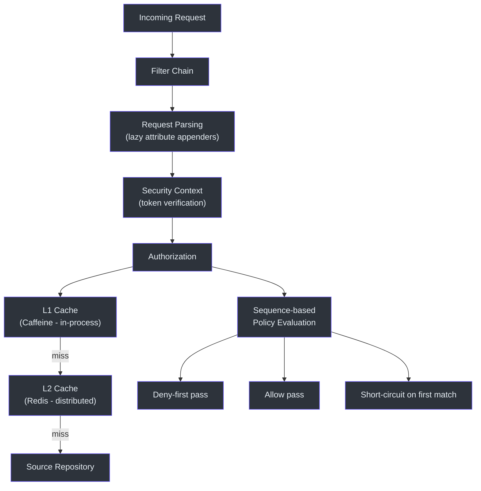
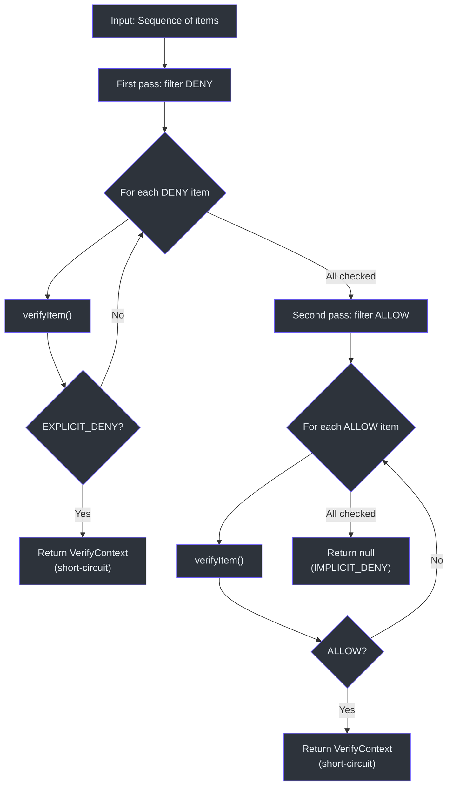
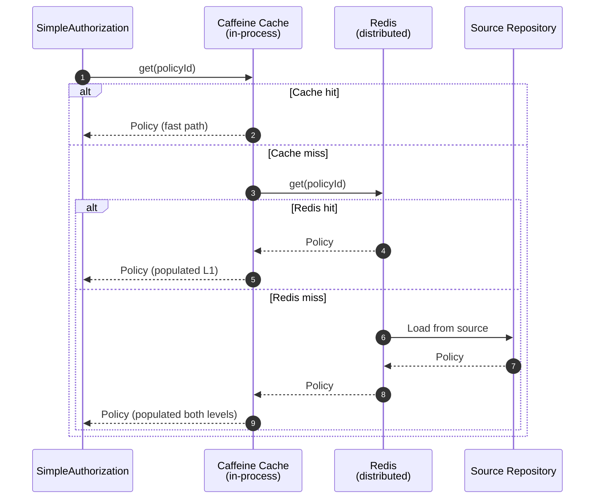

# 性能

CoSec 专为在 API 网关层实现高吞吐量、低延迟的授权决策而设计。性能通过基于序列的惰性评估、多级缓存和使用 Spring 的 `PathPattern` 解析器进行高效路径匹配来实现。

## 性能架构



## 基于序列的评估

一项关键的性能优化（提交 `de927e6`）将基于 `List` 的策略评估替换为基于 Kotlin `Sequence` 的评估。这一变更消除了拒绝优先算法中的中间集合分配。

### 优化前与优化后

```mermaid
flowchart TD
    subgraph "Before: List-based (eager)"
        A1["List of all policies"] --> B1["flatMap to List of statements"]
        B1 --> C1["filter DENY statements -> new List"]
        C1 --> D1["forEach DENY -> verify"]
        B1 --> E1["filter ALLOW statements -> new List"]
        E1 --> F1["forEach ALLOW -> verify"]
    end
    subgraph "After: Sequence-based (lazy)"
        A2["Sequence of matched policies"] --> B2["flatMap to Sequence of statements"]
        B2 --> C2["filter DENY (lazy)"]
        C2 --> D2["forEach DENY -> verify (short-circuit)"]
        B2 --> E2["filter ALLOW (lazy)"]
        E2 --> F2["forEach ALLOW -> verify (short-circuit)"]
    end

    style A1 fill:#2d333b,stroke:#6d5dfc,color:#e6edf3
    style B1 fill:#2d333b,stroke:#6d5dfc,color:#e6edf3
    style C1 fill:#2d333b,stroke:#6d5dfc,color:#e6edf3
    style D1 fill:#2d333b,stroke:#6d5dfc,color:#e6edf3
    style E1 fill:#2d333b,stroke:#6d5dfc,color:#e6edf3
    style F1 fill:#2d333b,stroke:#6d5dfc,color:#e6edf3
    style A2 fill:#2d333b,stroke:#6d5dfc,color:#e6edf3
    style B2 fill:#2d333b,stroke:#6d5dfc,color:#e6edf3
    style C2 fill:#2d333b,stroke:#6d5dfc,color:#e6edf3
    style D2 fill:#2d333b,stroke:#6d5dfc,color:#e6edf3
    style E2 fill:#2d333b,stroke:#6d5dfc,color:#e6edf3
    style F2 fill:#2d333b,stroke:#6d5dfc,color:#e6edf3

```



`SimpleAuthorization` 中的 `evaluateDenyFirst` 函数在 `Sequence<T>` 上操作，这意味着：

1. **无中间集合** -- `filter` 和 `flatMap` 返回惰性序列。
2. **短路评估** -- 第一个 DENY 匹配立即停止迭代。
3. **两遍设计** -- DENY 语句先评估，然后是 ALLOW 语句，确保拒绝规则始终优先。

### evaluateDenyFirst 算法



## JMH 基准测试

CoSec 通过 `me.champeau.jmh` Gradle 插件在每个模块中包含 JMH（Java 微基准测试工具）基准测试。

### PathPatternBenchmark

对 Spring `PathPattern` 匹配性能进行基准测试，这是 `PathActionMatcher` 中的核心操作：

```kotlin
open class PathPatternBenchmark {
    @Benchmark
    fun matches(): Boolean {
        return PathPatternTest.matches()
    }

    @Benchmark
    fun matchAndExtract(): PathPattern.PathMatchInfo? {
        return PathPatternTest.matchAndExtract()
    }
}
```

两个基准测试方法分别衡量：
- **`matches()`** -- 纯布尔匹配检查（拒绝评估的快速路径）。
- **`matchAndExtract()`** -- 带路径变量提取的匹配（当条件需要路径参数时使用）。

### 运行基准测试

```bash
# 运行 cosec-core 中的所有基准测试
./gradlew :cosec-core:jmh

# 运行特定基准测试
./gradlew :cosec-core:jmh -PjmhIncludes=*.PathPatternBenchmark

# 使用自定义 JMH 选项运行
./gradlew :cosec-core:jmh -PjmhIncludes="*" -PjmhParams="mode=avgt"
```

## 缓存策略

### 多级缓存 (CoCache + Redis)



缓存配置支持每个缓存最多 100,000 个条目：

```yaml
cosec:
  authorization:
    cache:
      policy:
        maximum-size: 100000
      role:
        maximum-size: 100000
```

### 缓存容量

| 缓存 | 最大大小 | 键 | 值 |
|------|----------|----|----|
| PolicyCache | 100,000 | 策略 ID | 序列化的策略 |
| GlobalPolicyIndexCache | 1（固定键） | `""` | 全局策略 ID 集合 |
| AppPermissionCache | 100,000 | AppId | AppPermission |
| RolePermissionCache | 100,000 | SpacedRoleId | PermissionId 集合 |

## 性能相关提交

代码库中最近的性能优化：

- `de927e6` -- `refactor(authorization): optimize performance by using sequences instead of lists`
- `7e9bf7d` -- `perf(cosec-opentelemetry): optimize attribute population in CoSecInstrumenter`
- `62c672e` -- `feat(cosec-gateway-server): add cache configuration for policy and role`
- `ba7db16` -- `Refactor: Enhance Statement.verify performance`

## 参考资料

- [cosec-core/src/jmh/kotlin/me/ahoo/cosec/policy/action/PathPatternBenchmark.kt:19](https://github.com/Ahoo-Wang/CoSec/blob/main/cosec-core/src/jmh/kotlin/me/ahoo/cosec/policy/action/PathPatternBenchmark.kt#L19) -- JMH 基准测试
- [cosec-core/src/main/kotlin/me/ahoo/cosec/authorization/SimpleAuthorization.kt:61](https://github.com/Ahoo-Wang/CoSec/blob/main/cosec-core/src/main/kotlin/me/ahoo/cosec/authorization/SimpleAuthorization.kt#L61) -- 基于序列的 evaluateDenyFirst
- [cosec-cocache/src/main/kotlin/me/ahoo/cosec/cache/RedisPolicyRepository.kt:26](https://github.com/Ahoo-Wang/CoSec/blob/main/cosec-cocache/src/main/kotlin/me/ahoo/cosec/cache/RedisPolicyRepository.kt#L26) -- 缓存的策略仓库
- [k8s/cosec-gateway-config.yaml](https://github.com/Ahoo-Wang/CoSec/blob/main/k8s/cosec-gateway-config.yaml) -- 缓存配置
- [cosec-gateway-server/build.gradle.kts:35](https://github.com/Ahoo-Wang/CoSec/blob/main/cosec-gateway-server/build.gradle.kts#L35) -- JVM 性能选项

## 相关页面

- [Redis 缓存](../integrations/redis-caching.md)
- [OpenTelemetry 集成](../integrations/opentelemetry.md)
- [部署](./deployment.md)
- [测试](./testing.md)
