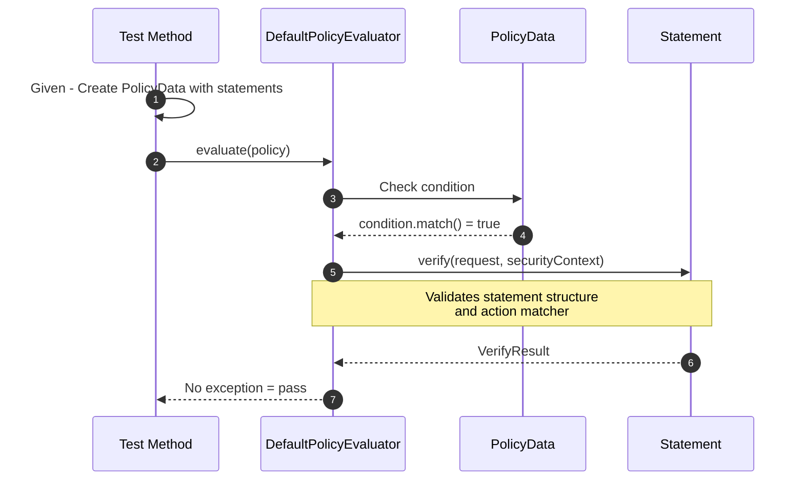
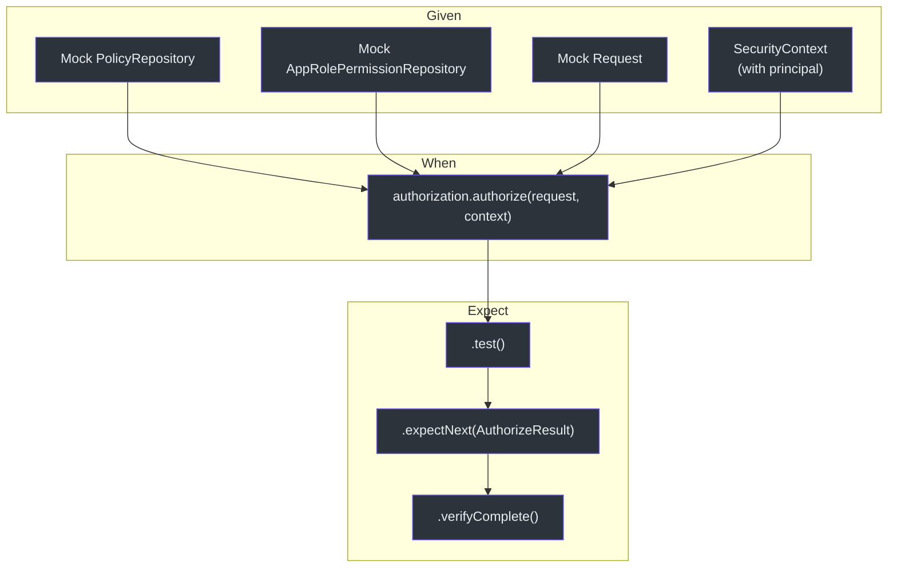
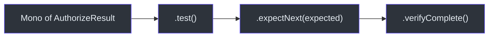

# 测试

CoSec 使用基于 JUnit 5、MockK、FluentAssert、Hamcrest 和 Reactor Test 的综合测试技术栈。测试遵循清晰的 Given-When-Expect 模式，并利用类型安全的流式断言。

## 测试技术栈

| 库 | 用途 |
|----|------|
| JUnit 5 | 测试框架（`@Test`、`@ParameterizedTest`） |
| MockK | Kotlin 原生 Mock（`mockk`、`every`） |
| FluentAssert | 流式断言（`me.ahoo.test.asserts.assert`） |
| Hamcrest | 匹配器断言（`assertThat`、`instanceOf`、`equalTo`） |
| Reactor Test | 响应式步骤验证（`.test()`、`expectNext`、`verifyComplete`） |

## 测试策略评估

### DefaultPolicyEvaluatorTest

测试策略可以无错误地评估。使用 `EvaluateRequest` 测试夹具模拟请求。



关键测试模式：

```kotlin
@Test
fun evaluateDefaultRequest() {
    var evaluateRequest: Request = EvaluateRequest()
    evaluateRequest.method.assert().isEqualTo("POST")
    evaluateRequest.remoteIp.assert().isEqualTo("127.0.0.1")
    evaluateRequest.attributes.assert().isEmpty()
}

@Test
fun safeEvaluateSwallowsTooManyRequestsException() {
    var executed = false
    DefaultPolicyEvaluator.safeEvaluate {
        executed = true
        throw TooManyRequestsException()
    }
    assertThat(executed, equalTo(true))
}
```

## 测试授权

### SimpleAuthorizationTest

使用 Mock 依赖测试完整的授权流程。使用 `reactor.kotlin.test.test()` 进行响应式验证。



### Root 用户测试

```kotlin
@Test
fun authorizeWhenPrincipalIsRoot() {
    val authorization = SimpleAuthorization(policyRepository, permissionRepository)
    val securityContext = mockk<SecurityContext> {
        every { principal.id } returns CoSecPrincipal.ROOT_ID
    }
    authorization.authorize(request, securityContext)
        .test()
        .expectNext(AuthorizeResult.ALLOW)
        .verifyComplete()
}
```

### 空策略测试

```kotlin
@Test
fun authorizeWhenPolicyIsEmpty() {
    val policyRepository = mockk<PolicyRepository> {
        every { getGlobalPolicy() } returns Mono.empty()
        every { getPolicies(any()) } returns Mono.empty()
    }
    val authorization = SimpleAuthorization(policyRepository, permissionRepository)
    authorization.authorize(request, SimpleSecurityContext.anonymous())
        .test()
        .expectNext(AuthorizeResult.IMPLICIT_DENY)
        .verifyComplete()
}
```

### 全局策略允许测试

```kotlin
@Test
fun authorizeWhenGlobalPolicyIsAllowAll() {
    val globalPolicy = mockk<Policy> {
        every { id } returns "globalPolicy"
        every { condition } returns AllConditionMatcher.INSTANCE
        every { statements } returns listOf(
            StatementData(effect = Effect.ALLOW, action = AllActionMatcher.INSTANCE)
        )
    }
    val policyRepository = mockk<PolicyRepository> {
        every { getGlobalPolicy() } returns Mono.just(listOf(globalPolicy))
        every { getPolicies(any()) } returns Mono.empty()
    }
    authorization.authorize(request, SimpleSecurityContext.anonymous())
        .test()
        .expectNext(AuthorizeResult.ALLOW)
        .verifyComplete()
}
```

## 使用 JWT 测试夹具

`JwtFixture` 对象为基于 JWT 的测试提供共享的测试算法：

```kotlin
object JwtFixture {
    var ALGORITHM = Algorithm.HMAC256("FyN0Igd80Gas8stTavArGKOYnS9uLWGA_")
}
```

此夹具在 JWT 令牌转换器和验证器测试中使用，以确保一致的签名行为。

## Reactor 测试模式

所有响应式测试遵循 `.test().expectNext().verifyComplete()` 模式：



## 运行测试

```bash
# 运行所有测试
./gradlew test

# 运行单个模块的测试
./gradlew :cosec-core:test
./gradlew :cosec-api:test

# 运行单个测试类
./gradlew :cosec-core:test --tests "me.ahoo.cosec.policy.DefaultPolicyEvaluatorTest"

# 运行单个测试方法
./gradlew :cosec-core:test --tests "me.ahoo.cosec.authorization.SimpleAuthorizationTest.authorizeWhenPrincipalIsRoot"

# 生成代码覆盖率报告
./gradlew :code-coverage-report:codeCoverageReport
```

## 参考资料

- [cosec-core/src/test/kotlin/me/ahoo/cosec/policy/DefaultPolicyEvaluatorTest.kt:35](https://github.com/Ahoo-Wang/CoSec/blob/main/cosec-core/src/test/kotlin/me/ahoo/cosec/policy/DefaultPolicyEvaluatorTest.kt#L35) -- 策略评估器测试
- [cosec-core/src/test/kotlin/me/ahoo/cosec/authorization/SimpleAuthorizationTest.kt:41](https://github.com/Ahoo-Wang/CoSec/blob/main/cosec-core/src/test/kotlin/me/ahoo/cosec/authorization/SimpleAuthorizationTest.kt#L41) -- 授权测试
- [cosec-jwt/src/test/kotlin/me/ahoo/cosec/jwt/JwtFixture.kt:18](https://github.com/Ahoo-Wang/CoSec/blob/main/cosec-jwt/src/test/kotlin/me/ahoo/cosec/jwt/JwtFixture.kt#L18) -- JWT 测试夹具
- [cosec-core/src/main/kotlin/me/ahoo/cosec/authorization/SimpleAuthorization.kt:48](https://github.com/Ahoo-Wang/CoSec/blob/main/cosec-core/src/main/kotlin/me/ahoo/cosec/authorization/SimpleAuthorization.kt#L48) -- SimpleAuthorization（被测对象）
- [cosec-core/src/main/kotlin/me/ahoo/cosec/policy/DefaultPolicyEvaluator.kt](https://github.com/Ahoo-Wang/CoSec/blob/main/cosec-core/src/main/kotlin/me/ahoo/cosec/policy/DefaultPolicyEvaluator.kt) -- 策略评估器（被测对象）

## 相关页面

- [自定义匹配器](../extending/custom-matchers.md)
- [自动配置](../extending/auto-configuration.md)
- [性能](./performance.md)
- [Spring WebFlux 集成](../integrations/spring-webflux.md)
