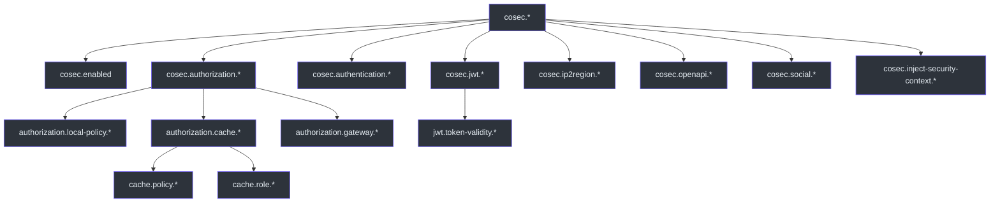
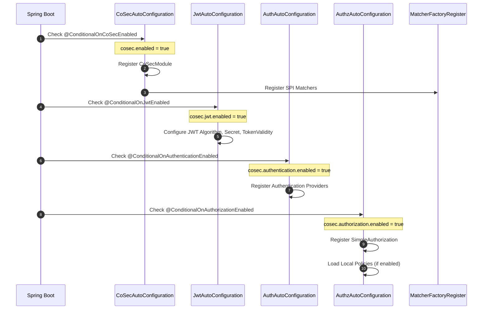
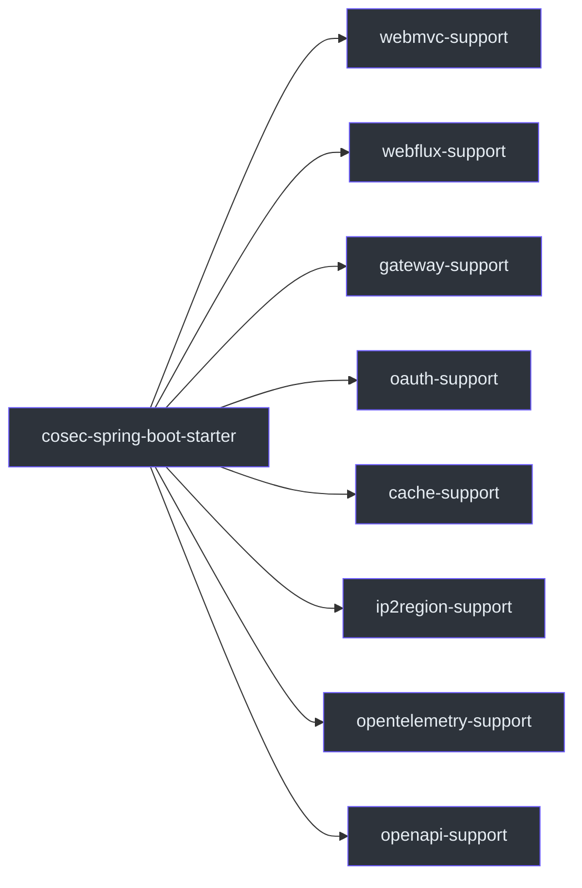

# 配置参考

CoSec 使用 Spring Boot 的 `@ConfigurationProperties` 机制实现类型安全的配置。所有属性都以 `cosec.` 为前缀，由 `CoSec.COSEC_PREFIX` 常量定义（[cosec-api/src/main/kotlin/me/ahoo/cosec/api/CoSec.kt:22](https://github.com/Ahoo-Wang/CoSec/blob/main/cosec-api/src/main/kotlin/me/ahoo/cosec/api/CoSec.kt#L22)）。

## 配置层次结构

下图展示了配置结构以及属性组之间的关系：



## 核心属性

### `cosec.enabled`

整个 CoSec 框架的主开关。设置为 `false` 时，所有自动配置将被跳过。

| 属性 | 类型 | 默认值 |
|------|------|--------|
| `cosec.enabled` | `Boolean` | `true` |

定义在 `CoSecProperties`（[cosec-spring-boot-starter/src/main/kotlin/me/ahoo/cosec/spring/boot/starter/CoSecProperties.kt:31](https://github.com/Ahoo-Wang/CoSec/blob/main/cosec-spring-boot-starter/src/main/kotlin/me/ahoo/cosec/spring/boot/starter/CoSecProperties.kt#L31)）中。

## JWT 属性（`cosec.jwt.*`）

控制 JWT 令牌的创建和验证。

| 属性 | 类型 | 默认值 | 描述 |
|------|------|--------|------|
| `cosec.jwt.enabled` | `Boolean` | `true` | 启用 JWT 认证 |
| `cosec.jwt.algorithm` | `Enum` | `hmac256` | 签名算法：`hmac256`、`hmac384`、`hmac512` |
| `cosec.jwt.secret` | `String` | *必填* | HMAC 签名的密钥 |
| `cosec.jwt.token-validity.access` | `Duration` | `PT10M` | 访问令牌有效期（10 分钟） |
| `cosec.jwt.token-validity.refresh` | `Duration` | `P7D` | 刷新令牌有效期（7 天） |

定义在 `JwtProperties`（[cosec-spring-boot-starter/src/main/kotlin/me/ahoo/cosec/spring/boot/starter/jwt/JwtProperties.kt:28](https://github.com/Ahoo-Wang/CoSec/blob/main/cosec-spring-boot-starter/src/main/kotlin/me/ahoo/cosec/spring/boot/starter/jwt/JwtProperties.kt#L28)）中。条件激活由 `@ConditionalOnJwtEnabled` 控制（[cosec-spring-boot-starter/src/main/kotlin/me/ahoo/cosec/spring/boot/starter/jwt/ConditionalOnJwtEnabled.kt](https://github.com/Ahoo-Wang/CoSec/blob/main/cosec-spring-boot-starter/src/main/kotlin/me/ahoo/cosec/spring/boot/starter/jwt/ConditionalOnJwtEnabled.kt)）。

## 认证属性（`cosec.authentication.*`）

| 属性 | 类型 | 默认值 | 描述 |
|------|------|--------|------|
| `cosec.authentication.enabled` | `Boolean` | `true` | 启用认证 |

定义在 `AuthenticationProperties`（[cosec-spring-boot-starter/src/main/kotlin/me/ahoo/cosec/spring/boot/starter/authentication/AuthenticationProperties.kt:26](https://github.com/Ahoo-Wang/CoSec/blob/main/cosec-spring-boot-starter/src/main/kotlin/me/ahoo/cosec/spring/boot/starter/authentication/AuthenticationProperties.kt#L26)）中。

## 授权属性（`cosec.authorization.*`）

控制授权引擎和策略加载行为。

| 属性 | 类型 | 默认值 | 描述 |
|------|------|--------|------|
| `cosec.authorization.enabled` | `Boolean` | `true` | 启用授权 |
| `cosec.authorization.local-policy.enabled` | `Boolean` | `false` | 从本地 JSON 文件加载策略 |
| `cosec.authorization.local-policy.locations` | `Set<String>` | `classpath:cosec-policy/*-policy.json` | 策略文件位置的 Glob 模式 |
| `cosec.authorization.local-policy.init-repository` | `Boolean` | `false` | 启动时使用本地文件初始化策略仓库 |
| `cosec.authorization.local-policy.force-refresh` | `Boolean` | `false` | 启动时强制刷新本地策略 |

定义在 `AuthorizationProperties`（[cosec-spring-boot-starter/src/main/kotlin/me/ahoo/cosec/spring/boot/starter/authorization/AuthorizationProperties.kt:27](https://github.com/Ahoo-Wang/CoSec/blob/main/cosec-spring-boot-starter/src/main/kotlin/me/ahoo/cosec/spring/boot/starter/authorization/AuthorizationProperties.kt#L27)）中。

### 授权缓存属性（`cosec.authorization.cache.*`）

通过 CoCache 控制基于 Redis 的策略和角色权限缓存。

| 属性 | 类型 | 默认值 | 描述 |
|------|------|--------|------|
| `cosec.authorization.cache.enabled` | `Boolean` | `true` | 启用缓存 |
| `cosec.authorization.cache.key-prefix` | `String` | `cosec` | Redis 键前缀 |
| `cosec.authorization.cache.policy.initialCapacity` | `Int` | *未设置* | Guava 缓存初始容量（策略缓存） |
| `cosec.authorization.cache.policy.maximumSize` | `Long` | *未设置* | Guava 缓存最大大小（策略缓存） |
| `cosec.authorization.cache.policy.expireAfterWrite` | `Long` | *未设置* | 写入后过期时间（秒）（策略缓存） |
| `cosec.authorization.cache.policy.expireAfterAccess` | `Long` | *未设置* | 访问后过期时间（秒）（策略缓存） |
| `cosec.authorization.cache.role.initialCapacity` | `Int` | *未设置* | Guava 缓存初始容量（角色缓存） |
| `cosec.authorization.cache.role.maximumSize` | `Long` | *未设置* | Guava 缓存最大大小（角色缓存） |
| `cosec.authorization.cache.role.expireAfterWrite` | `Long` | *未设置* | 写入后过期时间（秒）（角色缓存） |
| `cosec.authorization.cache.role.expireAfterAccess` | `Long` | *未设置* | 访问后过期时间（秒）（角色缓存） |

定义在 `CacheProperties`（[cosec-spring-boot-starter/src/main/kotlin/me/ahoo/cosec/spring/boot/starter/authorization/cache/CacheProperties.kt:34](https://github.com/Ahoo-Wang/CoSec/blob/main/cosec-spring-boot-starter/src/main/kotlin/me/ahoo/cosec/spring/boot/starter/authorization/cache/CacheProperties.kt#L34)）中。

### 网关属性（`cosec.authorization.gateway.*`）

| 属性 | 类型 | 默认值 | 描述 |
|------|------|--------|------|
| `cosec.authorization.gateway.enabled` | `Boolean` | `true` | 启用 Spring Cloud Gateway 集成 |

定义在 `GatewayProperties`（[cosec-spring-boot-starter/src/main/kotlin/me/ahoo/cosec/spring/boot/starter/authorization/gateway/GatewayProperties.kt:26](https://github.com/Ahoo-Wang/CoSec/blob/main/cosec-spring-boot-starter/src/main/kotlin/me/ahoo/cosec/spring/boot/starter/authorization/gateway/GatewayProperties.kt#L26)）中。

## IP2Region 属性（`cosec.ip2region.*`）

控制用于基于区域访问控制的 IP 地理定位。

| 属性 | 类型 | 默认值 | 描述 |
|------|------|--------|------|
| `cosec.ip2region.enabled` | `Boolean` | `true` | 启用 IP 地理定位 |

定义在 `Ip2RegionProperties`（[cosec-spring-boot-starter/src/main/kotlin/me/ahoo/cosec/spring/boot/starter/ip2region/Ip2RegionProperties.kt:26](https://github.com/Ahoo-Wang/CoSec/blob/main/cosec-spring-boot-starter/src/main/kotlin/me/ahoo/cosec/spring/boot/starter/ip2region/Ip2RegionProperties.kt#L26)）中。

## OpenAPI 属性（`cosec.openapi.*`）

控制 Swagger/OpenAPI 集成和策略生成端点。

| 属性 | 类型 | 默认值 | 描述 |
|------|------|--------|------|
| `cosec.openapi.enabled` | `Boolean` | `true` | 启用 OpenAPI 集成 |

定义在 `OpenAPIProperties`（[cosec-spring-boot-starter/src/main/kotlin/me/ahoo/cosec/spring/boot/starter/openapi/OpenAPIProperties.kt:26](https://github.com/Ahoo-Wang/CoSec/blob/main/cosec-spring-boot-starter/src/main/kotlin/me/ahoo/cosec/spring/boot/starter/openapi/OpenAPIProperties.kt#L26)）中。

## 自动配置激活流程

下图展示了 CoSec 自动配置如何根据属性进行激活：



## 示例 Application.yaml

```yaml
cosec:
  # 主开关
  enabled: true

  # JWT 配置
  jwt:
    enabled: true
    algorithm: hmac256           # hmac256 | hmac384 | hmac512
    secret: "my-super-secret-key-at-least-256-bits-long"
    token-validity:
      access: PT30M              # 30 分钟
      refresh: P14D              # 14 天

  # 认证
  authentication:
    enabled: true

  # 授权
  authorization:
    enabled: true
    local-policy:
      enabled: true
      locations:
        - "classpath:cosec-policy/*-policy.json"
      init-repository: true
      force-refresh: false

    # Redis 缓存
    cache:
      enabled: true
      key-prefix: "cosec"
      policy:
        maximumSize: 1000
        expireAfterWrite: 300    # 5 分钟
      role:
        maximumSize: 500
        expireAfterWrite: 300

    # Spring Cloud Gateway
    gateway:
      enabled: true

  # IP 地理定位
  ip2region:
    enabled: true

  # OpenAPI
  openapi:
    enabled: true
```

## 功能变体

`cosec-spring-boot-starter` 模块暴露 Gradle 功能变体，决定包含哪些集成模块：



| 功能变体 | 包含的模块 | 所需依赖 |
|---------|-----------|---------|
| `webmvc-support` | `cosec-webmvc` | Spring WebMvc |
| `webflux-support` | `cosec-webflux` | Spring WebFlux |
| `gateway-support` | `cosec-gateway` | Spring Cloud Gateway |
| `oauth-support` | `cosec-social` | JustAuth |
| `cache-support` | `cosec-cocache` | Spring Data Redis + CoCache |
| `ip2region-support` | `cosec-ip2region` | ip2region 库 |
| `opentelemetry-support` | `cosec-opentelemetry` | OpenTelemetry |
| `openapi-support` | `cosec-openapi` | SpringDoc OpenAPI |

功能变体在 `build.gradle.kts`（[cosec-spring-boot-starter/build.gradle.kts:18](https://github.com/Ahoo-Wang/CoSec/blob/main/cosec-spring-boot-starter/build.gradle.kts#L18)）中声明。

## 相关页面

- [CoSec 概述](./overview.md) —— 架构和核心概念
- [快速入门](./quick-start.md) —— 几分钟内让 CoSec 运行起来
- [策略编写指南](./policy-authoring.md) —— 编写 JSON 策略

## 参考资料

- [cosec-api/src/main/kotlin/me/ahoo/cosec/api/CoSec.kt](https://github.com/Ahoo-Wang/CoSec/blob/main/cosec-api/src/main/kotlin/me/ahoo/cosec/api/CoSec.kt)
- [cosec-spring-boot-starter/src/main/kotlin/me/ahoo/cosec/spring/boot/starter/CoSecProperties.kt](https://github.com/Ahoo-Wang/CoSec/blob/main/cosec-spring-boot-starter/src/main/kotlin/me/ahoo/cosec/spring/boot/starter/CoSecProperties.kt)
- [cosec-spring-boot-starter/src/main/kotlin/me/ahoo/cosec/spring/boot/starter/jwt/JwtProperties.kt](https://github.com/Ahoo-Wang/CoSec/blob/main/cosec-spring-boot-starter/src/main/kotlin/me/ahoo/cosec/spring/boot/starter/jwt/JwtProperties.kt)
- [cosec-spring-boot-starter/src/main/kotlin/me/ahoo/cosec/spring/boot/starter/authorization/AuthorizationProperties.kt](https://github.com/Ahoo-Wang/CoSec/blob/main/cosec-spring-boot-starter/src/main/kotlin/me/ahoo/cosec/spring/boot/starter/authorization/AuthorizationProperties.kt)
- [cosec-spring-boot-starter/src/main/kotlin/me/ahoo/cosec/spring/boot/starter/authorization/cache/CacheProperties.kt](https://github.com/Ahoo-Wang/CoSec/blob/main/cosec-spring-boot-starter/src/main/kotlin/me/ahoo/cosec/spring/boot/starter/authorization/cache/CacheProperties.kt)
- [cosec-spring-boot-starter/src/main/kotlin/me/ahoo/cosec/spring/boot/starter/authorization/gateway/GatewayProperties.kt](https://github.com/Ahoo-Wang/CoSec/blob/main/cosec-spring-boot-starter/src/main/kotlin/me/ahoo/cosec/spring/boot/starter/authorization/gateway/GatewayProperties.kt)
- [cosec-spring-boot-starter/src/main/kotlin/me/ahoo/cosec/spring/boot/starter/ip2region/Ip2RegionProperties.kt](https://github.com/Ahoo-Wang/CoSec/blob/main/cosec-spring-boot-starter/src/main/kotlin/me/ahoo/cosec/spring/boot/starter/ip2region/Ip2RegionProperties.kt)
- [cosec-spring-boot-starter/src/main/kotlin/me/ahoo/cosec/spring/boot/starter/openapi/OpenAPIProperties.kt](https://github.com/Ahoo-Wang/CoSec/blob/main/cosec-spring-boot-starter/src/main/kotlin/me/ahoo/cosec/spring/boot/starter/openapi/OpenAPIProperties.kt)
- [cosec-spring-boot-starter/build.gradle.kts](https://github.com/Ahoo-Wang/CoSec/blob/main/cosec-spring-boot-starter/build.gradle.kts)
- [cosec-spring-boot-starter/src/main/kotlin/me/ahoo/cosec/spring/boot/starter/authentication/AuthenticationProperties.kt](https://github.com/Ahoo-Wang/CoSec/blob/main/cosec-spring-boot-starter/src/main/kotlin/me/ahoo/cosec/spring/boot/starter/authentication/AuthenticationProperties.kt)
