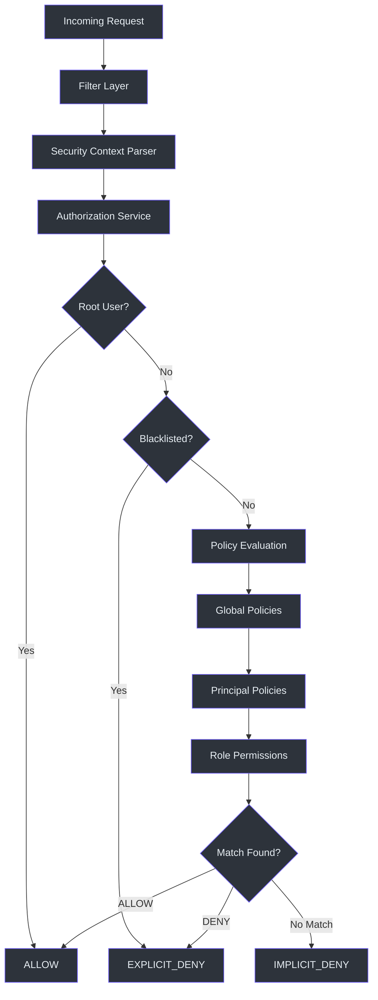
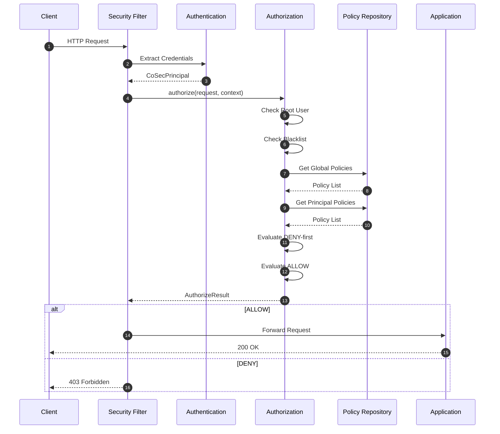
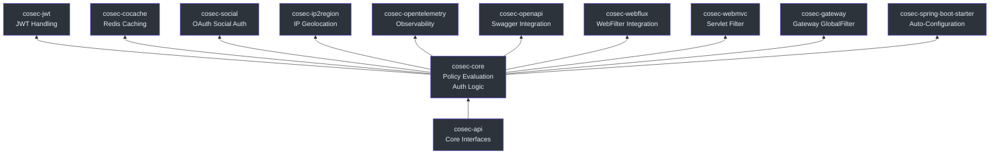

# CoSec 概述

CoSec 是一个面向 JVM 的**基于 RBAC 和策略的多租户响应式安全框架**。它将类似 AWS IAM 的策略模型引入 Java/Kotlin 生态系统，构建在 Spring Boot 4 和 Project Reactor 之上。CoSec 提供了基于声明式 JSON 的策略语言，用于细粒度授权，并原生支持多租户、响应式编程以及通过 Java SPI 实现的可扩展性。

## 为什么选择 CoSec？

现有的 JVM 安全框架（如 Spring Security 和 Apache Shiro）主要围绕基于 Servlet 的命令式编程模型设计，缺乏对云原生环境中常见的基于策略的授权模式的原生支持。

CoSec 旨在填补这一空白：

- **类似 AWS IAM 的策略模型** —— 声明式 JSON 策略，支持 DENY 优先评估、动作匹配器和条件匹配器 —— 与云服务提供商使用的心智模型一致。
- **从底层开始响应式** —— 核心接口返回 `Mono<T>`（Project Reactor）。无阻塞，无线程本地变量的 hack。
- **默认多租户** —— 租户是安全模型中的一等实体，而非事后添加。
- **SPI 可扩展** —— 通过 Java SPI 自定义动作匹配器和条件匹配器，无需修改框架代码。

## 核心特性

| 特性 | 描述 |
|------|------|
| RBAC + 策略授权 | 将基于角色的访问控制与细粒度策略评估相结合 |
| 多租户 | 租户范围的策略和主体 |
| 响应式 | 核心接口基于 Project Reactor（`Mono<T>`） |
| SPI 可扩展性 | 通过 `ActionMatcherFactory` 和 `ConditionMatcherFactory` 自定义匹配器 |
| 多种集成方式 | WebFlux、WebMvc、Spring Cloud Gateway |
| JSON 策略语言 | 声明式策略，支持路径模式、条件和速率限制 |
| JWT 认证 | 内置 JWT 令牌管理，可配置算法 |
| Redis 缓存 | 通过 CoCache 实现策略和权限缓存 |

## 架构概览

下图展示了 CoSec 的高层架构以及请求如何流经安全管道：

## 请求生命周期

每个 HTTP 请求都经过一个明确定义的安全管道。过滤层取决于集成方式（WebFlux、WebMvc 或 Gateway），但核心授权逻辑是共享的：

## 模块概览

CoSec 采用多模块 Gradle 项目组织，每个模块都有明确的职责：

| 模块 | 描述 |
|------|------|
| `cosec-api` | 核心接口 —— `CoSecPrincipal`、`Authorization`、`Authentication`、`Policy`、`Statement`。无框架依赖。 |
| `cosec-core` | 策略评估引擎、认证/授权实现、条件和动作匹配器。 |
| `cosec-jwt` | 使用 `java-jwt` 库进行 JWT 令牌创建和验证。 |
| `cosec-cocache` | 通过 CoCache 实现基于 Redis 的策略和权限缓存。 |
| `cosec-social` | 通过 JustAuth 集成 OAuth 社交登录。 |
| `cosec-ip2region` | 用于基于区域访问控制的 IP 地理定位。 |
| `cosec-opentelemetry` | 用于分布式追踪的 OpenTelemetry 集成。 |
| `cosec-openapi` | Swagger/OpenAPI 集成和策略生成端点。 |
| `cosec-webflux` | 面向 Spring WebFlux 应用的响应式 WebFilter 集成。 |
| `cosec-webmvc` | 面向 Spring WebMvc 应用的 Servlet 过滤器集成。 |
| `cosec-gateway` | 面向 Spring Cloud Gateway 的 GlobalFilter 集成。 |
| `cosec-spring-boot-starter` | 聚合所有模块的自动配置。 |
| `cosec-gateway-server` | 独立网关应用（不发布到 Maven Central）。 |

## 与替代方案的对比

| 方面 | CoSec | Spring Security | Apache Shiro |
|------|-------|-----------------|--------------|
| 授权模型 | 基于策略（类似 AWS IAM） | 过滤器链 + `@PreAuthorize` | 基于权限（`WildcardPermission`） |
| 响应式支持 | 原生（基于 `Mono`） | 5.x 中添加（`WebFlux`） | 不支持 |
| 多租户 | 一等支持（`TenantPrincipal`） | 需要自定义实现 | 需要自定义实现 |
| 策略语言 | 带条件和匹配器的 JSON | SpEL 表达式 | INI / 编程式 |
| SPI 可扩展性 | 匹配器的 Java SPI | `SecurityFilterChain` | `Realm` SPI |
| Spring Boot 集成 | `cosec-spring-boot-starter` | `spring-boot-starter-security` | `shiro-spring-boot-starter` |
| 速率限制 | 内置（`rateLimiter` 条件） | 需要单独的库 | 需要单独的库 |
| 最低 Java 版本 | 17 | 17 | 11 |

## 核心安全模型

安全模型定义在 `cosec-api` 中，遵循以下关键抽象：

- **`CoSecPrincipal`** —— 表示具有 `id`、`roles`、`policies` 和 `attributes` 的用户/代理。根用户绕过所有检查（[cosec-api/src/main/kotlin/me/ahoo/cosec/api/principal/CoSecPrincipal.kt:35](https://github.com/Ahoo-Wang/CoSec/blob/main/cosec-api/src/main/kotlin/me/ahoo/cosec/api/principal/CoSecPrincipal.kt#L35)）。
- **`Authentication<C, P>`** —— 响应式接口，验证凭证并返回 `CoSecPrincipal`（[cosec-api/src/main/kotlin/me/ahoo/cosec/api/authentication/Authentication.kt:32](https://github.com/Ahoo-Wang/CoSec/blob/main/cosec-api/src/main/kotlin/me/ahoo/cosec/api/authentication/Authentication.kt#L32)）。
- **`Authorization`** —— 响应式接口，根据 `SecurityContext` 评估请求并返回 `AuthorizeResult`（[cosec-api/src/main/kotlin/me/ahoo/cosec/api/authorization/Authorization.kt:35](https://github.com/Ahoo-Wang/CoSec/blob/main/cosec-api/src/main/kotlin/me/ahoo/cosec/api/authorization/Authorization.kt#L35)）。
- **`Policy`** —— 包含可选 `ConditionMatcher` 的 `Statement` 集合。评估顺序：检查条件，然后 DENY 优先，再 ALLOW（[cosec-api/src/main/kotlin/me/ahoo/cosec/api/policy/Policy.kt:45](https://github.com/Ahoo-Wang/CoSec/blob/main/cosec-api/src/main/kotlin/me/ahoo/cosec/api/policy/Policy.kt#L45)）。
- **`Statement`** —— 包含 `Effect`、`ActionMatcher` 和 `ConditionMatcher` 的单条权限规则（[cosec-api/src/main/kotlin/me/ahoo/cosec/api/policy/Statement.kt:37](https://github.com/Ahoo-Wang/CoSec/blob/main/cosec-api/src/main/kotlin/me/ahoo/cosec/api/policy/Statement.kt#L37)）。

## 相关页面

- [快速入门](./quick-start.md) —— 几分钟内让 CoSec 运行起来
- [配置参考](./configuration.md) —— 完整的属性参考
- [策略编写指南](./policy-authoring.md) —— 编写 JSON 策略

## 参考资料

- [cosec-api/src/main/kotlin/me/ahoo/cosec/api/principal/CoSecPrincipal.kt](https://github.com/Ahoo-Wang/CoSec/blob/main/cosec-api/src/main/kotlin/me/ahoo/cosec/api/principal/CoSecPrincipal.kt)
- [cosec-api/src/main/kotlin/me/ahoo/cosec/api/authorization/Authorization.kt](https://github.com/Ahoo-Wang/CoSec/blob/main/cosec-api/src/main/kotlin/me/ahoo/cosec/api/authorization/Authorization.kt)
- [cosec-api/src/main/kotlin/me/ahoo/cosec/api/authentication/Authentication.kt](https://github.com/Ahoo-Wang/CoSec/blob/main/cosec-api/src/main/kotlin/me/ahoo/cosec/api/authentication/Authentication.kt)
- [cosec-api/src/main/kotlin/me/ahoo/cosec/api/policy/Policy.kt](https://github.com/Ahoo-Wang/CoSec/blob/main/cosec-api/src/main/kotlin/me/ahoo/cosec/api/policy/Policy.kt)
- [cosec-api/src/main/kotlin/me/ahoo/cosec/api/policy/Statement.kt](https://github.com/Ahoo-Wang/CoSec/blob/main/cosec-api/src/main/kotlin/me/ahoo/cosec/api/policy/Statement.kt)
- [cosec-api/src/main/kotlin/me/ahoo/cosec/api/policy/Effect.kt](https://github.com/Ahoo-Wang/CoSec/blob/main/cosec-api/src/main/kotlin/me/ahoo/cosec/api/policy/Effect.kt)
- [cosec-core/src/main/kotlin/me/ahoo/cosec/authorization/SimpleAuthorization.kt](https://github.com/Ahoo-Wang/CoSec/blob/main/cosec-core/src/main/kotlin/me/ahoo/cosec/authorization/SimpleAuthorization.kt)
- [cosec-webflux/src/main/kotlin/me/ahoo/cosec/webflux/ReactiveAuthorizationFilter.kt](https://github.com/Ahoo-Wang/CoSec/blob/main/cosec-webflux/src/main/kotlin/me/ahoo/cosec/webflux/ReactiveAuthorizationFilter.kt)
- [cosec-gateway/src/main/kotlin/me/ahoo/cosec/gateway/AuthorizationGatewayFilter.kt](https://github.com/Ahoo-Wang/CoSec/blob/main/cosec-gateway/src/main/kotlin/me/ahoo/cosec/gateway/AuthorizationGatewayFilter.kt)
- [settings.gradle.kts](https://github.com/Ahoo-Wang/CoSec/blob/main/settings.gradle.kts)
