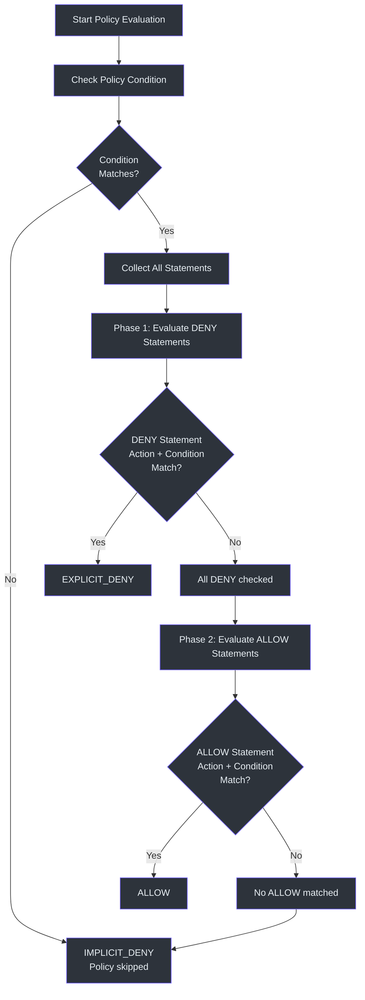
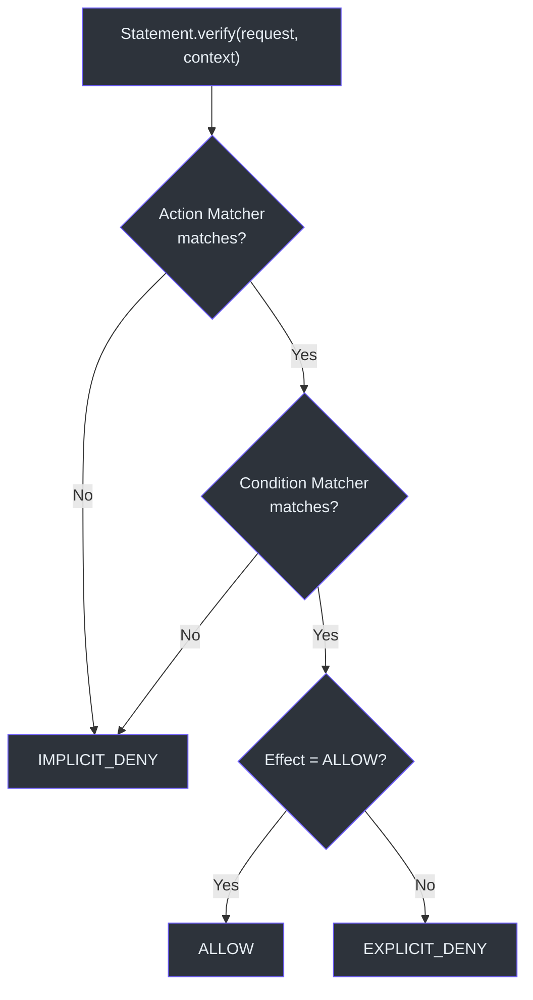
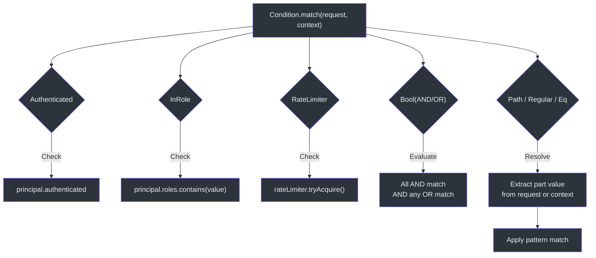

# 策略编写指南

CoSec 策略是使用类似 AWS IAM 模型定义访问控制规则的 JSON 文档。本指南涵盖策略结构、可用匹配器以及常见授权模式的实用示例。

## 策略结构

每个策略都是一个 JSON 对象，具有以下字段，根据 [schema/cosec-policy.schema.json](https://github.com/Ahoo-Wang/CoSec/blob/main/schema/cosec-policy.schema.json) 中的 schema 进行验证：

```json
{
  "id": "my-policy-id",
  "name": "Human-Readable Name",
  "category": "grouping-category",
  "description": "What this policy controls",
  "type": "global",
  "tenantId": "(platform)",
  "condition": { },
  "statements": [ ]
}
```

| 字段 | 必填 | 类型 | 描述 |
|------|------|------|------|
| `id` | 否 | `String` | 策略唯一标识符 |
| `name` | 是 | `String` | 人类可读的策略名称 |
| `category` | 是 | `String` | 分组类别（如 `"admin"`、`"user"`） |
| `description` | 是 | `String` | 策略控制的内容描述 |
| `type` | 是 | `Enum` | `"global"`、`"system"` 或 `"custom"` |
| `tenantId` | 是 | `String` | 策略所属的租户 |
| `condition` | 否 | `Object` | 整个策略应用前必须满足的条件 |
| `statements` | 是 | `Array` | 权限语句列表 |

策略类型枚举定义在 `PolicyType`（[cosec-api/src/main/kotlin/me/ahoo/cosec/api/policy/PolicyType.kt:25](https://github.com/Ahoo-Wang/CoSec/blob/main/cosec-api/src/main/kotlin/me/ahoo/cosec/api/policy/PolicyType.kt#L25)）中：
- **`global`** —— 适用于所有应用的策略
- **`system`** —— 平台管理的策略；用户无法删除
- **`custom`** —— 用户自定义策略

## 语句结构

每条语句定义一个单独的权限规则：

```json
{
  "name": "StatementName",
  "effect": "allow",
  "action": { },
  "condition": { }
}
```

| 字段 | 必填 | 类型 | 默认值 | 描述 |
|------|------|------|--------|------|
| `name` | 否 | `String` | *未命名* | 此语句的标识符 |
| `effect` | 否 | `String` | `"allow"` | `"allow"` 或 `"deny"` |
| `action` | 是 | `Object/String/Array` | *必填* | 此语句适用的请求 |
| `condition` | 否 | `Object` | *始终匹配* | 此语句的附加条件 |

`Effect` 枚举（[cosec-api/src/main/kotlin/me/ahoo/cosec/api/policy/Effect.kt:28](https://github.com/Ahoo-Wang/CoSec/blob/main/cosec-api/src/main/kotlin/me/ahoo/cosec/api/policy/Effect.kt#L28)）决定语句匹配时的结果。

## 策略评估顺序

CoSec 使用 DENY 优先的评估策略。在评估策略内或跨策略的语句时，DENY 语句在 ALLOW 语句之前检查：



此逻辑在 `Policy.verify` 方法（[cosec-api/src/main/kotlin/me/ahoo/cosec/api/policy/Policy.kt:76](https://github.com/Ahoo-Wang/CoSec/blob/main/cosec-api/src/main/kotlin/me/ahoo/cosec/api/policy/Policy.kt#L76)）和 `SimpleAuthorization.evaluateDenyFirst`（[cosec-core/src/main/kotlin/me/ahoo/cosec/authorization/SimpleAuthorization.kt:61](https://github.com/Ahoo-Wang/CoSec/blob/main/cosec-core/src/main/kotlin/me/ahoo/cosec/authorization/SimpleAuthorization.kt#L61)）中实现。

## 语句匹配流程

每条语句通过先检查动作匹配器，再检查条件匹配器来进行验证：



此逻辑在 `Statement.verify`（[cosec-api/src/main/kotlin/me/ahoo/cosec/api/policy/Statement.kt:60](https://github.com/Ahoo-Wang/CoSec/blob/main/cosec-api/src/main/kotlin/me/ahoo/cosec/api/policy/Statement.kt#L60)）中实现。

## 动作匹配器

动作匹配器决定语句适用于哪些 HTTP 请求。`ActionMatcher` 接口定义在（[cosec-api/src/main/kotlin/me/ahoo/cosec/api/policy/ActionMatcher.kt:31](https://github.com/Ahoo-Wang/CoSec/blob/main/cosec-api/src/main/kotlin/me/ahoo/cosec/api/policy/ActionMatcher.kt#L31)）。

### 路径匹配器（`path`）

最常用的动作匹配器。使用 Spring `PathPattern` 语法进行 URL 匹配。工厂类是 `PathActionMatcherFactory`（[cosec-core/src/main/kotlin/me/ahoo/cosec/policy/action/PathActionMatcher.kt:82](https://github.com/Ahoo-Wang/CoSec/blob/main/cosec-core/src/main/kotlin/me/ahoo/cosec/policy/action/PathActionMatcher.kt#L82)）。

**字符串简写** —— 匹配单个路径模式：

```json
{
  "action": "/api/users/{id}"
}
```

**数组简写** —— 匹配多个路径模式（隐式组合）：

```json
{
  "action": [
    "/auth/login",
    "/auth/register",
    "/auth/refresh"
  ]
}
```

**带方法过滤的对象形式** —— 限制为特定 HTTP 方法：

```json
{
  "action": {
    "path": {
      "method": "GET",
      "pattern": "/api/users/{id}"
    }
  }
}
```

**多个方法和模式**：

```json
{
  "action": {
    "path": {
      "method": ["GET", "POST"],
      "pattern": [
        "/api/users/#{principal.id}/*",
        "/api/users/#{principal.id}/orders/*"
      ],
      "options": {
        "caseSensitive": false,
        "separator": "/",
        "decodeAndParseSegments": false
      }
    }
  }
}
```

### 全部匹配器（`all`）

匹配所有请求，无论路径或方法：

```json
{
  "action": {
    "all": {
      "method": "GET"
    }
  }
}
```

通配符字符串 `"*"` 也匹配所有动作：

```json
{
  "action": "*"
}
```

### 组合匹配器（`composite`）

使用 OR 逻辑组合多个动作匹配器：

```json
{
  "action": {
    "composite": [
      "/api/users/#{principal.id}/*",
      {
        "path": {
          "method": "POST",
          "pattern": ["/api/orders/*"]
        }
      }
    ]
  }
}
```

## 条件匹配器

条件匹配器在动作匹配之外添加约束。`ConditionMatcher` 接口（[cosec-api/src/main/kotlin/me/ahoo/cosec/api/policy/ConditionMatcher.kt:29](https://github.com/Ahoo-Wang/CoSec/blob/main/cosec-api/src/main/kotlin/me/ahoo/cosec/api/policy/ConditionMatcher.kt#L29)）是所有条件的基础。

### 已认证条件

检查用户是否已认证（非匿名）。定义在 `AuthenticatedConditionMatcher`（[cosec-core/src/main/kotlin/me/ahoo/cosec/policy/condition/context/AuthenticatedConditionMatcher.kt:23](https://github.com/Ahoo-Wang/CoSec/blob/main/cosec-core/src/main/kotlin/me/ahoo/cosec/policy/condition/context/AuthenticatedConditionMatcher.kt#L23)）中。

```json
{
  "condition": {
    "authenticated": {}
  }
}
```

### 角色条件

检查主体是否具有特定角色。定义在 `InRoleConditionMatcher`（[cosec-core/src/main/kotlin/me/ahoo/cosec/policy/condition/context/InRoleConditionMatcher.kt:23](https://github.com/Ahoo-Wang/CoSec/blob/main/cosec-core/src/main/kotlin/me/ahoo/cosec/policy/condition/context/InRoleConditionMatcher.kt#L23)）中。

```json
{
  "condition": {
    "inRole": {
      "value": "admin"
    }
  }
}
```

### 租户条件

检查主体是否属于特定租户。定义在 `InTenantConditionMatcher`（[cosec-core/src/main/kotlin/me/ahoo/cosec/policy/condition/context/InTenantConditionMatcher.kt](https://github.com/Ahoo-Wang/CoSec/blob/main/cosec-core/src/main/kotlin/me/ahoo/cosec/policy/condition/context/InTenantConditionMatcher.kt)）中。

```json
{
  "condition": {
    "inTenant": {
      "value": "tenant-123"
    }
  }
}
```

### 速率限制条件

对请求应用速率限制。超过限制时抛出 `TooManyRequestsException`，导致拒绝。定义在 `RateLimiterConditionMatcher`（[cosec-core/src/main/kotlin/me/ahoo/cosec/policy/condition/limiter/RateLimiterConditionMatcher.kt:34](https://github.com/Ahoo-Wang/CoSec/blob/main/cosec-core/src/main/kotlin/me/ahoo/cosec/policy/condition/limiter/RateLimiterConditionMatcher.kt#L34)）中。

```json
{
  "condition": {
    "rateLimiter": {
      "permitsPerSecond": 100
    }
  }
}
```

### 路径条件

将路径模式与请求属性（如 `request.remoteIp`）进行匹配。使用 `PathPattern` 语法，可配置分隔符。定义在 `PathConditionMatcher`（[cosec-core/src/main/kotlin/me/ahoo/cosec/policy/condition/part/PathConditionMatcher.kt:24](https://github.com/Ahoo-Wang/CoSec/blob/main/cosec-core/src/main/kotlin/me/ahoo/cosec/policy/condition/part/PathConditionMatcher.kt#L24)）中。

```json
{
  "condition": {
    "path": {
      "part": "request.remoteIp",
      "pattern": "192.168.0.*",
      "options": {
        "caseSensitive": false,
        "separator": ".",
        "decodeAndParseSegments": false
      }
    }
  }
}
```

### 正则表达式条件

将正则表达式与请求或上下文属性进行匹配。支持 `negate` 用于白名单模式。定义在 `RegularConditionMatcher`（[cosec-core/src/main/kotlin/me/ahoo/cosec/policy/condition/part/RegularConditionMatcher.kt](https://github.com/Ahoo-Wang/CoSec/blob/main/cosec-core/src/main/kotlin/me/ahoo/cosec/policy/condition/part/RegularConditionMatcher.kt)）中。

```json
{
  "condition": {
    "regular": {
      "part": "request.origin",
      "pattern": "^(http|https)://github.com"
    }
  }
}
```

带否定（阻止所有不匹配该模式的来源）：

```json
{
  "condition": {
    "regular": {
      "negate": true,
      "part": "request.origin",
      "pattern": "^(http|https)://github.com"
    }
  }
}
```

### 布尔条件（AND/OR）

使用布尔逻辑组合多个条件。定义在 `BoolConditionMatcher`（[cosec-core/src/main/kotlin/me/ahoo/cosec/policy/condition/BoolConditionMatcher.kt:35](https://github.com/Ahoo-Wang/CoSec/blob/main/cosec-core/src/main/kotlin/me/ahoo/cosec/policy/condition/BoolConditionMatcher.kt#L35)）中。

```json
{
  "condition": {
    "bool": {
      "and": [
        { "authenticated": {} }
      ],
      "or": [
        {
          "in": {
            "part": "context.principal.id",
            "value": ["developerId"]
          }
        },
        {
          "path": {
            "part": "request.remoteIp",
            "pattern": "192.168.0.*"
          }
        }
      ]
    }
  }
}
```

### 其他部分条件

| 匹配器 | 键 | 描述 |
|--------|-----|------|
| 等于 | `eq` | 部分值的精确字符串匹配 |
| 包含 | `contains` | 子串匹配 |
| 开头匹配 | `startsWith` | 前缀匹配 |
| 结尾匹配 | `endsWith` | 后缀匹配 |
| 包含于 | `in` | 值在列表中 |

```json
{
  "condition": {
    "eq": {
      "part": "request.path.var.id",
      "value": "#{principal.id}"
    }
  }
}
```

```json
{
  "condition": {
    "in": {
      "part": "context.principal.id",
      "value": ["admin-1", "admin-2", "admin-3"]
    }
  }
}
```

## 条件匹配器评估



## 完整策略示例

### 匿名访问

允许未认证的用户访问公开端点（认证和健康检查）：

```json
{
  "id": "anonymous-access",
  "name": "Anonymous Access",
  "category": "access",
  "description": "Allow anonymous access to auth endpoints and health checks",
  "type": "global",
  "tenantId": "(platform)",
  "statements": [
    {
      "name": "AuthEndpoints",
      "action": [
        "/auth/login",
        "/auth/register",
        "/auth/refresh"
      ]
    },
    {
      "name": "HealthCheck",
      "action": [
        "/actuator/health",
        "/actuator/health/readiness",
        "/actuator/health/liveness"
      ]
    }
  ]
}
```

这与网关服务器中的健康探测策略模式相同（[cosec-gateway-server/src/main/resources/cosec-policy/health-probe-policy.json](https://github.com/Ahoo-Wang/CoSec/blob/main/cosec-gateway-server/src/main/resources/cosec-policy/health-probe-policy.json)）。没有 `effect` 字段的语句默认为 `"allow"`。

### 用户范围访问

允许已认证用户仅访问自己的资源：

```json
{
  "id": "user-scope",
  "name": "User Scope Access",
  "category": "access",
  "description": "Allow users to access their own resources",
  "type": "global",
  "tenantId": "(platform)",
  "statements": [
    {
      "name": "OwnResources",
      "action": "/api/users/#{principal.id}/*",
      "condition": {
        "authenticated": {}
      }
    }
  ]
}
```

`#{principal.id}` SpEL 模板表达式在评估时根据安全上下文进行解析，允许按用户的路径模式。

### IP 黑名单

拒绝来自特定 IP 范围的请求：

```json
{
  "id": "ip-blacklist",
  "name": "IP Blacklist",
  "category": "security",
  "description": "Block requests from blacklisted IP ranges",
  "type": "global",
  "tenantId": "(platform)",
  "statements": [
    {
      "name": "IpBlacklist",
      "effect": "deny",
      "action": "*",
      "condition": {
        "path": {
          "part": "request.remoteIp",
          "pattern": "192.168.0.*",
          "options": {
            "caseSensitive": false,
            "separator": ".",
            "decodeAndParseSegments": false
          }
        }
      }
    }
  ]
}
```

`path` 条件匹配器使用点分隔符将 IP 地址作为路径模式进行匹配。

### 速率限制

限制请求速率并附带认证检查：

```json
{
  "id": "rate-limited-access",
  "name": "Rate Limited Access",
  "category": "access",
  "description": "Allow authenticated access with rate limiting",
  "type": "global",
  "tenantId": "(platform)",
  "condition": {
    "bool": {
      "and": [
        { "authenticated": {} }
      ],
      "or": [
        {
          "rateLimiter": {
            "permitsPerSecond": 10
          }
        }
      ]
    }
  },
  "statements": [
    {
      "name": "AllEndpoints",
      "action": "/api/*"
    }
  ]
}
```

速率限制使用 Guava 的 `RateLimiter`，如 `RateLimiterConditionMatcher`（[cosec-core/src/main/kotlin/me/ahoo/cosec/policy/condition/limiter/RateLimiterConditionMatcher.kt:34](https://github.com/Ahoo-Wang/CoSec/blob/main/cosec-core/src/main/kotlin/me/ahoo/cosec/policy/condition/limiter/RateLimiterConditionMatcher.kt#L34)）所示。超过限制时，会抛出 `TooManyRequestsException`。

### 基于角色的访问

仅允许具有 `admin` 角色的用户访问管理端点：

```json
{
  "id": "admin-access",
  "name": "Admin Access",
  "category": "access",
  "description": "Allow admin role access to admin endpoints",
  "type": "system",
  "tenantId": "(platform)",
  "statements": [
    {
      "name": "AdminEndpoints",
      "action": [
        "/api/admin/*",
        "/api/system/*"
      ],
      "condition": {
        "inRole": {
          "value": "admin"
        }
      }
    },
    {
      "name": "DeveloperOverride",
      "action": "*",
      "condition": {
        "in": {
          "part": "context.principal.id",
          "value": ["developerId"]
        }
      }
    }
  ]
}
```

## SpEL 模板表达式

动作模式和条件值支持使用 `#{expression}` 语法的 SpEL 模板表达式。常用变量：

| 表达式 | 描述 |
|--------|------|
| `#{principal.id}` | 当前用户的 ID |
| `#{principal.tenantId}` | 当前用户的租户 ID |
| `#{request.path.var.variableName}` | 从动作模式中提取的路径变量 |

## SPI：自定义匹配器

CoSec 使用 Java SPI 实现可扩展的匹配器。要添加自定义匹配器：

1. 实现工厂接口（`ActionMatcherFactory` 或 `ConditionMatcherFactory`）
2. 在 `META-INF/services/` 中注册

`ActionMatcherFactory` 示例：

```kotlin
class MyCustomActionMatcherFactory : ActionMatcherFactory {
    companion object {
        const val TYPE = "myCustom"
    }
    override val type: String = TYPE
    override fun create(configuration: Configuration): ActionMatcher {
        return MyCustomActionMatcher(configuration)
    }
}
```

在 `META-INF/services/me.ahoo.cosec.policy.action.ActionMatcherFactory` 中注册：

```
com.example.MyCustomActionMatcherFactory
```

## 相关页面

- [CoSec 概述](./overview.md) —— 架构和核心概念
- [快速入门](./quick-start.md) —— 几分钟内让 CoSec 运行起来
- [配置参考](./configuration.md) —— 所有属性及其默认值

## 参考资料

- [schema/cosec-policy.schema.json](https://github.com/Ahoo-Wang/CoSec/blob/main/schema/cosec-policy.schema.json)
- [cosec-api/src/main/kotlin/me/ahoo/cosec/api/policy/Policy.kt](https://github.com/Ahoo-Wang/CoSec/blob/main/cosec-api/src/main/kotlin/me/ahoo/cosec/api/policy/Policy.kt)
- [cosec-api/src/main/kotlin/me/ahoo/cosec/api/policy/Statement.kt](https://github.com/Ahoo-Wang/CoSec/blob/main/cosec-api/src/main/kotlin/me/ahoo/cosec/api/policy/Statement.kt)
- [cosec-api/src/main/kotlin/me/ahoo/cosec/api/policy/Effect.kt](https://github.com/Ahoo-Wang/CoSec/blob/main/cosec-api/src/main/kotlin/me/ahoo/cosec/api/policy/Effect.kt)
- [cosec-api/src/main/kotlin/me/ahoo/cosec/api/policy/PolicyType.kt](https://github.com/Ahoo-Wang/CoSec/blob/main/cosec-api/src/main/kotlin/me/ahoo/cosec/api/policy/PolicyType.kt)
- [cosec-core/src/main/kotlin/me/ahoo/cosec/authorization/SimpleAuthorization.kt](https://github.com/Ahoo-Wang/CoSec/blob/main/cosec-core/src/main/kotlin/me/ahoo/cosec/authorization/SimpleAuthorization.kt)
- [cosec-core/src/main/kotlin/me/ahoo/cosec/policy/action/PathActionMatcher.kt](https://github.com/Ahoo-Wang/CoSec/blob/main/cosec-core/src/main/kotlin/me/ahoo/cosec/policy/action/PathActionMatcher.kt)
- [cosec-core/src/main/kotlin/me/ahoo/cosec/policy/condition/BoolConditionMatcher.kt](https://github.com/Ahoo-Wang/CoSec/blob/main/cosec-core/src/main/kotlin/me/ahoo/cosec/policy/condition/BoolConditionMatcher.kt)
- [cosec-core/src/main/kotlin/me/ahoo/cosec/policy/condition/context/AuthenticatedConditionMatcher.kt](https://github.com/Ahoo-Wang/CoSec/blob/main/cosec-core/src/main/kotlin/me/ahoo/cosec/policy/condition/context/AuthenticatedConditionMatcher.kt)
- [cosec-core/src/main/kotlin/me/ahoo/cosec/policy/condition/context/InRoleConditionMatcher.kt](https://github.com/Ahoo-Wang/CoSec/blob/main/cosec-core/src/main/kotlin/me/ahoo/cosec/policy/condition/context/InRoleConditionMatcher.kt)
- [cosec-core/src/main/kotlin/me/ahoo/cosec/policy/condition/limiter/RateLimiterConditionMatcher.kt](https://github.com/Ahoo-Wang/CoSec/blob/main/cosec-core/src/main/kotlin/me/ahoo/cosec/policy/condition/limiter/RateLimiterConditionMatcher.kt)
- [cosec-core/src/main/kotlin/me/ahoo/cosec/policy/condition/part/PathConditionMatcher.kt](https://github.com/Ahoo-Wang/CoSec/blob/main/cosec-core/src/main/kotlin/me/ahoo/cosec/policy/condition/part/PathConditionMatcher.kt)
- [cosec-core/src/test/resources/cosec-policy/test-policy.json](https://github.com/Ahoo-Wang/CoSec/blob/main/cosec-core/src/test/resources/cosec-policy/test-policy.json)
- [cosec-gateway-server/src/main/resources/cosec-policy/health-probe-policy.json](https://github.com/Ahoo-Wang/CoSec/blob/main/cosec-gateway-server/src/main/resources/cosec-policy/health-probe-policy.json)
