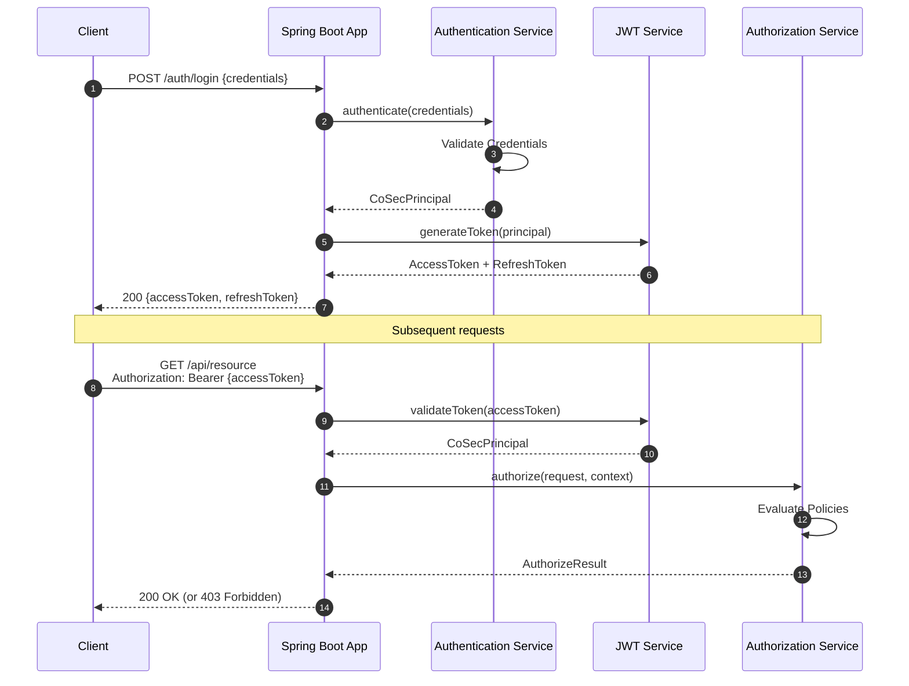
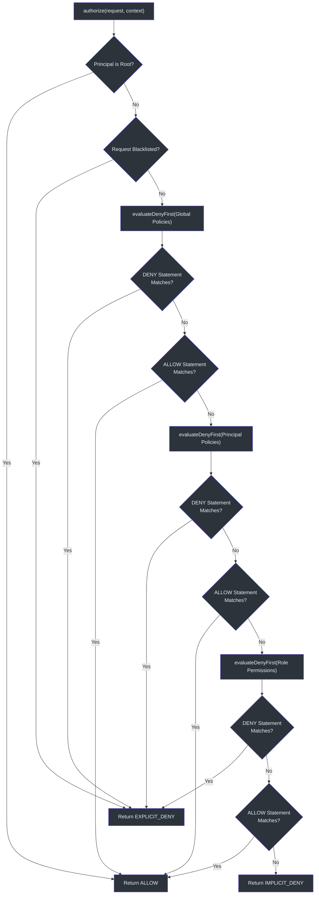

# 快速入门

本指南将引导你将 CoSec 添加到 Spring Boot 应用中，配置 JWT 认证，创建第一个策略，并使用 curl 验证访问控制。

## 前提条件

- Java 17+
- Kotlin 2.x 或 Java 17 项目
- Spring Boot 4.x
- Gradle（推荐 Kotlin DSL）

## 第 1 步：添加依赖

在 `build.gradle.kts` 中添加 CoSec Spring Boot starter：

```kotlin
dependencies {
    implementation("me.ahoo.cosec:cosec-spring-boot-starter")
}
```

该 starter 会传递性地引入 `cosec-core`、`cosec-api` 和 `cosec-jwt`。其他集成模块（WebFlux、Gateway、缓存）作为 Gradle 功能变体提供：

```kotlin
dependencies {
    implementation("me.ahoo.cosec:cosec-spring-boot-starter") {
        capabilities {
            requireCapability("me.ahoo.cosec:cosec-spring-boot-starter:webflux-support")
        }
    }
    // 或者用于 Gateway：
    // requireCapability("me.ahoo.cosec:cosec-spring-boot-starter:gateway-support")
    // 或者用于缓存（Redis）：
    // requireCapability("me.ahoo.cosec:cosec-spring-boot-starter:cache-support")
}
```

Starter 会根据检测到的依赖自动配置安全组件。自动配置由 `@ConditionalOnCoSecEnabled` 控制（[cosec-spring-boot-starter/src/main/kotlin/me/ahoo/cosec/spring/boot/starter/ConditionalOnCoSecEnabled.kt](https://github.com/Ahoo-Wang/CoSec/blob/main/cosec-spring-boot-starter/src/main/kotlin/me/ahoo/cosec/spring/boot/starter/ConditionalOnCoSecEnabled.kt)）。

## 第 2 步：配置应用属性

创建或编辑 `application.yaml`：

```yaml
cosec:
  enabled: true
  jwt:
    algorithm: hmac256
    secret: "your-256-bit-secret-key-here-change-me"
    token-validity:
      access: PT10M     # 10 分钟
      refresh: P7D      # 7 天
  authorization:
    enabled: true
    local-policy:
      enabled: true
      locations:
        - "classpath:cosec-policy/*-policy.json"
```

| 属性 | 类型 | 默认值 | 描述 |
|------|------|--------|------|
| `cosec.enabled` | `Boolean` | `true` | CoSec 的主开关 |
| `cosec.jwt.algorithm` | `Enum` | `hmac256` | JWT 签名算法（`hmac256`、`hmac384`、`hmac512`） |
| `cosec.jwt.secret` | `String` | *必填* | JWT 签名的密钥 |
| `cosec.jwt.token-validity.access` | `Duration` | `PT10M` | 访问令牌 TTL |
| `cosec.jwt.token-validity.refresh` | `Duration` | `P7D` | 刷新令牌 TTL |
| `cosec.authorization.enabled` | `Boolean` | `true` | 启用授权 |
| `cosec.authorization.local-policy.enabled` | `Boolean` | `false` | 从本地 JSON 文件加载策略 |
| `cosec.authorization.local-policy.locations` | `Set<String>` | `classpath:cosec-policy/*-policy.json` | 策略文件的 Glob 模式 |

JWT 属性定义在 `JwtProperties`（[cosec-spring-boot-starter/src/main/kotlin/me/ahoo/cosec/spring/boot/starter/jwt/JwtProperties.kt:28](https://github.com/Ahoo-Wang/CoSec/blob/main/cosec-spring-boot-starter/src/main/kotlin/me/ahoo/cosec/spring/boot/starter/jwt/JwtProperties.kt#L28)）中，授权属性定义在 `AuthorizationProperties`（[cosec-spring-boot-starter/src/main/kotlin/me/ahoo/cosec/spring/boot/starter/authorization/AuthorizationProperties.kt:27](https://github.com/Ahoo-Wang/CoSec/blob/main/cosec-spring-boot-starter/src/main/kotlin/me/ahoo/cosec/spring/boot/starter/authorization/AuthorizationProperties.kt#L27)）中。

## 第 3 步：创建第一个策略

在 `src/main/resources/cosec-policy/anonymous-access-policy.json` 创建文件：

```json
{
  "id": "anonymous-access",
  "name": "Anonymous Access",
  "category": "access",
  "description": "Allow anonymous access to auth endpoints and health checks",
  "type": "global",
  "tenantId": "(platform)",
  "statements": [
    {
      "name": "AuthEndpoints",
      "action": [
        "/auth/login",
        "/auth/register",
        "/auth/refresh"
      ]
    },
    {
      "name": "HealthCheck",
      "action": [
        "/actuator/health",
        "/actuator/health/readiness",
        "/actuator/health/liveness"
      ]
    }
  ]
}
```

此策略使用默认的 ALLOW 效果（没有 `effect` 字段时默认为 `"allow"`），并按路径模式匹配请求。没有 `condition` 的语句适用于所有请求，包括匿名请求。

策略 JSON 格式遵循 [schema/cosec-policy.schema.json](https://github.com/Ahoo-Wang/CoSec/blob/main/schema/cosec-policy.schema.json) 中的 schema。

## 第 4 步：启动应用

```bash
./gradlew bootRun
```

启动时，CoSec 将：

1. 自动配置安全过滤器链
2. 从配置的位置加载本地策略文件
3. 通过 SPI 注册 `ActionMatcherFactory` 和 `ConditionMatcherFactory` 实现
4. 使用配置的算法和密钥初始化 JWT 令牌服务

自动配置入口点是 `CoSecAutoConfiguration`（[cosec-spring-boot-starter/src/main/kotlin/me/ahoo/cosec/spring/boot/starter/CoSecAutoConfiguration.kt:37](https://github.com/Ahoo-Wang/CoSec/blob/main/cosec-spring-boot-starter/src/main/kotlin/me/ahoo/cosec/spring/boot/starter/CoSecAutoConfiguration.kt#L37)）。

## 第 5 步：使用 curl 测试

**访问公开端点（策略允许）：**

```bash
curl -v http://localhost:8080/actuator/health
# 预期结果：200 OK
```

**在没有令牌的情况下访问受保护端点：**

```bash
curl -v http://localhost:8080/api/users
# 预期结果：401 Unauthorized（无凭证）
# 或 403 Forbidden（匿名用户，没有匹配的 ALLOW 策略）
```

## 认证流程

当客户端进行认证时，将发生以下序列：



`Authentication` 接口对凭证类型 `C` 和主体类型 `P` 进行了泛型化（[cosec-api/src/main/kotlin/me/ahoo/cosec/api/authentication/Authentication.kt:32](https://github.com/Ahoo-Wang/CoSec/blob/main/cosec-api/src/main/kotlin/me/ahoo/cosec/api/authentication/Authentication.kt#L32)）：

```kotlin
interface Authentication<C : Credentials, out P : CoSecPrincipal> {
    val supportCredentials: Class<C>
    fun authenticate(credentials: C): Mono<out P>
}
```

## 创建自定义认证（Kotlin）

要添加自定义认证机制，需实现 `Authentication` 接口：

```kotlin
@Component
class UsernamePasswordAuthentication(
    private val userRepository: UserRepository
) : Authentication<UsernamePasswordCredentials, TenantPrincipal> {

    override val supportCredentials = UsernamePasswordCredentials::class.java

    override fun authenticate(
        credentials: UsernamePasswordCredentials
    ): Mono<TenantPrincipal> {
        return userRepository.findByUsername(credentials.username)
            .filter { passwordEncoder.matches(credentials.password, it.hashedPassword) }
            .map { user ->
                SimpleTenantPrincipal(
                    id = user.id,
                    roles = user.roles,
                    policies = user.policies,
                    tenantId = user.tenantId
                )
            }
    }
}
```

## 项目结构

按照本指南操作后，你的项目结构应如下所示：

```
src/main/
  resources/
    application.yaml
    cosec-policy/
      anonymous-access-policy.json
```

## 授权评估顺序

设计策略时，理解评估顺序至关重要：



此逻辑在 `SimpleAuthorization`（[cosec-core/src/main/kotlin/me/ahoo/cosec/authorization/SimpleAuthorization.kt:48](https://github.com/Ahoo-Wang/CoSec/blob/main/cosec-core/src/main/kotlin/me/ahoo/cosec/authorization/SimpleAuthorization.kt#L48)）中实现。DENY 优先的方法确保显式拒绝始终优先于任何允许。

## 相关页面

- [CoSec 概述](./overview.md) —— 架构和核心概念
- [配置参考](./configuration.md) —— 所有属性及其默认值
- [策略编写指南](./policy-authoring.md) —— 编写 JSON 策略

## 参考资料

- [cosec-spring-boot-starter/build.gradle.kts](https://github.com/Ahoo-Wang/CoSec/blob/main/cosec-spring-boot-starter/build.gradle.kts)
- [cosec-spring-boot-starter/src/main/kotlin/me/ahoo/cosec/spring/boot/starter/CoSecAutoConfiguration.kt](https://github.com/Ahoo-Wang/CoSec/blob/main/cosec-spring-boot-starter/src/main/kotlin/me/ahoo/cosec/spring/boot/starter/CoSecAutoConfiguration.kt)
- [cosec-spring-boot-starter/src/main/kotlin/me/ahoo/cosec/spring/boot/starter/CoSecProperties.kt](https://github.com/Ahoo-Wang/CoSec/blob/main/cosec-spring-boot-starter/src/main/kotlin/me/ahoo/cosec/spring/boot/starter/CoSecProperties.kt)
- [cosec-spring-boot-starter/src/main/kotlin/me/ahoo/cosec/spring/boot/starter/jwt/JwtProperties.kt](https://github.com/Ahoo-Wang/CoSec/blob/main/cosec-spring-boot-starter/src/main/kotlin/me/ahoo/cosec/spring/boot/starter/jwt/JwtProperties.kt)
- [cosec-spring-boot-starter/src/main/kotlin/me/ahoo/cosec/spring/boot/starter/authorization/AuthorizationProperties.kt](https://github.com/Ahoo-Wang/CoSec/blob/main/cosec-spring-boot-starter/src/main/kotlin/me/ahoo/cosec/spring/boot/starter/authorization/AuthorizationProperties.kt)
- [cosec-api/src/main/kotlin/me/ahoo/cosec/api/authentication/Authentication.kt](https://github.com/Ahoo-Wang/CoSec/blob/main/cosec-api/src/main/kotlin/me/ahoo/cosec/api/authentication/Authentication.kt)
- [cosec-core/src/main/kotlin/me/ahoo/cosec/authorization/SimpleAuthorization.kt](https://github.com/Ahoo-Wang/CoSec/blob/main/cosec-core/src/main/kotlin/me/ahoo/cosec/authorization/SimpleAuthorization.kt)
- [cosec-gateway-server/src/main/resources/cosec-policy/health-probe-policy.json](https://github.com/Ahoo-Wang/CoSec/blob/main/cosec-gateway-server/src/main/resources/cosec-policy/health-probe-policy.json)
