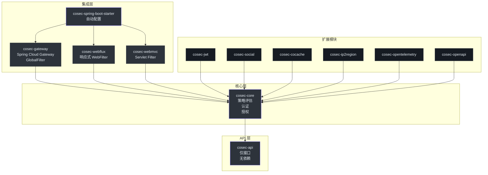
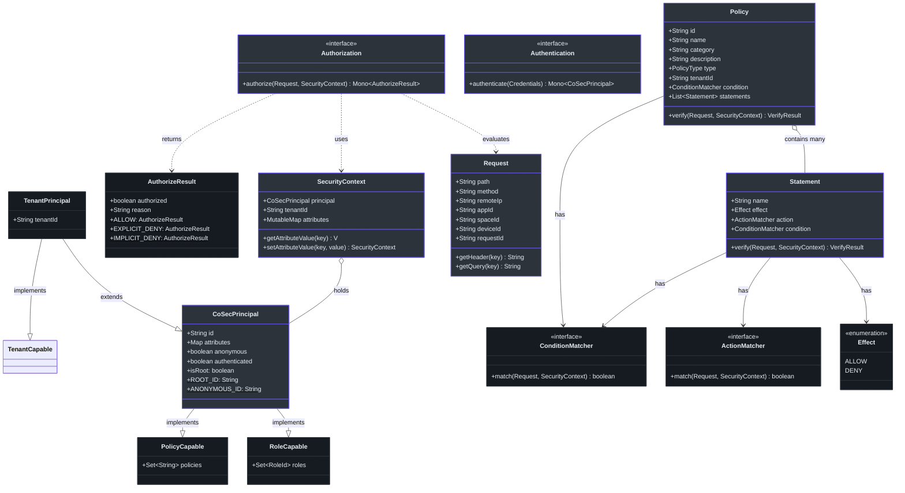
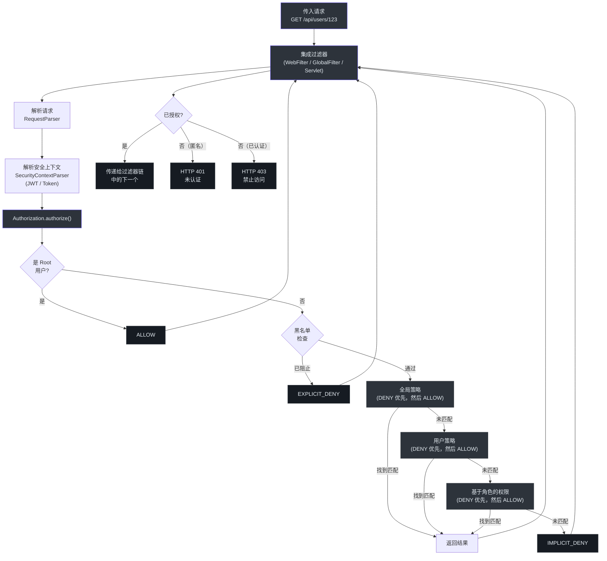
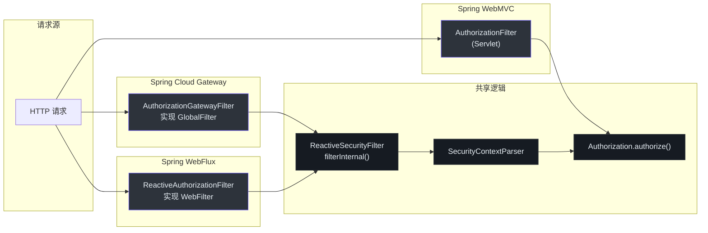
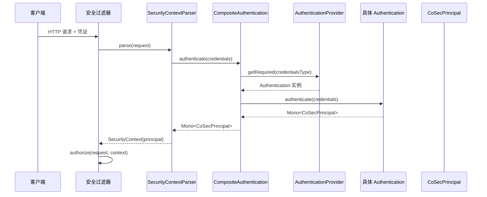

# 贡献者指南

欢迎来到 CoSec -- 一个面向 JVM 的基于 RBAC 和策略的多租户响应式安全框架。本指南旨在帮助你从零开始快速成长为合格的贡献者，无论你来自 Python、JavaScript 还是其他 JVM 语言背景。

---

## 第一部分：基础篇

### 面向 Python 和 JavaScript 工程师的 Kotlin

Kotlin 是一种运行在 JVM 上的静态类型语言。如果你写过 Python 或 JavaScript，许多 Kotlin 概念会觉得很熟悉，但类型系统和空安全需要一些调整。本节为你提供对照参考，让你能流畅地阅读 CoSec 代码。

#### 变量和类型

| 概念 | Python | JavaScript | Kotlin |
|---|---|---|---|
| 不可变变量 | `x = 1`（惯例：大写） | `const x = 1` | `val x = 1` |
| 可变变量 | `x = 1` | `let x = 1` | `var x = 1` |
| 类型注解 | `x: int = 1` | `x: number = 1`（TS） | `val x: Int = 1` |
| 字符串模板 | `f"Hello {name}"` | `` `Hello ${name}` `` | `"Hello $name"` |
| 可空类型 | `Optional[str]` | `string \| null`（TS） | `String?` |
| 非空断言 | `x!`（TS） | `x!`（TS） | `x!!` |
| 安全调用 | 无 | `x?.method()`（TS） | `x?.method()` |
| Elvis（默认值） | `x or default` | `x ?? default` | `x ?: default` |

#### 函数和 Lambda

| 概念 | Python | JavaScript | Kotlin |
|---|---|---|---|
| 函数 | `def add(a, b):` | `function add(a, b) {` | `fun add(a: Int, b: Int): Int` |
| Lambda | `lambda x: x + 1` | `(x) => x + 1` | `{ x -> x + 1 }` |
| 单表达式 | `def double(x): return x * 2` | `const double = (x) => x * 2` | `fun double(x: Int) = x * 2` |
| 默认参数 | `def f(x=1):` | `function f(x=1) {` | `fun f(x: Int = 1)` |
| 命名参数 | `f(name="alice")` | `f({ name: "alice" })` | `f(name = "alice")` |

#### 类和接口

| 概念 | Python | JavaScript | Kotlin |
|---|---|---|---|
| 类 | `class Foo:` | `class Foo { }` | `class Foo { }` |
| 接口 | （抽象基类） | （非标准） | `interface Foo { }` |
| 数据类 | `@dataclass` | （手动） | `data class Foo(val x: Int)` |
| 实现接口 | `class Bar(Foo):` | `class Bar extends Foo` | `class Bar : Foo` |
| 枚举 | `Enum` 模块 | `enum`（TS） | `enum class Foo { A, B }` |
| 伴生对象 | `@classmethod` | `static` | `companion object { }` |
| 扩展函数 | （猴子补丁） | `prototype.method` | `fun String.first() = this[0]` |

#### 集合

| 概念 | Python | JavaScript | Kotlin |
|---|---|---|---|
| 列表 | `[1, 2, 3]` | `[1, 2, 3]` | `listOf(1, 2, 3)` |
| 可变列表 | `[]` | `[]` | `mutableListOf<Int>()` |
| 字典/映射 | `{"a": 1}` | `{ a: 1 }` | `mapOf("a" to 1)` |
| 集合 | `{1, 2}` | `new Set([1, 2])` | `setOf(1, 2)` |
| 过滤 | `[x for x in l if x > 0]` | `l.filter(x => x > 0)` | `l.filter { it > 0 }` |
| 映射（转换） | `[f(x) for x in l]` | `l.map(x => f(x))` | `l.map { f(it) }` |
| 扁平映射 | `[y for x in l for y in f(x)]` | `l.flatMap(x => f(x))` | `l.flatMap { f(it) }` |
| 折叠/归约 | `functools.reduce(op, l, init)` | `l.reduce((a, b) => a + b)` | `l.fold(0) { acc, x -> acc + x }` |
| `it` 关键字 | 无 | 无 | 单参数 Lambda 的隐式参数名 |

#### 可空类型和智能转换

Kotlin 在编译器层面强制执行空安全。`String` 不能持有 `null`；只有 `String?` 可以。

```kotlin
val name: String = "Alice"   // 不能为 null
val maybe: String? = null    // 可以为 null

// 空检查后的智能转换
if (maybe != null) {
    println(maybe.length)    // 编译器知道 maybe 在这里非空
}
```

你会在 CoSec 中看到 `?.`（安全调用）、`?:`（Elvis）和 `!!`（非空断言）的广泛使用。`requireNotNull()` 函数也很常见 -- 当值为 null 时它会抛出 `IllegalArgumentException`（[PermissionVerifier.kt:69](https://github.com/Ahoo-Wang/CoSec/blob/main/cosec-api/src/main/kotlin/me/ahoo/cosec/api/policy/PermissionVerifier.kt#L69)）。

#### CoSec 中的关键 Kotlin 惯用写法

1. **`fun interface`**（SAM 接口）：CoSec 使用 `fun interface` 定义单抽象方法接口，可以用 Lambda 实例化。例如，`PermissionVerifier` 就是一个 `fun interface`（[PermissionVerifier.kt:29](https://github.com/Ahoo-Wang/CoSec/blob/main/cosec-api/src/main/kotlin/me/ahoo/cosec/api/policy/PermissionVerifier.kt#L29)）。

2. **`companion object`**：Kotlin 对 `static` 成员的替代方案。广泛用于常量和工厂方法（例如 `CoSecPrincipal.ROOT_ID`，见 [CoSecPrincipal.kt:80](https://github.com/Ahoo-Wang/CoSec/blob/main/cosec-api/src/main/kotlin/me/ahoo/cosec/api/principal/CoSecPrincipal.kt#L80)）。

3. **扩展函数**：在不修改原有类型的情况下为其添加函数。例如，`CoSecPrincipal.isRoot` 是一个扩展属性（[CoSecPrincipal.kt:94](https://github.com/Ahoo-Wang/CoSec/blob/main/cosec-api/src/main/kotlin/me/ahoo/cosec/api/principal/CoSecPrincipal.kt#L94)）。

4. **类型别名**：复杂类型的简写。`typealias PolicyId = String`（[Policy.kt:22](https://github.com/Ahoo-Wang/CoSec/blob/main/cosec-api/src/main/kotlin/me/ahoo/cosec/api/policy/Policy.kt#L22)）和 `typealias RoleId = String`（[RoleCapable.kt:19](https://github.com/Ahoo-Wang/CoSec/blob/main/cosec-api/src/main/kotlin/me/ahoo/cosec/api/principal/RoleCapable.kt#L19)）。

5. **委托（`by`）**：Kotlin 支持类委托和属性委托。`cosec-core` 中的 `Delegated.kt` 提供了委托工具（[Delegated.kt](https://github.com/Ahoo-Wang/CoSec/blob/main/cosec-core/src/main/kotlin/me/ahoo/cosec/Delegated.kt)）。

6. **密封类和枚举**：用于固定值集合。`Effect` 是一个枚举，包含 `ALLOW` 和 `DENY` 两个值（[Effect.kt:28](https://github.com/Ahoo-Wang/CoSec/blob/main/cosec-api/src/main/kotlin/me/ahoo/cosec/api/policy/Effect.kt#L28)）。

### 从第一性原理理解 Spring Boot 和 Project Reactor

CoSec 构建于 Spring Boot 4 和 Project Reactor 之上。理解响应式编程范式对于贡献代码至关重要。

#### 什么是响应式编程？

响应式编程是一种异步、事件驱动的范式，数据通过流传递。你不需要在等待结果时阻塞线程，而是声明当数据到达时*应该发生什么*。

用 Python 的术语来说，可以类比生成器（`yield`）加上 `asyncio`。用 JavaScript 的术语来说，可以类比 `Promise` 和 `Observable`（RxJS）。

#### Mono 和 Flux

Project Reactor 提供两个核心类型：

- **`Mono<T>`**：最多发射一个元素然后完成的流。等价于 JavaScript 中的 `Promise<T>` 或 Python 中的 `Future<T>`。
- **`Flux<T>`**：发射零个或多个元素然后完成的流。等价于 RxJS 中的 `Observable<T>`。

CoSec 广泛使用 `Mono`，因为认证和授权通常产生单一结果：

```kotlin
// 认证返回 Mono<CoSecPrincipal>（一个结果或空）
fun authenticate(credentials: Credentials): Mono<out CoSecPrincipal>
// 来源：cosec-api/.../Authentication.kt:44

// 授权返回 Mono<AuthorizeResult>（一个结果）
fun authorize(request: Request, context: SecurityContext): Mono<AuthorizeResult>
// 来源：cosec-api/.../Authorization.kt:43
```

#### 响应式管道

响应式流通过操作符形成管道。以下是 CoSec 中最常见的操作符：

| 操作符 | Python 等价 | JavaScript 等价 | 用途 |
|---|---|---|---|
| `map` | `map(fn, iterable)` | `promise.then(fn)` | 转换值 |
| `flatMap` | `async for x in gen: yield x` | `promise.then(asyncFn)` | 异步转换 |
| `filter` | `filter(fn, iterable)` | 无（在 `.then` 中用 `if`） | 保留匹配项 |
| `switchIfEmpty` | `if not result: fallback()` | `promise.catch(fallback)` | 为空时提供替代 |
| `onErrorResume` | `try/except` | `promise.catch(handler)` | 响应式错误处理 |
| `toMono()` | `Future(result)` | `Promise.resolve(result)` | 将值包装为 Mono |

来自 `SimpleAuthorization.authorize()` 的真实示例（[SimpleAuthorization.kt:213](https://github.com/Ahoo-Wang/CoSec/blob/main/cosec-core/src/main/kotlin/me/ahoo/cosec/authorization/SimpleAuthorization.kt#L213)）：

```kotlin
override fun authorize(request: Request, context: SecurityContext): Mono<AuthorizeResult> {
    val verifyResult = verifyRoot(context)
    if (verifyResult == VerifyResult.ALLOW) {
        return AuthorizeResult.ALLOW.toMono()        // 将值包装为 Mono
    }
    return blacklistChecker
        .check(request, context)                      // Mono<Boolean>
        .flatMap { allowed ->                         // 异步转换
            if (!allowed) {
                return@flatMap AuthorizeResult.EXPLICIT_DENY.toMono()
            }
            verify(request, context)                  // 链接到下一步
        }
}
```

#### 使用 StepVerifier 测试响应式代码

Reactor 提供了 `StepVerifier` 来声明式地测试响应式流。你将在每个测试中看到这种模式：

```kotlin
authorization.authorize(request, securityContext)
    .test()                                        // 将 Mono 转换为 StepVerifier
    .expectNext(AuthorizeResult.ALLOW)             // 断言发射的值
    .verifyComplete()                              // 断言流完成
// 来源：cosec-core/.../SimpleAuthorizationTest.kt:52-54
```

#### Spring Boot 自动配置

Spring Boot 自动配置是一种约定优于配置的机制。使用 `@AutoConfiguration` 注解的类在满足特定条件时会自动注册 Bean（Spring 管理的对象）。

在 CoSec 中，`CoSecAutoConfiguration` 是入口点（[CoSecAutoConfiguration.kt:37](https://github.com/Ahoo-Wang/CoSec/blob/main/cosec-spring-boot-starter/src/main/kotlin/me/ahoo/cosec/spring/boot/starter/CoSecAutoConfiguration.kt#L37)）：

```kotlin
@ConditionalOnCoSecEnabled                    // 仅当 cosec.enabled=true 时激活
@AutoConfiguration(before = [JacksonAutoConfiguration::class])
@EnableConfigurationProperties(CoSecProperties::class)
class CoSecAutoConfiguration {
    @Bean
    @ConditionalOnMissingBean
    fun coSecModule(): CoSecModule = CoSecModule()
    // ...
}
```

条件注解控制功能何时被激活：

- `@ConditionalOnCoSecEnabled` -- 检查 `cosec.enabled` 属性（[ConditionalOnCoSecEnabled.kt:23](https://github.com/Ahoo-Wang/CoSec/blob/main/cosec-spring-boot-starter/src/main/kotlin/me/ahoo/cosec/spring/boot/starter/ConditionalOnCoSecEnabled.kt#L23)）
- `@ConditionalOnJwtEnabled` -- 激活 JWT 支持
- `@ConditionalOnAuthorizationEnabled` -- 激活授权
- `@ConditionalOnGatewayEnabled` -- 激活 Spring Cloud Gateway 集成

`MatcherFactoryRegister` Bean（[MatcherFactoryRegister.kt:24](https://github.com/Ahoo-Wang/CoSec/blob/main/cosec-spring-boot-starter/src/main/kotlin/me/ahoo/cosec/spring/boot/starter/policy/MatcherFactoryRegister.kt#L24)）是一个 `SmartLifecycle`，它从 Spring 上下文中发现所有 `ActionMatcherFactory` 和 `ConditionMatcherFactory` Bean 并注册到 SPI 提供者中。

---

## 第二部分：架构和领域模型

### 全局视图

CoSec 是一个多模块 Gradle 项目。所有公共 API 都在 `cosec-api` 中定义为接口；所有实现都在 `cosec-core` 或集成模块中。这种分离意味着你只需阅读 `cosec-api` 就能理解契约。



<!-- Sources:
  settings.gradle.kts - module definitions
  build.gradle.kts - dependency and plugin configuration
-->

### 模块依赖关系图

模块依赖顺序在 `settings.gradle.kts`（[settings.gradle.kts](https://github.com/Ahoo-Wang/CoSec/blob/main/settings.gradle.kts)）中定义，构建逻辑在 `build.gradle.kts`（[build.gradle.kts](https://github.com/Ahoo-Wang/CoSec/blob/main/build.gradle.kts)）中：

| 模块 | 依赖 | 是否发布 | 用途 |
|---|---|---|---|
| `cosec-api` | 无 | 是 | 核心接口，零框架依赖 |
| `cosec-core` | `cosec-api` | 是 | 策略评估、认证/授权实现 |
| `cosec-jwt` | `cosec-core` | 是 | JWT 令牌处理 |
| `cosec-social` | `cosec-core` | 是 | 通过 JustAuth 实现 OAuth 社交登录 |
| `cosec-cocache` | `cosec-core` | 是 | Redis 缓存策略/权限 |
| `cosec-ip2region` | `cosec-core` | 是 | IP 地理位置信息增强 |
| `cosec-opentelemetry` | `cosec-core` | 是 | OpenTelemetry 链路追踪 |
| `cosec-openapi` | `cosec-core` | 是 | Swagger/OpenAPI 集成 |
| `cosec-webflux` | `cosec-core` | 是 | 响应式 WebFilter 集成 |
| `cosec-webmvc` | `cosec-core` | 是 | Servlet Filter 集成 |
| `cosec-gateway` | `cosec-webflux` | 是 | Spring Cloud Gateway GlobalFilter |
| `cosec-spring-boot-starter` | 以上所有 | 是 | 自动配置聚合器 |
| `cosec-gateway-server` | `cosec-spring-boot-starter` | **否** | 独立网关应用 |
| `cosec-dependencies` | 无 | 是（BOM） | 版本管理 |
| `cosec-bom` | 无 | 是（BOM） | 物料清单 |

`cosec-gateway-server` 是唯一不可发布的模块，在 `build.gradle.kts` 中配置（[build.gradle.kts:33](https://github.com/Ahoo-Wang/CoSec/blob/main/build.gradle.kts#L33)）：

```kotlin
val serverProjects = setOf(
    project(":cosec-gateway-server"),
)
```

### 领域模型

CoSec 的领域模型受 AWS IAM 启发。理解核心类型之间的关系至关重要。



<!-- Sources:
  cosec-api/src/main/kotlin/me/ahoo/cosec/api/principal/CoSecPrincipal.kt
  cosec-api/src/main/kotlin/me/ahoo/cosec/api/policy/Policy.kt
  cosec-api/src/main/kotlin/me/ahoo/cosec/api/policy/Statement.kt
  cosec-api/src/main/kotlin/me/ahoo/cosec/api/context/SecurityContext.kt
  cosec-api/src/main/kotlin/me/ahoo/cosec/api/authorization/Authorization.kt
  cosec-api/src/main/kotlin/me/ahoo/cosec/api/authentication/Authentication.kt
  cosec-api/src/main/kotlin/me/ahoo/cosec/api/context/request/Request.kt
-->

#### 核心接口详解

**CoSecPrincipal**（[CoSecPrincipal.kt:35](https://github.com/Ahoo-Wang/CoSec/blob/main/cosec-api/src/main/kotlin/me/ahoo/cosec/api/principal/CoSecPrincipal.kt#L35)）-- 核心身份类型。继承 `java.security.Principal`、`PolicyCapable` 和 `RoleCapable`。关键属性：

- `id` -- 唯一标识符（[第 42 行](https://github.com/Ahoo-Wang/CoSec/blob/main/cosec-api/src/main/kotlin/me/ahoo/cosec/api/principal/CoSecPrincipal.kt#L42)）
- `anonymous` -- 当 `id == ANONYMOUS_ID`（`"(0)"`）时为 true（[第 61 行](https://github.com/Ahoo-Wang/CoSec/blob/main/cosec-api/src/main/kotlin/me/ahoo/cosec/api/principal/CoSecPrincipal.kt#L61)）
- `authenticated` -- `anonymous` 的反义（[第 68 行](https://github.com/Ahoo-Wang/CoSec/blob/main/cosec-api/src/main/kotlin/me/ahoo/cosec/api/principal/CoSecPrincipal.kt#L68)）
- `ROOT_ID` -- 默认为 `"cosec"`，可通过系统属性 `cosec.root` 配置（[第 80 行](https://github.com/Ahoo-Wang/CoSec/blob/main/cosec-api/src/main/kotlin/me/ahoo/cosec/api/principal/CoSecPrincipal.kt#L80)）
- `ANONYMOUS_ID` -- `"(0)"`（[第 87 行](https://github.com/Ahoo-Wang/CoSec/blob/main/cosec-api/src/main/kotlin/me/ahoo/cosec/api/principal/CoSecPrincipal.kt#L87)）
- `isRoot` -- 扩展属性，检查 `ROOT_ID == id`（[第 94 行](https://github.com/Ahoo-Wang/CoSec/blob/main/cosec-api/src/main/kotlin/me/ahoo/cosec/api/principal/CoSecPrincipal.kt#L94)）

**TenantPrincipal**（[TenantPrincipal.kt:26](https://github.com/Ahoo-Wang/CoSec/blob/main/cosec-api/src/main/kotlin/me/ahoo/cosec/api/principal/TenantPrincipal.kt#L26)）-- 在 `CoSecPrincipal` 基础上实现 `TenantCapable`，增加 `tenantId`。策略按租户隔离。

**Policy**（[Policy.kt:45](https://github.com/Ahoo-Wang/CoSec/blob/main/cosec-api/src/main/kotlin/me/ahoo/cosec/api/policy/Policy.kt#L45)）-- `Statement` 的命名集合，带可选的 `ConditionMatcher`。其 `verify()` 方法（[第 76 行](https://github.com/Ahoo-Wang/CoSec/blob/main/cosec-api/src/main/kotlin/me/ahoo/cosec/api/policy/Policy.kt#L76)）实现了拒绝优先的评估算法：
1. 检查策略级条件。如果未通过，返回 `IMPLICIT_DENY`。
2. 评估所有 DENY 语句。如果任一匹配，返回 `EXPLICIT_DENY`。
3. 评估所有 ALLOW 语句。如果任一匹配，返回 `ALLOW`。
4. 返回 `IMPLICIT_DENY`。

**Statement**（[Statement.kt:37](https://github.com/Ahoo-Wang/CoSec/blob/main/cosec-api/src/main/kotlin/me/ahoo/cosec/api/policy/Statement.kt#L37)）-- 单条权限规则，包含 `Effect`、`ActionMatcher` 和 `ConditionMatcher`。其 `verify()` 方法（[第 60 行](https://github.com/Ahoo-Wang/CoSec/blob/main/cosec-api/src/main/kotlin/me/ahoo/cosec/api/policy/Statement.kt#L60)）首先检查 Action 匹配器，然后检查条件匹配器，最后将 Effect 映射为 `VerifyResult`。

**Authentication**（[Authentication.kt:32](https://github.com/Ahoo-Wang/CoSec/blob/main/cosec-api/src/main/kotlin/me/ahoo/cosec/api/authentication/Authentication.kt#L32)）-- 泛型接口，参数化凭证类型 `C` 和主体类型 `P`。返回 `Mono<out P>`。

**Authorization**（[Authorization.kt:35](https://github.com/Ahoo-Wang/CoSec/blob/main/cosec-api/src/main/kotlin/me/ahoo/cosec/api/authorization/Authorization.kt#L35)）-- `fun interface`（SAM），接受 `Request` 和 `SecurityContext`，返回 `Mono<AuthorizeResult>`。

**Request**（[Request.kt:36](https://github.com/Ahoo-Wang/CoSec/blob/main/cosec-api/src/main/kotlin/me/ahoo/cosec/api/context/request/Request.kt#L36)）-- 表示传入的 HTTP 请求，包含 `path`、`method`、`remoteIp`、`appId`、`spaceId`、`deviceId` 和 `requestId`。

**SecurityContext**（[SecurityContext.kt:34](https://github.com/Ahoo-Wang/CoSec/blob/main/cosec-api/src/main/kotlin/me/ahoo/cosec/api/context/SecurityContext.kt#L34)）-- 持有 `CoSecPrincipal`、租户信息和可变 `attributes`，用于在授权过程中在组件间传递数据。

#### 租户类型

CoSec 支持三种租户类型，在 `Tenant` 接口中定义（[Tenant.kt:22](https://github.com/Ahoo-Wang/CoSec/blob/main/cosec-api/src/main/kotlin/me/ahoo/cosec/api/tenant/Tenant.kt#L22)）：

| 租户类型 | ID 常量 | 描述 |
|---|---|---|
| 平台（Platform） | `"(platform)"` | 根平台租户，管理所有其他租户 |
| 默认（Default） | `"(0)"` | 非多租户场景的默认租户 |
| 用户（User） | 任意其他 ID | 客户特定租户 |

### 授权数据流

下图展示了请求如何流经 CoSec 授权管道：



<!-- Sources:
  cosec-core/src/main/kotlin/me/ahoo/cosec/authorization/SimpleAuthorization.kt:213-232
  cosec-webflux/src/main/kotlin/me/ahoo/cosec/webflux/ReactiveSecurityFilter.kt:66-116
-->

#### 授权流程详解（SimpleAuthorization）

`SimpleAuthorization`（[SimpleAuthorization.kt:48](https://github.com/Ahoo-Wang/CoSec/blob/main/cosec-core/src/main/kotlin/me/ahoo/cosec/authorization/SimpleAuthorization.kt#L48)）是核心授权实现。其 `authorize()` 方法（[第 213 行](https://github.com/Ahoo-Wang/CoSec/blob/main/cosec-core/src/main/kotlin/me/ahoo/cosec/authorization/SimpleAuthorization.kt#L213)）严格按照以下顺序执行：

1. **Root 用户检查**（[第 217 行](https://github.com/Ahoo-Wang/CoSec/blob/main/cosec-core/src/main/kotlin/me/ahoo/cosec/authorization/SimpleAuthorization.kt#L217)）-- 如果 `context.principal.isRoot`，立即返回 `ALLOW`。Root 用户绕过所有检查。

2. **黑名单检查**（[第 221 行](https://github.com/Ahoo-Wang/CoSec/blob/main/cosec-core/src/main/kotlin/me/ahoo/cosec/authorization/SimpleAuthorization.kt#L221)）-- 如果 `BlacklistChecker`（[BlacklistChecker.kt:29](https://github.com/Ahoo-Wang/CoSec/blob/main/cosec-core/src/main/kotlin/me/ahoo/cosec/blacklist/BlacklistChecker.kt#L29)）阻止请求，返回 `EXPLICIT_DENY`。默认为 `NoOp`，放行所有请求。

3. **验证管道**（[第 194 行](https://github.com/Ahoo-Wang/CoSec/blob/main/cosec-core/src/main/kotlin/me/ahoo/cosec/authorization/SimpleAuthorization.kt#L194)）-- 使用 `switchIfEmpty` 的响应式链：
   - `verifyGlobalPolicies`（[第 156 行](https://github.com/Ahoo-Wang/CoSec/blob/main/cosec-core/src/main/kotlin/me/ahoo/cosec/authorization/SimpleAuthorization.kt#L156)）-- 评估来自 `PolicyRepository.getGlobalPolicy()` 的全局策略。
   - `verifyPrincipalPolicies`（[第 166 行](https://github.com/Ahoo-Wang/CoSec/blob/main/cosec-core/src/main/kotlin/me/ahoo/cosec/authorization/SimpleAuthorization.kt#L166)）-- 评估分配给主体的策略。
   - `verifyAppRolePermission`（[第 180 行](https://github.com/Ahoo-Wang/CoSec/blob/main/cosec-core/src/main/kotlin/me/ahoo/cosec/authorization/SimpleAuthorization.kt#L180)）-- 评估基于角色的权限。
   - 如果没有匹配，返回 `IMPLICIT_DENY`。

每个策略验证都使用 `evaluateDenyFirst` 辅助方法（[第 61 行](https://github.com/Ahoo-Wang/CoSec/blob/main/cosec-core/src/main/kotlin/me/ahoo/cosec/authorization/SimpleAuthorization.kt#L61)），它始终在 ALLOW 语句之前处理 DENY 语句。

### 集成层：请求如何进入 CoSec

CoSec 与三种 Spring 请求处理模型集成。三者都遵循相同的模式：解析请求、提取安全上下文、执行授权，然后要么放行要么拒绝。



<!-- Sources:
  cosec-gateway/src/main/kotlin/me/ahoo/cosec/gateway/AuthorizationGatewayFilter.kt
  cosec-webflux/src/main/kotlin/me/ahoo/cosec/webflux/ReactiveAuthorizationFilter.kt
  cosec-webflux/src/main/kotlin/me/ahoo/cosec/webflux/ReactiveSecurityFilter.kt
-->

**WebFlux**（`cosec-webflux`）：`ReactiveAuthorizationFilter`（[ReactiveAuthorizationFilter.kt:36](https://github.com/Ahoo-Wang/CoSec/blob/main/cosec-webflux/src/main/kotlin/me/ahoo/cosec/webflux/ReactiveAuthorizationFilter.kt#L36)）实现 `WebFilter` 和 `Ordered`。它继承 `ReactiveSecurityFilter`，后者包含共享的过滤逻辑（[ReactiveSecurityFilter.kt:57](https://github.com/Ahoo-Wang/CoSec/blob/main/cosec-webflux/src/main/kotlin/me/ahoo/cosec/webflux/ReactiveSecurityFilter.kt#L57)）。过滤器顺序为 `1000`（[第 49 行](https://github.com/Ahoo-Wang/CoSec/blob/main/cosec-webflux/src/main/kotlin/me/ahoo/cosec/webflux/ReactiveAuthorizationFilter.kt#L49)）。

**Gateway**（`cosec-gateway`）：`AuthorizationGatewayFilter`（[AuthorizationGatewayFilter.kt:31](https://github.com/Ahoo-Wang/CoSec/blob/main/cosec-gateway/src/main/kotlin/me/ahoo/cosec/gateway/AuthorizationGatewayFilter.kt#L31)）实现 Spring Cloud Gateway 的 `GlobalFilter`。它也继承 `ReactiveSecurityFilter`。过滤器顺序为 `HIGHEST_PRECEDENCE + 10`（[第 42 行](https://github.com/Ahoo-Wang/CoSec/blob/main/cosec-gateway/src/main/kotlin/me/ahoo/cosec/gateway/AuthorizationGatewayFilter.kt#L42)）。

**安全过滤器逻辑**：`ReactiveSecurityFilter.filterInternal()` 方法（[ReactiveSecurityFilter.kt:66](https://github.com/Ahoo-Wang/CoSec/blob/main/cosec-webflux/src/main/kotlin/me/ahoo/cosec/webflux/ReactiveSecurityFilter.kt#L66)）处理完整的请求生命周期：
- 使用 `RequestParser` 解析请求（[第 70 行](https://github.com/Ahoo-Wang/CoSec/blob/main/cosec-webflux/src/main/kotlin/me/ahoo/cosec/webflux/ReactiveSecurityFilter.kt#L70)）
- 使用 `SecurityContextParser` 提取安全上下文（[第 73 行](https://github.com/Ahoo-Wang/CoSec/blob/main/cosec-webflux/src/main/kotlin/me/ahoo/cosec/webflux/ReactiveSecurityFilter.kt#L73)）
- 遇到 `TokenVerificationException` 时，回退到匿名上下文（[第 75 行](https://github.com/Ahoo-Wang/CoSec/blob/main/cosec-webflux/src/main/kotlin/me/ahoo/cosec/webflux/ReactiveSecurityFilter.kt#L75)）
- 调用 `authorization.authorize()`（[第 85 行](https://github.com/Ahoo-Wang/CoSec/blob/main/cosec-webflux/src/main/kotlin/me/ahoo/cosec/webflux/ReactiveSecurityFilter.kt#L85)）
- 如果已授权，将 principal 设置到 exchange 并继续过滤器链（[第 89 行](https://github.com/Ahoo-Wang/CoSec/blob/main/cosec-webflux/src/main/kotlin/me/ahoo/cosec/webflux/ReactiveSecurityFilter.kt#L89)）
- 如果未授权且为匿名用户：HTTP 401（[第 99 行](https://github.com/Ahoo-Wang/CoSec/blob/main/cosec-webflux/src/main/kotlin/me/ahoo/cosec/webflux/ReactiveSecurityFilter.kt#L99)）
- 如果未授权且已认证：HTTP 403（[第 101 行](https://github.com/Ahoo-Wang/CoSec/blob/main/cosec-webflux/src/main/kotlin/me/ahoo/cosec/webflux/ReactiveSecurityFilter.kt#L101)）
- 处理 `TooManyRequestsException`：HTTP 429（[第 106 行](https://github.com/Ahoo-Wang/CoSec/blob/main/cosec-webflux/src/main/kotlin/me/ahoo/cosec/webflux/ReactiveSecurityFilter.kt#L106)）

### SPI 扩展点

CoSec 使用 Java 的 Service Provider Interface（SPI）实现可扩展性。自定义匹配器在运行时通过 `ServiceLoader` 发现。

```mermaid
flowchart TD
    subgraph "ServiceLoader 发现"
        SPI1["META-INF/services/<br>me.ahoo.cosec.policy.action<br>.ActionMatcherFactory"]
        SPI2["META-INF/services/<br>me.ahoo.cosec.policy.condition<br>.ConditionMatcherFactory"]
    end

    subgraph "ActionMatcherFactory 工厂"
        A1["AllActionMatcherFactory<br>type: all"]
        A2["PathActionMatcherFactory<br>type: path"]
        A3["CompositeActionMatcherFactory<br>type: composite"]
    end

    subgraph "ConditionMatcherFactory 工厂"
        C1["AllConditionMatcherFactory"]
        C2["AuthenticatedConditionMatcherFactory"]
        C3["InRoleConditionMatcherFactory"]
        C4["InTenantConditionMatcherFactory"]
        C5["SpelConditionMatcherFactory"]
        C6["OgnlConditionMatcherFactory"]
        C7["PathConditionMatcherFactory"]
        C8["RateLimiterConditionMatcherFactory"]
        C9["Eq / Contains / StartsWith<br>/ EndsWith / In / Regular"]
        C10["BoolConditionMatcherFactory"]
        C11["GroupedRateLimiterConditionMatcherFactory"]
    end

    subgraph "注册"
        PROV["ActionMatcherFactoryProvider<br>(SPI + Spring Bean)"]
        CPRV["ConditionMatcherFactoryProvider<br>(SPI + Spring Bean)"]
    end

    SPI1 --> A1
    SPI1 --> A2
    SPI1 --> A3
    SPI2 --> C1
    SPI2 --> C2
    SPI2 --> C3
    SPI2 --> C4
    SPI2 --> C5
    SPI2 --> C6
    SPI2 --> C7
    SPI2 --> C8
    SPI2 --> C9
    SPI2 --> C10
    SPI2 --> C11

    A1 --> PROV
    A2 --> PROV
    A3 --> PROV
    C1 --> CPRV
    C2 --> CPRV
    C3 --> CPRV
    C4 --> CPRV
    C5 --> CPRV
    C6 --> CPRV
    C7 --> CPRV
    C8 --> CPRV
    C9 --> CPRV
    C10 --> CPRV
    C11 --> CPRV

    style SPI1 fill:#161b22,stroke:#30363d,color:#e6edf3
    style SPI2 fill:#161b22,stroke:#30363d,color:#e6edf3
    style PROV fill:#2d333b,stroke:#6d5dfc,color:#e6edf3
    style CPRV fill:#2d333b,stroke:#6d5dfc,color:#e6edf3
```



<!-- Sources:
  cosec-core/src/main/resources/META-INF/services/me.ahoo.cosec.policy.action.ActionMatcherFactory
  cosec-core/src/main/resources/META-INF/services/me.ahoo.cosec.policy.condition.ConditionMatcherFactory
  cosec-core/src/main/kotlin/me/ahoo/cosec/policy/action/ActionMatcherFactoryProvider.kt
  cosec-spring-boot-starter/src/main/kotlin/me/ahoo/cosec/spring/boot/starter/policy/MatcherFactoryRegister.kt
-->

#### SPI 的工作原理

1. **SPI 文件**声明内置工厂实现。Action 匹配器 SPI 文件（[ActionMatcherFactory](https://github.com/Ahoo-Wang/CoSec/blob/main/cosec-core/src/main/resources/META-INF/services/me.ahoo.cosec.policy.action.ActionMatcherFactory)）列出：
   - `me.ahoo.cosec.policy.action.AllActionMatcherFactory`
   - `me.ahoo.cosec.policy.action.PathActionMatcherFactory`
   - `me.ahoo.cosec.policy.action.CompositeActionMatcherFactory`

   条件匹配器 SPI 文件（[ConditionMatcherFactory](https://github.com/Ahoo-Wang/CoSec/blob/main/cosec-core/src/main/resources/META-INF/services/me.ahoo.cosec.policy.condition.ConditionMatcherFactory)）列出 16 个工厂。

2. **Provider 类**在启动时加载 SPI 工厂。`ActionMatcherFactoryProvider`（[ActionMatcherFactoryProvider.kt:20](https://github.com/Ahoo-Wang/CoSec/blob/main/cosec-core/src/main/kotlin/me/ahoo/cosec/policy/action/ActionMatcherFactoryProvider.kt#L20)）在其 `init` 块中使用 `ServiceLoader.load()` 发现并按类型名称注册工厂。

3. **Spring 集成**也通过 `MatcherFactoryRegister`（[MatcherFactoryRegister.kt:24](https://github.com/Ahoo-Wang/CoSec/blob/main/cosec-spring-boot-starter/src/main/kotlin/me/ahoo/cosec/spring/boot/starter/policy/MatcherFactoryRegister.kt#L24)）注册工厂，它从 Spring `ApplicationContext` 中发现所有 `ActionMatcherFactory` 和 `ConditionMatcherFactory` Bean。

#### 添加自定义匹配器

要添加新的 Action 或条件匹配器：

1. 实现工厂接口（`ActionMatcherFactory` 或 `ConditionMatcherFactory`）-- 例如 [ActionMatcherFactory.kt:30](https://github.com/Ahoo-Wang/CoSec/blob/main/cosec-core/src/main/kotlin/me/ahoo/cosec/policy/action/ActionMatcherFactory.kt#L30)。
2. 如果是独立的，在 `META-INF/services/me.ahoo.cosec.policy.action.ActionMatcherFactory` 创建 SPI 文件列出你的类。
3. 如果使用 Spring Boot，将你的工厂注册为 `@Bean`，`MatcherFactoryRegister` 会自动发现它。

### 策略评估流程

`DefaultPolicyEvaluator`（[DefaultPolicyEvaluator.kt:25](https://github.com/Ahoo-Wang/CoSec/blob/main/cosec-core/src/main/kotlin/me/ahoo/cosec/policy/DefaultPolicyEvaluator.kt#L25)）提供策略验证（不是授权）。它创建一个模拟的 `EvaluateRequest`（[第 64 行](https://github.com/Ahoo-Wang/CoSec/blob/main/cosec-core/src/main/kotlin/me/ahoo/cosec/policy/DefaultPolicyEvaluator.kt#L64)）并运行所有条件、Action 和语句，以便在策略投入生产前捕获配置错误。

### 认证管道



<!-- Sources:
  cosec-core/src/main/kotlin/me/ahoo/cosec/authentication/CompositeAuthentication.kt
  cosec-core/src/main/kotlin/me/ahoo/cosec/context/DefaultSecurityContextParser.kt
  cosec-webflux/src/main/kotlin/me/ahoo/cosec/webflux/ReactiveSecurityFilter.kt
-->

`CompositeAuthentication`（[CompositeAuthentication.kt:22](https://github.com/Ahoo-Wang/CoSec/blob/main/cosec-core/src/main/kotlin/me/ahoo/cosec/authentication/CompositeAuthentication.kt#L22)）使用 `AuthenticationProvider` 注册表，根据凭证类型委托给相应的 `Authentication` 实现。

### 序列化

CoSec 使用 Jackson 进行策略、权限和配置的 JSON 序列化。`CoSecModule`（[CoSecModule](https://github.com/Ahoo-Wang/CoSec/blob/main/cosec-core/src/main/kotlin/me/ahoo/cosec/serialization/CoSecModule.kt)）注册了领域类型的自定义序列化器，包括：
- `JsonPolicySerializer` -- 序列化 `Policy` 对象
- `JsonStatementSerializer` -- 序列化 `Statement` 对象
- `JsonActionMatcherSerializer` -- 序列化 `ActionMatcher` 对象
- `JsonConditionMatcherSerializer` -- 序列化 `ConditionMatcher` 对象
- `JsonEffectSerializer` -- 序列化 `Effect` 枚举
- `JsonAppPermissionSerializer` -- 序列化 `AppPermission` 对象

SPI 注册的 `tools.jackson.databind.JacksonModule` 文件确保模块被自动发现（[JacksonModule SPI](https://github.com/Ahoo-Wang/CoSec/blob/main/cosec-core/src/main/resources/META-INF/services/tools.jackson.databind.JacksonModule)）。

---

## 第三部分：开发工作流

### 开发环境设置

#### 前置要求

| 工具 | 版本 | 原因 |
|---|---|---|
| JDK | 17+ | `build.gradle.kts` 中的 `jvmToolchain(17)` 要求（[build.gradle.kts:83](https://github.com/Ahoo-Wang/CoSec/blob/main/build.gradle.kts#L83)） |
| Gradle | 已包含 Wrapper（`./gradlew`） | 无需单独安装 |
| Git | 任何最新版本 | 版本控制 |
| IDE | 推荐 IntelliJ IDEA | 最佳 Kotlin 支持和 Gradle 集成 |

#### 克隆和构建

```bash
# 克隆仓库
git clone https://github.com/Ahoo-Wang/CoSec.git
cd CoSec

# 构建所有模块（编译 + 测试）
./gradlew build

# 不运行测试的构建（初始设置更快）
./gradlew build -x test
```

首次构建会下载依赖，可能需要几分钟。所有依赖版本集中在 `gradle/libs.versions.toml`（[libs.versions.toml](https://github.com/Ahoo-Wang/CoSec/blob/main/gradle/libs.versions.toml)）中管理。

#### 验证你的环境

```bash
# 运行所有测试（在干净的检出上应该全部通过）
./gradlew test

# 运行 Detekt 静态分析
./gradlew detekt

# 生成代码覆盖率报告
./gradlew :code-coverage-report:codeCoverageReport
```

### 关键构建命令参考

| 命令 | 功能 |
|---|---|
| `./gradlew build` | 编译、运行测试、运行 Detekt、构建 JAR |
| `./gradlew test` | 运行所有模块的测试 |
| `./gradlew :cosec-core:test` | 运行单个模块的测试 |
| `./gradlew :cosec-core:test --tests "me.ahoo.cosec.policy.DefaultPolicyEvaluatorTest"` | 运行单个测试类 |
| `./gradlew :cosec-core:test --tests "me.ahoo.cosec.authorization.SimpleAuthorizationTest.authorizeWhenPrincipalIsRoot"` | 运行单个测试方法 |
| `./gradlew detekt` | 运行所有模块的静态分析 |
| `./gradlew :cosec-core:jmh` | 运行 JMH 基准测试 |
| `./gradlew :cosec-core:jmh -PjmhIncludes=*.SomeBenchmark` | 运行特定 JMH 基准测试 |

### 项目结构约定

每个库模块遵循以下结构：

```
cosec-<module>/
  build.gradle.kts           # 模块构建配置
  src/
    main/
      kotlin/me/ahoo/cosec/  # 生产代码
        <feature>/
          *.kt
      resources/
        META-INF/services/    # SPI 注册文件
    test/
      kotlin/me/ahoo/cosec/  # 测试代码（镜像 main 结构）
        <feature>/
          *Test.kt
      resources/              # 测试夹具
```

#### 包命名

基础包为 `me.ahoo.cosec`。子包映射到领域概念：

| 包 | 用途 |
|---|---|
| `me.ahoo.cosec.api` | 公共接口（在 `cosec-api` 中） |
| `me.ahoo.cosec.api.principal` | Principal、角色、策略能力接口 |
| `me.ahoo.cosec.api.policy` | Policy、Statement、Effect、匹配器 |
| `me.ahoo.cosec.api.authorization` | Authorization、AuthorizeResult |
| `me.ahoo.cosec.api.authentication` | Authentication、Credentials |
| `me.ahoo.cosec.api.context` | SecurityContext、Attributes |
| `me.ahoo.cosec.api.context.request` | Request、AppIdCapable、DeviceIdCapable |
| `me.ahoo.cosec.api.tenant` | Tenant、TenantCapable |
| `me.ahoo.cosec.api.permission` | Permission、AppPermission、RolePermission |
| `me.ahoo.cosec.api.token` | Token、AccessToken、CompositeToken |
| `me.ahoo.cosec.policy` | 策略评估、数据类 |
| `me.ahoo.cosec.policy.action` | ActionMatcher 实现 |
| `me.ahoo.cosec.policy.condition` | ConditionMatcher 实现 |
| `me.ahoo.cosec.policy.condition.part` | 基于路径的条件匹配器 |
| `me.ahoo.cosec.policy.condition.context` | 基于上下文的条件匹配器 |
| `me.ahoo.cosec.policy.condition.limiter` | 限流条件匹配器 |
| `me.ahoo.cosec.authorization` | Authorization 实现 |
| `me.ahoo.cosec.authentication` | Authentication 实现 |
| `me.ahoo.cosec.context` | SecurityContext 实现 |
| `me.ahoo.cosec.principal` | Principal 实现 |
| `me.ahoo.cosec.serialization` | Jackson 序列化器 |
| `me.ahoo.cosec.token` | Token 处理 |
| `me.ahoo.cosec.blacklist` | 黑名单检查 |
| `me.ahoo.cosec.tenant` | Tenant 实现 |
| `me.ahoo.cosec.permission` | Permission 数据类 |
| `me.ahoo.cosec.webflux` | WebFlux 集成 |
| `me.ahoo.cosec.gateway` | Spring Cloud Gateway 集成 |

### 你的第一次贡献

#### 寻找任务

1. 查看 [GitHub Issues](https://github.com/Ahoo-Wang/CoSec/issues) 中标记为 `good first issue` 或 `help wanted` 的问题。
2. 在代码库中搜索 TODO 注释。
3. 查看测试覆盖率报告中未测试的代码路径。

#### 典型工作流

1. **Fork 和分支**：在 GitHub 上 Fork 仓库，然后创建功能分支：
   ```bash
   git checkout -b feature/my-new-feature
   ```

2. **编写代码**：遵循下面描述的约定。

3. **编写测试**：每个新功能或 Bug 修复都必须包含测试。

4. **本地运行检查**：
   ```bash
   ./gradlew build        # 编译 + 测试 + Detekt
   ./gradlew detekt       # 仅静态分析
   ./gradlew test         # 仅测试
   ```

5. **提交和推送**：使用清晰的提交信息，遵循 [Conventional Commits](https://www.conventionalcommits.org/) 格式：
   ```
   feat(policy): add regex action matcher
   fix(authorization): handle empty policy list correctly
   test(core): add tests for RateLimiterConditionMatcher
   ```

6. **发起 Pull Request**：将分支推送到你的 Fork 并对 `main` 分支发起 PR。

#### 添加新条件匹配器：分步示例

假设你要添加一个 `TimeRangeConditionMatcher`，只允许在特定时间段内访问。

**步骤 1：创建匹配器类**，放在 `cosec-core/src/main/kotlin/me/ahoo/cosec/policy/condition/part/TimeRangeConditionMatcher.kt`：

```kotlin
package me.ahoo.cosec.policy.condition.part

import me.ahoo.cosec.api.configuration.Configuration
import me.ahoo.cosec.api.context.SecurityContext
import me.ahoo.cosec.api.context.request.Request
import me.ahoo.cosec.api.policy.ConditionMatcher
import me.ahoo.cosec.policy.condition.AbstractConditionMatcher

class TimeRangeConditionMatcher(configuration: Configuration) :
    AbstractConditionMatcher(TYPE, configuration) {

    private val startHour: Int = configuration.get("startHour")?.asInt() ?: 0
    private val endHour: Int = configuration.get("endHour")?.asInt() ?: 23

    override fun internalMatch(request: Request, securityContext: SecurityContext): Boolean {
        val currentHour = java.time.LocalTime.now().hour
        return currentHour in startHour..endHour
    }

    companion object {
        const val TYPE = "timeRange"
    }
}
```

**步骤 2：创建工厂类**：

```kotlin
class TimeRangeConditionMatcherFactory : ConditionMatcherFactory {
    override val type: String = TimeRangeConditionMatcher.TYPE

    override fun create(configuration: Configuration): ConditionMatcher =
        TimeRangeConditionMatcher(configuration)
}
```

**步骤 3：通过 SPI 注册** -- 添加到 `cosec-core/src/main/resources/META-INF/services/me.ahoo.cosec.policy.condition.ConditionMatcherFactory`：

```
me.ahoo.cosec.policy.condition.part.TimeRangeConditionMatcherFactory
```

**步骤 4：编写测试**，放在 `cosec-core/src/test/kotlin/me/ahoo/cosec/policy/condition/part/TimeRangeConditionMatcherTest.kt`：

```kotlin
package me.ahoo.cosec.policy.condition.part

import me.ahoo.cosec.configuration.JsonConfiguration
import me.ahoo.cosec.context.SimpleSecurityContext
import me.ahoo.cosec.policy.EvaluateRequest
import org.junit.jupiter.api.Test
import org.junit.jupiter.api.assertDoesNotThrow

class TimeRangeConditionMatcherTest {
    @Test
    fun `match within range`() {
        val config = """{"type":"timeRange","startHour":0,"endHour":23}"""
            .let { JsonConfiguration.Companion.asConfiguration(it) }
        val matcher = TimeRangeConditionMatcher(config)
        val request = EvaluateRequest()
        val context = SimpleSecurityContext.anonymous()
        assertDoesNotThrow { matcher.match(request, context) }
    }
}
```

**步骤 5：注册 Jackson 序列化器**（如果匹配器有自定义序列化格式）。在 `me.ahoo.cosec.serialization` 中添加序列化器类，并在 `CoSecModule` 中注册。

### 测试指南

CoSec 采用分层测试方法，在每个层级使用特定的库。

#### 测试库

| 库 | 用途 | 坐标 |
|---|---|---|
| JUnit 5 | 测试框架 | `org.junit.jupiter`（版本见 [libs.versions.toml:18](https://github.com/Ahoo-Wang/CoSec/blob/main/gradle/libs.versions.toml#L18)） |
| MockK | Kotlin Mock 库 | `io.mockk:mockk`（[libs.versions.toml:47](https://github.com/Ahoo-Wang/CoSec/blob/main/gradle/libs.versions.toml#L47)） |
| FluentAssert | 流式断言 | `me.ahoo.test:fluent-assert-core`（[libs.versions.toml:45](https://github.com/Ahoo-Wang/CoSec/blob/main/gradle/libs.versions.toml#L45)） |
| Hamcrest | 匹配器库 | `org.hamcrest:hamcrest`（[libs.versions.toml:46](https://github.com/Ahoo-Wang/CoSec/blob/main/gradle/libs.versions.toml#L46)） |
| Reactor Test | 用于 Mono/Flux 的 StepVerifier | 通过 Spring BOM 引入 |

#### 编写授权逻辑的测试

`SimpleAuthorization` 的测试（[SimpleAuthorizationTest.kt:41](https://github.com/Ahoo-Wang/CoSec/blob/main/cosec-core/src/test/kotlin/me/ahoo/cosec/authorization/SimpleAuthorizationTest.kt#L41)）是一个很好的参考。关键模式：

**1. 使用 MockK 进行 Mock**：

```kotlin
val policyRepository = mockk<PolicyRepository>()
val permissionRepository = mockk<AppRolePermissionRepository>()
val request = mockk<Request>()
val securityContext = mockk<SecurityContext> {
    every { principal.id } returns CoSecPrincipal.ROOT_ID
}
```

**2. 使用 StepVerifier 测试响应式流**：

```kotlin
authorization.authorize(request, securityContext)
    .test()                                    // 将 Mono 转换为 StepVerifier
    .expectNext(AuthorizeResult.ALLOW)         // 断言发射的值
    .verifyComplete()                          // 断言流完成
```

**3. 使用数据类构建测试夹具**：

```kotlin
val statement = StatementData(
    effect = Effect.ALLOW,
    action = AllActionMatcher.INSTANCE,
)
val policy = PolicyData(
    id = "test-policy",
    category = "test",
    name = "Test Policy",
    description = "A test policy",
    type = PolicyType.GLOBAL,
    tenantId = Tenant.DEFAULT_TENANT_ID,
    statements = listOf(statement),
)
```

`StatementData`（[StatementData.kt:31](https://github.com/Ahoo-Wang/CoSec/blob/main/cosec-core/src/main/kotlin/me/ahoo/cosec/policy/StatementData.kt#L31)）和 `PolicyData`（[PolicyData.kt:35](https://github.com/Ahoo-Wang/CoSec/blob/main/cosec-core/src/main/kotlin/me/ahoo/cosec/policy/PolicyData.kt#L35)）是用于构建测试对象的数据类实现。

#### 测试自动配置

`cosec-spring-boot-starter` 中的测试使用 Spring Boot 的测试上下文框架。参见 `CoSecAutoConfigurationTest` 中的示例（[CoSecAutoConfigurationTest.kt](https://github.com/Ahoo-Wang/CoSec/blob/main/cosec-spring-boot-starter/src/test/kotlin/me/ahoo/cosec/spring/boot/starter/CoSecAutoConfigurationTest.kt)）。

#### 测试策略评估

`DefaultPolicyEvaluatorTest`（[DefaultPolicyEvaluatorTest.kt](https://github.com/Ahoo-Wang/CoSec/blob/main/cosec-core/src/test/kotlin/me/ahoo/cosec/policy/DefaultPolicyEvaluatorTest.kt)）演示了如何测试策略评估。你可以使用数据类构建策略并验证其评估结果是否正确。

### 调试技巧

#### 启用调试日志

CoSec 使用 `io.github.oshai:kotlin-logging-jvm` 进行日志记录（[libs.versions.toml:37](https://github.com/Ahoo-Wang/CoSec/blob/main/gradle/libs.versions.toml#L37)）。`SimpleAuthorization` 在 DEBUG 级别记录详细的决策推理：

```
Verify [Request(...)] [Context(...)] matched Policy[policyId] Statement[0][statementName] - [ALLOW].
```

要在 `config/logback.xml` 中启用调试日志：

```xml
<logger name="me.ahoo.cosec" level="DEBUG"/>
```

#### 常见调试场景

**1. "ActionMatcherFactory[type] not found"**：这意味着你在策略 JSON 中引用了一个未注册的匹配器类型。检查工厂是否列在 SPI 文件中，以及 `ActionMatcherFactoryProvider` 是否已加载它（[ActionMatcherFactoryProvider.kt:46](https://github.com/Ahoo-Wang/CoSec/blob/main/cosec-core/src/main/kotlin/me/ahoo/cosec/policy/action/ActionMatcherFactoryProvider.kt#L46)）。

**2. 意外的 IMPLICIT_DENY**：最常见的原因是策略条件不匹配。使用调试日志跟踪正在评估的策略和语句。检查策略的顶层 `condition` 是否为 `AllConditionMatcher`（匹配一切）或是否与你的请求上下文匹配。

**3. TokenVerificationException 被吞没**：`ReactiveSecurityFilter` 捕获 `TokenVerificationException` 并回退到匿名上下文（[ReactiveSecurityFilter.kt:75](https://github.com/Ahoo-Wang/CoSec/blob/main/cosec-webflux/src/main/kotlin/me/ahoo/cosec/webflux/ReactiveSecurityFilter.kt#L75)）。如果你看到意外的 403 响应，检查 Token 解析是否静默失败。

**4. StepVerifier 超时**：如果 `Mono` 从未完成，`StepVerifier.verifyComplete()` 会挂起。使用 `.verify(Duration)` 设置超时，并检查所有响应式链是否产生值。

**5. Detekt 失败**：推送前运行 `./gradlew detekt`。配置在 `config/detekt/detekt.yml`（[detekt.yml](https://github.com/Ahoo-Wang/CoSec/blob/main/config/detekt/detekt.yml)）。构建中默认启用自动纠正（[build.gradle.kts:51](https://github.com/Ahoo-Wang/CoSec/blob/main/build.gradle.kts#L51)）。

### 代码风格和约定

#### Kotlin 约定

- **接口在 cosec-api 中，实现在 cosec-core 中**：这是最重要的约定。永远不要将实现类放在 `cosec-api` 中。
- **全程响应式**：核心接口返回 `Mono<T>`。永远不要在生产代码中阻塞 `Mono`。
- **`-Xjsr305=strict` 和 `-Xjvm-default=all-compatibility`**：这些编译器标志在 [build.gradle.kts:86](https://github.com/Ahoo-Wang/CoSec/blob/main/build.gradle.kts#L86) 中设置。`all-compatibility` 标志为 Java 互操作性在接口中生成默认方法体。
- **数据类用于 DTO**：对表示数据的对象使用 `data class`（例如 `PolicyData`、`StatementData`）。对有行为的对象使用普通类。
- **空安全**：优先使用非空类型。仅当 null 是有效值时使用 `?`。对必需值使用 `requireNotNull()`。

#### 命名约定

| 元素 | 约定 | 示例 |
|---|---|---|
| 接口 | PascalCase，无前缀/后缀 | `Policy`、`ActionMatcher` |
| 实现 | `Simple` 或描述性前缀 | `SimpleAuthorization`、`PathActionMatcher` |
| 数据类 | 名词 + `Data` 后缀 | `PolicyData`、`StatementData` |
| 工厂 | 名词 + `Factory` 后缀 | `PathActionMatcherFactory` |
| 提供者 | 名词 + `Provider` 后缀 | `ActionMatcherFactoryProvider` |
| 测试类 | 类名 + `Test` | `SimpleAuthorizationTest` |
| 测试方法 | camelCase，描述性 | `authorizeWhenPrincipalIsRoot` |
| 常量 | SCREAMING_SNAKE_CASE | `ROOT_ID`、`ANONYMOUS_ID` |

#### Detekt 配置

Detekt 规则在 `config/detekt/detekt.yml`（[detekt.yml](https://github.com/Ahoo-Wang/CoSec/blob/main/config/detekt/detekt.yml)）中配置。值得注意的放宽规则：

- `LongParameterList`、`NestedBlockDepth`、`TooManyFunctions` 已禁用
- `MaxLineLength` 设置为 200
- `ReturnCount` 已禁用
- `MagicNumber` 已禁用
- `WildcardImport` 排除常用测试导入（`java.util.*`、`org.hamcrest.*`、`org.junit.jupiter.api.*`）

### 常见陷阱

#### 1. 在生产代码中阻塞 Mono

永远不要在响应式线程（Netty 事件循环）上运行的代码中调用 `.block()`。这会导致死锁。请使用响应式操作符（`map`、`flatMap`、`switchIfEmpty`）替代。

#### 2. 忘记 SPI 注册

如果你添加了新的 `ActionMatcherFactory` 或 `ConditionMatcherFactory` 但忘记将其添加到 SPI 文件中，它将不会被发现。始终更新相应的 `META-INF/services/` 文件。

#### 3. 错误的测试导入

项目使用 FluentAssert（`me.ahoo.test:fluent-assert-core`）进行断言。请导入 `me.ahoo.test.asserts.assert` -- 而不是 AssertJ 的 `assertThat()`，后者在 Kotlin 中冗长且非空安全。这是通过约定强制执行的。

#### 4. 忘记 JVM 工具链

所有库模块必须以 Java 17 为目标。这在根 `build.gradle.kts` 中配置（[build.gradle.kts:83](https://github.com/Ahoo-Wang/CoSec/blob/main/build.gradle.kts#L83)）。不要在模块特定的构建文件中覆盖此设置。

#### 5. 向 cosec-api 添加依赖

`cosec-api` 模块按设计没有框架依赖。永远不要向 `cosec-api` 添加 Spring、Reactor 或其他框架依赖。如果你需要在接口中使用框架类型，它属于 `cosec-core` 或集成模块。

#### 6. 不测试拒绝优先逻辑

编写策略评估测试时，始终同时测试 ALLOW 和 DENY 路径。拒绝优先的评估顺序意味着 DENY 语句将覆盖 ALLOW 语句，即使 ALLOW 排在列表前面。这是一个关键的安全属性。

#### 7. 策略评估中的 RateLimiter 异常

`DefaultPolicyEvaluator` 在评估过程中捕获 `TooManyRequestsException`（[DefaultPolicyEvaluator.kt:48](https://github.com/Ahoo-Wang/CoSec/blob/main/cosec-core/src/main/kotlin/me/ahoo/cosec/policy/DefaultPolicyEvaluator.kt#L48)）。如果你的策略使用限流条件，不要期望它们在评估时抛出异常 -- 它们会被静默跳过。

#### 8. SecurityContext 的线程安全性

`SimpleSecurityContext` 使用 `ConcurrentHashMap` 作为其 `attributes`（[SimpleSecurityContext.kt:41](https://github.com/Ahoo-Wang/CoSec/blob/main/cosec-core/src/main/kotlin/me/ahoo/cosec/context/SimpleSecurityContext.kt#L41)）。该类标记为 `@ThreadSafe`。创建自定义 `SecurityContext` 实现时，请使用线程安全的集合。

---

## 附录

### 附录 A：术语表

| 术语 | 定义 |
|---|---|
| **ActionMatcher** | 判断请求是否匹配特定 Action 模式（如 URL 路径）的接口。通过 SPI 注册。 |
| **AllActionMatcher** | 匹配所有请求的内置 `ActionMatcher`。类型键：`"*"`。 |
| **AllConditionMatcher** | 始终返回 true 的内置 `ConditionMatcher`。用作默认值。 |
| **AllowAnonymous** | 应用于未认证（匿名）用户的策略或语句。 |
| **AppId** | 从请求头或查询参数中提取的应用标识符。 |
| **AppPermission** | 按应用隔离的权限，包含多组单独的权限。 |
| **AppPermissionEvaluator** | 用于评估请求是否匹配应用权限配置的接口。 |
| **AppRolePermission** | 应用角色与权限之间的映射。用于授权的第三阶段。 |
| **Attribute** | 存储在 `SecurityContext.attributes` 中的键值对，用于在组件间传递数据。 |
| **Authenticate（认证）** | 通过验证凭证来核实用户身份的过程。 |
| **Authentication** | 凭证验证的核心接口，返回 `Mono<CoSecPrincipal>`。 |
| **AuthenticationProvider** | 将凭证类型映射到 `Authentication` 实现的注册表。 |
| **Authorize（授权）** | 判断已认证用户是否有权执行某操作的过程。 |
| **Authorization** | 访问控制决策的核心接口，返回 `Mono<AuthorizeResult>`。 |
| **AuthorizeResult** | 授权决策的结果：ALLOW、EXPLICIT_DENY、IMPLICIT_DENY、TOKEN_EXPIRED 或 TOO_MANY_REQUESTS。 |
| **BlacklistChecker** | 可选组件，在策略评估前阻止被封禁用户或 IP 的请求。 |
| **CoSec** | 框架名称，源自 "Co"（协作）+ "Sec"（安全）。也是配置属性的常量前缀。 |
| **CoSecPrincipal** | 表示已认证或匿名用户的核心身份类型，继承 `java.security.Principal`。 |
| **CompositeActionMatcher** | 当任一子匹配器匹配时即匹配的 `ActionMatcher`。用于组合多个路径模式。 |
| **CompositeAuthentication** | 根据凭证类型委托给相应处理器的 `Authentication` 实现。 |
| **CompositeToken** | 包含访问令牌和刷新令牌的令牌。 |
| **ConditionMatcher** | 评估条件是否满足以使策略或语句生效的接口。 |
| **Credentials（凭证）** | 认证用户所需的数据（如用户名/密码、令牌）。 |
| **DefaultPolicyEvaluator** | 通过用模拟数据测试所有匹配器来验证策略配置的工具。 |
| **DENY** | 明确禁止某操作的 `Effect` 值。优先于 ALLOW。 |
| **DeviceId** | 客户端设备的唯一标识符，从请求头或查询参数中提取。 |
| **Effect** | 枚举，包含两个值：`ALLOW` 和 `DENY`。决定语句是允许还是阻止操作。 |
| **EXPLICIT_DENY** | 表示请求被 DENY 语句主动拒绝的 `AuthorizeResult`。 |
| **Fun interface** | Kotlin 的 SAM（单抽象方法）接口，可以用 Lambda 实例化。 |
| **Global Policy（全局策略）** | `PolicyType.GLOBAL` 的策略，适用于所有应用的所有请求。 |
| **IMPLICIT_DENY** | 表示没有策略或权限匹配请求的 `AuthorizeResult`。默认结果。 |
| **JMH** | Java Microbenchmark Harness。用于每个模块的性能基准测试。 |
| **JWT** | JSON Web Token。用于无状态认证令牌。 |
| **LocalPolicyLoader** | 从本地配置文件加载策略的组件。 |
| **MatcherFactory** | 从 JSON 配置创建 `ActionMatcher` 或 `ConditionMatcher` 实例的工厂接口。 |
| **MatcherFactoryRegister** | Spring `SmartLifecycle` Bean，从 Spring 上下文中发现和注册匹配器工厂。 |
| **Mono** | Project Reactor 类型，表示 0 或 1 个元素的异步流。 |
| **Multi-Tenancy（多租户）** | 按客户（租户）隔离数据和策略的能力。 |
| **Null Safety（空安全）** | Kotlin 的类型系统，区分可空（`T?`）和非空（`T`）类型。 |
| **OGNL** | Object-Graph Navigation Language。用作条件匹配器的表达式语言。 |
| **PathActionMatcher** | 通过 URL 路径模式（Ant 风格）匹配请求的内置 `ActionMatcher`。 |
| **Permission（权限）** | 单条访问控制规则，包含 Effect、Action 匹配器和可选条件。 |
| **PermissionVerifier** | `fun interface`，验证请求是否被允许，返回 `VerifyResult`。 |
| **Policy（策略）** | `Statement` 的命名集合，带可选条件。访问控制配置的主要单元。 |
| **PolicyCapable** | 具有策略分配的实体接口。提供 `policies: Set<String>`。 |
| **PolicyData** | `Policy` 的数据类实现。 |
| **PolicyEvaluator** | 用于验证策略配置的接口。 |
| **PolicyId** | `String` 的类型别名，表示策略标识符。 |
| **PolicyRepository** | 按 ID 获取策略或获取全局策略的仓库接口。 |
| **PolicyType** | 枚举：`GLOBAL`（全局适用）、`SYSTEM`（管理员管理）、`CUSTOM`（用户自定义）。 |
| **Principal（主体）** | 安全身份。在 CoSec 中，`CoSecPrincipal` 继承 `java.security.Principal`。 |
| **Project Reactor** | CoSec 全程使用的响应式编程库，用于异步操作。 |
| **RateLimiterConditionMatcher** | 限制请求频率的条件匹配器。 |
| **ReactiveAuthorizationFilter** | Spring WebFlux `WebFilter`，对每个请求执行授权。 |
| **ReactiveSecurityFilter** | 响应式授权过滤器的基类，包含共享的过滤逻辑。 |
| **Request** | 表示传入 HTTP 请求的接口，包含路径、方法、头信息和元数据。 |
| **RequestId** | 用于在系统中追踪请求的唯一标识符。 |
| **Role（角色）** | 分配给用户的权限命名集合。 |
| **RoleCapable** | 具有角色分配的实体接口。提供 `roles: Set<RoleId>`。 |
| **RoleId** | `String` 的类型别名，表示角色标识符。 |
| **SAM Interface** | 单抽象方法接口。Kotlin 的 `fun interface` 创建此类接口。 |
| **SecurityContext** | 持有当前主体、租户信息和请求的可变属性的对象。 |
| **ServiceLoader** | Java 的 SPI 机制，用于在运行时发现实现。用于匹配器工厂。 |
| **SimpleAuthorization** | 核心 `Authorization` 实现，包含 Root 绕过、黑名单、策略和角色评估。 |
| **SimplePrincipal** | 基础的 `CoSecPrincipal` 实现。 |
| **SimpleSecurityContext** | 使用 `ConcurrentHashMap` 的线程安全 `SecurityContext` 实现。 |
| **SpaceId** | 从请求头中提取的租户/工作空间标识符。 |
| **SpEL** | Spring Expression Language。用作条件匹配器的表达式语言。 |
| **SPI** | Service Provider Interface。Java 在运行时发现和加载实现的机制。 |
| **Statement（语句）** | `Policy` 中的单条权限规则，包含 `Effect`、`ActionMatcher` 和 `ConditionMatcher`。 |
| **StatementData** | `Statement` 的数据类实现。 |
| **StepVerifier** | Reactor Test 工具，用于在测试中验证 `Mono` 和 `Flux` 流。 |
| **Tenant（租户）** | 用于隔离策略和数据的组织边界。三种类型：Platform、Default、User。 |
| **TenantCapable** | 属于某个租户的实体接口。提供 `tenantId`。 |
| **TenantPrincipal** | 同时实现 `TenantCapable` 的 `CoSecPrincipal`，将用户与租户关联。 |
| **Token（令牌）** | 代表已认证会话的凭证（通常是 JWT）。 |
| **TokenVerificationException** | 当令牌无法验证（如无效签名、已过期）时抛出的异常。 |
| **TooManyRequestsException** | 当限流条件被超出时抛出的异常。 |
| **VerifyResult** | 枚举：`ALLOW`、`EXPLICIT_DENY`、`IMPLICIT_DENY`。策略验证的内部结果。 |

### 附录 B：关键文件参考

#### cosec-api -- 核心接口

| 文件 | 关键接口 | 用途 |
|---|---|---|
| [CoSec.kt](https://github.com/Ahoo-Wang/CoSec/blob/main/cosec-api/src/main/kotlin/me/ahoo/cosec/api/CoSec.kt) | `CoSec` | 框架常量（`COSEC`、`DEFAULT`） |
| [CoSecPrincipal.kt](https://github.com/Ahoo-Wang/CoSec/blob/main/cosec-api/src/main/kotlin/me/ahoo/cosec/api/principal/CoSecPrincipal.kt) | `CoSecPrincipal` | 核心身份，包含 `id`、`roles`、`policies`、`attributes` |
| [TenantPrincipal.kt](https://github.com/Ahoo-Wang/CoSec/blob/main/cosec-api/src/main/kotlin/me/ahoo/cosec/api/principal/TenantPrincipal.kt) | `TenantPrincipal` | 带租户上下文的主体 |
| [RoleCapable.kt](https://github.com/Ahoo-Wang/CoSec/blob/main/cosec-api/src/main/kotlin/me/ahoo/cosec/api/principal/RoleCapable.kt) | `RoleCapable`、`RoleId` | 角色分配能力 |
| [PolicyCapable.kt](https://github.com/Ahoo-Wang/CoSec/blob/main/cosec-api/src/main/kotlin/me/ahoo/cosec/api/principal/PolicyCapable.kt) | `PolicyCapable` | 策略分配能力 |
| [Authentication.kt](https://github.com/Ahoo-Wang/CoSec/blob/main/cosec-api/src/main/kotlin/me/ahoo/cosec/api/authentication/Authentication.kt) | `Authentication<C, P>` | 凭证验证 |
| [Authorization.kt](https://github.com/Ahoo-Wang/CoSec/blob/main/cosec-api/src/main/kotlin/me/ahoo/cosec/api/authorization/Authorization.kt) | `Authorization` | 访问控制决策 |
| [AuthorizeResult.kt](https://github.com/Ahoo-Wang/CoSec/blob/main/cosec-api/src/main/kotlin/me/ahoo/cosec/api/authorization/AuthorizeResult.kt) | `AuthorizeResult` | 决策结果（ALLOW/DENY/IMPLICIT_DENY） |
| [Policy.kt](https://github.com/Ahoo-Wang/CoSec/blob/main/cosec-api/src/main/kotlin/me/ahoo/cosec/api/policy/Policy.kt) | `Policy` | Statement 的命名集合 |
| [Statement.kt](https://github.com/Ahoo-Wang/CoSec/blob/main/cosec-api/src/main/kotlin/me/ahoo/cosec/api/policy/Statement.kt) | `Statement` | 单条权限规则 |
| [Effect.kt](https://github.com/Ahoo-Wang/CoSec/blob/main/cosec-api/src/main/kotlin/me/ahoo/cosec/api/policy/Effect.kt) | `Effect` | ALLOW 或 DENY |
| [PolicyType.kt](https://github.com/Ahoo-Wang/CoSec/blob/main/cosec-api/src/main/kotlin/me/ahoo/cosec/api/policy/PolicyType.kt) | `PolicyType` | GLOBAL、SYSTEM、CUSTOM |
| [ActionMatcher.kt](https://github.com/Ahoo-Wang/CoSec/blob/main/cosec-api/src/main/kotlin/me/ahoo/cosec/api/policy/ActionMatcher.kt) | `ActionMatcher` | 请求 Action 匹配 |
| [ConditionMatcher.kt](https://github.com/Ahoo-Wang/CoSec/blob/main/cosec-api/src/main/kotlin/me/ahoo/cosec/api/policy/ConditionMatcher.kt) | `ConditionMatcher` | 条件评估 |
| [PermissionVerifier.kt](https://github.com/Ahoo-Wang/CoSec/blob/main/cosec-api/src/main/kotlin/me/ahoo/cosec/api/policy/PermissionVerifier.kt) | `PermissionVerifier`、`VerifyResult` | 权限检查 |
| [SecurityContext.kt](https://github.com/Ahoo-Wang/CoSec/blob/main/cosec-api/src/main/kotlin/me/ahoo/cosec/api/context/SecurityContext.kt) | `SecurityContext` | 请求安全上下文 |
| [Request.kt](https://github.com/Ahoo-Wang/CoSec/blob/main/cosec-api/src/main/kotlin/me/ahoo/cosec/api/context/request/Request.kt) | `Request` | 传入的 HTTP 请求 |
| [Tenant.kt](https://github.com/Ahoo-Wang/CoSec/blob/main/cosec-api/src/main/kotlin/me/ahoo/cosec/api/tenant/Tenant.kt) | `Tenant` | 带 ID 和类型检查的租户 |

#### cosec-core -- 实现

| 文件 | 关键类 | 用途 |
|---|---|---|
| [SimpleAuthorization.kt](https://github.com/Ahoo-Wang/CoSec/blob/main/cosec-core/src/main/kotlin/me/ahoo/cosec/authorization/SimpleAuthorization.kt) | `SimpleAuthorization` | 核心授权逻辑 |
| [PolicyRepository.kt](https://github.com/Ahoo-Wang/CoSec/blob/main/cosec-core/src/main/kotlin/me/ahoo/cosec/authorization/PolicyRepository.kt) | `PolicyRepository` | 策略存储接口 |
| [AppRolePermissionRepository.kt](https://github.com/Ahoo-Wang/CoSec/blob/main/cosec-core/src/main/kotlin/me/ahoo/cosec/authorization/AppRolePermissionRepository.kt) | `AppRolePermissionRepository` | 角色权限存储 |
| [PolicyVerifyContext.kt](https://github.com/Ahoo-Wang/CoSec/blob/main/cosec-core/src/main/kotlin/me/ahoo/cosec/authorization/PolicyVerifyContext.kt) | `VerifyContext` | 跟踪评估结果的上下文 |
| [CompositeAuthentication.kt](https://github.com/Ahoo-Wang/CoSec/blob/main/cosec-core/src/main/kotlin/me/ahoo/cosec/authentication/CompositeAuthentication.kt) | `CompositeAuthentication` | 基于凭证类型的认证委托 |
| [DefaultPolicyEvaluator.kt](https://github.com/Ahoo-Wang/CoSec/blob/main/cosec-core/src/main/kotlin/me/ahoo/cosec/policy/DefaultPolicyEvaluator.kt) | `DefaultPolicyEvaluator` | 策略验证工具 |
| [PolicyData.kt](https://github.com/Ahoo-Wang/CoSec/blob/main/cosec-core/src/main/kotlin/me/ahoo/cosec/policy/PolicyData.kt) | `PolicyData` | Policy 数据类 |
| [StatementData.kt](https://github.com/Ahoo-Wang/CoSec/blob/main/cosec-core/src/main/kotlin/me/ahoo/cosec/policy/StatementData.kt) | `StatementData` | Statement 数据类 |
| [PathActionMatcher.kt](https://github.com/Ahoo-Wang/CoSec/blob/main/cosec-core/src/main/kotlin/me/ahoo/cosec/policy/action/PathActionMatcher.kt) | `PathActionMatcher` | URL 路径模式匹配 |
| [AllActionMatcher.kt](https://github.com/Ahoo-Wang/CoSec/blob/main/cosec-core/src/main/kotlin/me/ahoo/cosec/policy/action/AllActionMatcher.kt) | `AllActionMatcher` | 匹配所有请求的通配符 |
| [ActionMatcherFactory.kt](https://github.com/Ahoo-Wang/CoSec/blob/main/cosec-core/src/main/kotlin/me/ahoo/cosec/policy/action/ActionMatcherFactory.kt) | `ActionMatcherFactory` | 工厂 SPI 接口 |
| [ActionMatcherFactoryProvider.kt](https://github.com/Ahoo-Wang/CoSec/blob/main/cosec-core/src/main/kotlin/me/ahoo/cosec/policy/action/ActionMatcherFactoryProvider.kt) | `ActionMatcherFactoryProvider` | SPI 注册表 |
| [ConditionMatcherFactory.kt](https://github.com/Ahoo-Wang/CoSec/blob/main/cosec-core/src/main/kotlin/me/ahoo/cosec/policy/condition/ConditionMatcherFactory.kt) | `ConditionMatcherFactory` | 工厂 SPI 接口 |
| [AbstractConditionMatcher.kt](https://github.com/Ahoo-Wang/CoSec/blob/main/cosec-core/src/main/kotlin/me/ahoo/cosec/policy/condition/AbstractConditionMatcher.kt) | `AbstractConditionMatcher` | 带取反支持的基类 |
| [SimplePrincipal.kt](https://github.com/Ahoo-Wang/CoSec/blob/main/cosec-core/src/main/kotlin/me/ahoo/cosec/principal/SimplePrincipal.kt) | `SimplePrincipal` | 基础 CoSecPrincipal 实现 |
| [SimpleSecurityContext.kt](https://github.com/Ahoo-Wang/CoSec/blob/main/cosec-core/src/main/kotlin/me/ahoo/cosec/context/SimpleSecurityContext.kt) | `SimpleSecurityContext` | 线程安全的 SecurityContext |
| [BlacklistChecker.kt](https://github.com/Ahoo-Wang/CoSec/blob/main/cosec-core/src/main/kotlin/me/ahoo/cosec/blacklist/BlacklistChecker.kt) | `BlacklistChecker` | 黑名单检查接口 |

#### SPI 注册文件

| 文件 | 注册的工厂 |
|---|---|
| [ActionMatcherFactory](https://github.com/Ahoo-Wang/CoSec/blob/main/cosec-core/src/main/resources/META-INF/services/me.ahoo.cosec.policy.action.ActionMatcherFactory) | `AllActionMatcherFactory`、`PathActionMatcherFactory`、`CompositeActionMatcherFactory` |
| [ConditionMatcherFactory](https://github.com/Ahoo-Wang/CoSec/blob/main/cosec-core/src/main/resources/META-INF/services/me.ahoo.cosec.policy.condition.ConditionMatcherFactory) | 16 个工厂，包括 `Spel`、`Ognl`、`RateLimiter`、基于路径和基于上下文的匹配器 |

#### 集成模块

| 文件 | 关键类 | 用途 |
|---|---|---|
| [ReactiveSecurityFilter.kt](https://github.com/Ahoo-Wang/CoSec/blob/main/cosec-webflux/src/main/kotlin/me/ahoo/cosec/webflux/ReactiveSecurityFilter.kt) | `ReactiveSecurityFilter` | 基础过滤器逻辑（解析、认证、决策） |
| [ReactiveAuthorizationFilter.kt](https://github.com/Ahoo-Wang/CoSec/blob/main/cosec-webflux/src/main/kotlin/me/ahoo/cosec/webflux/ReactiveAuthorizationFilter.kt) | `ReactiveAuthorizationFilter` | WebFlux `WebFilter` |
| [AuthorizationGatewayFilter.kt](https://github.com/Ahoo-Wang/CoSec/blob/main/cosec-gateway/src/main/kotlin/me/ahoo/cosec/gateway/AuthorizationGatewayFilter.kt) | `AuthorizationGatewayFilter` | Spring Cloud Gateway `GlobalFilter` |
| [CoSecAutoConfiguration.kt](https://github.com/Ahoo-Wang/CoSec/blob/main/cosec-spring-boot-starter/src/main/kotlin/me/ahoo/cosec/spring/boot/starter/CoSecAutoConfiguration.kt) | `CoSecAutoConfiguration` | 自动配置入口点 |
| [MatcherFactoryRegister.kt](https://github.com/Ahoo-Wang/CoSec/blob/main/cosec-spring-boot-starter/src/main/kotlin/me/ahoo/cosec/spring/boot/starter/policy/MatcherFactoryRegister.kt) | `MatcherFactoryRegister` | Spring Bean 工厂注册 |
| [ConditionalOnCoSecEnabled.kt](https://github.com/Ahoo-Wang/CoSec/blob/main/cosec-spring-boot-starter/src/main/kotlin/me/ahoo/cosec/spring/boot/starter/ConditionalOnCoSecEnabled.kt) | `@ConditionalOnCoSecEnabled` | 功能开关注解 |

#### 构建配置

| 文件 | 用途 |
|---|---|
| [build.gradle.kts](https://github.com/Ahoo-Wang/CoSec/blob/main/build.gradle.kts) | 根构建：插件、Detekt、Jacoco、JMH、发布 |
| [settings.gradle.kts](https://github.com/Ahoo-Wang/CoSec/blob/main/settings.gradle.kts) | 模块引入 |
| [gradle/libs.versions.toml](https://github.com/Ahoo-Wang/CoSec/blob/main/gradle/libs.versions.toml) | 版本目录 |
| [config/detekt/detekt.yml](https://github.com/Ahoo-Wang/CoSec/blob/main/config/detekt/detekt.yml) | Detekt 静态分析配置 |

#### 测试文件（关键示例）

| 文件 | 测试内容 |
|---|---|
| [SimpleAuthorizationTest.kt](https://github.com/Ahoo-Wang/CoSec/blob/main/cosec-core/src/test/kotlin/me/ahoo/cosec/authorization/SimpleAuthorizationTest.kt) | Root 绕过、黑名单、全局/用户/角色策略 |
| [DefaultPolicyEvaluatorTest.kt](https://github.com/Ahoo-Wang/CoSec/blob/main/cosec-core/src/test/kotlin/me/ahoo/cosec/policy/DefaultPolicyEvaluatorTest.kt) | 策略验证 |
| [PathActionMatcherTest.kt](https://github.com/Ahoo-Wang/CoSec/blob/main/cosec-core/src/test/kotlin/me/ahoo/cosec/policy/action/PathActionMatcherTest.kt) | URL 路径匹配 |
| [ReactiveAuthorizationFilterTest.kt](https://github.com/Ahoo-Wang/CoSec/blob/main/cosec-webflux/src/test/kotlin/me/ahoo/cosec/webflux/ReactiveAuthorizationFilterTest.kt) | WebFlux 过滤器集成 |
| [CoSecAutoConfigurationTest.kt](https://github.com/Ahoo-Wang/CoSec/blob/main/cosec-spring-boot-starter/src/test/kotlin/me/ahoo/cosec/spring/boot/starter/CoSecAutoConfigurationTest.kt) | 自动配置 |

### 附录 C：速查卡

#### 构建命令

```bash
./gradlew build                                                    # 完整构建
./gradlew test                                                     # 所有测试
./gradlew :cosec-core:test                                         # 单模块测试
./gradlew :cosec-core:test --tests "*.SimpleAuthorizationTest"     # 单个测试类
./gradlew detekt                                                   # 静态分析
./gradlew :code-coverage-report:codeCoverageReport                 # 覆盖率报告
./gradlew :cosec-core:jmh -PjmhIncludes=*.SomeBenchmark            # 基准测试
```

#### 关键类型层次结构

```
java.security.Principal
  └── CoSecPrincipal（接口）
        ├── PolicyCapable（policies: Set<String>）
        ├── RoleCapable（roles: Set<RoleId>）
        └── TenantPrincipal（tenantId: String）

Request（path, method, remoteIp, appId, spaceId, deviceId）
  └── EvaluateRequest（测试用模拟）

SecurityContext（principal, tenantId, attributes）
  └── SimpleSecurityContext（ConcurrentHashMap attributes）

Policy（id, name, type, condition, statements）
  └── PolicyData（data class）

Statement（name, effect, action, condition）
  └── StatementData（data class）

Effect = ALLOW | DENY
PolicyType = GLOBAL | SYSTEM | CUSTOM
VerifyResult = ALLOW | EXPLICIT_DENY | IMPLICIT_DENY
AuthorizeResult = ALLOW | EXPLICIT_DENY | IMPLICIT_DENY | TOKEN_EXPIRED | TOO_MANY_REQUESTS
```

#### 授权决策树

```
1. principal.isRoot?      → ALLOW
2. 请求在黑名单中?         → EXPLICIT_DENY
3. 全局策略匹配?
   - 有 DENY 匹配?        → EXPLICIT_DENY
   - 有 ALLOW 匹配?       → ALLOW
4. 用户策略匹配?
   - 有 DENY 匹配?        → EXPLICIT_DENY
   - 有 ALLOW 匹配?       → ALLOW
5. 角色权限匹配?
   - 有 DENY 匹配?        → EXPLICIT_DENY
   - 有 ALLOW 匹配?       → ALLOW
6. 无匹配?                → IMPLICIT_DENY
```

#### 配置属性

所有 CoSec 属性以 `cosec.` 为前缀：

| 属性 | 默认值 | 用途 |
|---|---|---|
| `cosec.enabled` | `true` | 主开关 |
| `cosec.authentication.enabled` | `true` | 启用认证 |
| `cosec.authorization.enabled` | `true` | 启用授权 |
| `cosec.jwt.enabled` | `true` | 启用 JWT 支持 |
| `cosec.gateway.enabled` | `false` | 启用 Gateway 集成 |
| `cosec.social.enabled` | `false` | 启用社交认证 |
| `cosec.cache.enabled` | `false` | 启用 Redis 缓存 |
| `cosec.ip2region.enabled` | `false` | 启用 IP 地理位置 |
| `cosec.openapi.enabled` | `false` | 启用 OpenAPI 集成 |
| `cosec.opentelemetry.enabled` | `false` | 启用 OpenTelemetry 链路追踪 |
| `cosec.inject.enabled` | `false` | 启用安全上下文注入 |

#### 技术栈速查

| 组件 | 版本 | 来源 |
|---|---|---|
| Kotlin | 2.3.20 | [libs.versions.toml:26](https://github.com/Ahoo-Wang/CoSec/blob/main/gradle/libs.versions.toml#L26) |
| Java 目标 | 17 | [build.gradle.kts:83](https://github.com/Ahoo-Wang/CoSec/blob/main/build.gradle.kts#L83) |
| Spring Boot | 4.0.5 | [libs.versions.toml:3](https://github.com/Ahoo-Wang/CoSec/blob/main/gradle/libs.versions.toml#L3) |
| Spring Cloud | 2025.1.1 | [libs.versions.toml:4](https://github.com/Ahoo-Wang/CoSec/blob/main/gradle/libs.versions.toml#L4) |
| JUnit | 6.0.3 | [libs.versions.toml:18](https://github.com/Ahoo-Wang/CoSec/blob/main/gradle/libs.versions.toml#L18) |
| MockK | 1.14.9 | [libs.versions.toml:21](https://github.com/Ahoo-Wang/CoSec/blob/main/gradle/libs.versions.toml#L21) |
| FluentAssert | 0.2.6 | [libs.versions.toml:19](https://github.com/Ahoo-Wang/CoSec/blob/main/gradle/libs.versions.toml#L19) |
| Detekt | 1.23.8 | [libs.versions.toml:24](https://github.com/Ahoo-Wang/CoSec/blob/main/gradle/libs.versions.toml#L24) |
| Jackson（JWT） | 4.5.1 | [libs.versions.toml:12](https://github.com/Ahoo-Wang/CoSec/blob/main/gradle/libs.versions.toml#L12) |
| OGNL | 3.4.11 | [libs.versions.toml:11](https://github.com/Ahoo-Wang/CoSec/blob/main/gradle/libs.versions.toml#L11) |
