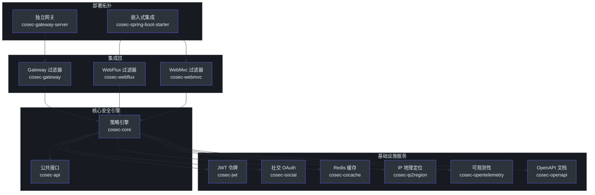
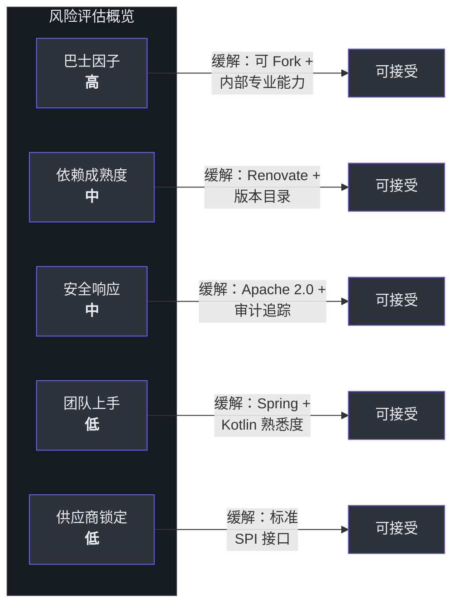
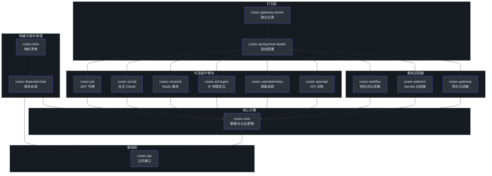

# 管理者指南

> **目标读者**：CTO、工程副总裁、安全负责人，以及正在评估或采纳 CoSec 的技术决策者。

---

## 系统概述

CoSec 是一个开源的、基于 RBAC 和策略驱动的安全框架，专为现代 JVM 应用打造。它以嵌入式库组件的形式提供认证、授权和多租户安全能力——而非独立的安全网关设备——使团队能够将安全直接融入微服务架构中。

| 属性 | 详情 |
|---|---|
| **开源许可** | Apache 2.0（宽松许可，适合生产环境使用） |
| **编程语言** | Kotlin，运行于 JVM（Java 17+） |
| **并发模型** | 响应式（Project Reactor）——全链路非阻塞 I/O |
| **框架集成** | Spring Boot 4、Spring Cloud Gateway 2025.x |
| **代码规模** | 约 18,000 行 Kotlin 代码，328 个源文件，102 个测试文件 |
| **模块数量** | 15 个模块（12 个可发布库、2 个 BOM、1 个独立服务器） |
| **发布节奏** | 活跃——自 2025 年 1 月以来 424 次提交，最新版本 v4.3.5 |
| **仓库地址** | [github.com/Ahoo-Wang/CoSec](https://github.com/Ahoo-Wang/CoSec) |

**核心价值**：CoSec 通过将策略驱动的授权能力直接嵌入应用代码，消除了对独立安全网关基础设施层的依赖。这降低了延迟，简化了部署拓扑，并使开发团队能够在服务边界处对访问决策实现精细控制。

---

## 能力地图

下表将 CoSec 的技术能力映射到业务成果，帮助管理层将技术特性与组织影响力关联起来。

| 能力 | 技术机制 | 业务影响 |
|---|---|---|
| **基于策略的授权** | 类似 AWS IAM 的模型，支持 Effect（ALLOW/DENY）、ActionMatcher 和 ConditionMatcher | 将新增访问规则的实施周期从数天缩短至数小时；策略即代码，满足审计要求 |
| **多租户隔离** | 一等公民 `TenantPrincipal` 和基于 `TenantCapable` 的租户作用域策略 | 实现 SaaS 多租户而无需为每个客户单独部署 |
| **JWT 认证** | 通过 `com.auth0:java-jwt` 进行令牌签发与验证 | 无状态认证可水平扩展，不依赖会话存储 |
| **社交 OAuth 登录** | 通过 JustAuth 集成 GitHub、Google、微信等 30+ 提供商 | 利用现有身份提供商，加速用户注册与登录流程 |
| **速率限制** | `RateLimiterConditionMatcher` 和 `GroupedRateLimiterConditionMatcher` 作为策略条件 | 无需外部限流基础设施即可保护 API 免受滥用 |
| **IP 地理定位** | 集成 `ip2region` 为请求上下文补充地理数据 | 支持基于地理位置的访问策略，满足数据驻留合规要求 |
| **分布式缓存** | 通过 CoCache 实现 Redis 支持的策略和权限缓存 | 亚毫秒级授权查询；消除重复的策略反序列化开销 |
| **可观测性** | 通过 `cosec-opentelemetry` 提供 OpenTelemetry 埋点 | 完整的请求级别认证决策追踪，用于审计和故障排查 |
| **OpenAPI 集成** | 通过 `cosec-openapi` + springdoc 提供 Bearer Token 注解 | API 规范中自动生成安全要求文档 |
| **黑名单执行** | 授权流水线中的 `BlacklistChecker` | 即时事件响应能力——快速封禁被入侵的账户或 IP |

---

## 架构概览

CoSec 采用分层架构，公共 API 契约（`cosec-api`）与实现（`cosec-core`）严格分离，集成模块为每种部署拓扑提供轻量级适配器。

**关键架构决策及其影响：**

- **全链路响应式**：每次授权检查都返回 `Mono<AuthorizeResult>`，实现非阻塞 I/O。这意味着 CoSec 在高并发场景下增加的延迟开销几乎可以忽略——对于处理每秒数千请求的网关部署至关重要。
- **API/实现分离**：`cosec-api` 零框架依赖，可安全地在领域模块中引用而不会引入 Spring。这强制了清晰的架构边界。
- **基于 SPI 的可扩展性**：自定义策略匹配器通过 Java SPI（`META-INF/services`）注册，无需修改核心代码。新增条件类型（例如时间段限制、自定义 Header 检查）可以在不 fork 项目的情况下实现。
- **单人维护 + 自动化辅助**：自 2024 年以来，主要作者贡献了 252 次提交，Renovate 机器人贡献了 342 次提交（自动化依赖更新）。机器人负责依赖更新，维护者专注于功能开发。

---

## 团队拓扑

了解 CoSec 的维护团队构成和协作方式，对采纳风险评估至关重要。

| 维度 | 发现 | 依据 |
|---|---|---|
| **主要维护者** | Ahoo Wang（ahoowang@qq.com） | Git 作者分析：自 2024 年以来 252 次提交 |
| **自动化程度** | Renovate 机器人处理依赖更新 | 342 次机器人提交用于依赖版本升级 |
| **CI/CD 成熟度** | GitHub Actions，并行测试任务，代码覆盖率，签名发布 | `.github/workflows/` 下 6 个工作流文件 |
| **测试基础设施** | JUnit 5 + MockK + FluentAssert；集成测试使用 Redis 服务容器 | CI 运行 7 个并行模块测试任务；Redis 相关模块使用服务容器 |
| **发布流程** | Git 标签创建时自动发布到 Sonatype Central + GitHub Packages | `package-deploy.yml` 在 `release: created` 事件触发 |
| **社区生态** | Apache 2.0 开源；通过 GitHub 管理议题和 PR | POM 元数据引用 GitHub Issue Tracker |

**采纳者须知**：CoSec 是一个由自动化支撑的单人维护项目。这在成熟、专注的基础设施库中很常见（类似许多 Spring 生态项目的早期阶段），但确实意味着"巴士因子"为 1。采纳 CoSec 的组织应规划内部补丁贡献能力，以备不时之需。

---

## 技术投资分析

### 为什么响应式、策略驱动的安全现在至关重要

行业正在趋同于两大模式，而 CoSec 已经围绕它们构建：

1. **策略即代码（Policy-as-Code）**（AWS IAM、Open Policy Agent、Cedar）：声明式策略可版本化、可测试、可审计——替代分散在各服务中的硬编码角色检查。
2. **响应式/非阻塞 I/O**（Project Reactor、虚拟线程）：随着服务水平扩展，阻塞式安全检查会成为吞吐量瓶颈。CoSec 的响应式核心从根本上避免了这个问题。

### 战略定位

| 因素 | 评估 |
|---|---|
| **与 Spring 生态的契合度** | 紧密——基于 Spring Boot 4 和 Spring Cloud 2025.x，当前最新主要版本 |
| **Kotlin 采用趋势** | Kotlin 是新 Spring Boot 项目的首选语言；CoSec 的 API 为 Kotlin 原生设计，同时完全兼容 Java |
| **竞争替代方案** | Spring Security ACL（复杂）、Keycloak（重量级）、OPA（需要 sidecar/daemon） |
| **独特价值主张** | 唯一将 IAM 风格策略、多租户和响应式授权结合为可嵌入库的框架 |

---

## 风险评估

每一项技术采纳决策都伴随风险。下表识别了关键风险、严重程度和建议的缓解措施。

| 风险 | 严重程度 | 可能性 | 影响 | 缓解措施 |
|---|---|---|---|---|
| **单人维护** | 高 | 中 | 修复延迟、开发停滞 | 确保 Fork 就绪；分配内部贡献者时间；监控提交节奏（目前 1-2 次/天） |
| **Spring Boot 版本滞后** | 中 | 低 | Spring 大版本升级时的破坏性变更 | 依赖目录（`cosec-dependencies`）集中管理版本；Renovate 机器人自动更新；已支持 Spring Boot 4 |
| **安全漏洞响应** | 中 | 中 | 补丁发布前的暴露窗口 | Apache 2.0 许可允许自行修复；SPI 边界限制影响范围；未观察到关键 CVE 历史 |
| **Kotlin 生态熟悉度** | 低 | 低 | 纯 Java 团队上手较慢 | Kotlin 编译为 JVM 字节码；Spring 知识可直接迁移；API 设计遵循标准模式 |
| **供应商锁定** | 低 | 极低 | 替换 CoSec 时的迁移成本 | 接口定义在 `cosec-api`（无框架依赖）；基于 SPI 的匹配器；标准 JWT/OAuth 协议 |

---

## 成本与扩展模型

理解运维成本特征有助于容量规划和预算制定。

| 维度 | 详情 | 成本影响 |
|---|---|---|
| **许可费用** | Apache 2.0——无许可费用，无使用限制 | 零许可成本；商业使用无需法务审查 |
| **运行时开销** | 响应式非阻塞；策略评估基于内存流式处理 | 每请求 CPU 占用极低；无线程阻塞 |
| **基础设施依赖** | Redis（可选，用于缓存）、JWT 库（进程内） | Redis 根据云服务商层级约 50-200 美元/月；低流量部署非必需 |
| **部署拓扑** | 嵌入式（无 sidecar）或独立网关 | 嵌入式模式零额外基础设施；独立网关为一个 JVM 进程 |
| **扩展行为** | 水平扩展——无状态授权，Redis 缓存之外无共享状态 | 随应用实例线性扩展；Redis 独立扩展 |
| **维护负担** | Renovate 机器人处理依赖更新；Detekt 强制代码质量 | 人工依赖管理极少；静态分析在合并前捕获回归问题 |

**替代方案成本对比：**

| 方案 | 基础设施成本 | 运维复杂度 | 延迟 |
|---|---|---|---|
| **CoSec 嵌入式** | 零额外基础设施 | 低 | 亚毫秒（进程内） |
| **独立认证网关** | 额外的网关实例 | 中 | +1-5ms（网络跳转） |
| **Keycloak** | 专用服务器 + 数据库 | 高 | +2-10ms（令牌自省） |
| **OPA Sidecar** | 每服务一个 Sidecar | 中 | +1-3ms（本地 gRPC） |

---

## 依赖地图

CoSec 的模块依赖关系决定了集成复杂度和变更的影响范围。

**关键依赖洞察：**

| 关系 | 类型 | 影响 |
|---|---|---|
| `cosec-core` 依赖 `cosec-api` | 编译依赖 | 核心模块必须与 API 共存；API 始终可用 |
| 插件模块依赖 `cosec-core` | 编译依赖 | 任何插件都会引入完整的策略引擎 |
| `cosec-spring-boot-starter` 聚合所有插件 | 编译依赖 | 选择 starter 即意味着接受所有插件的传递依赖 |
| `cosec-gateway-server` 依赖 `cosec-spring-boot-starter` | 编译依赖 | 网关服务器是最重的部署产物 |
| `cosec-dependencies` 为纯 BOM 模块 | 平台依赖 | 控制所有版本锁定；依赖版本管理的唯一真实来源 |
| `cosec-gateway-server` 不对外发布 | 构建产物 | 仅内部使用；不发布到 Maven Central |

**支持选择性采纳**：团队可以仅依赖 `cosec-api` + `cosec-core` + 特定插件（例如仅 JWT 和 WebFlux），而无需引入社交登录、OpenTelemetry 或网关组件。

---

## 关键指标与可观测性

CoSec 提供了内置的可观测性钩子，使工程团队能够在生产环境中监控安全态势。

| 指标/信号 | 来源 | 业务价值 |
|---|---|---|
| **授权决策追踪** | 通过 `cosec-opentelemetry` 提供 OpenTelemetry Span | 完整审计追踪：谁在何时访问了什么，以及哪条策略允许/拒绝了访问 |
| **策略匹配率** | `SimpleAuthorization` 中的 Debug 级别日志 | 识别未使用的策略以进行清理；检测过度宽松的配置 |
| **隐式拒绝率** | 授权结果监控 | 高隐式拒绝率表明策略覆盖不足或配置过于严格 |
| **速率限制触发** | `RateLimiterConditionMatcher` 异常 | 检测滥用模式；基于实际流量调整限流阈值 |
| **黑名单命中** | `BlacklistChecker` 日志条目 | 衡量事件响应黑名单机制的有效性 |
| **认证失败** | JWT 验证和社交认证错误路径 | 检测凭证填充攻击或 OAuth 提供商配置异常 |
| **缓存命中率** | CoCache Redis 操作 | 优化缓存 TTL；确保策略查询保持高性能 |

**CI/CD 质量门禁**（依据 `.github/workflows/`）：

| 门禁 | 工具 | 覆盖范围 |
|---|---|---|
| 单元与集成测试 | JUnit 5 + Testcontainers | 7 个并行 CI 任务，覆盖 core、JWT、social、cocache、webflux、webmvc、starter |
| 静态分析 | Detekt 1.23.8，支持自动修正 | 所有源文件强制执行；配置文件位于 `config/detekt/detekt.yml` |
| 代码覆盖率 | JaCoCo | 通过 `code-coverage-report` 模块生成报告 |
| 依赖时效性 | Renovate 机器人 | 自动创建版本升级 PR |
| 签名发布 | CI 中 PGP 签名 | 所有 Maven Central 构件均经过 GPG 签名 |

---

## 路线图契合度

CoSec 与常见工程组织优先级的契合情况。

| 组织优先级 | CoSec 契合点 | 说明 |
|---|---|---|
| **零信任架构** | 默认隐式拒绝的策略模型 | 每个请求都经过评估；无全局通行授权 |
| **多租户 SaaS** | 一等公民租户模型 | `TenantPrincipal`、租户作用域策略、`InTenantConditionMatcher` |
| **平台工程** | 可嵌入库模型 | 无需单独的平台团队来运维认证基础设施 |
| **API 优先开发** | OpenAPI 集成，支持 Bearer Token 注解 | 安全要求在 API 契约中可见 |
| **可观测性驱动运维** | 授权决策的 OpenTelemetry Span | 与现有 Grafana/Datadog/Honeycomb 管道集成 |
| **法规合规** | 通过策略评估日志提供审计追踪 | 策略即代码满足 SOC 2、ISO 27001 审计要求 |
| **成本优化** | 嵌入式模式无额外基础设施 | 消除网关许可和运维开销 |

---

## 技术债务总结

对需要关注领域的透明评估。

| 领域 | 状态 | 依据 | 建议措施 |
|---|---|---|---|
| **测试覆盖广度** | 良好 | 102 个测试文件覆盖 328 个源文件（1:3.2 比例）；所有模块均有测试套件 | 保持当前标准；为多租户场景增加集成测试 |
| **依赖时效性** | 优秀 | Renovate 机器人产生 342 次自动更新提交；Spring Boot 4.0.5、Kotlin 2.3.20 | 无需额外行动——自动化流程已覆盖 |
| **代码质量工具** | 强健 | Detekt 静态分析，支持自动修正，构建时强制执行 | 无需额外行动 |
| **文档** | 增长中 | 近期新增 VitePress Wiki，支持 i18n；CLAUDE.md 用于 AI 辅助开发 | 持续投入，为采纳者提供运维手册 |
| **单人维护集中度** | 已认知 | 1 名维护者 + 自动化机器人；仅 2025 年就有 424 次提交 | 预算分配用于内部贡献者培训；考虑赞助该项目 |
| **JMH 基准测试覆盖** | 存在但有限 | 每个模块已配置 JMH 插件；但基准测试结果未发布 | 发布基准测试结果，跟踪各版本的性能回归 |

---

## 建议

以下建议按影响力和紧迫性排序。

### 1. 从嵌入式模式开始，快速获取价值（优先级：高）

使用 `cosec-spring-boot-starter` 将 CoSec 嵌入现有的 Spring Boot 服务。这不需要任何额外基础设施，即可在数天内获得策略驱动的授权能力，而非花费数月自建角色检查机制。WebFlux 集成路径的文档最为完善。

### 2. 建立内部贡献者能力（优先级：高）

鉴于单人维护模式，应指定一至两名工程师深入了解 CoSec 代码库。发现 Bug 时向上游贡献补丁。这既可对冲巴士因子风险，又可加速内部支持。模块化架构（特别是 `cosec-api` / `cosec-core` 的清晰分离）使 Kotlin 工程师的上手过程非常直接。

### 3. 从第一天起采用策略即代码实践（优先级：高）

将 CoSec 策略存储在版本控制中。使用 `LocalPolicyInitializer` 在启动时从类路径加载策略。以对待代码变更的同等严谨性对待策略变更——Pull Request 审查、自动化测试、分阶段发布。这建立了合规框架所需的审计追踪。

### 4. 从一开始就投入可观测性（优先级：中）

立即启用 `cosec-opentelemetry`。授权决策追踪是生产环境中调试访问问题的最有价值信号。将追踪数据连接到现有的可观测性平台。没有这一能力，排查"为什么这个请求被拒绝"将变成手动翻日志的苦差事。

### 5. 评估选择性模块采纳以最小化依赖足迹（优先级：低）

如果服务仅需要 JWT 认证和 WebFlux 授权，可以直接依赖 `cosec-api`、`cosec-core`、`cosec-jwt` 和 `cosec-webflux`——跳过 spring-boot-starter 聚合器。这减少了传递依赖数量和类路径复杂度。本文档中的依赖地图清晰展示了每种能力所需的模块。
