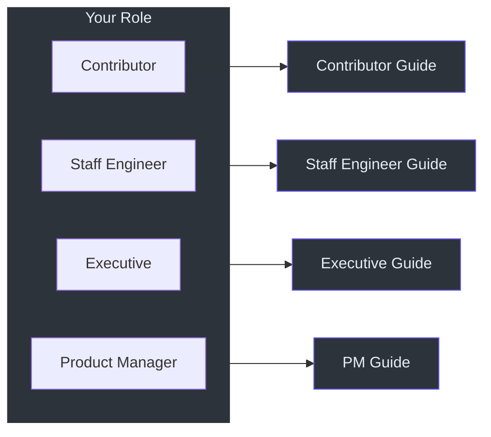

# 入门指南

选择最适合您角色的指南：

| 指南 | 受众 | 重点 | 长度 |
|------|------|------|------|
| [贡献者指南](./contributor) | 新的开源贡献者 | 环境搭建、代码库概览、测试、PR 流程 | 全面详细 |
| [高级工程师指南](./staff-engineer) | 高级/首席工程师 | 架构、设计权衡、系统图 | 精炼、有主见 |
| [管理者指南](./executive) | VP/总监级别领导 | 能力图谱、风险评估、投资分析 | 无代码 |
| [产品经理指南](./product-manager) | PM 和利益相关者 | 用户旅程、功能图谱、局限性、FAQ | 零术语 |

## 快速导航

