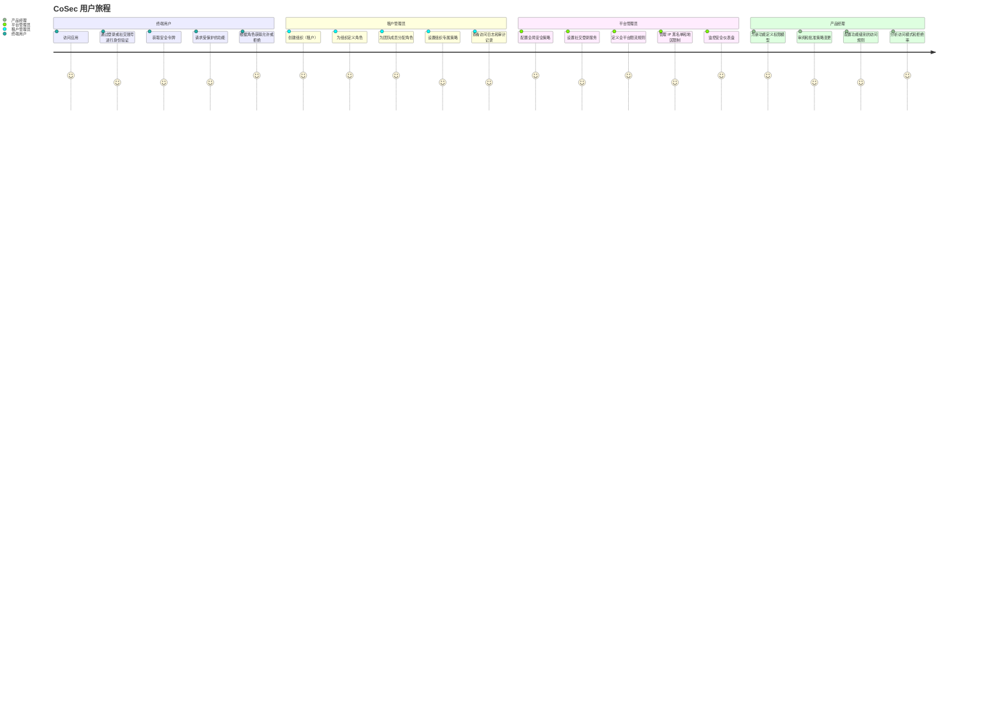
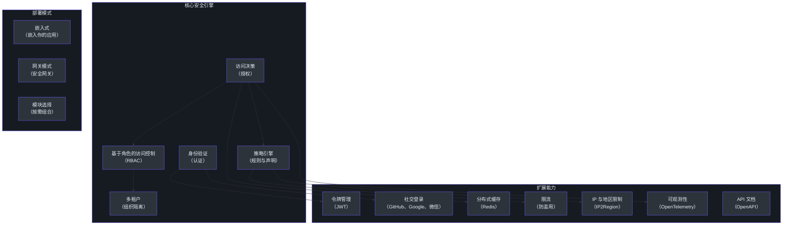
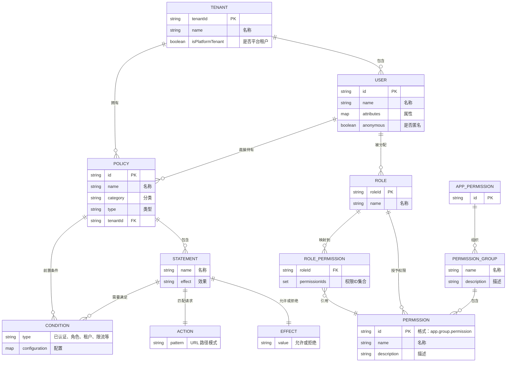
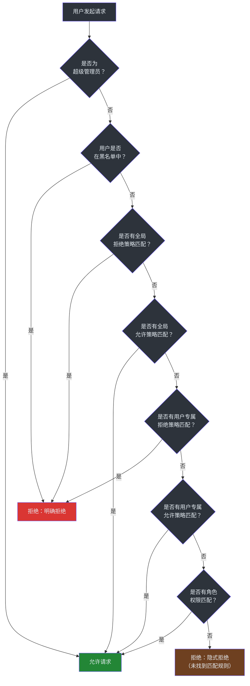

# 产品经理指南

欢迎来到 CoSec。本指南从产品视角介绍这个安全框架 — 它能做什么、为用户解决了什么问题，以及它的能力如何转化为产品决策。全程不涉及工程术语。

---

## 系统简介

CoSec 是一个安全框架，控制**谁可以访问什么**。可以把它想象为你软件的可编程门卫：它验证身份（认证）并执行访问规则（授权）。

有三个亮点值得产品团队关注：

1. **原生多租户。** 每个客户组织拥有独立的安全规则、角色和策略 — 开箱即用。
2. **策略驱动权限。** 访问规则以人类可读的 JSON 策略定义，类似于 AWS IAM。产品经理和安全团队可以在不触碰应用代码的情况下审阅、版本控制和审计这些策略。
3. **灵活部署。** 它可以嵌入你现有的应用内部运行，也可以作为独立的安全网关部署在所有服务的前面。

| 业务问题 | CoSec 如何解决 |
|---|---|
| "谁能访问这个功能？" | 基于角色和策略的授权机制评估每一个请求 |
| "每个客户需要自己的安全规则" | 内置多租户隔离，每个组织拥有独立的策略、角色和权限 |
| "我们需要支持社交登录" | 支持 GitHub、Google、微信等 30+ 社交账号登录 |
| "我们需要防止 API 滥用" | 限流功能内置在策略层中 |
| "合规要求审计追踪" | 每个访问决策都记录了原因（允许、明确拒绝、隐式拒绝） |
| "我们想按地区或 IP 限制访问" | 条件匹配器支持 IP 范围、地理区域、时间窗口和自定义逻辑 |

---

## 用户旅程图

下图展示了不同类型的用户如何在整个生命周期中与 CoSec 交互。

---

## 功能能力图

CoSec 由多个模块化能力组成。每个模块可以独立使用，也可以组合使用。

### 能力详情

| 能力 | 功能说明 | 产品影响 |
|---|---|---|
| **认证** | 通过检查凭据（用户名/密码、社交登录、API 密钥）验证用户身份 | 支持多种登录方式，无需为每种方式单独开发 |
| **授权** | 在每次请求时决定已认证用户被允许执行什么操作 | 每个功能访问都根据定义的规则实时检查 |
| **策略引擎** | 以 JSON 策略定义的访问规则（允许/拒绝效果）进行评估 | 安全规则可以通过编辑 JSON 文件修改，无需重新部署应用 |
| **RBAC** | 将权限分配给命名角色，再将角色分配给用户 | 经典的"管理员 / 编辑者 / 查看者"模型 — 终端用户容易理解 |
| **多租户** | 按客户组织隔离安全规则 | 一个平台服务多个客户，每个客户有独立的安全边界 |
| **社交登录** | 让用户使用 GitHub、Google、微信等 30+ 服务商的现有账号登录 | 减少注册摩擦 — 不需要记住新密码 |
| **JWT 令牌** | 颁发有时效的令牌（默认：10 分钟访问令牌，7 天刷新令牌） | 用户保持登录状态但不会永久有效；令牌自动过期 |
| **限流** | 限制用户或 IP 每秒可以发起的请求数量 | 防止滥用并保护服务稳定性 |
| **IP 与地区限制** | 根据 IP 地址范围或地理区域允许或拒绝访问 | 满足区域数据访问合规要求 |
| **分布式缓存** | 在 Redis 中缓存策略和权限查询结果，附带本地回退 | 即使在高负载下授权检查也保持快速 |
| **可观测性** | 通过 OpenTelemetry 追踪每一个授权决策 | 运维团队可以准确看到请求被允许或拒绝的原因 |
| **API 文档** | 为受保护的接口自动生成 Swagger/OpenAPI 文档 | 减少产品团队和工程团队之间的沟通摩擦 |

---

## 数据模型（产品视角）

下图从产品角度展示了核心安全概念之间的关系。

### 核心数据关系说明

| 关系 | 产品含义 |
|---|---|
| **租户包含用户** | 每个组织有自己的用户集合，与其他组织完全隔离 |
| **用户被分配角色** | 用户 A 在组织 A 可以是"管理员"，同时在组织 B 是"查看者" |
| **角色授予权限** | "编辑者"角色可能包含"创建文档"和"编辑文档"等权限 |
| **策略包含声明** | 一个策略将多条规则捆绑在一起（例如，"管理后台的所有规则"） |
| **声明有效果** | 每条规则要么是"允许"，要么是"拒绝" — "拒绝"在冲突时始终优先 |
| **声明匹配动作** | 动作是一个 URL 模式，如 `/api/orders/*`，规则适用于匹配该模式的请求 |
| **声明需要满足条件** | 附加检查，如"用户必须已登录"或"请求必须来自允许的 IP 范围" |
| **租户拥有策略** | 每个组织可以定义自己的访问规则，与平台级规则独立 |

---

## 授权决策流程

当用户尝试执行某项操作时，系统按以下流程决定是否允许。这是产品决策中最重要的流程。

### 决策结果

| 结果 | 含义 | 何时发生 |
|---|---|---|
| **允许** | 用户可以继续操作 | 找到了匹配的"允许"规则 |
| **明确拒绝** | 用户被特定规则阻止 | 找到了匹配的"拒绝"规则（优先级高于任何"允许"规则） |
| **隐式拒绝** | 用户因为没有规则覆盖此操作而被阻止 | 完全没有匹配的规则 — 这是所有操作的默认结果 |
| **令牌过期** | 用户的登录会话已超时 | JWT 访问令牌已超过有效期 |
| **请求过于频繁** | 超出限流阈值 | 用户或 IP 每秒发送的请求数超过了允许值 |

---

## 配置与功能开关

CoSec 使用统一的配置前缀（`cosec.*`），各功能开关可以独立控制。这些设置在应用的配置文件（如 `application.yml`）中完成。

### 功能开关

| 开关 | 默认值 | 控制范围 |
|---|---|---|
| `cosec.enabled` | `true` | 主开关 — 启用或关闭整个安全框架 |
| `cosec.authentication.enabled` | `true` | 是否启用身份验证 |
| `cosec.authorization.enabled` | `true` | 是否启用访问控制检查 |
| `cosec.authorization.local-policy.enabled` | `false` | 从本地 JSON 文件加载安全策略（而非远程存储） |
| `cosec.authorization.local-policy.force-refresh` | `false` | 每次启动时强制重新读取策略文件 |
| `cosec.authorization.gateway.enabled` | `true` | 是否启用 Spring Cloud Gateway 集成 |
| `cosec.jwt.enabled` | `true` | 是否启用 JWT 令牌支持 |
| `cosec.authorization.cache.enabled` | `true` | 是否启用策略和权限缓存 |
| `cosec.opentelemetry.enabled` | `true` | 是否启用安全决策追踪 |

### 令牌配置

| 设置项 | 默认值 | 说明 |
|---|---|---|
| `cosec.jwt.algorithm` | `HMAC256` | 令牌签名方式（HMAC256、HMAC384 或 HMAC512） |
| `cosec.jwt.secret` | （必填） | 用于签名和验证令牌的密钥 |
| `cosec.jwt.token-validity.access` | 10 分钟 | 访问令牌的有效时长，过期后需要刷新 |
| `cosec.jwt.token-validity.refresh` | 7 天 | 刷新令牌的有效时长，过期后需要重新登录 |

### 缓存配置

| 设置项 | 默认值 | 说明 |
|---|---|---|
| `cosec.authorization.cache.enabled` | `true` | 启用策略查询缓存 |
| `cosec.authorization.cache.policy.maximum-size` | 无限制 | 缓存策略的最大数量 |
| `cosec.authorization.cache.policy.expire-after-write` | 无限制 | 缓存策略的刷新时间 |
| `cosec.authorization.cache.role.maximum-size` | 无限制 | 缓存角色权限的最大数量 |
| `cosec.authorization.cache.role.expire-after-write` | 无限制 | 缓存角色权限的刷新时间 |

### 策略类型

| 类型 | 管理者 | 编辑权限 | 使用场景 |
|---|---|---|---|
| **GLOBAL（全局）** | 平台管理员 | 仅平台管理员 | 适用于所有人的规则，如"允许匿名访问登录页面" |
| **SYSTEM（系统）** | 平台管理员 | 仅平台管理员（用户不可删除） | 构成安全基线的内置规则 |
| **CUSTOM（自定义）** | 租户管理员 | 租户管理员在所属组织内编辑 | 客户专属规则，如"我们的编辑者可以访问报表仪表盘" |

---

## API 能力

CoSec 通过定义清晰的接口向应用开发者暴露其功能。从产品视角来看，以下是系统能做的事情。

### 认证能力

| 能力 | 说明 | 用户体验 |
|---|---|---|
| **凭据登录** | 用户名/密码验证 | 标准登录表单 |
| **社交登录** | 通过第三方服务商进行 OAuth 登录 | "使用 GitHub / Google / 微信登录"按钮 |
| **令牌颁发** | 登录成功后生成访问令牌和刷新令牌 | 用户在多个会话中保持登录状态 |
| **令牌刷新** | 无需重新输入凭据即可延长会话 | 用户无感知 — 刷新过程对用户透明 |
| **匿名访问** | 允许未认证用户访问公开接口 | 登录提示仅在访问受保护功能时出现 |

### 授权能力

| 能力 | 说明 | 产品使用场景 |
|---|---|---|
| **路径匹配** | 匹配 URL 模式的规则，如 `/api/orders/*` | 用一条规则保护整个功能区域 |
| **方法匹配** | 匹配 HTTP 方法（GET、POST、PUT、DELETE）的规则 | "查看者只能看，不能编辑" |
| **通配符匹配** | 一条规则覆盖所有接口 | 对黑名单用户的全局拒绝 |
| **基于角色的权限** | 权限分配给命名角色 | "管理员"、"编辑者"、"查看者"等访问级别 |
| **用户专属策略** | 直接为单个用户分配策略 | 为特定用户临时授予更高权限 |
| **组合条件** | 使用 AND/OR 逻辑组合多个条件 | "已登录 且（是管理员 或 请求来自办公网络）时允许" |

### 条件匹配器

| 匹配器 | 检查内容 | 示例 |
|---|---|---|
| **已认证** | 用户是否已登录？ | "只有已登录用户才能访问" |
| **属于角色** | 用户是否拥有特定角色？ | "只有管理员才能执行此操作" |
| **属于租户** | 用户是否属于特定组织？ | "只有某某公司的用户才能看到" |
| **限流器** | 用户是否超出了请求限制？ | "每秒最多 10 次请求" |
| **分组限流器** | 按分组的限流（如按 IP 分组） | "每个 IP 每秒最多 10 次请求" |
| **路径匹配** | 请求值是否匹配路径模式？ | "仅允许以 192.168 开头的 IP 请求" |
| **等于** | 值是否等于预期字符串？ | "仅允许此特定租户 ID" |
| **包含** | 值是否包含某子串？ | "仅允许地区包含'上海'的请求" |
| **开头是** | 值是否以某前缀开头？ | "仅允许来自中国的请求" |
| **结尾是** | 值是否以某后缀结尾？ | "仅允许以特定 IP 结尾的请求" |
| **在列表中** | 值是否在允许值集合中？ | "仅允许这些特定用户 ID" |
| **正则表达式** | 值是否匹配某个模式？ | "仅允许来自 github.com 域名的请求" |
| **布尔逻辑（AND/OR）** | 组合多个条件 | 复杂逻辑组合 |
| **OGNL 表达式** | 执行自定义表达式 | 高级自定义逻辑 |
| **SpEL 表达式** | 执行 Spring 表达式语言 | 高级自定义逻辑 |

---

## 性能与 SLA

### 授权决策速度

| 场景 | 处理方式 | 性能说明 |
|---|---|---|
| **超级管理员请求** | 立即允许，不进行策略评估 | 最快路径 — 仅做一次身份检查 |
| **缓存命中** | 策略和权限数据从 Redis 或本地缓存获取 | 亚毫秒级查询 |
| **缓存未命中** | 从存储加载策略数据，然后缓存 | 每个用户的首次请求可能较慢；后续请求很快 |
| **超出限流** | 在策略评估之前立即拒绝 | 快速路径 — 避免浪费处理资源 |

### 缓存架构

系统使用两级缓存来存储策略和权限数据：

- **一级缓存（本地）：** 每个应用实例内的内存缓存。可配置大小、过期时间和并发设置。
- **二级缓存（分布式）：** 基于Redis 的跨实例共享缓存。确保策略变更传播到所有实例。

这种两级方式意味着大多数授权检查不需要离开应用实例，同时在策略变更时仍然确保一致性。

### 可扩展性

| 维度 | 表现 |
|---|---|
| **租户数量** | 没有硬性限制 — 租户隔离是逻辑层面的（每个请求携带租户 ID），而非物理隔离 |
| **每个租户的策略数** | 策略按 ID 索引；策略内声明的评估是线性的 |
| **用户数量** | 每个用户携带自己的角色和策略；不存在因用户数导致的扩展瓶颈 |
| **并发请求** | 授权检查是无状态且独立的 — 随应用实例水平扩展 |

---

## 已知限制与约束

| 限制 | 影响 | 应对措施 |
|---|---|---|
| **策略变更需要传播时间** | 策略更新需要时间才能到达所有缓存实例 | 可以调整缓存过期时间；支持强制刷新 |
| **默认令牌有效期较短** | 访问令牌默认 10 分钟后过期 | 刷新令牌（默认 7 天）自动处理会话延续 |
| **拒绝始终优先** | 一条"拒绝"规则会覆盖任意数量的"允许"规则 | 这是设计如此（安全优先），但需要谨慎编写策略 |
| **没有内置管理界面** | 策略以 JSON 文件编写或存储在外部 | 使用提供的 JSON Schema 进行 IDE 验证；可以在 API 之上构建管理界面 |
| **社交登录依赖第三方服务商** | 如果 GitHub / Google / 微信服务不可用，对应登录方式会失败 | 如果配置了凭据登录，用户可以回退到该方式 |
| **本地限流器是单进程的** | 单个实例内的限流器不会跨实例聚合 | 使用分组限流器配合共享存储实现分布式限流 |
| **超级管理员绕过所有检查** | 超级管理员拥有不受限制的访问权限 | 将超级管理员凭据限制在少数平台管理员手中 |
| **没有内置用户管理** | CoSec 不管理用户账号、密码或个人资料 | 这由你的应用或独立的身份提供商处理 |

---

## 数据与隐私

### CoSec 处理的数据

| 数据类别 | 说明 | 敏感级别 |
|---|---|---|
| **用户身份** | 用户 ID、角色、策略、自定义属性 | 高 — 包含身份信息 |
| **租户信息** | 组织 ID、租户类型 | 中 — 业务结构数据 |
| **安全令牌** | JWT 访问令牌和刷新令牌 | 高 — 授予系统访问权限 |
| **授权决策** | 谁访问了什么以及是否被允许的日志 | 中 — 审计追踪数据 |
| **请求元数据** | IP 地址、地理区域、请求路径 | 中 — 可能被视为个人数据 |

### 隐私考量

| 关注点 | CoSec 如何应对 |
|---|---|
| **租户间数据隔离** | 每个策略、角色和权限都绑定到租户 ID。一个组织无法看到另一个组织的安全规则。 |
| **令牌安全** | 令牌使用 HMAC（256/384/512 位）签名。签名密钥从不传输 — 只有令牌本身在网络上传递。 |
| **IP 处理** | IP 地址用于地区限制和限流，但 CoSec 本身不存储 IP 地址。你的应用控制数据保留策略。 |
| **审计追踪** | 每个授权决策包含原因说明。你控制这些日志存储在哪里以及保留多久。 |
| **匿名访问** | CoSec 区分匿名用户和已认证用户。公开接口可以显式配置，不会暴露受保护的数据。 |
| **超级管理员** | 超级管理员 ID 通过系统属性配置，不存储在用户数据库中。它是特殊情况的绕过机制，不是普通用户账号。 |

### 合规就绪度

CoSec 的策略驱动设计支持常见的合规要求：

- **最小权限原则：** 隐式拒绝意味着用户只在被明确授权时才能获得访问。
- **职责分离：** 可以分配不同角色，确保没有任何单个用户拥有不受约束的权力。
- **审计日志：** 每个授权决策都可追踪并附有原因。
- **数据驻留：** 基于 IP 和地区的条件可以限制特定区域的访问。
- **访问审查：** 策略以 JSON 定义 — 可以像任何其他配置一样进行版本控制、审阅和审计。

---

## 术语表

| 术语 | 通俗解释 |
|---|---|
| **认证（Authentication）** | 弄清楚用户是谁的过程（就像在门口出示身份证） |
| **授权（Authorization）** | 决定用户可以做什么的过程（就像检查你的工牌能否打开特定的门） |
| **策略（Policy）** | 一组访问规则的集合，定义了某人能做或不能做什么 |
| **声明（Statement）** | 策略中的一条规则（例如，"允许编辑文档"） |
| **效果（Effect）** | 声明是允许还是拒绝访问（只有两个选项：允许和拒绝） |
| **主体（Principal）** | 发起请求的用户或自动化系统 |
| **租户（Tenant）** | 拥有独立用户、角色和安全规则集的组织或工作空间 |
| **角色（Role）** | 一组命名的权限集合（例如，"管理员"可以做所有事情，"查看者"只能阅读） |
| **权限（Permission）** | 可以授予角色或用户的具体操作（例如，"创建订单"、"删除用户"） |
| **动作匹配器（Action Matcher）** | 根据 URL 路径决定策略声明适用于哪些请求的规则 |
| **条件匹配器（Condition Matcher）** | 规则生效前必须满足的附加条件（例如，"用户必须已登录"） |
| **限流（Rate Limiting）** | 对用户或 IP 地址在给定时间内可以发起的请求数量设置上限 |
| **JWT** | 一种安全令牌，证明用户已登录。包含编码的身份信息和过期时间。 |
| **访问令牌（Access Token）** | 短期 JWT（默认 10 分钟），证明用户当前已通过认证 |
| **刷新令牌（Refresh Token）** | 较长期的令牌（默认 7 天），用于获取新的访问令牌而无需重新输入凭据 |
| **RBAC** | 基于角色的访问控制 — 先把权限分配给角色，再把角色分配给用户 |
| **隐式拒绝（Implicit Deny）** | 当没有规则匹配请求时的默认结果 — 除非明确允许，否则一律拒绝 |
| **明确拒绝（Explicit Deny）** | 一条明确说"拒绝此操作"的规则 — 始终覆盖任何允许规则 |
| **SPI** | 服务提供者接口 — 一种允许开发者添加自定义规则类型而不修改框架的机制 |
| **网关（Gateway）** | 独立的安全层，位于你的服务前面，检查每一个传入的请求 |
| **OpenTelemetry** | 一种可观测性标准，让你可以追踪每个请求期间发生了什么 |
| **CoCache** | CoSec 使用的缓存库，将策略查询结果存储在 Redis 和本地内存中以实现快速访问 |
| **IP2Region** | 将 IP 地址映射到地理区域（国家、省份、城市）的库 |
| **OGNL / SpEL** | 表达式语言，允许在策略中使用高级自定义条件（例如，"检查用户的部门是否是'工程部'"） |

---

## 常见问题

### 1. 用户尝试访问不允许的内容时会发生什么？

系统返回"明确拒绝"结果。在实际操作中，应用收到拒绝请求的信号，通常会向用户显示 403 禁止访问的提示。决策包含一个原因字符串，用于日志记录和排查。

### 2. 不同客户（租户）可以有完全不同的安全规则吗？

可以。每个租户拥有自己的策略、角色和权限。租户 A 的"管理员"角色可以拥有与租户 B 的"管理员"角色不同的权限。系统完全隔离这些配置 — 一个租户永远无法看到或影响另一个租户的安全设置。

### 3. 如果我们添加了新功能但忘记创建安全规则怎么办？

访问默认被拒绝（隐式拒绝）。如果没有策略明确允许访问新功能，用户将被阻止。这是安全优先的设计 — 意外阻止一个功能比意外暴露它更安全。

### 4. 如何处理需要临时提升为管理员的用户？

为用户分配一个专属策略，授予额外的权限。用户专属策略会与基于角色的权限一起评估。当提升期结束后，移除该用户专属策略即可。

### 5. 支持哪些社交登录服务商？

通过 JustAuth 集成，CoSec 支持 30+ 社交登录服务商，包括 GitHub、Google、微信、Facebook、Twitter、LinkedIn、Apple、Microsoft 等。每个服务商需要配置自己的 OAuth 凭据（客户端 ID 和密钥）。

### 6. 策略变更多久生效？

策略变更为提升性能会被缓存。传播延迟取决于缓存过期设置。如果需要立即生效，可以强制刷新缓存。使用默认设置时，变更通常在缓存过期时间窗口内传播。

### 7. 可以根据地理位置限制对某些功能的访问吗？

可以。CoSec 包含 IP 到地区的映射（通过 IP2Region）。策略可以使用条件匹配器检查用户的地理位置（国家、省份、城市），并据此允许或拒绝访问。例如："只允许来自上海和广东省的访问。"

### 8. 限流是如何工作的？

限流作为策略内的条件进行配置。你设置每秒允许的请求数。当用户超过限制时，系统甚至在评估其他规则之前就返回"请求过于频繁"。限流可以按用户或按分组（如按 IP 地址）设置。

### 9. 全局策略和自定义策略有什么区别？

**全局策略**适用于所有组织的所有人，由平台管理员管理。**自定义策略**仅适用于特定租户（组织），由该租户的管理员管理。全局策略优先评估。

### 10. 可以将 CoSec 与我们现有的用户数据库一起使用吗？

可以。CoSec 处理认证和授权，但不管理用户账号。你的应用提供用户数据（ID、角色、属性），CoSec 使用这些信息做出安全决策。你可以将 CoSec 与现有的用户存储集成。

### 11. Redis 缓存宕机了怎么办？

CoSec 使用两级缓存。如果 Redis 不可用，本地内存缓存仍然可以处理请求。缓存未命中会回退到从源头加载策略。系统会优雅降级而非直接失败。

### 12. 如何审计谁访问了什么？

每个授权决策都通过统一的代码路径处理，生成一个带有原因的授权结果（允许、明确拒绝、隐式拒绝、令牌过期、请求过于频繁）。结合 OpenTelemetry 追踪，你可以看到任何请求的完整决策链 — 谁发起了请求、评估了哪些规则、以及为什么做出该决策。

### 13. 一个用户可以属于多个组织吗？

可以。一个用户可以是多个租户的成员，在每个租户中拥有不同的角色。系统根据请求确定适用的租户上下文。一个用户可以同时在组织 A 是"管理员"，在组织 B 是"查看者"。

### 14. CoSec 仅适用于 Web 应用吗？

CoSec 适用于任何处理 HTTP 请求的应用。它集成了多种 Web 框架，包括响应式框架（WebFlux）、传统框架（WebMVC）和 API 网关（Spring Cloud Gateway）。它还可以作为独立网关保护任何基于 HTTP 的服务。

### 15. 什么是"超级管理员"用户，为什么它绕过所有检查？

超级管理员是在平台层面配置的特殊管理身份。它绕过所有策略检查，作为一种安全保障机制 — 确保平台管理员始终能够访问系统。超级管理员 ID 通过系统属性配置，不通过常规用户管理流程。它应该仅限于极少数受信任的管理员使用。

---

## 下一步

| 如果你想... | 从这里开始 |
|---|---|
| 了解技术架构 | 阅读[高级工程师指南](./staff-engineer.md) |
| 了解项目组织方式 | 阅读[贡献者指南](./contributor.md) |
| 评估 CoSec 是否适合你的组织 | 阅读[高管指南](./executive.md) |
| 开始集成 CoSec | 访问[集成指南](/getting-started/) |
| 了解策略格式 | 查看[策略 Schema](https://github.com/Ahoo-Wang/CoSec/blob/main/schema/cosec-policy.schema.json) |
| 查看示例策略 | 查看 [README](https://github.com/Ahoo-Wang/CoSec/blob/main/README.md) 中的策略演示 |

---

*本指南是 CoSec 入职文档的一部分。源代码和完整文档请访问 [github.com/Ahoo-Wang/CoSec](https://github.com/Ahoo-Wang/CoSec)。*
