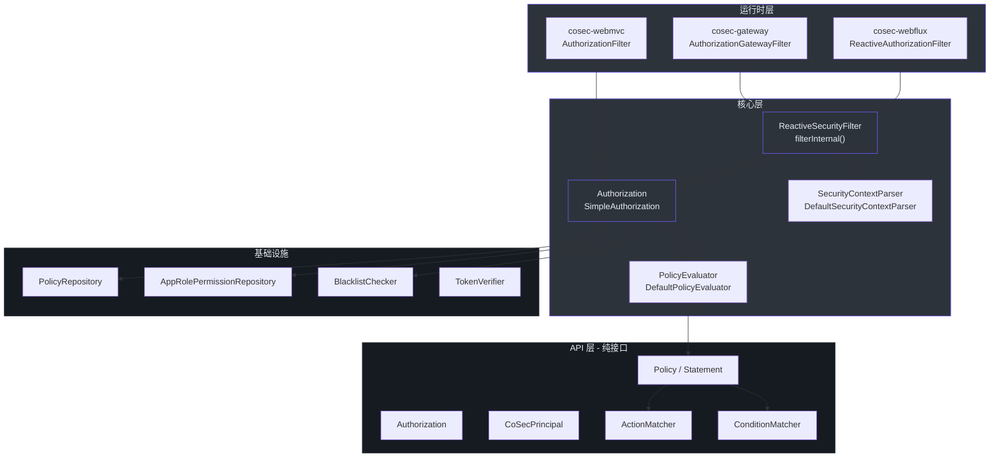
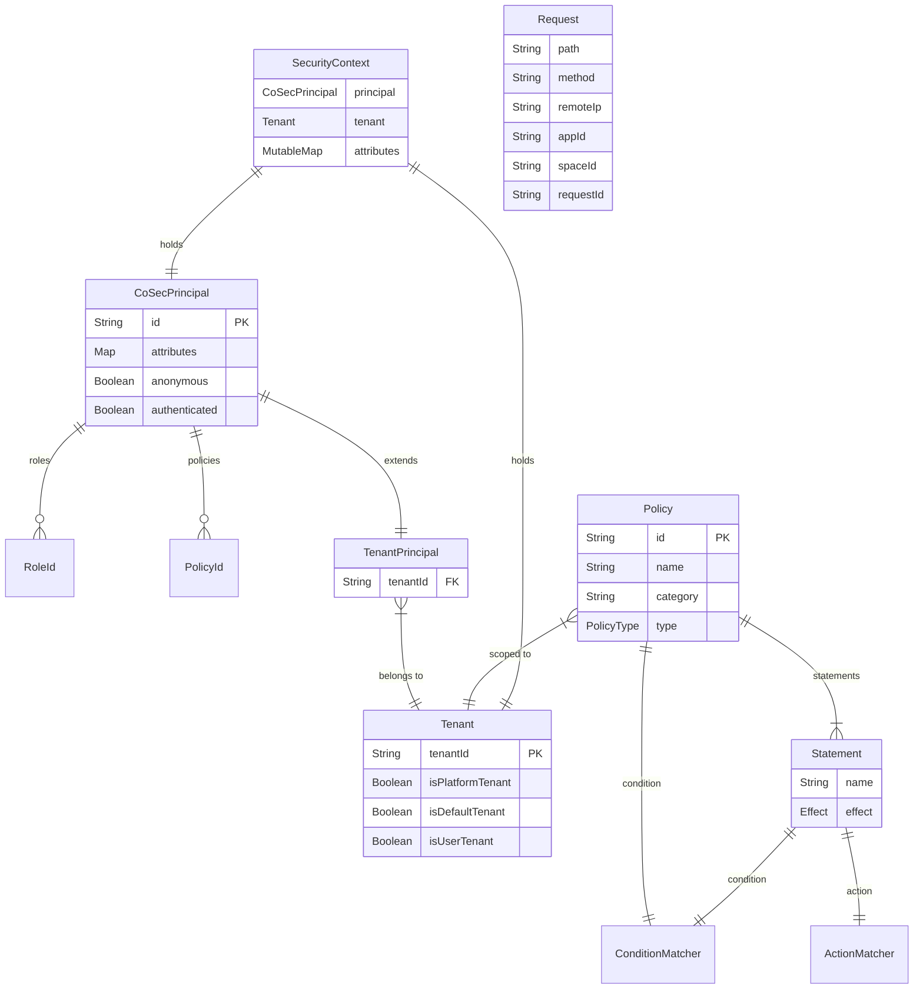
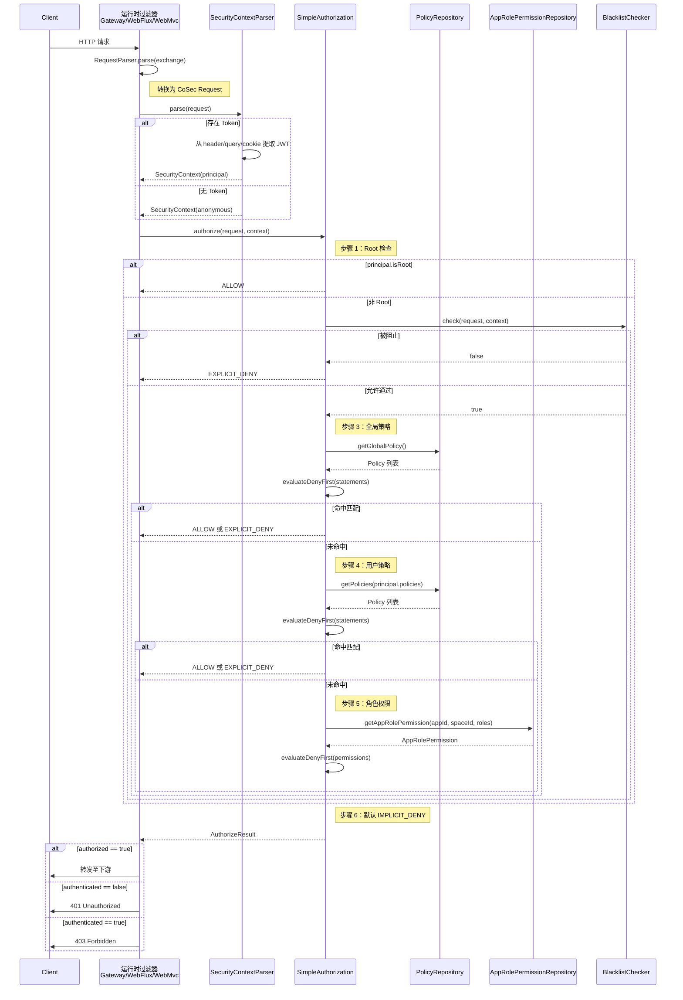
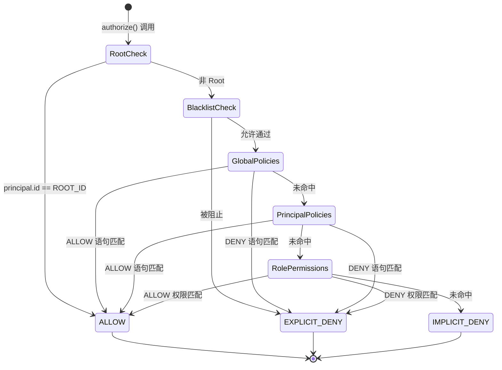
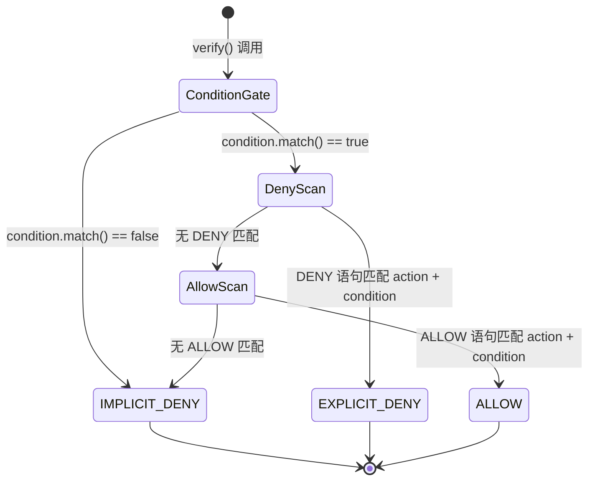
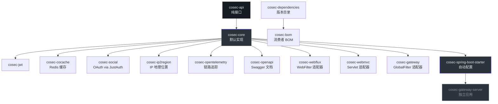
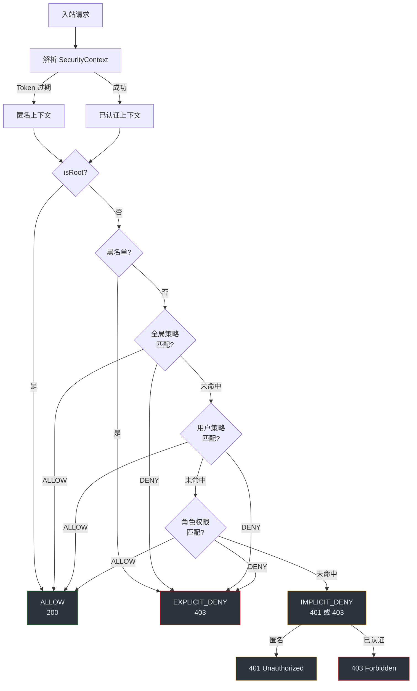
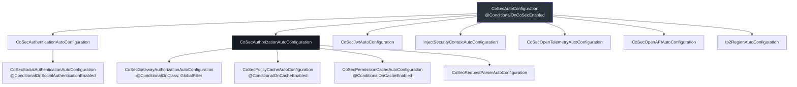

# 高级工程师入职指南

你来这里不是为了添加一个依赖。你来这里是因为你需要推演授权决策的正确性、扩展策略引擎，或者将 CoSec 集成到一个它从未见过的运行时环境中。本指南一次过给你整个架构脊柱。

## 执行摘要

CoSec 是一个面向 JVM 的响应式、多租户、基于策略的授权框架。其心智模型直接借鉴 AWS IAM：每个请求都按顺序对一组 Policy 文档进行评估，每个 Policy 包含带有 ALLOW 或 DENY 效果的 Statement 规则。DENY 始终优先。默认结果是 IMPLICIT_DENY。

框架清晰地分为两个层次：

| 层次 | 模块 | 职责 |
|------|------|------|
| **API** | `cosec-api` | 纯接口，零框架依赖。定义安全模型契约。 |
| **核心** | `cosec-core` | 默认实现、策略评估、认证编排。 |
| **集成** | `cosec-webflux`、`cosec-webmvc`、`cosec-gateway` | 将核心接入 Spring 运行时的适配器。 |
| **自动配置** | `cosec-spring-boot-starter` | 通过 `@ConditionalOn*` 注解进行 Bean 装配。 |

关键不变量：`cosec-api` **没有** Spring、Reactor 或 Jackson 的导入。所有公共契约都在那里。所有实现都在 `cosec-core` 或集成模块中。如果你正在给 `cosec-api` 添加 Spring 导入，说明你进错了模块。

<!-- Sources: cosec-api/build.gradle.kts, cosec-api/src/main/kotlin/me/ahoo/cosec/api/ -->

## 核心架构洞察

整个授权决策归结为一个递归模式：**条件门控，然后 DENY 优先扫描，然后 ALLOW 扫描**。这个模式在三个层级上完全相同：Policy、Statement 和顶层 SimpleAuthorization 编排器。

```python
# DENY 优先评估模式的伪代码
def evaluate_deny_first(items, get_effect, verify):
    # 阶段 1：先检查所有 DENY 规则
    for item in filter(items, lambda i: get_effect(i) == DENY):
        if verify(item) == EXPLICIT_DENY:
            return EXPLICIT_DENY  # 首次命中 DENY 即短路返回

    # 阶段 2：检查 ALLOW 规则
    for item in filter(items, lambda i: get_effect(i) == ALLOW):
        if verify(item) == ALLOW:
            return ALLOW  # 首次命中 ALLOW 即短路返回

    # 阶段 3：默认拒绝
    return IMPLICIT_DENY

# Policy.verify() 将此模式应用于其 statements
# SimpleAuthorization.authorize() 将此模式应用于整个策略链
```

[`SimpleAuthorization`](https://github.com/Ahoo-Wang/CoSec/blob/main/cosec-core/src/main/kotlin/me/ahoo/cosec/authorization/SimpleAuthorization.kt#L61) 中的 `evaluateDenyFirst` 函数同时用于策略语句和角色权限。架构是分形的：每一层都是相同的模式。

<!-- Sources: cosec-core/src/main/kotlin/me/ahoo/cosec/authorization/SimpleAuthorization.kt#L61-80 -->

## 系统架构



<!-- Sources: cosec-webflux/ReactiveSecurityFilter.kt, cosec-core/authorization/SimpleAuthorization.kt, cosec-api/authorization/Authorization.kt -->

关键观察：三个运行时适配器（Gateway、WebFlux、WebMvc）都汇入同一个 `Authorization.authorize()` 接口。唯一的区别是它们如何从 HTTP 交换中提取 `Request`。这是策略模式在框架边界上的应用。

## 领域模型



<!-- Sources: cosec-api/principal/CoSecPrincipal.kt, cosec-api/policy/Policy.kt, cosec-api/context/SecurityContext.kt, cosec-api/tenant/Tenant.kt -->

### 身份层级

身份模型有三个层级，由 [`cosec-api/src/main/kotlin/me/ahoo/cosec/api/tenant/Tenant.kt`](https://github.com/Ahoo-Wang/CoSec/blob/main/cosec-api/src/main/kotlin/me/ahoo/cosec/api/tenant/Tenant.kt) 中的 `Tenant` 接口控制：

| 层级 | `tenantId` 值 | 含义 |
|------|---------------|------|
| **平台** | `"(platform)"` | 根平台运营者。可管理所有租户。 |
| **默认** | `"(0)"` | 共享/默认租户。无租户隔离。 |
| **用户** | 任何其他字符串 | 具有隔离性的特定客户租户。 |

`CoSecPrincipal.ROOT_ID` 默认为 `"cosec"`，但可通过系统属性 `cosec.root` 覆盖（[`CoSecPrincipal.kt:80`](https://github.com/Ahoo-Wang/CoSec/blob/main/cosec-api/src/main/kotlin/me/ahoo/cosec/api/principal/CoSecPrincipal.kt#L80)）。Root 主体绕过整个授权链。

### 特殊身份常量

| 常量 | 值 | 定义位置 | 用途 |
|------|-----|----------|------|
| `ROOT_ID` | `"cosec"`（可配置） | [`CoSecPrincipal.kt:80`](https://github.com/Ahoo-Wang/CoSec/blob/main/cosec-api/src/main/kotlin/me/ahoo/cosec/api/principal/CoSecPrincipal.kt#L80) | 绕过所有授权检查 |
| `ANONYMOUS_ID` | `"(0)"` | [`CoSecPrincipal.kt:87`](https://github.com/Ahoo-Wang/CoSec/blob/main/cosec-api/src/main/kotlin/me/ahoo/cosec/api/principal/CoSecPrincipal.kt#L87) | 未认证主体 |
| `PLATFORM_TENANT_ID` | `"(platform)"` | [`Tenant.kt:56`](https://github.com/Ahoo-Wang/CoSec/blob/main/cosec-api/src/main/kotlin/me/ahoo/cosec/api/tenant/Tenant.kt#L56) | 平台级租户 |
| `DEFAULT_TENANT_ID` | `"(0)"` | [`Tenant.kt:57`](https://github.com/Ahoo-Wang/CoSec/blob/main/cosec-api/src/main/kotlin/me/ahoo/cosec/api/tenant/Tenant.kt#L57) | 默认共享租户 |

## 组件类型

### API 契约（`cosec-api`）

每个公共契约都是 `cosec-api` 中的接口。没有实现，没有框架耦合。该模块定义了安全代数：

| 接口 | 文件 | 用途 |
|------|------|------|
| `CoSecPrincipal` | [`CoSecPrincipal.kt`](https://github.com/Ahoo-Wang/CoSec/blob/main/cosec-api/src/main/kotlin/me/ahoo/cosec/api/principal/CoSecPrincipal.kt) | 身份：id、角色、策略、属性 |
| `Authentication<C, P>` | [`Authentication.kt`](https://github.com/Ahoo-Wang/CoSec/blob/main/cosec-api/src/main/kotlin/me/ahoo/cosec/api/authentication/Authentication.kt) | 凭证验证，返回 `Mono<P>` |
| `Authorization` | [`Authorization.kt`](https://github.com/Ahoo-Wang/CoSec/blob/main/cosec-api/src/main/kotlin/me/ahoo/cosec/api/authorization/Authorization.kt) | 请求评估，返回 `Mono<AuthorizeResult>` |
| `Policy` | [`Policy.kt`](https://github.com/Ahoo-Wang/CoSec/blob/main/cosec-api/src/main/kotlin/me/ahoo/cosec/api/policy/Policy.kt) | 带条件门控的 Statement 集合 |
| `Statement` | [`Statement.kt`](https://github.com/Ahoo-Wang/CoSec/blob/main/cosec-api/src/main/kotlin/me/ahoo/cosec/api/policy/Statement.kt) | 单条规则：Effect + ActionMatcher + ConditionMatcher |
| `ActionMatcher` | [`ActionMatcher.kt`](https://github.com/Ahoo-Wang/CoSec/blob/main/cosec-api/src/main/kotlin/me/ahoo/cosec/api/policy/ActionMatcher.kt) | 匹配请求动作（HTTP 方法 + 路径） |
| `ConditionMatcher` | [`ConditionMatcher.kt`](https://github.com/Ahoo-Wang/CoSec/blob/main/cosec-api/src/main/kotlin/me/ahoo/cosec/api/policy/ConditionMatcher.kt) | 匹配上下文条件 |
| `SecurityContext` | [`SecurityContext.kt`](https://github.com/Ahoo-Wang/CoSec/blob/main/cosec-api/src/main/kotlin/me/ahoo/cosec/api/context/SecurityContext.kt) | 主体 + 租户 + 可变属性 |
| `Request` | [`Request.kt`](https://github.com/Ahoo-Wang/CoSec/blob/main/cosec-api/src/main/kotlin/me/ahoo/cosec/api/context/request/Request.kt) | HTTP 请求抽象 |

### 核心实现（`cosec-core`）

| 类 | 职责 |
|----|------|
| `SimpleAuthorization` | 编排完整的 6 步授权流程 |
| `DefaultPolicyEvaluator` | 在加载时验证策略结构 |
| `DefaultSecurityContextParser` | 从请求头中的 JWT 提取 SecurityContext |
| `DefaultAuthenticationProvider` | 将凭证类型映射到 Authentication 实例的注册表 |
| `CompositeAuthentication` | 根据凭证类型分派到正确的 Authentication |
| `TokenCompositeAuthentication` | 包装 CompositeAuthentication，同时将主体转换为 token |
| `LocalPolicyLoader` | 从 classpath 资源加载策略 JSON 文件 |
| `SimpleSecurityContext` | 使用 ConcurrentHashMap 属性的线程安全 SecurityContext |

### 集成适配器

每个适配器遵循相同的模式：将 HTTP 交换解析为 `Request`，调用 `Authorization.authorize()`，然后转发或拒绝。

| 适配器 | 类 | 过滤器类型 | 顺序 |
|--------|-----|-----------|------|
| WebFlux | [`ReactiveAuthorizationFilter`](https://github.com/Ahoo-Wang/CoSec/blob/main/cosec-webflux/src/main/kotlin/me/ahoo/cosec/webflux/ReactiveAuthorizationFilter.kt) | `WebFilter` | 1000 |
| Gateway | [`AuthorizationGatewayFilter`](https://github.com/Ahoo-Wang/CoSec/blob/main/cosec-gateway/src/main/kotlin/me/ahoo/cosec/gateway/AuthorizationGatewayFilter.kt) | `GlobalFilter` | `HIGHEST_PRECEDENCE + 10` |
| WebMvc | [`AuthorizationFilter`](https://github.com/Ahoo-Wang/CoSec/blob/main/cosec-webmvc/src/main/kotlin/me/ahoo/cosec/servlet/AuthorizationFilter.kt) | `jakarta.servlet.Filter` | N/A |

Gateway 过滤器运行在 `HIGHEST_PRECEDENCE + 10`（[`AuthorizationGatewayFilter.kt:42`](https://github.com/Ahoo-Wang/CoSec/blob/main/cosec-gateway/src/main/kotlin/me/ahoo/cosec/gateway/AuthorizationGatewayFilter.kt#L42)），在路由特定过滤器之前。WebFlux 过滤器运行在顺序 1000（[`ReactiveAuthorizationFilter.kt:49`](https://github.com/Ahoo-Wang/CoSec/blob/main/cosec-webflux/src/main/kotlin/me/ahoo/cosec/webflux/ReactiveAuthorizationFilter.kt#L49)），在 CORS 之后但在应用逻辑之前。

### Gateway 与 WebFlux 的关键区别

Gateway 过滤器**不**继承 `ReactiveAuthorizationFilter`。它直接实现 `GlobalFilter` 并继承 `ReactiveSecurityFilter`。关键行为差异：Gateway 过滤器会修改 exchange 以将 `requestId` 头注入下游请求（[`AuthorizationGatewayFilter.kt:47-49`](https://github.com/Ahoo-Wang/CoSec/blob/main/cosec-gateway/src/main/kotlin/me/ahoo/cosec/gateway/AuthorizationGatewayFilter.kt#L47)），而 WebFlux 过滤器不会。这对分布式链路追踪至关重要。

## 请求生命周期

这是整个系统中最重要的时序图。从上到下阅读，然后以同样的方式阅读源代码。



<!-- Sources: cosec-core/authorization/SimpleAuthorization.kt#L213-232, cosec-webflux/ReactiveSecurityFilter.kt#L66-116 -->

`ReactiveSecurityFilter.filterInternal()` 方法（[`ReactiveSecurityFilter.kt:66`](https://github.com/Ahoo-Wang/CoSec/blob/main/cosec-webflux/src/main/kotlin/me/ahoo/cosec/webflux/ReactiveSecurityFilter.kt#L66)）包含错误处理矩阵：

```python
# 错误处理矩阵（来自 ReactiveSecurityFilter 的伪代码）
if authorized:
    forward_with_principal()
elif not authenticated:
    return_401()
else:
    return_403()

# 异常处理：
TooManyRequestsException -> 429
TokenVerificationException -> 将 token 错误作为原因
Generic exception -> 500，返回 IMPLICIT_DENY body
```

## 状态转换

### 授权决策状态机



<!-- Sources: cosec-core/authorization/SimpleAuthorization.kt#L194-232 -->

### 策略评估状态机

每个独立的 `Policy.verify()` 都有自己的状态转换：



<!-- Sources: cosec-api/policy/Policy.kt#L76-103, cosec-api/policy/Statement.kt#L60-74 -->

### Statement 验证

单个 `Statement.verify()`（[`Statement.kt:60`](https://github.com/Ahoo-Wang/CoSec/blob/main/cosec-api/src/main/kotlin/me/ahoo/cosec/api/policy/Statement.kt#L60)）遵循以下逻辑：

```python
def statement_verify(statement, request, context):
    if not statement.action.match(request, context):
        return IMPLICIT_DENY
    if not statement.condition.match(request, context):
        return IMPLICIT_DENY
    if statement.effect == ALLOW:
        return ALLOW
    else:
        return EXPLICIT_DENY
```

Action 匹配作为快速路径先执行。如果 action 模式不匹配，条件永远不会被评估。这个顺序对具有副作用的限流器条件尤为重要。

## 决策日志

这些是塑造代码库每一次交互的架构决策。

| # | 决策 | 理由 | 可见位置 |
|---|------|------|----------|
| D1 | API 模块零框架依赖 | 接口必须在 classpath 中没有 Spring 的情况下可实现 | [`cosec-api/build.gradle.kts`](https://github.com/Ahoo-Wang/CoSec/blob/main/cosec-api/build.gradle.kts) |
| D2 | DENY 优先评估顺序 | 防止权限提升：宽泛的 ALLOW 不能覆盖有针对性的 DENY | [`SimpleAuthorization.kt:61`](https://github.com/Ahoo-Wang/CoSec/blob/main/cosec-core/src/main/kotlin/me/ahoo/cosec/authorization/SimpleAuthorization.kt#L61) |
| D3 | 基于 SPI 的匹配器发现 | 允许第三方扩展而无需修改核心 | [`META-INF/services/me.ahoo.cosec.policy.action.ActionMatcherFactory`](https://github.com/Ahoo-Wang/CoSec/blob/main/cosec-core/src/main/resources/META-INF/services/me.ahoo.cosec.policy.action.ActionMatcherFactory) |
| D4 | 全链路响应式（`Mono<T>`） | 非阻塞授权在高负载下可扩展；与 Spring WebFlux 一致 | [`Authorization.kt:43`](https://github.com/Ahoo-Wang/CoSec/blob/main/cosec-api/src/main/kotlin/me/ahoo/cosec/api/authorization/Authorization.kt#L43) |
| D5 | Root 绕过基于身份而非角色 | Root 检查（`principal.isRoot`）在所有其他检查之前发生，包括黑名单 | [`SimpleAuthorization.kt:146-154`](https://github.com/Ahoo-Wang/CoSec/blob/main/cosec-core/src/main/kotlin/me/ahoo/cosec/authorization/SimpleAuthorization.kt#L146) |
| D6 | SecurityContext 属性可变且并发 | 下游组件可写入路径变量、限流计数器等 | [`SimpleSecurityContext.kt:41`](https://github.com/Ahoo-Wang/CoSec/blob/main/cosec-core/src/main/kotlin/me/ahoo/cosec/context/SimpleSecurityContext.kt#L41) |
| D7 | 从 header、query 或 cookie 提取 Token | 支持浏览器、API 和遗留客户端 | [`DefaultSecurityContextParser.kt:27-31`](https://github.com/Ahoo-Wang/CoSec/blob/main/cosec-core/src/main/kotlin/me/ahoo/cosec/context/DefaultSecurityContextParser.kt#L27) |
| D8 | Gateway 过滤器顺序接近最高优先级 | 授权必须在可能修改 exchange 的路由过滤器之前运行 | [`AuthorizationGatewayFilter.kt:42`](https://github.com/Ahoo-Wang/CoSec/blob/main/cosec-gateway/src/main/kotlin/me/ahoo/cosec/gateway/AuthorizationGatewayFilter.kt#L42) |

## 依赖关系论证

### 模块依赖图



<!-- Sources: settings.gradle.kts, build.gradle.kts root -->

### 版本策略

所有依赖版本集中在 [`gradle/libs.versions.toml`](https://github.com/Ahoo-Wang/CoSec/blob/main/gradle/libs.versions.toml)。`cosec-dependencies` 模块消费此目录，`cosec-bom` 将其作为 Maven BOM 重新导出给下游消费者。

| 依赖 | 版本 | 原因 |
|------|------|------|
| Kotlin | 2.3.20 | 语言版本；`-Xjsr305=strict` 用于空安全互操作 |
| Spring Boot | 4.0.5 | 运行时；驱动 WebFlux/WebMvc/Gateway API 兼容性 |
| Spring Cloud | 2025.1.1 | Gateway 过滤器集成 |
| auth0/java-jwt | 4.5.1 | JWT token 创建与验证 |
| JustAuth | 1.16.7 | 多供应商 OAuth（微信、GitHub 等） |
| OGNL | 3.4.11 | 基于表达式的条件匹配 |
| CoCache | 4.0.2 | 两级分布式缓存（本地 + Redis） |
| CosId | 3.0.5 | 分布式 ID 生成 |
| Guava RateLimiter | 33.5.0-jre | 条件中的令牌桶限流 |

### 为什么 OGNL 和 SpEL 同时存在

CoSec 支持两种表达式语言用于条件匹配器：OGNL（[`OgnlConditionMatcher.kt`](https://github.com/Ahoo-Wang/CoSec/blob/main/cosec-core/src/main/kotlin/me/ahoo/cosec/policy/condition/OgnlConditionMatcher.kt)）和 SpEL（[`SpelConditionMatcher.kt`](https://github.com/Ahoo-Wang/CoSec/blob/main/cosec-core/src/main/kotlin/me/ahoo/cosec/policy/condition/SpelConditionMatcher.kt)）。OGNL 是策略表达式的默认选择，因为它更简单且没有 Spring 依赖。SpEL 适用于已经投入 Spring 生态系统的团队。两者都注册为 SPI 条件匹配器。

## 存储/数据架构

CoSec 本身不拥有数据库。它定义了仓库接口，由你根据自己的数据存储来实现。

### 仓库 SPI

| 接口 | 模块 | 方法 | 用途 |
|------|------|------|------|
| `PolicyRepository` | `cosec-core` | `getGlobalPolicy()`、`getPolicies(ids)`、`setPolicy()` | 存储和检索策略文档 |
| `AppRolePermissionRepository` | `cosec-core` | `getAppRolePermission(appId, spaceId, roles)` | 将 app+role 映射到权限集 |

两者都返回 `Mono<T>`，意味着后端存储可以是响应式的（R2DBC、Redis 等）。`cosec-cocache` 模块使用 CoCache 两级缓存模式提供基于 Redis 的缓存实现。

### 本地策略加载

对于策略静态且基于文件的场景，`LocalPolicyLoader`（[`LocalPolicyLoader.kt`](https://github.com/Ahoo-Wang/CoSec/blob/main/cosec-core/src/main/kotlin/me/ahoo/cosec/policy/LocalPolicyLoader.kt)）从 classpath 读取 JSON 策略文件。配置如下：

```yaml
cosec:
  authorization:
    local-policy:
      enabled: true
      locations: "classpath:cosec-policy/*-policy.json"
      init-repository: true
      force-refresh: false
```

当 `init-repository` 为 true 时，`LocalPolicyInitializer` 会在启动时将加载的策略推送到 `PolicyRepository`（[`CoSecAuthorizationAutoConfiguration.kt:71-87`](https://github.com/Ahoo-Wang/CoSec/blob/main/cosec-spring-boot-starter/src/main/kotlin/me/ahoo/cosec/spring/boot/starter/authorization/CoSecAuthorizationAutoConfiguration.kt#L71)）。

### 策略 JSON 格式

策略文档遵循以下结构（由 `cosec-core/src/main/kotlin/me/ahoo/cosec/serialization/` 中的序列化层定义）：

```json
{
  "id": "global-policy",
  "name": "Global Access Policy",
  "category": "system",
  "type": "GLOBAL",
  "tenantId": "(platform)",
  "condition": {},
  "statements": [
    {
      "name": "deny-admin-mutation",
      "effect": "DENY",
      "action": { "path": { "pattern": "/admin/**" } },
      "condition": { "authenticated": true }
    },
    {
      "name": "allow-public-read",
      "effect": "ALLOW",
      "action": { "path": { "pattern": ["/api/public/**", "/health"] } },
      "condition": {}
    }
  ]
}
```

JSON 通过 `CoSecModule`（[`CoSecModule.kt`](https://github.com/Ahoo-Wang/CoSec/blob/main/cosec-core/src/main/kotlin/me/ahoo/cosec/serialization/CoSecModule.kt)）注册的自定义 Jackson 反序列化器进行反序列化。每种匹配器类型都有自己的反序列化器，委托给 SPI 工厂。

## 故障模式

理解故障模式对生产运营至关重要。

| 故障 | 行为 | 来源 |
|------|------|------|
| **JWT 过期** | `TokenVerificationException` 在 `filterInternal` 中被捕获，上下文回退到匿名，然后继续授权（大概率返回 401） | [`ReactiveSecurityFilter.kt:73-79`](https://github.com/Ahoo-Wang/CoSec/blob/main/cosec-webflux/src/main/kotlin/me/ahoo/cosec/webflux/ReactiveSecurityFilter.kt#L73) |
| **超出限流** | `TooManyRequestsException` 从条件匹配器抛出，被捕获并返回 429 | [`ReactiveSecurityFilter.kt:106-108`](https://github.com/Ahoo-Wang/CoSec/blob/main/cosec-webflux/src/main/kotlin/me/ahoo/cosec/webflux/ReactiveSecurityFilter.kt#L106) |
| **PolicyRepository 不可用** | `Mono` 传播错误；被 `onErrorResume` 捕获返回 500 | [`ReactiveSecurityFilter.kt:109-114`](https://github.com/Ahoo-Wang/CoSec/blob/main/cosec-webflux/src/main/kotlin/me/ahoo/cosec/webflux/ReactiveSecurityFilter.kt#L109) |
| **无匹配策略** | 返回 `IMPLICIT_DENY`（默认拒绝）。已认证用户得到 403，匿名用户得到 401 | [`SimpleAuthorization.kt:207-210`](https://github.com/Ahoo-Wang/CoSec/blob/main/cosec-core/src/main/kotlin/me/ahoo/cosec/authorization/SimpleAuthorization.kt#L207) |
| **黑名单阻止请求** | 在任何策略评估之前立即返回 `EXPLICIT_DENY` | [`SimpleAuthorization.kt:221-228`](https://github.com/Ahoo-Wang/CoSec/blob/main/cosec-core/src/main/kotlin/me/ahoo/cosec/authorization/SimpleAuthorization.kt#L221) |
| **格式错误的策略 JSON** | `CoSecJsonSerializer.readValue` 抛出异常；被 `LocalPolicyLoader` 捕获并记录日志，跳过该策略 | [`LocalPolicyLoader.kt:63-67`](https://github.com/Ahoo-Wang/CoSec/blob/main/cosec-core/src/main/kotlin/me/ahoo/cosec/policy/LocalPolicyLoader.kt#L63) |
| **未知 action matcher 类型** | SPI 查找在反序列化时失败；策略加载失败 | `ActionMatcherFactoryProvider` |

### 故障模式决策矩阵



<!-- Sources: SimpleAuthorization.kt#L213-232, ReactiveSecurityFilter.kt#L86-115 -->

## API 表面

### 核心授权 API

`cosec-api` 的公共 API 表面有意保持精简。以下是你需要了解的每一个接口：

```python
# 伪代码形式的完整授权 API
class Authorization:
    def authorize(request: Request, context: SecurityContext) -> Mono[AuthorizeResult]

class Authentication[C, P]:
    supportCredentials: Class[C]
    def authenticate(credentials: C) -> Mono[P]

class Policy:
    id, name, category, description, type, condition, statements
    def verify(request, context) -> VerifyResult  # ALLOW, EXPLICIT_DENY, IMPLICIT_DENY

class Statement:
    name, effect, action, condition
    def verify(request, context) -> VerifyResult

class ActionMatcher(RequestMatcher):
    def match(request, context) -> bool

class ConditionMatcher(RequestMatcher):
    def match(request, context) -> bool

class CoSecPrincipal(Principal):
    id, roles, policies, attributes, anonymous, authenticated

class SecurityContext(TenantCapable):
    principal, tenant, attributes
    def getAttributeValue(key) -> V
    def setAttributeValue(key, value) -> SecurityContext

class Request:
    path, method, remoteIp, appId, spaceId, deviceId, requestId
    def getHeader(key) -> str
    def getQuery(key) -> str
    def getCookieValue(key) -> str
```

### SPI 扩展点

要扩展 CoSec 添加自定义匹配器，你需要实现两样东西：

1. 一个带有唯一 `type` 字符串的 `ConditionMatcherFactory`（或 `ActionMatcherFactory`）
2. 在 `META-INF/services/me.ahoo.cosec.policy.condition.ConditionMatcherFactory` 中注册

内置注册可以在 SPI 文件 [`cosec-core/src/main/resources/META-INF/services/me.ahoo.cosec.policy.condition.ConditionMatcherFactory`](https://github.com/Ahoo-Wang/CoSec/blob/main/cosec-core/src/main/resources/META-INF/services/me.ahoo.cosec.policy.condition.ConditionMatcherFactory) 中看到：

| 类型 | 类 | 类别 |
|------|-----|------|
| `authenticated` | `AuthenticatedConditionMatcherFactory` | 上下文 |
| `inRole` | `InRoleConditionMatcherFactory` | 上下文 |
| `inTenant` | `InTenantConditionMatcherFactory` | 上下文 |
| `eq` | `EqConditionMatcherFactory` | 路径/字符串 |
| `contains` | `ContainsConditionMatcherFactory` | 路径/字符串 |
| `startsWith` | `StartsWithConditionMatcherFactory` | 路径/字符串 |
| `endsWith` | `EndsWithConditionMatcherFactory` | 路径/字符串 |
| `in` | `InConditionMatcherFactory` | 路径/字符串 |
| `regular` | `RegularConditionMatcherFactory` | 路径/字符串 |
| `path` | `PathConditionMatcherFactory` | 路径/字符串 |
| `spel` | `SpelConditionMatcherFactory` | 表达式 |
| `ognl` | `OgnlConditionMatcherFactory` | 表达式 |
| `rateLimiter` | `RateLimiterConditionMatcherFactory` | 限流 |
| `groupedRateLimiter` | `GroupedRateLimiterConditionMatcherFactory` | 限流 |
| `bool` | `BoolConditionMatcherFactory` | 逻辑组合 |
| `all` | `AllConditionMatcherFactory` | 匹配全部 |

对于 action matcher，SPI 文件 [`cosec-core/src/main/resources/META-INF/services/me.ahoo.cosec.policy.action.ActionMatcherFactory`](https://github.com/Ahoo-Wang/CoSec/blob/main/cosec-core/src/main/resources/META-INF/services/me.ahoo.cosec.policy.action.ActionMatcherFactory) 注册了：

| 类型 | 类 | 用途 |
|------|-----|------|
| `path` | `PathActionMatcherFactory` | Spring `PathPattern` 匹配，支持变量提取 |
| `all` | `AllActionMatcherFactory` | 匹配所有动作 |
| （组合） | `CompositeActionMatcherFactory` | 多模式 OR 组合 |

### 路径匹配内部机制

`PathActionMatcher`（[`PathActionMatcher.kt:42`](https://github.com/Ahoo-Wang/CoSec/blob/main/cosec-core/src/main/kotlin/me/ahoo/cosec/policy/action/PathActionMatcher.kt#L42)）使用 Spring 的 `PathPatternParser` 进行 URL 匹配。当模式匹配时，提取的路径变量存储在 `SecurityContext.attributes` 中，键为 `"PATH_VARIABLES"`（[`PathActionMatcher.kt:28`](https://github.com/Ahoo-Wang/CoSec/blob/main/cosec-core/src/main/kotlin/me/ahoo/cosec/policy/action/PathActionMatcher.kt#L28)）。这意味着下游条件匹配器可以在表达式中引用路径变量。

`ReplaceablePathActionMatcher`（[`PathActionMatcher.kt:61`](https://github.com/Ahoo-Wang/CoSec/blob/main/cosec-core/src/main/kotlin/me/ahoo/cosec/policy/action/PathActionMatcher.kt#L61)）支持在模式本身中使用 SpEL 模板表达式，允许像 `#{request.path}` 这样的动态模式在评估时解析。

## 配置

### 属性参考

所有属性以 `cosec.` 为前缀：

| 属性 | 默认值 | 模块 | 用途 |
|------|--------|------|------|
| `cosec.enabled` | `true` | starter | 总开关，通过 `@ConditionalOnCoSecEnabled` |
| `cosec.authorization.enabled` | `true` | starter | 授权功能开关 |
| `cosec.authorization.local-policy.enabled` | `false` | starter | 启用 classpath 策略加载 |
| `cosec.authorization.local-policy.locations` | `classpath:cosec-policy/*-policy.json` | starter | 策略文件资源模式 |
| `cosec.authorization.local-policy.init-repository` | `false` | starter | 启动时将本地策略推送到仓库 |
| `cosec.authorization.local-policy.force-refresh` | `false` | starter | 覆盖仓库中已有的策略 |
| `cosec.authentication.enabled` | `true` | starter | 认证功能开关 |
| `cosec.jwt.enabled` | `true` | starter | JWT token 处理开关 |
| `cosec.social.enabled` | `false` | starter | OAuth 社交登录开关 |
| `cosec.gateway.enabled` | `true` | starter | Gateway 过滤器开关 |

### 自动配置层级



<!-- Sources: cosec-spring-boot-starter/auto-configuration classes -->

`CoSecAutoConfiguration` 在 `JacksonAutoConfiguration` 之前运行（[`CoSecAutoConfiguration.kt:35`](https://github.com/Ahoo-Wang/CoSec/blob/main/cosec-spring-boot-starter/src/main/kotlin/me/ahoo/cosec/spring/boot/starter/CoSecAutoConfiguration.kt#L35)），以确保 `CoSecModule` Jackson 序列化器在任何 JSON 绑定发生之前被注册。

`MatcherFactoryRegister` Bean（[`CoSecAutoConfiguration.kt:43`](https://github.com/Ahoo-Wang/CoSec/blob/main/cosec-spring-boot-starter/src/main/kotlin/me/ahoo/cosec/spring/boot/starter/CoSecAutoConfiguration.kt#L43)）扫描 Spring `ApplicationContext` 中的 `ActionMatcherFactory` 和 `ConditionMatcherFactory` Bean，并将它们与 SPI 发现的工厂合并。这意味着你可以通过注册 Bean 来覆盖内置匹配器。

### 条件加载策略

自动配置使用分层条件系统：

```python
# 条件加载伪代码
if on_classpath("GlobalFilter"):
    # Spring Cloud Gateway 存在
    register(AuthorizationGatewayFilter)
elif on_classpath("ReactiveAuthorizationFilter"):
    # WebFlux 存在但 Gateway 不存在
    register(ReactiveAuthorizationFilter)

if on_classpath("AuthorizationFilter"):
    # Servlet API 存在
    register(AuthorizationFilter)
```

关键条件是 WebFlux 过滤器 Bean 定义上的 `@ConditionalOnMissingClass("org.springframework.cloud.gateway.filter.GlobalFilter")`（[`CoSecAuthorizationAutoConfiguration.kt:131`](https://github.com/Ahoo-Wang/CoSec/blob/main/cosec-spring-boot-starter/src/main/kotlin/me/ahoo/cosec/spring/boot/starter/authorization/CoSecAuthorizationAutoConfiguration.kt#L131)）。这确保当 Gateway 存在时 WebFlux 过滤器不会注册，因为 Gateway 过滤器已经提供了授权功能。

## 性能

### 策略评估复杂度

授权链的最坏情况是对所有策略及其语句的线性扫描。对于拥有 `p` 个策略的主体，每个策略包含 `s` 条语句：

```python
# 最坏情况：到处都未命中
# 每一层都是 O(n)，n 是所有匹配策略中的总语句数
total_evaluations = global_policy_statements + principal_policy_statements + role_permissions
# 每条语句：O(1) action 匹配 + O(1) condition 匹配（对于内置匹配器）
# 总计：O(total_evaluations)
```

`evaluateDenyFirst` 方法对同一集合进行两次遍历：一次用于 DENY，一次用于 ALLOW。这是有意为之的：它保证每条 DENY 语句都在任何 ALLOW 之前被评估，无论语句在策略 JSON 中的顺序如何。

### 限流器性能

`RateLimiterConditionMatcher`（[`RateLimiterConditionMatcher.kt`](https://github.com/Ahoo-Wang/CoSec/blob/main/cosec-core/src/main/kotlin/me/ahoo/cosec/policy/condition/limiter/RateLimiterConditionMatcher.kt)）使用 Guava 的 `RateLimiter.create(permitsPerSecond)`，这是令牌桶算法。它在每个条件匹配器实例创建一次，并在匹配该条件的所有请求之间共享。对于按用户限流，`GroupedRateLimiterConditionMatcher` 为每个分组键维护独立的限流器。

### 缓存层

`cosec-cocache` 模块在 `PolicyRepository` 和 `AppRolePermissionRepository` 之上添加了两级缓存（本地 Caffeine + Redis）。这将授权流程从：

```
请求 -> PolicyRepository（数据库调用） -> 评估
```

转变为：

```
请求 -> 本地缓存 ->（未命中）-> Redis ->（未命中）-> 数据库 -> 填充缓存 -> 评估
```

缓存配置通过 `CoSecPolicyCacheAutoConfiguration` 和 `CoSecPermissionCacheAutoConfiguration` 管理，受 `@ConditionalOnCacheEnabled` 门控。

### JMH 基准测试

每个模块都通过 `me.champeau.jmh` Gradle 插件（[`libs.versions.toml:53`](https://github.com/Ahoo-Wang/CoSec/blob/main/gradle/libs.versions.toml)）包含 JMH 基准测试支持。运行基准测试：

```bash
./gradlew :cosec-core:jmh -PjmhIncludes=*.SomeBenchmark
```

JMH 依赖版本为 `1.37`（[`libs.versions.toml:21`](https://github.com/Ahoo-Wang/CoSec/blob/main/gradle/libs.versions.toml#L21)）。

## 安全模型

### 绝不可违反的不变量

1. **DENY 始终获胜。** [`SimpleAuthorization.kt:61`](https://github.com/Ahoo-Wang/CoSec/blob/main/cosec-core/src/main/kotlin/me/ahoo/cosec/authorization/SimpleAuthorization.kt#L61) 中的 `evaluateDenyFirst` 模式绝不可被修改为允许 ALLOW 覆盖 DENY。

2. **Root 绕过是绝对的。** 如果 `principal.isRoot` 返回 true，授权立即返回 ALLOW（[`SimpleAuthorization.kt:217-219`](https://github.com/Ahoo-Wang/CoSec/blob/main/cosec-core/src/main/kotlin/me/ahoo/cosec/authorization/SimpleAuthorization.kt#L217)）。这包括绕过黑名单。这是设计如此。

3. **默认是拒绝。** 如果没有策略匹配，结果始终是 `IMPLICIT_DENY`（[`SimpleAuthorization.kt:207-210`](https://github.com/Ahoo-Wang/CoSec/blob/main/cosec-core/src/main/kotlin/me/ahoo/cosec/authorization/SimpleAuthorization.kt#L207)）。

4. **匿名主体没有角色或策略。** `SimpleTenantPrincipal.ANONYMOUS`（[`SimpleTenantPrincipal.kt:42`](https://github.com/Ahoo-Wang/CoSec/blob/main/cosec-core/src/main/kotlin/me/ahoo/cosec/principal/SimpleTenantPrincipal.kt#L42)）包装了 `SimplePrincipal.ANONYMOUS` 和默认租户。它只能访问全局策略明确允许匿名访问的资源。

5. **Token 提取是多源的。** `DefaultSecurityContextParser` 按 header、query 参数、cookie 的顺序检查（[`DefaultSecurityContextParser.kt:27-31`](https://github.com/Ahoo-Wang/CoSec/blob/main/cosec-core/src/main/kotlin/me/ahoo/cosec/context/DefaultSecurityContextParser.kt#L27)）。其中任何一个都可以携带 JWT。

6. **限流器异常是终结性的。** 当 `RateLimiterConditionMatcher` 无法获取令牌时，它抛出 `TooManyRequestsException`（[`RateLimiterConditionMatcher.kt:49`](https://github.com/Ahoo-Wang/CoSec/blob/main/cosec-core/src/main/kotlin/me/ahoo/cosec/policy/condition/limiter/RateLimiterConditionMatcher.kt#L49)）。此异常从授权链中传播出来，被过滤器层捕获，返回 429。

### 安全上下文隔离

`SimpleSecurityContext` 使用 `ConcurrentHashMap` 存储属性（[`SimpleSecurityContext.kt:41`](https://github.com/Ahoo-Wang/CoSec/blob/main/cosec-core/src/main/kotlin/me/ahoo/cosec/context/SimpleSecurityContext.kt#L41)）。在响应式上下文中，SecurityContext 是按请求创建的，不应在请求之间共享。然而，并发映射可以防止在单个请求的异步链中意外共享。

### 租户隔离

策略通过 `Tenant` 接口限定到租户。`Policy` 接口继承 `Tenant`，意味着每个策略文档都携带 `tenantId`。当 `PolicyRepository.getGlobalPolicy()` 返回全局策略时，它们无论租户如何都适用。当 `PolicyRepository.getPolicies(principal.policies)` 返回用户特定策略时，它们应该按当前租户上下文过滤。仓库实现负责强制执行此隔离。

## 测试策略

### 测试技术栈

| 工具 | 版本 | 用途 |
|------|------|------|
| JUnit 5 | 6.0.3 | 测试框架 |
| MockK | 1.14.9 | Kotlin 原生 Mock |
| FluentAssert | 0.2.6 | 流式测试断言（`me.ahoo.test.asserts.assert`） |
| Hamcrest | 3.0 | 匹配器库 |
| Reactor Test | （来自 Spring Boot） | `Mono`/`Flux` 测试的 `StepVerifier` |
| JMH | 1.37 | 性能基准测试 |

### 运行测试

```bash
# 所有模块的所有测试
./gradlew test

# 单个模块
./gradlew :cosec-core:test

# 单个测试类
./gradlew :cosec-core:test --tests "me.ahoo.cosec.authorization.SimpleAuthorizationTest"

# 单个测试方法
./gradlew :cosec-core:test --tests "me.ahoo.cosec.authorization.SimpleAuthorizationTest.authorize"

# Detekt 静态分析
./gradlew detekt

# 代码覆盖率
./gradlew :code-coverage-report:codeCoverageReport
```

### 测试规范

- 所有测试使用 FluentAssert（`me.ahoo.test.asserts.assert`），而非 AssertJ 的 `assertThat()`
- 响应式测试使用 `reactor-test` 的 `StepVerifier`
- Mock 使用 MockK，而非 Mockito
- 测试类遵循 `<被测类>Test` 命名规范
- Detekt 配置位于 [`config/detekt/detekt.yml`](https://github.com/Ahoo-Wang/CoSec/blob/main/config/detekt/detekt.yml)

### 关键测试文件

| 测试 | 测试内容 | 重要性 |
|------|----------|--------|
| [`SimpleAuthorizationTest`](https://github.com/Ahoo-Wang/CoSec/blob/main/cosec-core/src/test/kotlin/me/ahoo/cosec/authorization/SimpleAuthorizationTest.kt) | 完整授权流程 | 覆盖授权链的全部 6 个步骤 |
| [`CoSecAutoConfigurationTest`](https://github.com/Ahoo-Wang/CoSec/blob/main/cosec-spring-boot-starter/src/test/kotlin/me/ahoo/cosec/spring/boot/starter/CoSecAutoConfigurationTest.kt) | Bean 装配 | 验证条件 Bean 创建 |
| [`CoSecJsonSerializerTest`](https://github.com/Ahoo-Wang/CoSec/blob/main/cosec-core/src/test/kotlin/me/ahoo/cosec/serialization/CoSecJsonSerializerTest.kt) | 策略 JSON 往返 | 验证序列化正确性 |
| [`DefaultAppPermissionEvaluatorTest`](https://github.com/Ahoo-Wang/CoSec/blob/main/cosec-core/src/test/kotlin/me/ahoo/cosec/permission/DefaultAppPermissionEvaluatorTest.kt) | 权限评估 | 测试角色权限评估路径 |
| [`AuthorizationGatewayFilterTest`](https://github.com/Ahoo-Wang/CoSec/blob/main/cosec-gateway/src/test/kotlin/me/ahoo/cosec/gateway/AuthorizationGatewayFilterTest.kt) | Gateway 集成 | 测试 GlobalFilter 适配器 |

## 技术债务与已知问题

### 显式技术债务

1. **Root 绕过黑名单。** Root 检查（[`SimpleAuthorization.kt:217`](https://github.com/Ahoo-Wang/CoSec/blob/main/cosec-core/src/main/kotlin/me/ahoo/cosec/authorization/SimpleAuthorization.kt#L217)）在黑名单检查之前返回 ALLOW。这是有意为之，但应记录在案以防止意外。被攻陷的 Root 主体没有第二道防线。

2. **评估中的限流器副作用。** `RateLimiterConditionMatcher` 将 `TooManyRequestsException`（[`RateLimiterConditionMatcher.kt:49`](https://github.com/Ahoo-Wang/CoSec/blob/main/cosec-core/src/main/kotlin/me/ahoo/cosec/policy/condition/limiter/RateLimiterConditionMatcher.kt#L49)）作为控制流抛出。这意味着 DENY 语句中的限流器可以阻止 ALLOW 语句被评估，这是正确行为但很微妙。

3. **默认 `BlacklistChecker` 是 NoOp。** 自动配置默认使用 `BlacklistChecker.NoOp`（[`CoSecAuthorizationAutoConfiguration.kt:91`](https://github.com/Ahoo-Wang/CoSec/blob/main/cosec-spring-boot-starter/src/main/kotlin/me/ahoo/cosec/spring/boot/starter/authorization/CoSecAuthorizationAutoConfiguration.kt#L91)）。团队必须提供自己的实现，否则没有黑名单功能。

4. **策略对象的线程安全性。** `Policy` 和 `Statement` 接口不强制不可变性。如果 `PolicyRepository` 返回可变策略对象，并发评估可能产生干扰。`PolicyData` 实现应该是具有 `val` 属性的 data class。

5. **仓库调用无熔断器。** 如果 `PolicyRepository.getGlobalPolicy()` 返回错误，它会作为 500 传播。没有内置的回退到缓存策略。`cosec-cocache` 模块可以缓解此问题，但它是可选的。

### 架构观察

1. **`Policy.verify()` 默认方法包含实际逻辑。** 与大多数微不足道的接口默认方法不同，[`Policy.kt:76-103`](https://github.com/Ahoo-Wang/CoSec/blob/main/cosec-api/src/main/kotlin/me/ahoo/cosec/api/policy/Policy.kt#L76) 包含完整的 DENY 优先评估逻辑。这意味着每个 `Policy` 实现都继承此行为，覆盖它需要格外小心。

2. **`Statement.verify()` 也是默认方法。** 与 `Policy.verify()` 相同的关注点。action-condition-effect 评估逻辑在接口中（[`Statement.kt:60-74`](https://github.com/Ahoo-Wang/CoSec/blob/main/cosec-api/src/main/kotlin/me/ahoo/cosec/api/policy/Statement.kt#L60)）。

3. **`DefaultPolicyEvaluator` 使用 mock 请求。** 评估器创建一个固定路径为 `/policies/test` 的 `EvaluateRequest`（[`DefaultPolicyEvaluator.kt:65`](https://github.com/Ahoo-Wang/CoSec/blob/main/cosec-core/src/main/kotlin/me/ahoo/cosec/policy/DefaultPolicyEvaluator.kt#L65)）。这验证了匹配器在构造时不会抛出异常，但不能验证对真实请求的语义正确性。

## 深入探索

如果你需要理解系统的特定方面，以下是按影响排序的入口点：

| 目标 | 从这里开始 | 然后阅读 |
|------|-----------|----------|
| **理解完整授权流程** | [`SimpleAuthorization.kt`](https://github.com/Ahoo-Wang/CoSec/blob/main/cosec-core/src/main/kotlin/me/ahoo/cosec/authorization/SimpleAuthorization.kt) | [`ReactiveSecurityFilter.kt`](https://github.com/Ahoo-Wang/CoSec/blob/main/cosec-webflux/src/main/kotlin/me/ahoo/cosec/webflux/ReactiveSecurityFilter.kt) |
| **编写自定义条件匹配器** | [`ConditionMatcherFactory`](https://github.com/Ahoo-Wang/CoSec/blob/main/cosec-core/src/main/kotlin/me/ahoo/cosec/policy/condition/ConditionMatcherFactory.kt) | [`AuthenticatedConditionMatcher.kt`](https://github.com/Ahoo-Wang/CoSec/blob/main/cosec-core/src/main/kotlin/me/ahoo/cosec/policy/condition/context/AuthenticatedConditionMatcher.kt)（最简示例） |
| **理解路径匹配** | [`PathActionMatcher.kt`](https://github.com/Ahoo-Wang/CoSec/blob/main/cosec-core/src/main/kotlin/me/ahoo/cosec/policy/action/PathActionMatcher.kt) | [`PathPatternParsers.kt`](https://github.com/Ahoo-Wang/CoSec/blob/main/cosec-core/src/main/kotlin/me/ahoo/cosec/policy/action/PathPatternParsers.kt) |
| **集成到新的 Spring 运行时** | [`CoSecAuthorizationAutoConfiguration.kt`](https://github.com/Ahoo-Wang/CoSec/blob/main/cosec-spring-boot-starter/src/main/kotlin/me/ahoo/cosec/spring/boot/starter/authorization/CoSecAuthorizationAutoConfiguration.kt) | [`ReactiveAuthorizationFilter.kt`](https://github.com/Ahoo-Wang/CoSec/blob/main/cosec-webflux/src/main/kotlin/me/ahoo/cosec/webflux/ReactiveAuthorizationFilter.kt) |
| **调试策略 JSON 反序列化** | [`CoSecJsonSerializer.kt`](https://github.com/Ahoo-Wang/CoSec/blob/main/cosec-core/src/main/kotlin/me/ahoo/cosec/serialization/CoSecJsonSerializer.kt) | [`JsonPolicySerializer.kt`](https://github.com/Ahoo-Wang/CoSec/blob/main/cosec-core/src/main/kotlin/me/ahoo/cosec/serialization/JsonPolicySerializer.kt) |
| **理解多租户** | [`Tenant.kt`](https://github.com/Ahoo-Wang/CoSec/blob/main/cosec-api/src/main/kotlin/me/ahoo/cosec/api/tenant/Tenant.kt) | [`SimpleTenantPrincipal.kt`](https://github.com/Ahoo-Wang/CoSec/blob/main/cosec-core/src/main/kotlin/me/ahoo/cosec/principal/SimpleTenantPrincipal.kt) |
| **限流器内部机制** | [`RateLimiterConditionMatcher.kt`](https://github.com/Ahoo-Wang/CoSec/blob/main/cosec-core/src/main/kotlin/me/ahoo/cosec/policy/condition/limiter/RateLimiterConditionMatcher.kt) | [`GroupedRateLimiterConditionMatcher.kt`](https://github.com/Ahoo-Wang/CoSec/blob/main/cosec-core/src/main/kotlin/me/ahoo/cosec/policy/condition/limiter/GroupedRateLimiterConditionMatcher.kt) |
| **基于表达式的条件** | [`OgnlConditionMatcher.kt`](https://github.com/Ahoo-Wang/CoSec/blob/main/cosec-core/src/main/kotlin/me/ahoo/cosec/policy/condition/OgnlConditionMatcher.kt) | [`SpelConditionMatcher.kt`](https://github.com/Ahoo-Wang/CoSec/blob/main/cosec-core/src/main/kotlin/me/ahoo/cosec/policy/condition/SpelConditionMatcher.kt) |
| **认证链** | [`DefaultAuthenticationProvider.kt`](https://github.com/Ahoo-Wang/CoSec/blob/main/cosec-core/src/main/kotlin/me/ahoo/cosec/authentication/DefaultAuthenticationProvider.kt) | [`CompositeAuthentication.kt`](https://github.com/Ahoo-Wang/CoSec/blob/main/cosec-core/src/main/kotlin/me/ahoo/cosec/authentication/CompositeAuthentication.kt) |

### 与熟悉系统的对比

如果你有以下系统的经验，这里是 CoSec 的映射关系：

| 概念 | AWS IAM | Spring Security | CoSec |
|------|---------|-----------------|-------|
| 策略文档 | IAM Policy | `SecurityConfig` 链 | `Policy`（JSON） |
| 权限规则 | Statement | `authorizeHttpRequests` DSL | `Statement` |
| 效果 | Allow/Deny | permitAll/denyAll | `Effect.ALLOW/DENY` |
| 动作 | `Action: "s3:GetObject"` | `requestMatchers("/api/**")` | `ActionMatcher`（路径模式） |
| 条件 | `Condition: StringEquals` | `@PreAuthorize` SpEL | `ConditionMatcher`（SPI） |
| 主体 | IAM User/Role | `Authentication` | `CoSecPrincipal` |
| 默认行为 | 隐式拒绝 | 默认拒绝 | `IMPLICIT_DENY` |
| Root/Admin | 账户 Root | `ROLE_ADMIN` | `ROOT_ID` 绕过 |
| 租户 | AWS Account | 不支持（外部实现） | `Tenant`（内置） |
| 限流 | API Gateway 限流 | `RateLimiter` 过滤器 | `RateLimiterConditionMatcher` |

与 Spring Security 的关键区别：CoSec 不使用过滤器链进行授权逻辑。相反，它评估策略文档树。这使得授权决策可审计（你可以序列化策略 JSON）、可移植（同一策略在 WebFlux、WebMvc 和 Gateway 中都适用）且可在不启动 Web 服务器的情况下独立测试。

---

本指南涵盖了 CoSec 的架构脊柱。代码库约 15 个模块，关注点分离清晰。如有疑问，从 `cosec-api` 接口开始，在 `cosec-core` 中追踪实现。`META-INF/services/` 中的 SPI 文件告诉你每一个内置扩展。`cosec-spring-boot-starter` 中的自动配置告诉你各部分如何组装。
